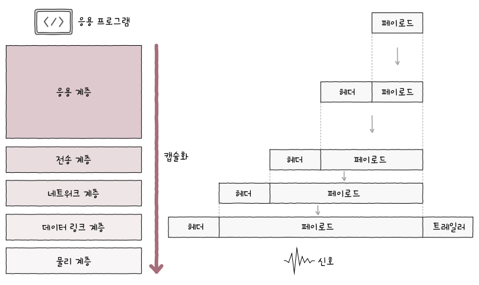
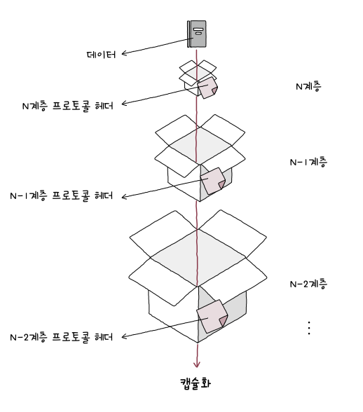
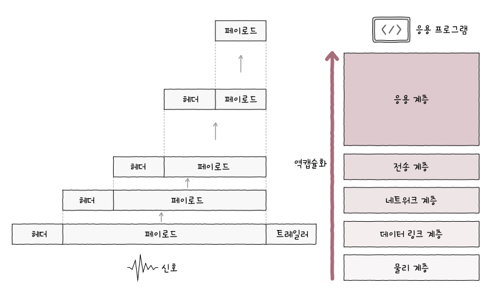
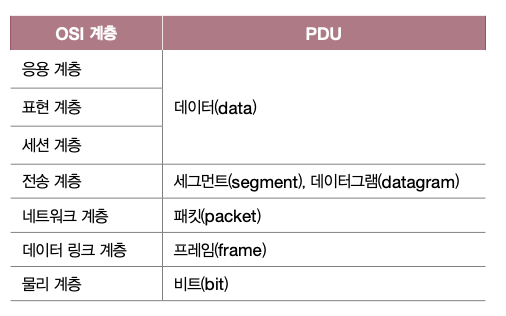
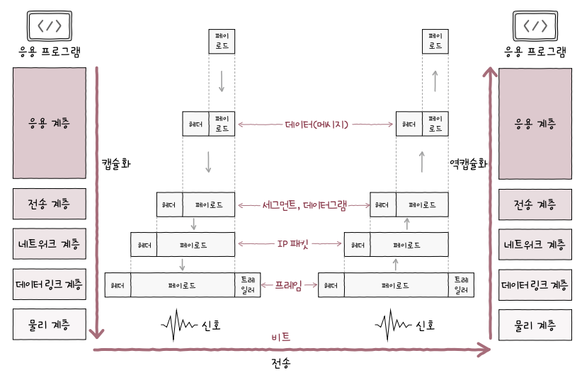

> # Chapter 01    **컴퓨터 네트워크 시작하기**

 

# **01-1 컴퓨터 네트워크를 알아야 하는 이유**

## 핵심 키워드

- 컴퓨터 네트워크
- 인터넷

## 네트워크

- 여러 장치가 서로 연결되어 정보를 주고 받을 수 있는 통신망
- 이 모양은 그래프의 형태를 띔 
- 그래프 : 노드와 노드를 연결하는 간선으로 이루어진 자료 구조

## 네트워크 기본 구조

- 호스트
- 네트워크 장비
- 통신 매체
- 메세지

## 호스트

- 네트워크의 가장자리 노드
- 호스트란?
    - 네트워크를 통해서 주고 받는 정보(메세지)를 최초로 생성해서 송신하거나 최종적으로 수신하는 대상
- 호스트는 역할에 따라서 구분할 수 있음
    - 클라이언트 : 서버에게 요청을 보내는 호스트
    → 음식점에서 돈까스 하나 주세요! 라는 요청을 보내는 것
    - 서버 : 요청에 대한 응답을 보내는 호스트
    → 음식점에서 돈까스를 여기 있다며 서빙해 주는 것
    - 다만 완전히 배타적인 개념은 아니니 오해하지 말 것 (역할에 따라 혹은 네트워크 구조에 따라 구분한 개념일 뿐이다!)

## 네트워크 장비

- 호스트 간 주고 받을 정보가 거치는 중간 노드 (이더넷 허브, 스위치, 라우터, 공유기 등..)
- 호스트 간 주고 받는 정보가 수신지까지 안전하게 전송될 수 있도록 한다

## 통신 매체

- 각 노드를 연결하는 간선 (링크)
    - 유선 매체 → 2장
    - 무선 매체 → 7장

## 메세지

- 통신 매체로 연결된 노드가 주고 받는 정보
- 웹 페이지, 파일, 메일 등 여러가지 정보를 주고 받을 수 있다~

## 마무리 정리

- 컴퓨터 네트워크 : 여러 장치가 연결되어 정보를 주고받을 수 있는 통신망
- 인터넷 : 여러 네트워크를 연결한 ‘네트워크의 네트워크’를 의미
- 네트워크 구조 : 노드로써 가장자리에 있는 호스트, 중간에 있는 네트워크 장비, 그것들을 연결하는 유무선의 통신 매체, 연결된 노드가 주고 받는 메세지로 이루어져 있다
- 네트워크는 기본적으로 그래프 형태를 띄고 있다!

 

# **01-2 네트워크 거시적으로 살펴보기**

## 핵심 키워드

- 네트워크 구조
- LAN
- WAN
- 회선 교환
- 패킷 교환
- 주소

## 범위에 따른 네트워크 분류

- LAN (Local Area Network) : 근거리를 연결한 네트워크
- WAN (Wide Area Network) : 원거리까지 연결한 네트워크

## LAN

- 가까운 지역을 연결한 근거리 통신망
- 일반 가정을 묶은 네트워크, 특정 회사에 있는 컴퓨터를 묶은 네트워크, 다른 국가의 기기들을 묶은 네트워크…

## WAN

- 인터넷이 WAN으로 분류
- LAN끼리 통신할 수 있는 네트워크
- 다른 LAN에 속한 호스트와 메세지를 주고 받아야 할 때 필요한 네트워크
- ISP (Internet Service Provider)
    - WAN을 구축하고 관리하는 업체! → KT, LG U+, SK 브로드밴드 …
    - 사용자에게 인터넷과 같은 WAN에 연결 가능한 회선을 임대하는 등 WAN과 관련한 다양한 서비스를 제공

## 좀 더 세밀한 분류

- LAN
- CAN
- MAN
- WAN
- 그냥 눈 도장만 찍기~

## 메시지 교환 방식에 따른 네트워크 분류

- 회선 교환 네트워크 : 회선 교환 방식으로 메시지를 주고 받는 네트워크
- 패킷 교환 네트워크 : 패킷 교환 방식으로 메시지를 주고 받는 네트워크 → 오늘날 인터넷 환경에서 주로 사용되는 네트워크

## 회선 교환 네트워크

- 회선 교환 방식
- 메시지를 주고 받기 전 (메시지 전송로인)회선(circuit)을 설정한 뒤 해당 회선을 통해 메시지를 주고 받는 방식
    - 회선을 설정한다 → 그냥 두 호스트를 연결했다, 두 호스트를 연결할 전송로를 예약했다, 전송로를 확보했다 …
- 회선 스위치
    - 호스트 사이에 일대일 전송로를 확보하는 네트워크 장비
    - 그냥 있다고만 알고 있기
- 장점
    - 두 호스트 사이에 연결을 확보한 후에 메시지를 주고 받는 특성 덕분에 주어진 시간 동안 전송되는 정보의 양이 비교적 일정함
- 단점
    - 회선의 이용 효율이 낮아질 수 있음 → 전송로를 예약을 했는데 메시지를 한 번만 주고 받고 이후에 사용을 안 하면 계속 전송로를 예약(점유)하고 있는건 낭비!

## 패킷 교환 네트워크

- 패킷 교환 방식
- 메시지를 패킷(packet)이라는 단위로 쪼개어 전송 → 패킷 교환 네트워크상의 송수신 단위
- 쪼개어 전송된 패킷들은 수신지에서 재조립
- 전송로의 이용 효율이 높아 회선 교환 방식의 문제점을 해결
- 현대 인터넷은 대부분 패킷 교환 방식을 이용
- 패킷 스위치
    - 패킷의 송수신지를 식별하고 패킷이 이동할 최적의 경로를 결정해주는 네트워크 장비
    - 라우터(router), 스위치 (switch) 등이 있음 (라우터는 3장 스위치는 2장)

## 패킷

- 패킷의 구조
    - 페이로드(payload) : 전송하려는 데이터 (택배에선 물품)
    - 헤더(header), 트레일러(trailer) : 부가 정보 또는 제어 정보 (택배에선 송장)
    - 즉 메시지를 주고 받는 기본 단위인 패킷은 페이로드와 앞쪽에 헤더, 뒷쪽에 트레일러로 이루어져 있다 (헤더가 없는 경우도 있으며 트레일러 또한 없을 수 있음)

## 주소 (address)

- 헤더에 담기는 대표적인 정보
- 송수신지를 특정하는 정보 : IP 주소, MAC 주소
- 주소가 있으면 “누구에게 전송할지”를 지정할 수 있다! → 즉 송수신지를 특정할 수 있는 정보인 주소가 있다면 다양한 유형으로 송수신이 가능하다!

## 송수신지 유형별 전송 방식

- 유니캐스트 (unicast)
    - 하나의 수신지에 메시지를 전송하는 것
    - 송신지와 수신지가 일대일로 메시지를 주고 받는 경우 (가장 일반적인 송수신 형태)
- 브로드캐스트 (broadcast)
    - 네트워크상의 모든 호스트에게 전송
    - 브로드캐스트 도메인 : 브로드캐스트가 전송되는 범위
- 멀티캐스트 (multicast)
    - 네트워크 내의 동일 그룹에 속한 호스트에게만 전송
- 애니캐스트 (anycast)
    - 네트워크 내의 동일 그룹에 속한 호스트 중 가장 가까운 호스트에게 전송

## 마무리 정리

- 네트워크 구조 : 호스트, 네트워크 장비, 통신 매체, 메시지로 이루어짐
- LAN : 가정, 기업처럼 근거리를 연결하는 한정된 공간에서의 네트워크
- WAN : LAN을 연결할 수 있는 넓은 범위의 네트워크
- 회선 교환 네트워크 : 호스트 간에 메시지를 주고받기 전, 두 호스트 사이에 메시지 전송로인 회선을 설정한 뒤 해당 전송로를 통해 메시지를 주고받는 것
- 패킷 교환 네트워크 : 메시지를 패킷 단위로 쪼개어 송수신하는 것
- 패킷 : 페이로드와 헤더로 구성되며, 때로는 트레일러까지 포함된 송수신되는 메시지의 단위
- 주소 : 송수신지를 특정할 수 있는 정보

 

# **01-3 네트워크 미시적으로 살펴보기**

## 핵심 키워드

- 프로토콜
- 네트워크 참조 모델
- OSI 모델
- TCP/IP 모델
- 캡슐화(역캡슐화)
- PDU

## 프로토콜 (Protocol)

- 노드 간에 정보를 올바르게 주고 받기 위해 합의된 규칙이나 방법
- 서로 다른 통신 장치들이 정보를 주고 받기 위해선 프로토콜이 통해야 함

## 통신 과정을 계층으로 나눈 이유

1. 네트워크 구성과 설계가 용이
2. 네트워크 문제 진단과 해결이 용이

## OSI 모델

- 국제 표준화 기구에서 만든 네트워크 참조 모델
- 통신 단계를 7개의 계층으로 나눈것!
- 주로 네트워크를 이론적으로 기술하고 이해할 때 사용하는 데 중점을 둔 모델
- OSI 모델의 목적은 이상적 설계에 가깝다.

## OSI 7계층

1. 물리 계층 (physical layer)
    - OSI 모델의 최하단에 있는 계층
    - 1과 0으로 표현되는 비트 신호를 주고 받는 계층
    - 통신 매체에 맞는 신호로 운반되도록 비트 데이터의 변환이 이루어지고 통신 매체를 통한 송수신이 이루어지는 계층
2. 데이터 링크 계층 (data link layer)
    - 네트워크 내 주변 장치 간의 정보를 올바르게 주고 받기 위한 계층
    - 물리 계층을 통해 주고 받는 정보에 오류가 없는지 확인하고, MAC 주소라는 주소 체계를 통해 네트워크 내 송수신지를 특정할 수 있다.
    - 때로는 전송 과정에서 발생할 수 있는 충돌 문제를 해겨하는 계층이다.
    - 이더넷을 비롯한 많은 LAN 기술이 데이터 링크 계층에 녹아 있다.
3. 네트워크 계층 (network layer)
    - 메시지를 (다른 네트워크에 속한) 수신지까지 전달하는 계층
    - 네트워크 계층에서는 네트워크 간의 통신이 이루어지는 계층
    - 인터넷을 가능하게 하는 계층
    - IP 주소라는 주소 체계를 통해 통신하고자 하는 수신지 호스트와 네트워크를 식별하고, 원하는 수신지에 도달하기 위한 최적의 경로를 결정한다.
4. 전송 계층 (transport layer)
    - 신뢰성 있고 안정성 있는 전송을 해야할 때 필요한 계층
    - 패킷의 흐름을 제어하거나 전송 오류를 점검해 신뢰성 있고 안정적인 전송이 이루어직도록 하는 계층
    - 포트라는 정보를 통해 실행 중인 응용 프로그램의 식별이 이루어지기도 한다.
5. 세션 계층 (session layer)
    - 세션을 관리하기 위해 존재하는 계층
    - 연결 상태를 생성하거나 유지하고, 종료되었을 때는 끊어 주는 역할을 담당하는 계층
    - 세션이라는 용어는 폭넓게 사용되지만, 일반적으로 통신을 주고 받는 호스트의 응용 프로그램 간 연결 상태를 의미한다.
6. 표현 계층 (presentation layer)
    - 번역가와 같은 역할을 하는 계층
    - 사람이 이해할 수 있는 언어인 문자를 컴퓨터가 이해할 수 있는 코드로 변환하거나, 압축, 암호화와 같은 작업이 이루어지는 계층
7. 응용 계층 (application layer)
    - OSI 참조 모델 최상단에 있는 계층
    - 사용자 및 사용자가 이용하는 응용 프로그램과 가장 밀접히 맞닿아 있는 계층
    - 사용자가 이용할 응용 프로그램에 다양한 네트워크 서비스를 제공하는 계층
    웹 브라우저 프로그램 → 웹 페이지를 제공
    이메일 클라이언트 프로그램 → 송수신된 이메일을 제공
    - 다양한 서비스가 제공될 수 있는 만큼 타 계층에 비해 응용 계층에 속한 프로토콜이 많다.

## TCP/IP 모델

- 이론 보다는 구현에 중점을 둔 네트워크 참조 모델
- TCP/IP 모델은 실용적 구현에 가깝다.
- TCP/IP 4계층, 인터넷 프로토콜 스위트, TCP/IP 프로토콜 스택 이라고도 불림
- IP는 인터넷 프로토콜 (Internet Protocol)의 약자
- TCP와 IP는 프로토콜의 이름이며 오늘날 네트워크 구현의 핵심으로 간주되고 있다.

## TCP/IP 4계층

1. 네트워크 액세스 계층 (network access layer)
    - 링크 계층 (link layer) 혹은 네트워크 인터페이스 계층 (network interface layer)이라고도 불림
    - OSI 모델의 데이터 링크 계층과 유사
    - TCP/IP 모델에서의 최하위 계층
    - OSI 모델의 물리 계층에 해당하는 개념이 없다고 보는 견해도 있어 물리 계층을 추가해 TCP/IP 모델을 5계층으로 확장하여 기술하기도 함
    - 유선 LAN과 관련한 물리 계층과 데이터 링크 계층에 대해서는 2장에서 학습
2. 인터넷 계층 (internet layer)
    - OSI 모델의 네트워크 계층과 유사
    - 주요 프로토콜과 네트워크 장비의 역할과 동작은 3장에서 학습
3. 전송 계층 (transport layer)
    - OSI 모델의 전송 계층과 유사
    - 4장에서 이어서 학습
4. 응용 계층 (application layer)
    - OSI 모델의 세션 계층, 표현 계층, 응용 계층을 합친 것과 유사
    - 5장에서 이어서 학습

## 캡슐화와 역캡슐화

- 패킷은 송신 과정에서 캡슐화가 이루어짐
- 패킷은 수신 과정에서 역캡슐화가 이루어짐
- 메시지는 송신지 입장에서는 높은 계층에서 부터 낮은 계층으로 이동
- 메시지는 수신지 입장에서는 낮은 계층에서 부터 높은 계층으로 이동

## 캡슐화

- 송신 과정에서 헤더(및 트레일러)를 추가해 나가는 과정 (인캡슐레이션이라고도 불림)
- 상위 계층으로부터 내려받은 패킷을 페이로드 삼아, 프로토콜에 걸맞은 헤더(혹은 트레일러)를 덧붙인 후 하위 계층으로 전달한다.  

- 즉, 한 단계 아래 계층은 바로 위의 계층으로부터 받은 패킷에 헤더 및 트레일러를 추가해 나간다.  

## 역캡슐화

- 수신 과정에서 추가된 헤더(및 트레일러)를 각 계층에서 확인한 뒤 제거해 나가는 과정 (디캡슐레이션이라고도 불림)  

## PDU (Protocol Data Unit)

- 각 계층에서 송수신되는 메시지의 단위
- 상위 계층에서 전달받은 데이터에 현재 계층의 프로토콜 헤더(및 트레일러)를 추가하면 현재 계층의 PDU가 됨
- OSI 모델의 PDU   

    
- 주로 전송 계층 이하의 메시지를 구분하기 위해 사용됨 (전송 계층보다 높은 계층에서는 일반적으로 데이터 혹은 메시지로만 지칭하는 경우가 많음)

## 마무리 정리
- 프로토콜 : 노드 간의 합의된 규칙이나 방법
- 네트워크 참조 모델 : 네트워크의 전송 단계를 계층적으로 표현한 것
- OSI 모델 : 통신 과정을 7개의 계층으로 표현한 것
- TCP/IP 모델 : 통신 과정을 4개의 계층으로 표현한 것
- 캡슐화 : 데이터 전송 과정에서 헤더(및 트레일러)를 추가해 나가는 과정
- 역캡슐화 : 캡슐화 과정에서 붙인 헤더(및 트레일러)를 제거하는 과정
- PDU : 각 계층에서 송수신되는 메시지의 단위

