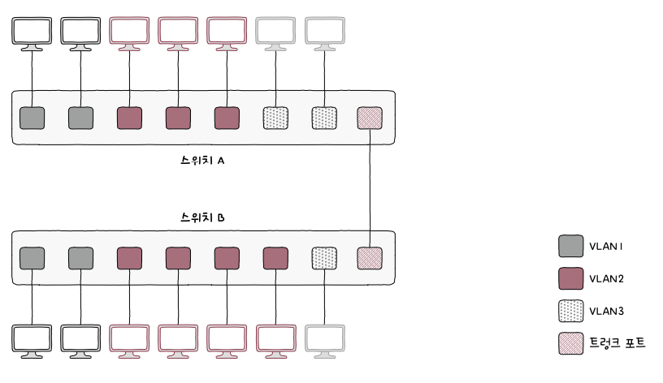

> # Chapter 02    **물리 계층과 데이터 링크 계층**

 

# **02-1 이더넷**

## 핵심 키워드

- 이더넷
- IEEE 802.3
- 이더넷 프레임
- MAC 주소

## 이더넷

- 다양한 통신 매체의 규격들과 송수신되는 프레임의 형태, 프레임을 주고받는 방법 등이 정의된 네트워크 기술
- 현대 LAN, 특히 유선 LAN 환경에서 가장 대중적으로 사용되는 기술
- 물리 계층과 데이터 링크 계층은 공통되게 이더넷 기술을 사용함

## 이더넷 표준

- 이더넷 관련 기술을 IEEE 802.3이라는 이름으로 표준화 함
- IEEE 802.3 : 이더넷 관련 다양한 표준들의 모음

## 통신 매체 표기 형태

1. 전송 속도 (data rate)
2. BASE
3. 추가 특성

## 통신 매체 종류

1. 동축 케이블 → C
2. 트위스티트 페어 케이블 → T (1000BASE-T 케이블)
3. 단파장 광섬유 케이블 → S (1000BASE-SX 케이블)
4. 장파장 광섬유 케이블 → L (1000BASE-LX 케이블)

## 이더넷 프레임

- 이더넷 네트워크에서 주고받는 프레임
- 호스트가 데이터 링크 계층에서 주고받는 프레임 형식
- 이더넷 프레임 헤더
  

## 프리앰블 (Preamble)

- 이더넷 프레임의 시작을 알리는 8byte(64bit) 크기의 정보
- 수신자는 이것을 통해 이더넷 프레임이 오고 있음을 알아차림
- 즉 송수신지 간의 동기화를 위해 사용되는 정보

## 수신지 MAC 주소 & 송신지 MAC 주소

- 물리적 주소라고도 불림
- 데이터 링크 계층의 핵심
- 네트워크 인터페이스마다 부여되는 6byte(48bit) 길이의 주소로, LAN 내의 수신지와 송신지를 특정할 수 있음
- 보통 NIC라는 장치가 네트워크 인터페이스 역할을 담당함 → 한 컴퓨터에 NIC가 여러 개 있다면 MAC 주소도 여러 개 있을 수 있음

## 타입 / 길이

- 이 필드에는 타입(type) 혹은 길이(length)가 올 수 있음
- 타입이란?
    - 이더넷 프레임이 ‘어떤 정보를 캡슐화했는지’를 나타내는 정보
    - 이더타입(ethertype)이라고도 불림
    - 대표적으로 상위 계층에서 사용된 프로토콜의 이름이 명시됨
      
    
    

## 데이터

- 상위 계층에서 전달받거나 상위 계층으로 전달해야 할 내용
- 네트워크 계층의 데이터와 헤더를 합친 PDU가 이곳에 포함됨
- 반드시 일정 크기(46byte 이상)여야 한다. → 그 이하의 데이터라면 크기를 맞추기 위해 패딩(padding)이라는 정보가 내부에 채워짐 (보통 46byte 이상이 될 때까지 0으로 채워짐)

## FCS (Frame Check Sequence)

- 수신한 이더넷 프레임에 오류가 있는지 확인하기 위한 필드
- 여기서 오류 검출이 이루어짐
- 이 필드에는 CRC(Cyclic Redundancy Check), 즉 순환 중복 검사라고 불리는 오류 검출용 값이 들어감
- 송신지는 프리앰블을 제외한 나머지 필드 값들을 바탕으로 CRC 값을 계산한 후, 이 값을 FCS 필드에 명시함
- 수신지는 수신한 프레임에서 프리앰블과 FCS 필드를 제외한 나머지 필드 값들을 바탕으로 CRC 값을 계산한 뒤, 이 값을 FCS 필드 값과 비교함
- 비교 값이 일치하지 않으면 프레임에 오류가 있다고 판단하여 해당 프레임을 폐기함

## 토큰 링

- 이더넷 외 다른 LAN 기술로 호스트들이 링(꼬리) 형태로 연결된 네트워크
- 호스트끼리 돌아가며 토큰이라는 특별한 정보를 주고받음
- 네트워크 내 다른 호스트에게 메시지를 송신하려면 반드시 이 토큰을 가지고 있어야 함

## 마무리 정리

- 이더넷 : 다양한 통신 매체의 규격들, 송수신되는 프레임의 형태, 프레임을 주고받는 방법 등을 정의한 네트워크 기술 (오늘날 유선 LAN 환경에서 가장 대중적으로 사용됨)
- IEEE 802.3 : 이더넷 관련 표준 규격들의 집합
- 이더넷 프레임 : 프리앰블, 수신지 MAC 주소, 송신지 MAC 주소, 타입/길이, 데이터, FCS로 구성됨
- MAC 주소 : 네트워크 인터페이스마다 부여되는 물리적 주소

 

# **02-2 NIC와 케이블**

## 핵심 키워드

- NIC
- 트위스티드 페어 케이블
- 광섬유 케이블
- 싱글 모드
- 멀티 모드

## NIC

- 호스트와 유무선 통신 매체를 연결하고, MAC 주소가 부여되는 네트워크 장비
- 호스트는 NIC가 있어야 네트워크에 참여할 수 있음

## NIC 역할

- 통신 매체에 흐르는 신호를 호스트가 이해하는 프레임으로 변환하거나 호스트가 이해하는 프레임을 통신 매체에 흐르는 신호로 변환하는 것
- 호스트가 네트워크를 통해 송수신하는 정보는 NIC를 거침
- 네트워크와의 연결점을 담당하는 점에서 네트워크 인터페이스 역할을 수행함

## 케이블

- NIC에 연결되는 물리 계층의 유선 통신 매체
- 유선 네트워크에서의 대표적인 케이블 종류
    - 트위스티드 페어 케이블
    - 광섬유 케이블
    

## 트위스티드 페어 케이블

- 구리 선으로 전기 신호를 주고받는 유선 통신 매체
- 대중적인 LAN 케이블 중 하나

## 광섬유 케이블

- 빛(광신호)을 이용해 정보를 주고받는 유선 통신 매체
- 코어의 지름에 따라 싱글 모드 광섬유 케이블, 멀티 모드 광섬유 케이블로 나뉨

## 마무리 정리

- NIC : 호스트와 통신 매체 사이의 인터페이스 역할을 담당하는 네트워크 장비
- 트위스티드 페어 케이블 : 구리 선을 통해 전기 신호를 주고받는 유선 통신 매체
- 광섬유 케이블 : 광섬유를 통해 광신호를 주고받는 유선 통신 매체

 

# **02-3 허브**

## 핵심 키워드

- 허브
- 반이중
- 전이중
- 콜리전 도메인
- CSMA/CD

## 주소 개념이 없는 물리 계층

- 송수신지를 특정할 수 있는 주소는 데이터 링크 계층부터 존재하는 개념
- 물리 계층의 네트워크 장비는 송수신되는 정보에 대한 어떠한 조작(송수신 내용 변경)이나 판단을 하지 않음

## 허브

- 물리 계층의 네트워크 장비
- 여러 대의 호스트를 연결하는 장치

## 허브의 특징

1. 전달받은 신호를 다른 모든 포트로 그대로 다시 내보낸다.
    - 물리 계층에서는 주소 개념이 없기에 허브는 수신지를 특정할 수 없음
    - 따라서 신호를 전달받으면 어떠한 조작이나 판단을 하지 않고 송신지를 제외한 모든 포트에 그저 내보내기만 함
    - 신호를 전달받은 모든 호스트는 데이터 링크 계층에서 패킷의 MAC 주소를 확인하고 자신과 관련 없는 주소는 폐기함
2. 반이중 모드로 통신한다.
    - 반이중 모드 : 송수신을 번갈아 가면서 하는 통신 방식 (마치 1차선 도로) (↔ 전이중 모드)
    - 동시에 송수신이 불가능함
3. 전기 신호를 증폭시켜 주는 리피터의 기능을 포함하는 경우가 많음
    - 리피터는 물리 계층의 또 다른 대표적인 장비
    - 전기 신호는 전송 거리가 길어질수록 감소하거나 왜곡될 수 있어서 이를 방지하기 위해 전기 신호를 증폭시켜 주는 장비를 사용함
    - 이를 리피터가 해 주는데, 허브는 이러한 리피터의 기능을 포함하는 경우가 많다

## 콜리전 도메인

- 충돌이 발생할 수 있는 영역을 콜리전 도메인이라 함
- 한 호스트가 허브에 송신하는 동안 다른 호스트는 송신하고 싶은 것이 있어도 기다려야 함
- 그런데 동시에 신호를 보내면 충돌이 발생함
- 허브에 연결된 모든 호스트는 같은 콜리전 도메인에 속함 (콜리전 도메인의 범위가 클수록 충돌 발생 가능성 상승)
- 허브의 넓은 콜리전 도메인으로 인한 충돌 문제를 해결하기 위해서 CSMA/CD 프로토콜이나 스위치 장비를 사용해야 함

## CSMA/CD (Carrier Sense Multiple Access with Collision Detection)

- 반이중 이더넷 네트워크에서 충돌을 방지하는 대표적인 프로토콜
- 여러 호스트가 공유하는 통신 매체에 접근할 때 사용 가능한 제어 방식이라는 점에서 매체 접근 제어(MAC, Media Access Control) 방법의 일종이라고도 함
- CS(Carrier Sense)는 `캐리어 감지`를 의미
    - 현재 통신 매체의 사용 가능 여부를 검사하는 것
    - CSMA/CD 프로토콜을 사용하는 반이중 이더넷 네트워크에서는 메시지를 보내기 전에 현재 네트워크상에서 전송 중인 것이 있는지를 먼저 확인함
- MA(Multiple Access)는 `다중 접근`을 의미
    - 복수의 호스트가 네트워크에 접근하려는 상황
    - 때로는 캐리어 감지를 하는 데도 두 개 이상의 호스트가 부득이하게 동시에 네트워크를 사용하려 할 때가 있으며 이때 충돌이 발생함
- CD(Collision Detection)는 `충돌 검출`을 의미
    - 충돌이 발생하면 이를 검출하는 것
    - 충돌을 감지하면 전송이 중단되고, 충돌을 검출한 호스트는 다른 이들에게 충돌이 발생했음을 알리고자 `잼 신호`라는 특별한 신호를 보냄
    

## 마무리 정리

- 허브 : 여러 대의 호스트를 연결할 수 있는 물리 계층의 장비, 전달받은 신호를 다른 모든 포트로 내보내며 반이중 모드로 통신함
- 반이중 모드 : 데이터를 한 번에 한 방향으로만 전송할 수 있는 통신 방식
- 전이중 모드 : 동시에 양방향으로 전송할 수 있는 통신 방식
- 콜리전 도메인 : 충돌 발생 가능성이 있는 영역
- CSMA/CD : 반이중 이더넷 네트워크의 충돌 방지 프로토콜

 

# **02-4 스위치**

## 핵심 키워드

- 스위치
- MAC 주소 테이블
- MAC 주소 학습
- VLAN

## 주소 개념이 있는 데이터 링크 계층

- MAC 주소가 바로 주소 개념에 속함
- 데이터 링크 계층 이상에서의 장비는 송수신지를 특정할 수 있음

## 스위치

- 데이터 링크 계층의 네트워크 장비
- 2계층에서 사용한다 하여 L2 스위치라고도 함
- 스위치의 여러 포트에는 호스트를 연결할 수 있음 (허브와 유사)
- 다만 스위치는 허브와 달리 MAC 주소를 학습해 특정 MAC 주소를 가진 호스트에만 프레임을 전달할 수 있고, 전이중 모드의 통신을 지원함

## 스위치의 특징

1. 특정 포트와 해당 포트에 연결된 호스트의 MAC 주소와의 관계를 기억함
2. 이를 통해 원하는 호스트에만 프레임을 전달할 수 있으며 이를 `MAC 주소 학습`이라 함
3. MAC 주소 학습을 위해 포트와 연결된 호스트의 MAC 주소 간의 연관 관계를 메모리표 형태로 기억하는데 이를 `MAC 주소 테이블`이라 함
4. 추가로 스위치와 유사한 장비로 `브리지(bridge)`라는 장비도 존재
    - 콜리전 도메인을 나누거나 네트워크를 확장하는 용도로 사용
    - 스위치의 기능들도 제공해줌
    - 특정 호스트가 연결되어 있는 포트로 프레임을 포워딩하거나 필터링할 수 있음
    - 다만 최근 스위치의 기능은 일반적으로 브리지의 기능을 포괄할 뿐 아니라 더 다양하고, 프레임의 처리 성능 면에서도 우수하여 브리지보다 스위치를 사용하는 추세임

## MAC 주소 학습

- 플러딩 (flooding)
    - 허브처럼 송신지 포트를 제외한 모든 포트로 프레임을 전송하는 스위치의 동작
- 필터링
    - 전달받은 프레임을 어디로 내보내고 어디로 내보내지 않을지 결정하는 스위치의 기능
    - 각 호스트들은 자신과 관련이 없는 프레임을 전송받았으면 이를 폐기했으므로 위와 같은 필터링 기능이 가능한 것
- 포워딩
    - 프레임이 전송될 포트에 실제로 프레임을 내보내는 것
- 에이징
    - MAC 주소 테이블에 등록된 특정 포트에서 일정 시간 동안 프레임을 전송받지 못했다면 해당 항목은 삭제되는 것

## VLAN (Virtual LAN)

- 한 대의 스위치로 가상의 LAN을 만드는 방법
- 호스트의 물리적 위치와 관계없이 논리적인 LAN을 구성할 수 있는 것
- 이는 브로드캐스트 도메인도 달라져서 다른 VLAN에 속한 호스트에게까지 전달되지 않음 (서로 다른 네트워크로 간주)

## 포트 기반 VLAN

- 스위치의 포트가 VLAN을 결정하는 방식
- 사전에 특정 포트에 VLAN을 할당하고, 해당 포트에 호스트를 연결함으로써 VLAN에 포함시킨다
- 한 대의 스위치만으로 포트 기반 VLAN을 나누면 포트 수가 부족해질 수도 있음!!
  

    
- 이를 해결하기 위한 방법은 두 대 이상의 VLAN 스위치를 효율적으로 연결하여 확장하는 `VLAN 트렁킹`이 있음
    - 스위치 간의 통신을 위한 특별한 포트인 `트렁크 포트`에 VLAN 스위치를 서로 연결하는 방식
      
    

- 어떤 VLAN에 속하는지 식별하기 위한 정보까지 추가 확장된 이더넷 프레임을 사용함
    - 802.1Q 프레임이라고 함
    - 이더넷 프레임 사이에 32bit 크기의 `VLAN 태그`라는 정보가 추가 됨
      
    
        

## MAC 기반 VLAN

- 사전에 설정된 MAC 주소에 따라 VLAN이 결정됨
- 이는 포트가 VLAN을 결정하는 것이 아닌 송수신하는 프레임 속 MAC 주소가 호스트가 속할 VLAN을 결정하는 방식

## 마무리 정리

- 스위치 : 포트별로 콜리전 도메인을 나누며 전이중 모드 통신을 지원하는 데이터 링크 계층의 장비
- MAC 주소 테이블 : 포트와 연결된 호스트의 MAC 주소 간의 연관 관계를 메모리표 형태로 기억하는 것
    - 이를 이용해 MAC 주소를 학습함
    - 이후 원하는 포트로 패킷을 포워딩하고 원치 않은 포트는 필터링 함
- VLAN : 스위치로 만들 수 있는 가상의 LAN
- 포트 기반 VLAN : 스위치의 포트가 VLAN을 결정하는 방식
- MAC 기반 VLAN : 사전에 설정된 MAC 주소에 따라 VLAN을 결정하는 방식

