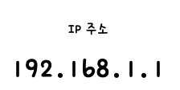
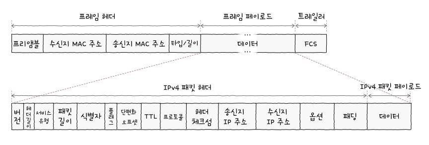
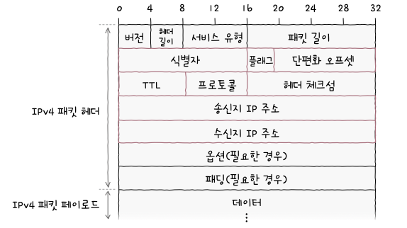
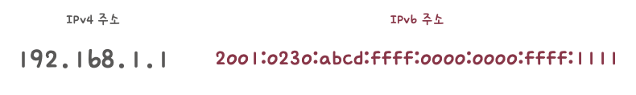
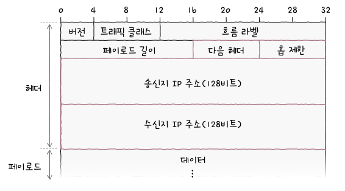

> # Chapter 03    **네트워크 계층**

 

# **03-1 LAN을 넘어서는 네트워크 계층**

## 핵심 키워드

- 네트워크 계층
- 라우팅
- IP
- IP 주소
- IPv4
- IPv6
- ARP

## 네트워크 계층

- 데이터 링크 계층의 한계
    1. 물리 계층과 데이터 링크 계층만으로는 다른 네트워크까지의 도달 경로를 파악하기 어렵다!
    2. MAC 주소만으로는 모든 네트워크에 속한 호스트의 위치를 특정하기 어렵다!

## 라우팅

- 패킷이 이동할 최적의 경로를 결정하는 것
- 라우팅을 수행하는 대표적인 장비
    - 라우터 (네트워크 계층의 장비)

## IP 주소

- 수신지 역할을 하는 정보는 네트워크 계층의 IP 주소 (수신인 역할을 하는 정보는 MAC 주소)
- 논리 주소라고도 불림
- MAC 주소는 일반적으로 NIC마다 할당되는 고정된 주소
- IP주소는 DHCP라는 특정 프로토콜 사용하여 호스트에 직접 할당이 가능
- DHCP (Dynamic Host Configuration Protocol)
    - 자동으로 할당받거나 사용자가 직접 할당 가능
    - 한 호스트가 복수의 IP 주소 가질 수 있음
    - 자세한건 03-2

## 인터넷 프로토콜

- 네트워크 계층의 핵심 프로토콜
- IPv4
- IPv6

## IP 주소 형태

- 4Byte(32bit)로 주소를 표현
- 숫자당 8bit로 표현되기에 0~255 범위 안에 있는 네 개의 10진수로 표기됨
- 각 10진수는 점(.)으로 구분되며, 점으로 구분된 8비트를 옥텟이라고 함
  

## IP의 대표적인 기능

- IP 주소 지정
    - IP 주소를 바탕으로 송수신 대상을 지정하는 것
- IP 단편화
    - 전송하고자 하는 패킷의 크기가 MTU라는 최대 전송 단위보다 클 경우, 이를 MTU 크기 이하의 복수의 패킷으로 나누는 것
    - MTU (Maximun Transmission Unit)
        - 한 번에 전송 가능한 IP 패킷의 최대 크기
        - 일반적으로 1500바이트이며, 나누어진 패킷은 수신지에 도착하면 재조합됨

## IPv4

- IPv4 패킷은 프레임의 페이로드로 데이터 필드에 명시됨
  

    
- IPv4 패킷의 형식
  

    - 식별자, 플래그, 단편화 오프셋 필드는 IP 단편화 기능에 관여
    - 송신지 IP 주소, 수신지 IP 주소는 IP 주소 지정 기능에 관여

- 식별자
    - 패킷에 할당된 번호
    - IPv4 패킷이 여러 조각으로 나누어져서 전송됐을때 도착한 패킷들이 어떤 메시지에서부터 쪼개졌는지를 인식하기 위해서 사용
- 플래그
    - 총 세개의 비트로 구성된 필드
    - 첫 번째 비트는 항상 0으로 예약된 비트로 현재 사용되지 않음
    - 나머지 두 개의 비트 중 하나는 DF (Don’t Fragment)
        - IP 단편화를 수행하지 말라는 표시
        - 0으로 설정되어 있다면 IP 단편화가 가능
        - 1로 설정되어 있다면 IP 단편화를 수행하지 않음
        - 1로 설정되었다고 해도 패킷의 크기가 너무 크다면 이는 폐기됨
    - 또 하나의 비트는 MF (More Fragment)
        - 단편하된 패킷이 더 있는지 나타냄
        - 0이라면 이 패킷이 마지막 패킷임을 의미
        - 1이라면 쪼개진 패킷이 아직 더 있다는 의미
- 단편화 오프셋 (fragment offset)
    - 패킷이 단편화되기 전에 패킷의 초기 데이터에서 몇 번째로 떨어진 패킷인지를 나타냄
    - 패킷들을 재조합하려면 단편화된 패킷이 초기 데이터에서 몇 번째 데이터에 해당하는 패킷인지를 알아야 하기에 이를 판단하기 위해 활용됨
- TTL (Time To Live)
    - 패킷의 수명을 의미
    - 패킷이 하나의 라우터를 거칠 때마다 TTL 값이 1씩 감소
    - 0으로 된다면 패킷은 폐기됨
    - 홉 (hop) : 패킷이 호스트 또는 라우터에 한 번 전달되는 것을 의미
    - 즉 TTL 필드의 값은 홉마다 1씩 감소
    - 무의미한 패킷이 네트워크상에 지속적으로 남아있는 것을 방지하기 위해 TTL 필드가 존재함
- 프로토콜
    - IP 패킷의 프로토콜은 상위 계층의 프로토콜이 무엇인지를 나타내는 필드임
    - 전송 계층에서의 TCP는 6번 UDP는 17번
- 송신지 IP 주소, 수신지 IP 주소
- 이론적으로 IPv4주소는 2^32개인 약 32억 개가 할당 가능

## IPv6

- 16Byte(128bit)로 주소를 표현
- 콜론(:)으로 구분된 8개 그룹의 16진수로 표기
  

    
- IPv6 패킷의 형식
  

    
- 다음 헤더
    - 상위 계층의 프로토콜을 가리키거나 확장 헤더를 가리킴
- 홉 제한 (hop limit)
    - IPv4 패킷의 TTL 필드와 비슷하게 패킷의 수명을 나타내는 필드
- 송신지 IP 주소, 수신지 IP 주소
    - IPv4 헤더 길이는 가변적이나 IPv6 기본 헤더는 40Byte로 고정적

## ARP (Address Resolution Protocol)

- IP 주소를 통해 MAC 주소를 알아내는 프로토콜
- ARP의 동작 과정
    1. ARP 요청
    2. ARP 응답
    3. ARP 테이블 갱신

## ARP 동작 과정

1. ARP 요청
    - A는 네트워크 내의 모든 호스트에게 브로드캐스트 메시지를 보내면 이 메시지를 ARP 요청이라는 ARP 패킷이라 함
2. ARP 응답
    - 네트워크 내의 모든 호스트가 ARP 요청 메시지를 수신하지만, B를 제외한 나머지 호스트는 자신의 IP 주소가 아니므로 무시함
    - B는 자신의 MAC 주소를 담은 메시지를 A에게 전송하는데 이 유니캐스트 메시지는 ARP 응답이라는 ARP 패킷이라 함
    - 이때 A는 B의 MAC 주소를 알게 됨
    - 유니캐스트 : 하나의 수신지에 메시지를 전송하는 방식
3. ARP 테이블 갱신
    - IP 주소와 그에 맞는 MAC 주소 테이블을 대응하는 표
    - A는 1단계와 2단계를 통해 B의 MAC 주소를 알게 되면 B의 IP 주소와 MAC 주소의 연관 관계를 ARP 테이블에 추가함
    - 이렇게 되면 A는 B와 통신할 때 브로드캐스트로 ARP 요청을 보낼 필요가 없어짐
    - 일정 시간이 지나면 ARP 테이블은 삭제됨
    - 임의로 삭제할 수도 있음

## IP 단편화

- IP 단편화는 되도록 하지 않는 것이 좋음
    - 여러 패킷으로 쪼개지면 자연스레 전송해햐할 패킷의 헤더들도 많아지고, 이는 트래픽 증가와 대역폭 낭비로 이어질 수 있음
    - 쪼개진 IP 패킷들을 합치는 과정에서 발생하는 부하도 성능 저하를 야기할 수 있음
- IP 단편화를 피하는 방법
    - IP 패킷을 주고받는 모든 호스트의 ‘처리 가능한 MTU 크기’를 고려하기
    - 즉 IP 단편화 없이 주고 받을 수 있는 최대 크기 만큼만 전송해야 함
    - 이 크기를 경로 MTU (Path MTU)라고 함 → 경로 MTU만큼의 데이터를 전송하자!
- 경로 MTU 발견
    - 경로 MTU를 구하고 해당 크기만큼만 송수신하여 IP 단편화를 회피하는 기술

## 마무리 정리

- 라우팅 : 네트워크 계층에서 통신을 빠르게 주고받기 위해 패킷이 이동할 최적의 경로를 결정하는 것
- IP : 네트워크 계층의 핵심 프로토콜로, IP 주소 지정과 IP 단편화를 수행함
- IP 주소 : 네트워크상의 호스트를 식별할 수 있는 네트워크 계층의 주소
- IP에는 IPv4, IPv6가 있으며 각각 주소의 길이와 헤더의 구성이 다름
- ARP : 동일 네트워크 내에 있는 호스트 IP 주소를 통해 MAC 주소를 알아내기 위한 프로토콜

