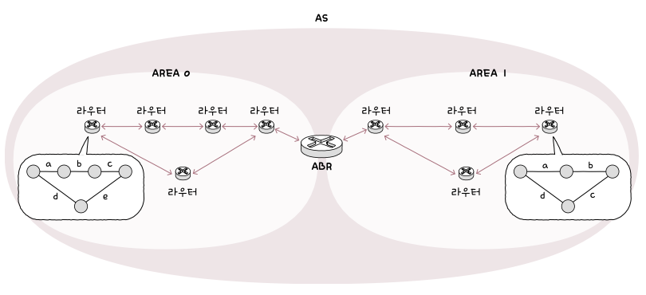

> # Chapter 03    **네트워크 계층**

 

# **03-1 LAN을 넘어서는 네트워크 계층**

## 핵심 키워드

- 네트워크 계층
- 라우팅
- IP
- IP 주소
- IPv4
- IPv6
- ARP

## 네트워크 계층

- 데이터 링크 계층의 한계
  1. 물리 계층과 데이터 링크 계층만으로는 다른 네트워크까지의 도달 경로를 파악하기 어렵다!
  2. MAC 주소만으로는 모든 네트워크에 속한 호스트의 위치를 특정하기 어렵다!

## 라우팅

- 패킷이 이동할 최적의 경로를 결정하는 것
- 라우팅을 수행하는 대표적인 장비
  - 라우터 (네트워크 계층의 장비)

## IP 주소

- 수신지 역할을 하는 정보는 네트워크 계층의 IP 주소 (수신인 역할을 하는 정보는 MAC 주소)
- 논리 주소라고도 불림
- MAC 주소는 일반적으로 NIC마다 할당되는 고정된 주소
- IP주소는 DHCP라는 특정 프로토콜 사용하여 호스트에 직접 할당이 가능
- DHCP (Dynamic Host Configuration Protocol)
  - 자동으로 할당받거나 사용자가 직접 할당 가능
  - 한 호스트가 복수의 IP 주소 가질 수 있음
  - 자세한건 03-2

## 인터넷 프로토콜

- 네트워크 계층의 핵심 프로토콜
- IPv4
- IPv6

## IP 주소 형태

- 4Byte(32bit)로 주소를 표현
- 숫자당 8bit로 표현되기에 0~255 범위 안에 있는 네 개의 10진수로 표기됨
- 각 10진수는 점(.)으로 구분되며, 점으로 구분된 8비트를 옥텟이라고 함
    
  

## IP의 대표적인 기능

- IP 주소 지정
  - IP 주소를 바탕으로 송수신 대상을 지정하는 것
- IP 단편화
  - 전송하고자 하는 패킷의 크기가 MTU라는 최대 전송 단위보다 클 경우, 이를 MTU 크기 이하의 복수의 패킷으로 나누는 것
  - MTU (Maximun Transmission Unit)
    - 한 번에 전송 가능한 IP 패킷의 최대 크기
    - 일반적으로 1500바이트이며, 나누어진 패킷은 수신지에 도착하면 재조합됨

## IPv4

- IPv4 패킷은 프레임의 페이로드로 데이터 필드에 명시됨
    
  
- IPv4 패킷의 형식
    
   - 식별자, 플래그, 단편화 오프셋 필드는 IP 단편화 기능에 관여 - 송신지 IP 주소, 수신지 IP 주소는 IP 주소 지정 기능에 관여

- 식별자
  - 패킷에 할당된 번호
  - IPv4 패킷이 여러 조각으로 나누어져서 전송됐을때 도착한 패킷들이 어떤 메시지에서부터 쪼개졌는지를 인식하기 위해서 사용
- 플래그
  - 총 세개의 비트로 구성된 필드
  - 첫 번째 비트는 항상 0으로 예약된 비트로 현재 사용되지 않음
  - 나머지 두 개의 비트 중 하나는 DF (Don’t Fragment)
    - IP 단편화를 수행하지 말라는 표시
    - 0으로 설정되어 있다면 IP 단편화가 가능
    - 1로 설정되어 있다면 IP 단편화를 수행하지 않음
    - 1로 설정되었다고 해도 패킷의 크기가 너무 크다면 이는 폐기됨
  - 또 하나의 비트는 MF (More Fragment)
    - 단편하된 패킷이 더 있는지 나타냄
    - 0이라면 이 패킷이 마지막 패킷임을 의미
    - 1이라면 쪼개진 패킷이 아직 더 있다는 의미
- 단편화 오프셋 (fragment offset)
  - 패킷이 단편화되기 전에 패킷의 초기 데이터에서 몇 번째로 떨어진 패킷인지를 나타냄
  - 패킷들을 재조합하려면 단편화된 패킷이 초기 데이터에서 몇 번째 데이터에 해당하는 패킷인지를 알아야 하기에 이를 판단하기 위해 활용됨
- TTL (Time To Live)
  - 패킷의 수명을 의미
  - 패킷이 하나의 라우터를 거칠 때마다 TTL 값이 1씩 감소
  - 0으로 된다면 패킷은 폐기됨
  - 홉 (hop) : 패킷이 호스트 또는 라우터에 한 번 전달되는 것을 의미
  - 즉 TTL 필드의 값은 홉마다 1씩 감소
  - 무의미한 패킷이 네트워크상에 지속적으로 남아있는 것을 방지하기 위해 TTL 필드가 존재함
- 프로토콜
  - IP 패킷의 프로토콜은 상위 계층의 프로토콜이 무엇인지를 나타내는 필드임
  - 전송 계층에서의 TCP는 6번 UDP는 17번
- 송신지 IP 주소, 수신지 IP 주소
- 이론적으로 IPv4주소는 2^32개인 약 32억 개가 할당 가능

## IPv6

- 16Byte(128bit)로 주소를 표현
- 콜론(:)으로 구분된 8개 그룹의 16진수로 표기
    
  
- IPv6 패킷의 형식
    
  
- 다음 헤더
  - 상위 계층의 프로토콜을 가리키거나 확장 헤더를 가리킴
- 홉 제한 (hop limit)
  - IPv4 패킷의 TTL 필드와 비슷하게 패킷의 수명을 나타내는 필드
- 송신지 IP 주소, 수신지 IP 주소
  - IPv4 헤더 길이는 가변적이나 IPv6 기본 헤더는 40Byte로 고정적

## ARP (Address Resolution Protocol)

- IP 주소를 통해 MAC 주소를 알아내는 프로토콜
- ARP의 동작 과정
  1. ARP 요청
  2. ARP 응답
  3. ARP 테이블 갱신

## ARP 동작 과정

1. ARP 요청
   - A는 네트워크 내의 모든 호스트에게 브로드캐스트 메시지를 보내면 이 메시지를 ARP 요청이라는 ARP 패킷이라 함
2. ARP 응답
   - 네트워크 내의 모든 호스트가 ARP 요청 메시지를 수신하지만, B를 제외한 나머지 호스트는 자신의 IP 주소가 아니므로 무시함
   - B는 자신의 MAC 주소를 담은 메시지를 A에게 전송하는데 이 유니캐스트 메시지는 ARP 응답이라는 ARP 패킷이라 함
   - 이때 A는 B의 MAC 주소를 알게 됨
   - 유니캐스트 : 하나의 수신지에 메시지를 전송하는 방식
3. ARP 테이블 갱신
   - IP 주소와 그에 맞는 MAC 주소 테이블을 대응하는 표
   - A는 1단계와 2단계를 통해 B의 MAC 주소를 알게 되면 B의 IP 주소와 MAC 주소의 연관 관계를 ARP 테이블에 추가함
   - 이렇게 되면 A는 B와 통신할 때 브로드캐스트로 ARP 요청을 보낼 필요가 없어짐
   - 일정 시간이 지나면 ARP 테이블은 삭제됨
   - 임의로 삭제할 수도 있음

## IP 단편화

- IP 단편화는 되도록 하지 않는 것이 좋음
  - 여러 패킷으로 쪼개지면 자연스레 전송해햐할 패킷의 헤더들도 많아지고, 이는 트래픽 증가와 대역폭 낭비로 이어질 수 있음
  - 쪼개진 IP 패킷들을 합치는 과정에서 발생하는 부하도 성능 저하를 야기할 수 있음
- IP 단편화를 피하는 방법
  - IP 패킷을 주고받는 모든 호스트의 ‘처리 가능한 MTU 크기’를 고려하기
  - 즉 IP 단편화 없이 주고 받을 수 있는 최대 크기 만큼만 전송해야 함
  - 이 크기를 경로 MTU (Path MTU)라고 함 → 경로 MTU만큼의 데이터를 전송하자!
- 경로 MTU 발견
  - 경로 MTU를 구하고 해당 크기만큼만 송수신하여 IP 단편화를 회피하는 기술

## 마무리 정리

- 라우팅 : 네트워크 계층에서 통신을 빠르게 주고받기 위해 패킷이 이동할 최적의 경로를 결정하는 것
- IP : 네트워크 계층의 핵심 프로토콜로, IP 주소 지정과 IP 단편화를 수행함
- IP 주소 : 네트워크상의 호스트를 식별할 수 있는 네트워크 계층의 주소
- IP에는 IPv4, IPv6가 있으며 각각 주소의 길이와 헤더의 구성이 다름
- ARP : 동일 네트워크 내에 있는 호스트 IP 주소를 통해 MAC 주소를 알아내기 위한 프로토콜

 

# **03-2 IP 주소**

## 핵심 키워드

- 클래스풀 주소 체계
- 클래스리스 주소 체계
- 서브넷 마스크
- 공인 IP 주소
- 사설 IP 주소
- NAT
- 정적 IP 주소
- 동적 IP 주소
- DHCP

## IP 주소

- IP 주소는 크게 네트워크 주소와 호스트 주소로 이루어 짐
- 네트워크 주소 : 호스트가 속한 특정 네트워크를 식별하는 역할
- 호스트 주소 : 네트워크 내에서 특정 호스트를 식별하는 역할

## 클래스풀 주소 체계

- 클래스를 기반으로 IP 주소를 관리하는 주소 체계를 의미
- 클래스 : 네트워크 크기에 따라 IP 주소를 분류하는 기준
- 총 다섯 개의 클래스 존재
  - A ~ E 클래스
      
    
  - 호스트 주소에서의 전부 0은 네트워크 자체를 의미하는 네트워크 주소로 사용
  - 호스트 주소에서의 전부 1은 브로드캐스트를 위한 주소로 사용
- 클래스풀 주소 지정 : 클래스를 이용해 IP 주소를 지정하는 방법

## A 클래스

- B와 C 클래스에 비해 할당 가능한 호스트 주소의 수가 많음
- 네트워크 주소는 ‘0’비트로 시작하고 1옥텟으로 구성됨
- 호스트 주소는 3옥텟으로 구성됨
- 2^7개의 네트워크가 존재할 수 있음 (맨 앞은 ‘0’ 고정이므로 2^8개 아님)
- 2^24개의 호스트 주소를 가질 수 있음 (사실은 2^24 - 2개)
- 0.0.0.0 ~ 127.255.255.255
  - 앞에 1옥텟은 네트워크 주소로 0~127(2^7개) 가능
  - 나머지 3옥텟은 호스트 주소로 각각 0~255(2^8*2^8*2^8개) 가능

## B 클래스

- 네트워크 주소는 ‘10’비트로 시작하고 2옥텟으로 구성됨
- 호스트 주소도 2옥텟으로 구성됨
- 2^14개의 네트워크가 존재할 수 있음 (맨 앞이 ‘10’ 고정이므로 2^16개 아님)
- 2^16개의 호스트 주소를 가질 수 있음 (사실은 2^16 - 2개)
- 128.0.0.0 ~ 191.255.255.255
  - 네트워크 주소가 10으로 시작하므로 첫 번째 옥텟의 최소는 128(10000000), 최대는 191(10111111), 두 번째 옥텟은 상관 없음(0~255 가능)
  - 나머지 2옥텟은 호스트 주소로 각각 0~255(2^8\*2^8개) 가능

## C 클래스

- 네트워크 주소는 ‘110’비트로 시작하고 3옥텟으로 구성됨
- 호스트 주소는 1옥텟으로 구성됨
- 2^21개의 네트워크가 존재할 수 있음 (맨 앞이 ‘110’ 고정이므로 2^24개 아님)
- 2^8개의 호스트 주소를 가질 수 있음 (사실은 2^8 - 2개)
- 192.0.0.0 ~ 223.255.255.255
  - 네트워크 주소가 ‘110’으로 시작하므로 최소는 192(11000000), 최대는 223(11011111), 나머지 옥텟은 상관 없음 (0~255 가능)
  - 나머지 1옥텟인 호스트 주소는 0~255 (2^8개) 가능

## D 클래스와 E 클래스

- 멀티캐스트를 위한 클래스이자 특수한 목적을 위해 예약된 클래스
- 네트워크의 크기를 나누는 데에 실질적으로 사용되지 않음

## 클래스리스 주소 체계

- 클래스가 아닌 서브넷 마스크를 이용해 네트워크 주소와 호스트 주소를 구분하는 IP 주소 체계
- 클래스풀 주소 체계보다 더 유동적이고 정교하게 네트워크를 구획할 수 있는 주소 체계
- 클래스풀 주소 체계는 클래스별 네트워크의 크기가 고정되어 있어서 다수의 IP 주소가 낭비될 가능이 큼
- 오늘날 주로 사용되는 방식!

## 서브넷 마스크

- 클래스리스 주소 체계에서 네트워크와 호스트를 구분 짓기 위한 수단으로 이용
- 이는 IP 주소상에서 네트워크 주소는 1, 호스트 주소는 0으로 표기한 `비트열`을 의미
- 서브네팅 : 서브넷 마스크를 이용해 클래스를 원하는 크기로 더 잘게 쪼개어 사용하는 것
- 서브넷 or 서브네트워크 : IP 주소의 네트워크 주소로 구분 가능한 네트워크의 부분 집합
- 기본 서브넷 마스크
  - A 클래스 : 255.0.0.0
  - B 클래스 : 255.255.0.0
  - C 클래스 : 255.255.255.0

## 서브네팅 - 비트 AND 연산

- IP 주소와 서브넷 마스크를 비트 AND 연산하여 네트워크 주소와 호스트 주소를 구분 지음
- 시나리오
  - IP 주소 : 192.168.219.103
  - 서브넷 마스크 : 255.255.255.0
  - 비트 AND 연산 결과 : 192.168.219.0
  - 192.168.219.0 ~ 192.168.219.255
    - 192.168.219.0 : 호스트 주소가 모두 0인 네트워크 주소
    - 192.168.219.255 : 호스트 주소가 모두 1인 브로드캐스트 주소
    - 즉 실제로 할당 가능한 호스트 IP 주소는 254개!

## CIDR 표기법

- 서브넷 마스크를 표기하는 방법
- IP 주소/서브넷 마스크 상의 1의 개수로 표기하는 형식
  - IP 주소 : 192.168.219.103
  - 서브넷 마스크 : 255.255.255.0 (1이 24개)
  - CIDR 표기법 : 192.168.219.103/24

## 공인 IP 주소와 사설 IP 주소

- 공인 IP 주소 : 전 세계에서 고유한 IP 주소
  - 네트워크 간의 통신에서 사용됨
  - 인터넷을 이용할 때 사용하는 IP 주소가 공인 IP 주소!
  - ISP나 한국인터넷정보센터와 같이 공인 IP 주소 할당 기관을 통해 할당받을 수 있음
- 사설 IP 주소 : 사설 네트워크에서 사용하기 위한 IP 주소
  - 사설 네트워크 : 외부 네트워크에서 공개되지 않은 네트워크
  - 사설 IP 주소의 할당 주체는 일반적으로 `라우터`
  - 이는 다른 네트워크상의 사설 IP 주소와 중복될 수 있음
  - 사설 IP 주소를 사용하는 호스트가 외부 네트워크와 통신하기 위해 필요한 기술이 `NAT` → 대부분의 라우터와 가정용 공유기는 NAT 기능을 내장하고 있음

## NAT (Network Address Translation)

- 사설 IP 주소를 사용하는 호스트가 외부 네트워크와 통신하기 위해 필요한 기술
- 네트워크 내부에서 사용되는 사설 IP 주소와 네트워크 외부에서 사용되는 공인 IP 주소를 변환하는데 사용됨
    
  
- 이를 통해 사설 IP 주소를 사용하는 여러 호스트는 적은 수의 공인 IP 주소를 공유할 수 있음
- 자세한건 chapter4인 전송 계층에서!

## 정적 IP 주소와 동적 IP 주소

- 호스트에 IP 주소를 할당하는 방법
  - 정적 할당 → 수작업을 통해 이루어짐
  - 동적 할당 → 일반적으로 DHCP라는 프로토콜을 통해 이루어짐
- 정적 IP 주소
  - 호스트에 직접 수작업으로 IP 주소를 부여하는 방식인 정적 할당을 통해 할당된 IP 주소를 의미
  - 일반적으로 IP 주소, 서브넷 마스크, 게이트웨이(라우터) 주소, DNS 주소를 입력하면 고정된 주소를 가지게 됨
  - 게이트웨이 : 일반적인 의미로는 서로 다른 네트워크를 연결하는 HW적/SW적 수단을 의미
  - 기본 게이트웨이 : 호스트가 속한 네트워크 외부로 나가기 위한 기본적인 첫 경로(첫 번째 홉)을 의미
  - IP 할당에서의 게이트웨이는 기본 게이트웨이를 의미 → 네트워크 외부와 연결된 라우터(공유기)의 주소를 의미한다고 보면 됨
- 동적 IP 주소
  - 일일이 입력하지 않아도 호스트에 IP 주소가 동적으로 할당되어진 IP 주소를 의미
  - 이는 사용하지 않으면 회수되고 할당받을 때마다 다른 주소를 받을 수 있음
  - IP 동적 할당에 사용되는 대표적인 프로토콜은 DHCP

## DHCP

- IP 동적 할당에 사용되는 대표적인 프로토콜
- 이것은 사실 응용 계층에 속함
- 이를 통한 IP 주소 할당
  - IP 주소를 할당받고자 하는 호스트와 해당 호스트에게 IP 주소를 제공하는 DHCP 서버간에 메시지를 주고받음으로써 이루어짐
  - DHCP 서버의 역할은 일반적으로 라우터(공유기)가 수행함
  - 하지만 특정 호스트에 DHCP 서버 기능을 추가할 수도 있음
  - DHCP 서버는 할당 가능한 IP 주소 목록을 관리하다 요청할 때 IP 주소를 할당함
- 이를 통해 할당받은 IP 주소는 임대 기간이 정해져 있음
  - DHCP 서버에서 설정할 수 있음
  - 일반적으로 수 시간에서 수일로 설정되어 있음
  - 임대 갱신 : 임대 기간을 연장하는 것으로 기본적으로 두 차례 자동으로 수행됨
  - 임대 갱신 과정이 모두 실패하면 해당 IP 주소는 DHCP 서버로 반납됨
- DHCP를 이용하여 IP 주소를 할당받는 과정
    
  

## DHCP를 이용하여 IP 주소를 할당받는 과정

1. DHCP Discover
   - 클라이언트 → DHCP 서버
   - 클라이언트는 DHCP Discover 메시지를 통해 DHCP 서버를 찾으며 브로드캐스트로 전송됨
   - 전송하는 시점에는 아직 IP 주소를 할당받지 못해서 송신지 IP 주소는 0.0.0.0으로 설정됨
2. DHCP Offer
   - DHCP 서버 → 클라이언트
   - DHCP Discover 메시지를 받은 뒤 클라이언트에게 DHCP Offer 메시지를 보냄
   - 이때 IP 주소, 서브넷 마스크, 임대 기간 등의 정보가 포함되어 있음
3. DHCP Request
   - 클라이언트 → DHCP 서버
   - 이는 DHCP Offer 메시지에 대한 응답으로 브로드캐스트로 전송됨
   - 마치 ‘DHCP Offer 메시지 잘 받았는데, 이 IP 주소 써도 되지요?’
4. DHCP Acknowledgment (DHCP ACK)
   - DHCP 서버 → 클라이언트
   - DHCP 서버는 클라이언트에게 DHCP ACK 메시지를 보내는데 이는 최종 승인과도 같은 메시지임

## 예약 주소

  

- 루프백 주소 : 자기 자신을 가리키는 특별한 주소
  - 일반적으로 로컬호스트가 존재 (127.0.01)
- 0.0.0.0/8 : 호스트가 IP 주소를 할당받기 전에 임시로 사용하는 주소
- 0.0.0.0/0 : 모든 임의의 IP 주소로 주로 패킷이 이동할 경로를 결정하는 라우팅에서 활용됨 (디폴트 라우트를 나타내기 위해 사용됨)
- 디폴트 라우트 : 패킷을 어떤 IP 주소로 전달할지 결정하기 어려울 경우 기본적으로 패킷을 전달할 경로

## 마무리 정리

- 클래스풀 주소 체계 : 클래스를 이용해 네트워크 주소와 호스트 주소를 나누는 방식
- 클래스리스 주소 체계 : 클래스를 이용하지 않고 서브넷 마스크로 네트워크 주소와 호스트 주소를 구분 짓는 방식
- 서브넷 마스크 : 서브넷을 구분하기 위해 사용하는 비트열 (네트워크 주소는 1, 호스트 주소는 0)
- IP 주소에는 공인 IP 주소와 사설 IP 주소가 있음
- NAT : IP 주소를 변환하는 기술
- 정적 IP 주소 : 정적으로 할당된 IP 주소
- 동적 IP 주소 : 동적으로 할당된 IP 주소로 일반적으로 DHCP를 이용하여 할당함

 

# **03-3 라우팅**

## 핵심 키워드

- 라우터
- 라우팅 테이블
- 정적 라우팅
- 동적 라우팅
- 라우팅 프로토콜

## 라우팅

- 패킷이 이동할 최적의 경로를 설정한 뒤 경로로 패킷을 이동시키는 것
- 라우터의 핵심 기능!

## 라우터

- 네트워크 계층의 장비
- 호스트 간의 통신 과정에서 패킷은 여러 라우터를 거쳐서 다양한 경로로 이동할 수 있음 (이 과정을 홉이라 함)
- 홉 : 라우팅 도중 패킷이 호스트 ↔ 라우터, 혹은 라우터 ↔ 라우터 간에 이동하는 하나의 과정
- L3 스위치라고 부르는 장치도 네트워크 계층의 대표 장치이긴 하나 기능상 라우터와 상당 부분 유사하므로 크게 구분하지 않는 경우가 많음

## 라우팅 테이블

- 특정 수신지까지 도달하기 위한 정보를 명시한 일종의 표와 같은 정보
- 라우터는 라우팅 테이블을 참고하여 수신지까지의 도달 경로를 판단함
- 명시되는 대표적인 정보
  - 수신지 IP 주소와 서브넷 마스크 : 최종적으로 패킷을 전달할 대상을 의미
  - 다음 홉(또는 게이트웨이) : 최종 수신지까지 가기 위해 다음으로 거쳐야 할 호스트의 IP 주소나 인터페이스를 의미
  - 네트워크 인터페이스 : 패킷을 내보낼 통로로 인터페이스(NIC) 이름이 직접적으로 명시되거나 인터페이스에 대응하는 IP 주소가 명시되기도 함
  - 메트릭 : 해당 경로로 이동하는데 드는 비용을 의미 (메트릭이 낮은 경로를 선호)
- 디폴트 라우트 : 라우팅 테이블에 없는 경로로 패킷을 전송해야 할 때의 기본 경로 (모든 IP 주소를 의미하는 0.0.0.0/0으로 명시)

## 정적 라우팅과 동적 라우팅

- 정적 라우팅
  - 사용자가 수동으로 직접 채워 넣은 라우팅 테이블을 토대로 라우팅하는 방식
- 동적 라우팅
  - 자동으로 라우팅 테이블 항목을 만들고 이를 토대로 라우팅하는 방식
  - 정적 라우팅을 하면 라우팅되는 경로상에 문제가 발생한다 해도 문제가 발생한 경로로 패킷을 전송할 수 밖에 없음! → 동적 라우팅을 통해 해결
  - 라우팅 테이블 항목이 수시로 변할수 있음
  - (동적) 라우팅 프로토콜을 통해 최적의 경로를 찾아 라우팅 테이블을 채운다!

## 라우팅 프로토콜

- 라우터끼리 자신들의 정보를 교환하며 해킷이 이동할 최적의 경로를 찾기 위한 프로토콜
- IGP (Interior Gateway Protocol) : AS 내부에서 수행
  - RIP
  - OSPF
- EGP (Exterior Gateway Protocol) : AS 외부에서 수행
  - BGP

## IGP

- 대표적인 IGP로는 RIP와 OSPF가 있음
- RIP (Routing Information Protocol)
  - 거리 벡터 기반의 라우팅 프로토콜
  - 거리를 기반으로 최적의 경로를 찾는 라우팅 프로토콜
  - RIP는 인접한 라우터끼리 경로 정보를 주기적으로 교환하며 라우팅 테이블을 갱신함
  - 거리는 패킷이 경유한 라우터의 수, 즉 홉의 수를 의미 → 홉 수가 작은 경로가 최적 경로
  - 홉 수가 적을수록 라우팅 테이블상의 메트릭 값도 작아짐
- OSPF (Open Shortest Path First)
  - 링크 상태 라우팅 프로토콜
  - 현재 네트워크의 상태를 그래프의 형태로 `링크 상태 데이터베이스`에 저장함
  - 링크 상태 데이터베이스 (LSDB: Link State DataBase)
    - 현재 네트워크의 상태를 그래프로 표현하기 위한 데이터가 저장되어 있음
      - 라우터들의 연결 관계
      - 연결 비용 등..
  - RIP와 달리, 네트워크의 구성이 변경되었을 때 라우팅 테이블이 갱신됨
  - 최적의 경로를 결정하기 위해 대역폭을 기반으로 메트릭을 계산함 (대역폭이 높은 링크일수록 메트릭이 낮은 경로로 인식)
  - 네트워크의 규모가 매우 커진다면 LSDB에 모든 정보를 저장하기 어려움이 있음!
  - 그래서 OSPF는 AS를 에어리어(Area)라는 단위로 나누고, 구분된 에어리어 내에서만 링크 상태를 공유함
  - 에어리어 경계에 있는 ABR(Area Border Router)이라는 라우터가 에어리어 간의 연결을 담당
      
    
  - AS (Autonomous System) : 동일한 라우팅 정책으로 운용되는 라우터들의 집단 네트워크
  - ASBR (Autonomous System Boundary Router) : AS 외부와 통신할 경우 AS 경계에서 AS 내외로 통신을 주고받을 수 있는 특별한 라우터
      
    

## EGP

- 대표적인 EGP로는 BGP가 있음
- BGP (Border Gateway Protocol)
  - AS 간 통신이 가능한 프로토콜
    - eBGP (external BGP)
  - AS 내 라우터 간 통신도 가능함
    - iBGP (internal BGP)
  - AS 간 정보를 주고받기 위해서는 AS 내에서 eBGP를 사용하는 라우터와 다른 AS의 eBGP 라우터와 연결되어 있어야 함
  - BGP 메시지를 주고받을 수 있도록 연결된 eBGP 라우터를 `피어`라고 함
  - 즉 다른 AS 와의 BGP 연결을 유지하기 위해서는 eBGP 라우터끼리 연결되어 피어가 되어야 함 → 피어 관계가 되도록 연결하는 과정을 `피어링`이라 함
- BGP의 속성 : 경로에 대한 일종의 부가 정보
  - AS-PATH 속성
    - 이 속성에서 알 수 있는 eBGP의 특징
      1. BGP는 AS 간 라우팅을 할 때 거치게 될 ‘라우터’의 수가 아닌 ‘AS’의 수를 고려함
      2. 1번에 의해 AS-PATH 길이가 더 짧아도 라우터의 홉 수가 더 많을 수 있음!
      3. BGP는 메시지가 어디를 거쳐 이동하는지를 나타내는 ‘경로’를 고려함 (RIP는 수신지에 이르는 ‘거리’ 고려)
  - NEXT-HOP
    - 다음 홉, 즉 다음으로 거칠 라우터의 IP 주소를 나타냄
  - LOCAL-PREF
    - LOCAL PREFerence의 약자로 지역 선호도이다.
    - 이 값이 클수록 우선으로 선택된다. (AS-PATH, NEXT-HOP 속성보다 우선시)

## 마무리 정리

- 라우터는 패킷이 이동할 최적의 경로를 결정하기 위해 라우팅 테이블을 이용함
- 정적 라우팅 : 수동으로 채워진 라우팅 테이블 항목을 토대로 라우팅되는 방식
- 동적 라우팅 : (동적) 라우팅 프로토콜을 통해 자동으로 채워진 라우팅 테이블 항목을 토대로 라우팅 되는 방식
- 라우팅 프로토콜 : 라우팅의 범위에 따라 AS 내부에서 수행되는 IGP, AS 외부에서 수행되는 EGP로 나뉨
