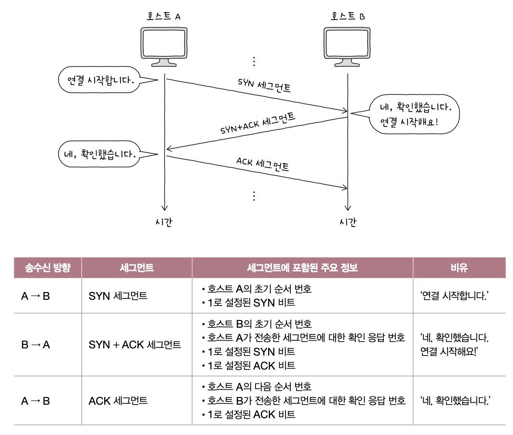
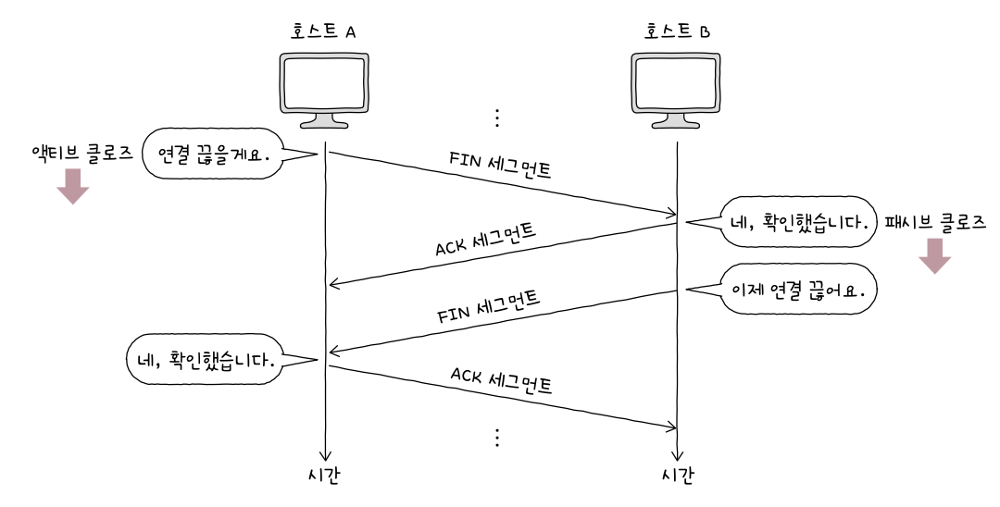
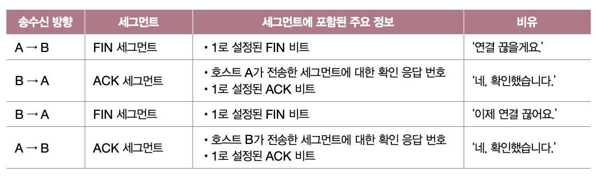

> # Chapter 04    **전송 계층**

 

# **04-1 전송 계층 개요 : IP의 한계와 포트**

## 핵심 키워드

- 전송 계층
- 신뢰할 수 없는 통신
- 비연결형 통신
- 포트
- NAT
- NAPT

## 전송 계층

- IP는  신뢰할 수 없는 프로토콜이자 비연결형 프로토콜이라는 점이 있음
- 전송 계층은 연결형 통신을 가능하게 함
- 전송 계층은 신뢰성 있는 통신을 가능하게 함

## 포트

- 패킷이 전달될 특정 애플리케이션을 식별할 수 있는 정보를 의미
- 패킷은 수신지 호스트의 주소까지 전달했다고 해서 전송이 끝난 것이 아니라, 실행 중인 특정 애플리케이션 프로세스까지 전달되어야 함
- 잘 알려진 포트  

    
- 등록된 포트  

    

## 포트 기반 NAT

- NAT : IP 주소를 변환하는 기술이며, 주로 네트워크 내부에서 사용되는 사설 IP 주소와 네트워크 외부에서 사용되는 공인 IP 주소를 변환하는 데 사용됨
- NAT 변환 테이블 : 변환의 대상이 되는 IP 주소 쌍이 명시되어 있는 테이블
- NAPT (or APT): 포트를 활용해 하나의 공인 IP 주소를 여러 사설 IP 주소가 공유할 수 있도록 하는 NAT의 일종

## 포트 포워딩

- 네트워크 내 특정 호스트에 IP 주소와 포트 번호를 미리 할당하고, (해당 IP 주소:포트 번호)로써  해당 호스트에게 패킷을 전달하는 기능

## 마무리 정리

- `전송 계층`은 네트워크 계층과 응용 계층 사이에 위치
- `전송 계층`은 신뢰할 수 있는 연결형 통신이 가능한 프로토콜을 제공하므로 네트워크 계층의 한계를 보완할 수 있음
- `전송 계층`은 포트를 통해 응용 계층의 애플리케이션을 식별함으로써 응용 계층과의 연결 다리 역할을 수행
- 신뢰할 수 없는 통신 : 패킷이 수신지까지 제대로 전송되었다는 보장을 하지 않는 통신 특성
- 비연결형 통신 : 송수신 호스트 간에 사전 연결 수립 작업을 거치지 않는 통신 특성
- 포트 : 응용 계층의 애플리케이션 프로세스를 식별하는 정보
- NAT : IP 주소를 변환하는 기술
- NAPT : 포트 기반의 NAT로 NAT 테이블에 변환될 IP 주소 쌍과 더불어 포트 번호도 함께 기록

 

# **04-2 TCP와 UDP**

## 핵심 키워드

- TCP
- MSS
- TCP 세그먼트
- 순서 번호
- 확인 응답 번호
- 쓰리 웨이 핸드셰이크
- TCP 상태
- UDP
- UDP 데이터그램

## UDP

- User Datagram Protocol
- TCP보다 신뢰성은 떨어지지만 비교적 빠른 통신이 가능한 비연결형 프로토콜

## TCP

- Transmission Control Protocol
- 신뢰할 수 있는 통신을 위한 연결형 프로토콜

## TCP 통신 단계와 세그먼트 구조

- TCP는 통신하기 전에 연결을 수립하고 통신이 끝나면 연결을 종료함
- 데이터 송수신 과정에서 재전송을 통한 오류 제어, 흐름 제어, 혼잡 제어 등의 기능을 제공
- MSS (Maximum Segment Size) : TCP로 전송할 수 있는 최대 페이로드 크기 (TCP 헤더 크기는 제외한 채 MSS의 크기를 고려)
- TCP 세그먼트 구조  

    
    - 송신지 포트, 수신지 포트 : 송신지 또는 수신지 애플리케이션을 식별하는 포트 번호가 명시되는 필드
    - 순서 번호 : 송수신되는 세그먼트의 올바른 순서를 보장하기 위해 세그먼트 데이터의 첫 바이트에 부여되는 번호
    - 확인 응답 번호 : 상대 호스트가 보낸 세그먼트에 대한 응답으로, 다음으로 수신하기를 기대하는 순서 번호가 명시됨
    - 제어 비트 : 플래그 비트라고도 불리며 현재 세그먼트에 대한 부가 정보를 나타냄
    - 윈도우 : 수신 윈도우의 크기가 명시되며 수신 윈도우란 한 번에 수신하고자 하는 데이터의 양을 나타냄
- 제어 비트
    - 기본적으로 8비트로 구성
    - ACK : 세그먼트의 승인을 나타내기 위한 비트
    - SYN : 연결을 수립하지 위한 비트
    - FIN : 연결을 종료하기 위한 비트
- 순서 번호와 확인 응답 번호
    - 두 필드는 TCP의 신뢰성을 보장하기 위해 사용되는 중요한 필드임

## TCP 연결 수립과 종료

- 연결 수립 : 쓰리 웨이 핸드셰이크
    - three-way-handshake : 세 개의 단계로 이루어진 TCP의 연결 수립 과정을 의미

## 쓰리 웨이 핸드셰이크

- 연결 수립  

    
    - 위와 같이 세 단계를 거친 뒤 본격적인 송수신이 시작됨
    - 액티브 오픈 : 처음 연결을 시작하는 호스트의 연결 수립 과정을 의미하며, 주로 서버 - 클라이언트 관계에서 클라이언트에 의해 수행됨
    - 패시브 오픈 : 주소 서버에 의해 수행되며, 위의 예시에서는 호스트 B의 동작이 패시브 오픈
- 연결 종료  

 

    
    - 데이터 송수신이 끝났따면 연결을 종료해야함
    - 액티브 클로즈 : 먼저 연결을 종료하려는 호스트에 의해 수행됨. 앞의 예시에서는 FIN 세그먼트를 먼저 보낸 호스트 A가 액티브 클로즈를 수행한 셈
    - 패시브 클로즈 : 연결 요청을 받아들이는 호스트에 의해 수행됨. 앞의 예시에서는 호스트 B의 동작이 패시브 클로즈

## TCP 상태

- 상태는 현재 어떤 통신 과정에 있는지를 나타내는 정보로 TCP는 상태를 유지하고 활용한다는 점에서 Statefull 프로토콜이라고도 불림
- TCP 상태 분류  

    
    - 1 : 연결이 수립되지 않은 상태  

        
        - CLOSED : 아무런 연결이 없는 상태
        - LISTEN : 일종의 연결 대기 상태
            - SYN 세그먼트를 기다리는 상태
    - 2 : 연결 수립 과정에서 주로 볼 수 있는 상태  

        
        - SYN-SENT : 액티브 오픈 호스트가 SYN 세그먼트를 보낸 뒤 그 응답인 SYN + ACK 세그먼트를 기다리는 상태
        - SYN-RECEIVED : 패시브 오픈 호스트가 SYN + ACK 세그먼트를 보낸 뒤 그에 대한 ACK 세그먼트를 기다리는 상태
        - ESTABLISHED : 연결이 확립되었음을 나타내는 상태 (데이터를 송수신할 수 있는 상태)
    - 3 : 연결 종료 과정에서 주로 볼 수 있는 상태  

        
        - FIN-WAIT-1 : 연결 종료의 첫 단계로 FIN 세그먼트로서 연결 종료 요청을 보낸 액티브 클로즈 호스트는 이 상태로 접어듬
        - CLOSE-WAIT : 종료 요청인 FIN 세그먼트를 받은 패시브 클로즈 호스트가 그에 대한 응답으로 ACK 세그먼트를 보낸 후 대기하는 상태
        - FIN-WAIT-2 : FIN-WAIT-1 상태에서 ACK 세그먼트를 받게 되면 FIN-WAIT-2 상태가 됨. 상대 호스트의 FIN 세그먼트를 기다리는 상태
        - LAST-ACK : CLOSE-WAIT 상태에서 FIN 세그먼트를 전송한 뒤 이에 대한 ACK 세그먼트를 기다리는 상태
        - TIME-WAIT : 액티브 클로즈 호스트가 FIN 세그먼트를 수신한 뒤, 이에 대한 ACK 세그먼트를 전송한 뒤 접어드는 상태
            - 패시브 클로즈 호스트가 마지막 ACK 세그먼트를 수신하면 CLOSED 상태로 전이됨
            - 액티브 클로즈 호스트는 TIME-WAIT 상태에 접어들고 일정 시간을 기다린 뒤 CLOSED 상태로 전이됨
            - 이는 마지막 ACK 세그먼트가 올바르게 전송되지 않았을 수 있기 때문에 잠시 기다린 뒤 CLOSED 상태로 전이되는 것
            - 곧바로 종료한다면 상대 호스트는 마지막 ACK 세그먼트를 재전송받을 수 없음
- TCP 상태의 종합  

    

## UDP 데이터그램 구조

- UDP는 연결 수립 및 해제, 재전송을 통한 오류제어, 혼잡 제어, 흐름 제어 등을 수행하지 않음
- 상태를 유지하지 않기에 Stateless 프로토콜의 일종이라고도 함
- UDP 데이터그램의 구조  

    
    - 송시지 포트, 수신지 포트 : 송수신지의 포트 번호가 담김
    - 길이 : 헤더를 포함한 UDP 데이터그램의 바이트가 담김
    - 체크섬 : 데이터그램 전송 과정에서 오류가 발생했는지 검사하기 위한 필드
- UDP는 TCP에 비해 적은 오버헤드로 패킷을 빠르게 처리할 수 있음
    - 주로 실시간 스트리밍 서비스, 인터넷 전화처럼 실시간성이 강조되는 상황에서 TCP보다 많이 쓰임

## 마무리 정리

- MSS : TCP로 전송 가능한 최대 페이로드 크기
- TCP 세그먼트 : 송신지 포트와 수신지 포트, 순서 번호, 확인 응답 번호, 제어 비트, 윈도우 등의 필드가 있음
- 순서 번호 : TCP 세그먼트 순서를 나타내기 위한 정보
- 확인 응답 번호 : 수신 호스트가 다음으로 받기를 희망하는 순서 번호
- Three-Way-Handshake : TCP의 연결 수립 과정
- TCP는 다양한 상태를 통해 현재 어떤 통신 과정에 있는지를 나타내는 Statefull 프로토콜
- UDP는 비연결형 통신을 수행하는 신뢰할 수 없는 프로토콜로, Stateless 프로토콜의 일종
- UDP 데이터 그램 : 송신지 포트와 수신지 포트, UDP 길이, 체크섬 필드가 있음

 

# **04-3 TCP의 오류, 흐름, 혼잡 제어**

## 핵심 키워드

- RTT
- ARQ
- 오류 제어
- 흐름 제어
- 슬라이딩 윈도우
- 혼잡 제어

## 오류 제어 : 재전송 기법

- 오류를 검출하고 세그먼트를 재전송하는 상황
    1. 중복된 ACK 세그먼트를 수신했을 때
        - 중간에 누락된 세그먼트의 순서 번호가 존재한다면 중복된 ACK 세그먼트를 전송하는데 이때 중복됨
    2. 타임아웃이 발생했을 때
        - ARQ (Automatic Repeat Request) : 문제가 생신 메시지를 재전송함으로써 신뢰성을 확보하는 방식
            - Stop-and-Wait ARQ : 제대로 전달했음을 확인하기 전까지는 새로운 메시지를 보내지 않는 방식
            - Go-Back-N ARQ : 파이프라이닝이라 하는데 이를 활용해 여러 세그먼트를 전송하고, 도중에 잘못 전송된 세그먼트가 발생할 경우 해당 세그먼트부터 전부 다시 전송하는 방식 (파이프라이닝 : 연속해서 메시지리를 전송할 수 있는 기술) → 여기서의 ACK 세그먼트를 누적 확인 응답이라고 함
            - Selective Repeat ARQ : 선택적으로 재전송하는 방법
                - 제대로 전송받은 각각의 패킷들에 대해 ACK 세그먼트를 보내는 방식
                - 여기서의 ACK 세그먼트는 개별 확인 응답인 셈

## 흐름 제어 : 슬라이딩 윈도우

- 호스트가 한 번에 받아서 처리할 수 있는 세그먼트의 양에는 한계가 있음
- 수신 버퍼 : 수신된 세그먼트가 애플리케이션 프로세스에 의해 읽히기 전에 임시로 저장되는 공간
- 버퍼 오버플로 : 버퍼가 넘치는 문제 상황
- 송신 버퍼 : 송신할 세그먼트가 저장되는 공간
- 오늘날 TCP에서는 흐름 제어로 슬라이딩 윈도우를 사용함
- 윈도우 : 송신 호스트가 파이프라이닝할 수 있는 최대량을 의미

## 혼잡 제어

- 혼잡을 제어하기 위한 기능으로 흐름 제어는 주체가 수신 호스트라면 혼잡 제어는 송신 호스트가 주체
- 혼잡 윈도우 : 혼잡 없이 전송할 수 있을 법한 데이터양
- 혼잡 윈도우 크기는 혼잡 제어 알고리즘을 통해 결정함
- 가장 기본적인 알고리즘으로 AIMD가 존재

## AIMD

- Additive Increase / Multiplicative Decrease
- 합으로 증가 / 곱으로 감소
- 혼잡이 감지되지 않는다면 혼잡 윈도우를 RTT(Round Trip Time)마다 1씩 선형적으로 증가
- 혼잡이 감지되면 혼잡 윈도우를 절반으로 떨어뜨리는 동작
- 이 동작을 반복하는 알고리즘
- 이것만으로 혼잡 제어가 이루어지지는 않으며 더 정교하게 만들어진 혼잡 제어 알고리즘이 존재
    1. 느린 시작 알고리즘
        - 혼잡 윈도우를 1부터 시작해 문제없이 수신된 ACK 세그먼트 하나당 1씩 증가시키는 방식
    2. 혼잡 회피 알고리즘
        - RTT마다 혼잡 윈도우를 1 MSS씩 증가시키는 알고리즘
    3. 빠른 회복 알고리즘
        - 세 번의 중복 ACK 세그먼트를 수신했을 때 느린 시작은 건너뛰고 혼잡 회피를 수행하는 알고리즘

## 마무리 정리

- RTT : 송신 호스트가 세그먼트를 전송한 뒤 그에 대한 답변을 받는 데까지 걸리는 시간을 의미
- ARQ : TCP의 재전송 기법으로, 수신 호스트의 답변(ACK)과 타임아웃 발생을 토대로 문제를 진단하고, 문제가 생긴 메시지를 재전송함으로써 신뢰성을 확보하는 방식
- 오류 제어 : 이를 위한 재전송 기법에는 Stop-and-Wait ARQ, Go-Back-N ARQ, Selective Repeat ARQ가 있음
- 흐름 제어 : 수신자의 처리 속도를 고려하며 전송하는 방식으로, TCP는 이를 위해 슬라이딩 윈도우를 사용함
- 혼잡 제어 : 네트워크의 혼잡도를 판단하고 혼잡한 정도에 따라 전송량을 조절하는 방식으로, 느린 시작, 혼잡 회피, 빠른 회복 등의 알고리즘이 사용될 수 있음

