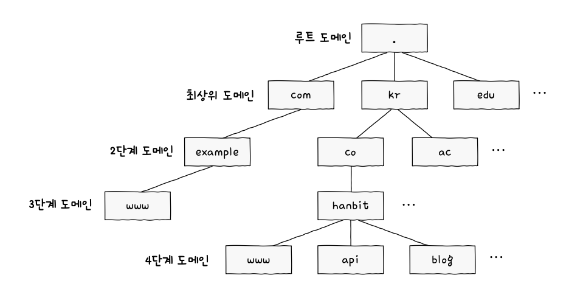

> # Chapter 05    **응용 계층**

 

# **05-1 DNS와 자원**

## 핵심 키워드

- 도메인 네임
- DNS
- 네임 서버
- DNS 캐시
- 자원
- URI
- URL

## 도메인 네임과 네임 서버

- 도메인 네임 : 호스트의 IP 주소와 대응되는 문자열 형태의 호스트 특정 정보
- 네임 서버 : 도메인 네임과 IP 주소를 관리하는 서버로 DNS 서버라고도 불림
- www.example.com.  
    
    
    - www : 3단계 도메인, 호스트 네임
    - example : 2단계 도메인
    - com : 최상위 도메인, TLD
    - . (마지막 .) : 루트 도메인, 생략해서 표기함
- DNS (Domain Name System) : 계층적인 도메인 네임에 대한 관리 체계
    - 호스트가 도메인 네임 시스템을 이용할 수 있도록 하는 애플리케이션 계층 프로토콜을 의미하기도 함

## 계층적 네임 서버

- 크게 네 가지
    - 로컬 네임 서버 (로컬 DNS 서버, 리졸버)
    - 루트 네임 서버 (루트 DNS 서버)
    - TLD 네임 서버 (최상위 도메인 네임 서버, TLD 서버)
    - 책임 네임 서버 (책임 서버)
- 로컬 네임 서버 : 클라이언트가 도메인 네임을 통해 IP 주소를 알아내고자 할 때 가장 먼저 찾게 되는 네임 서버 (질의에 대응하는 IP 주소를 알고 있다면 그 IP 주소를 알려줌, 모른다면 아래 네임 서버를 거쳐서 얻음)
- 루트 네임 서버 : 루트 도메인을 관장하는 네임 서버로, 질의에 대해 TLD 네임 서버의 IP 주소를 반환할 수 있음
- TLD 네임 서버 : TLD를 관리하는 네임 서버로 질의에 대해 TLD의 하위 도메인 네임을 관리하는 네임 서버 주소를 반환할 수 있음
- 책임 네임 서버 : 특정 도메인 영역을 관리하는 네임 서버로, 마지막으로 질의하는 네임 서버
- 네임 서버들의 계층 구조  
    
    
- 재귀적 질의  
    
    
- 반복적 질의  
    
    
- DNS 캐시
    - 네임 서버들이 기존에 응답받은 결과를 임시로 저장했다가 추후 같은 질의에 활용하는 것
    - 임시 저장된 값은 TTL(Time To Live)값과 함께 저장되어 영원히 남아있지는 않음 (IP 패킷의 TTL과는 다름!)

## 자원

- 네트워크상의 메시지를 통해 주고받는 대상
- HTML 파일, 이미지, 동영상, 텍스트 등..
- 두 호스트가 네트워크를 통해 서로 정보를 주고받을 때, 송수신하는 대상이 바로 자원

## URI

- Uniform Resource Identifier
- 자원을 식별할 수 있는 정보
- URI는 URL과 URN으로 나뉨
- URL (Uniform Resource Locator): 위치를 이용해 자원을 식별  
    
    
- URN (Uniform Resource Name): 이름을 이용해 자원을 식별  
    
    

## 마무리 정리

- 도메인 네임 : IP 주소와 대응되는 문자열 형태의 호스트 특정 정보이며, 네임 서버가 관리함
- DNS : 계층적이고 분산된 도메인 네임에 대한 관리 체계이자 이를 관리하는 프로토콜
- 네임 서버 : 도메인 에미을 풀이(리졸빙)하기 위해 사용되는 유형으로 크게 네 가지가 존재함 (로컬 N.S., 루트 N.S., TLD N.S., 책임 N.S.)
- DNS 캐시 : TTL 동안의 시간만큼 도메인 네임의 질의 결과를 임시 저장하는 것
- 자원 : 네트워크상의 메시지를 통해 송수신하고자 하는 대상
- URI : 자원을 식별할 수 있는 정보
- URL : 위치 기반으로 자원을 식별하는 방법으로 schema, authority, path, query, fragment로 구성되어 있음
- URN : 이름 기반으로 자원을 식별하는 방법

 

# **05-2 HTTP**

## 핵심 키워드

- HTTP 특성
- HTTP 메시지 구조
- 메서드
- 상태 코드

## HTTP의 특성

- HTTP (Hypertext Transfer Protocol) : 응용 계층에서 정보를 주고받는 데 사용되는 프로토콜
- 요청-응답 기반 프로토콜 : 클라이언트와 서버가 서로 HTTP 요청 메시지와 HTTP 응답 메시지를 주고받는 구조로 동작
- 미디어 독립적 프로토콜 : 클라이언트는 HTTP 요청 메시지를 통해 서버의 자원을 요청할 수 있고, 서버는 HTTP 응답 메시지를 통해 요청받은 자원에 대해 응답할 수 있음
    - HTTP에서 메시지를 주고받는 자원의 종류를 미디어 타입(media type) 혹은 MIME 타입 (Multipurpose Internet Mail Extension Type)이라고 부름
    - 타입 / 서브타입으로 데이터의 유형을 나타내며 서브타입은 주어진 타입에 대한 세부 유형을 나타냄
- 스테이트리스 프로토콜 : HTTP는 상태를 유지하지 않는 Stateless 프로토콜로 서버가 HTTP 요청을 보낸 클라이언트와 관련된 상태를 기억하지 않음
    - 특정 클라이언트가 특정 서버에 종속되지 않도록 하기 위함
    - 서버의 추가나 문제 발생 시 대처가 용이하도록 하기 위함
    - 즉 HTTP의 중요한 설계 목표는 확장성과 견고성!!
- 지속 연결 프로토콜
    - 기본적으로 HTTP는 비연결형 프로토콜 TCP는 연결형 프로토콜
    - 초기의 HTTP 1.0 이하는 쓰리 웨이 핸드셰이크를 통해 TCP 연결을 수립한 후, 요청에 대한 응답을 받으면 연결을 종료하는 방식으로 동작함 → 비지속 연결
    - HTTP 1.1 이상은 지속 연결이라는 기술을 제공하는데(다른 표현 keep-alive), 하나의 TCP 연결상에서 여러 개의 요청-응답을 주고받을 수 있는 기술  
    
        
    - 더욱 최근인 HTTP 3.0은 UDP 상에서 동작하며 이에 대한 내용은 알아보기!

## HTTP 메시지 구조

- HTTP 메시지 구성  
    
    
- 시작 라인
    - 요청 라인 : HTTP 요청 메시지  
    
        
        - 메서드 : 클라이언트가 서버의 자원에 대해 수행할 작업의 종류 (GET, POST, PUT, DELETE …)
        - 요청 대상 : HTTP 요청을 보낼 서버의 자원으로 보통 쿼리가 포함된 URI 경로가 명시됨 (http://www.example.com/hh?q=wo → /hh?q-wo)
        - HTTP 버전 : HTTP 버전을 의미 (HTTP/1.1)
    - 상태 라인 : HTTP 응답 메시지  
    
        
    - 상태 코드 : 요청에 대한 결과를 나타내는 세 자리 정수
    - 이유 구문 : 상태 코드에 대한 문자열 형태의 설명
- 필드 라인
    - 0개 이상의 HTTP 헤더가 명시됨 (HTTP 헤더 : HTTP 통신에 필요한 부가 정보)
    - 헤더 라인이라고도 부름
    - ‘헤더 이름 : 헤더 값’ 으로 구성 됨
- 메시지 본문
    - HTTP 요청 혹은 응답 메시지에서 본문이 필요할 경우 명시

## HTTP 상태 코드

- 상태 코드별 유형  
    
    

## 마무리 정리

- HTTP는 요청-응답 기반의 프로토콜
- HTTP는 미디어 독립적이고, 상태를 유지하지 않으며, 지속 연결 기능을 제공하는 특성을 지닌 프로토콜
- HTTP 메시지 구조 : 시작 라인, 필드 라인, 메시지 본문으로 이루어져 있음
- HTTP 요청 메시지의 요청 라인에는 메서드 명시
- HTTP 응답 메시지의 상태 라인에는 상태 코드 명시

 

# **05-3 HTTP 헤더와 HTTP 기반 기술**

## 핵심 키워드

- HTTP 헤더
- 캐시
- 쿠키
- 콘텐츠 협상

## HTTP 헤더

- 요청 시 활용되는 HTTP 헤더
    - Host : 요청을 보낼 호스트를 나타내는 헤더로 주로 도메인 네임으로 명시되며 포트 번호가 포함되어 있을 수 있음
    - User-Agent : 웹 브라우저와 같이 HTTP 요청을 시작하는 클라이언트 측의 프로그램을 의미 (클라이언트의 접속 환경을 유추 가능)
    - Referer : 클라이언트가 요청을 보낼 때 머무르고 있던 URL이 명시 됨
    - Authorization : 클라이언트의 인증 정보를 담는 헤더
- 응답 시 활용되는 HTTP 헤더
    - Server : 요청을 처리하는 서버 측의 소프트웨어와 관련된 정보를 명시
    - Allow : 클라이언트에게 허용된 HTTP 메서드 목록을 알려 주기 위해 사용
    - Retry-After : 자원을 사용할 수 있는 날짜 혹은 시각을 나타냄
    - Location : 클라이언트에게 자원의 위치를 알려 주기 위해 사용됨
    - WWW-Authenticate : 자원에 접근하기 위한 인증 방식을 설명하는 헤더 (주로 상태 코드 401(Unauthorized)과 함께 사용)
- 요청과 응답 모두 활용되는 HTTP 헤더
    - Date : 메시지가 생성된 날자와 시각에 관련된 정보를 담은 헤더
    - Connection : 클라이언트의 요청과 응답 간의 연결 방식을 설정하는 헤더 (대표적인 연결 방식은 지속 연결(keep-alive))
    - Content-Length : 본문의 바이트 단위 크기(길이)를 나타내는 헤더
    - Content-Type, Content-Language, Content-Encoding : 메시지 본문의 표현 방식을 설명하는 헤더

## 캐시

- 불필요한 대역폭 낭비와 응답 지연을 방지하기 위해 정보의 사본을 임시로 저장하는 기술
- 개인 전용 캐시 (private cache) : 웹 브라우저에 저장
- 공용 캐시 (public cache) : 클라이언트와 서버 사이에 위치한 중간 서버에 저장
- 캐시된 데이터에 유효 기간을 설정하여 관리함

## 쿠키

- 서버에서 생성되어 클라이언트 측에 저장되는 데이터로, Stateless한 HTTP의 특성을 보완하기 위한 수단
- <이름, 값> 쌍의 형태를 띠고 있음
- 적용 범위와 만료 기간 등 다양한 속성을 가질 수 있음

## 세션 인증

1. 클라이언트는 서버에게 (아이디, 비밀번호와 같은) 인증 정보를 전송함
2. 인증 정보가 올바르다면, 서버는 세션 아이디를 생성해 클라이언트에게 전송함
3. 서버는 생성한 세션 아이디를 데이터베이스 등에 저장함
4. 클라이언트는 추후 요청을 보낼 때 쿠키 내에 세션 아이디를 포함하여 전송함
5. 서버는 쿠키 속 세션 아이디와 저장된 세션 아이디를 비교하여 클라이언트를 식별함

## 마무리 정리

- HTTP 헤더 : 요청 메시지에서 주로 활용되는 헤더, 응답 메시지에서 주로 활용되는 헤더, 요청과 응답 메시지 모두에서 자주 활용되는 헤더로 구분 가능
- 캐시 : 대역폭 낭비, 응답 지연을 방지하기 위해 사본을 임시 저장하는 기술
- 쿠키 : 클라이언트의 상태를 알 수 있는 정보로, 서버에 의해 생성되고, 클라이언트에 의해 저장됨
- 콘텐츠 협상 : 같은 URI에 대해 가장 적합한 자원의 표현을 제공해 주는 메커니즘

