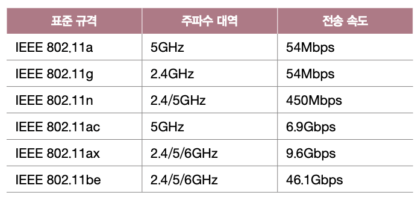

> # Chapter 07    **네트워크 심화**

 

# **07-1 안정성을 위한 기술**

## 핵심 키워드

- 가용성
- 이중화
- 다중화
- 로드 밸런싱

## 가용성

- 안정성의 정도를 나타내는 것
- 안정성 : 특정 기능을 언제든 균일한 성능으로 수행할 수 있는 특성
- 즉 ‘컴퓨터 시스템이 특정 기능을 실제로 수행할 수 있는 시간의 비율’을 의미
- 전체 사용 시간 중에서 정상적인 사용 시간
    - 가용성 = 업타임 / (업타임 + 다운타임)
- 다운타임의 경우
    - 과도한 트래픽으로 인한 서비스 다운
    - 예기치 못한 소프트웨어상 오류
    - 하드웨어 장애
    - 보안 공격
    - 자연 재해
- 결함 감내 : 문제가 발생하더라도 기능할 수 있는 능력
- 다운타임을 낮추고 가용성을 높이기 위해서는 결함을 감내할 수 있도록 서비스나 인프라를 설계하자!

## 이중화

- 결함을 감내하여 가용성을 높이기 위한 가장 기본적이고 대표적인 방법
- 무언가를 이중으로 두는 기술로 예비(백업)를 마련하는 방법
- 단일 장애점 (SPOF, Single Point Of Failure) : 문제가 발생할 경우 시스템 전체가 중단될 수 있는 대상
- 가용성을 높이기 위해서는 SPOF를 이중화하는 것이 좋음
- 이중화 구성
    - 액티브/스탠바이
        - 한 시스템은 가동 상태, 다른 시스템은 백업 용도로 대기 상태로 두는 구성 방식
        - 안전한 구성 방식
        - 하지만 두 장비가 동시에 가동되지 않고 한 번에 하나만 가동되기에 성능상 큰 변화 없음
    - 액티브/액티브
        - 두 시스템 모두를 가동 상태로 두는 구성 방식
        - 부하를 분산시킬 수 있고 두 시스템이 함께 가동되므로 성능상의 이점도 있음
        - 다만 한 시스템에 문제가 발생하면 다른 시스템에 부하가 급증할 수 있고, 이로 인해 추가적인 문제 발생 가능

## 다중화

- 이중화와 달리 ‘무언가를 여러 개 두는 기술’

## 이중화/다중화 사례

- 티밍 (teaming) : 윈도우에서 사용되는 용어
- 본딩 (bonding) : 리눅스에서 사용되는 용어
- 위 두 기술은 여러 개의 네트워크 인터페이스(NIC)를 이중화/다중화하여 마치 더 뛰어나고 안정적인 성능을 보유한 하나의 인터페이스처럼 보이게 하는 기술

## 로드 밸런싱

- 트래픽을 고르게 분산하는 기술
- 트래픽 : 주어진 시점에 네트워크(특정 노드)를 경유한 데이터(패킷)의 양
- 서버를 다중화 해도 특정 서버에만 트래픽이 몰릴 경우 가용성이 떨어질 수 있는데 로드 밸런싱을 통해 트래픽을 고르게 분배할 수 있음
- 로드 밸런싱은 로드 밸런서에 의해 수행됨
- 로드 밸런서 - 네트워크 장비
    - L4 스위치
    - L7 스위치
- 로드 밸런서 - 소프트웨어
    - HAProxy
    - Envoy
    - Nginx (웹 서버 소프트웨어)
- 로드 밸런서는 이중화 혹은 다중화 된 서버와 클라이언트 사이에 위치
- 클라이언트들은 로드 밸런서에 요청을 보내고, 로드 밸런서는 해당 요청을 각 서버에 균등하게 분배함  
    
    
- 로드 밸런싱 알고리즘
    - 라운드 로빈 알고리즘 : 단순히 서버를 돌아가며 부하를 전달하는 알고리즘
    - 최소 연결 알고리즘 : 연결이 적은 서버부터 우선적으로 부하를 전달하는 알고리즘
    - 때로는 단순히 무작위로 고르기도 함
    - 해시(Hash)를 사용하기도 함
    - 응답 시간이 가장 짧은 서버를 선택하기도 함
- 가중치가 높은 서버가 더 많이 선택되어 더 많은 부하를 받도록 하는 알고리즘
    - 가중치 라운드 로빈 알고리즘
    - 가중치 최소 연결 알고리즘

## 프록시

- 클라이언트와 서버 사이에서 데이터를 전달해 주는 서버
- 오리진 서버 : 자원을 생성하고 클라이언트에게 권한 있는 응답을 보내는 HTTP 서버
- 클라이언트가 어떤 프록시를 사용할지 선택함  
    
    
- 프록시는 주로 캐시 저장, 클라이언트 암호화 및 접근 제한 등의 기능을 제공
- 게이트웨이 : 네트워크 간의 통신을 가능케 하는 입구 역할을 하는 하드웨어 혹은 소프트 웨어  
    
    
- 프록시는 포워드 프록시, 게이트웨이는 리버스 프록시라고도 함
- 프록시 서버는 컨텐트 캐시, 보안, 필터링 등의 역할을 하는 중개자라면 게이트웨이는 서로 다른 네트워크 통신에서 서로 다른 프로토콜을 호환가능하게 하는 특별한 서버라고 볼 수 있음 (https://coding-start.tistory.com/342)

## 마무리 정리

- 가용성 : 정상적인 사용이 가능한 시간의 비율이며 가용성이 높을 수록 안정적인 시스템
- SPOF를 없애기 위해서 이중화/다중화를 사용하며 이를 통해 가용성을 높일 수 있음
- 로드 밸런싱 : 로드 밸런서를 통해 부하를 분산하는 방법

 

# **07-2 안정성을 위한 기술**

## 핵심 키워드

- 대칭 키 암호화 방식
- 공개 키 암호화 방식 (비대칭 키 암호화 방식)
- 공개 키 인증서
- 디지털 서명
- SSL
- TLS
- HTTPS
- TLS 핸드셰이크

## 암호화와 복호화

- 암호화 : 원문 데이터를 알아볼 수 없는 형태로 변경하는 것
- 복호화 : 암호화된 데이터를 원문 데이터로 되돌리는 것
- 이는 안전한 데이터 송수신뿐만 아니라 인증서 기반의 검증도 가능하게 함

## 대칭 키 암호화

- Symmetric Key Cryptography
- 암호화와 복호화에 동일한 암호 키를 사용하는 암호화 방식
- 이는 키가 유출되면 문제가 생기기에 상대방에게 키를 안전하게 전달하는 방법이 필요함
- 하지만 키를 안전하게 전달하는 방법이 있다면 애초에 데이터를 암호화해서 전달하기 보다 데이터를 그냥 안전하게 전달하면 됨 → 그래서 등장한 것이 공개 키 암호화(비대칭 키 암호화)

## 비대칭 키 암호화

- Asymmetric Key Cryptography
- 공개 키 암호화 방식(Public Key Cryptography)이라고도 함
- 암호화에 사용하는 키와 복호화에 사용하는 키가 다른 암호화 방식
- 공개 키 (Public Key) : 누구에게나 공개해도 되는 키
- 개인 키 (Private Key) : 함부로 유출되면 안 되는 키
- 두 키로 다른 키를 유추할 수 없기에 공개 키를 안다고 해서 원문 메시지를 유추할 수 없음

## 세션 키

- 대칭 키 암호화 방식과 비대칭 키 암호화 방식의 장단점을 고려해 둘 다 사용한 경우가 많음
- 예시
    1. 대칭 키를 상대에게 안전하게 전달하기 위해 공개 키로 대칭 키를 암호화
    2. 개인 키로 암호화된 대칭 키를 복호화
- 대칭 키를 안전하게 공유함과 동시에 공유한 대칭 키를 이용해 빠르게 암호화/복호화를 수행할 수 있음
- 이러한 방식으로 활용되는 대칭 키를 `세션 키`라고 함

## 인증서

- 네트워크(인터넷)에서 사용되는 인증서라는 용어는 일반적으로 공개 키 인증서를 의미함
- 공개 키 인증서 : 공개 키와 공개 키의 유효성을 입증하기 위한 전자 문서
- 공개 키 인증서는 인증 기관(CA, Certification Authority)이라는 제 3의 기관에서 발급함
- 공개 키 인증서에는 서명 값(signature)가 있음  
    
    
- 서명 값을 얻는 과정  
    
    
    1. 인증서 내용에 대한 해시 값(fingerprint, 지문)을
    2. CA의 개인 키로 암호화 하는 방식으로 만듦
- 디지털 서명 (digital signature) : 개인 키로 암호화된 메시지를 공개 키로 복호화함으로써 신원을 증명하는 절차  
    

## HTTPS: SSL과 TLS

- SSL (Secure Sockeys Layer)
- TLS (Transport Layer Security)
- SSL과 TLS는 위와 같은 암호화 방식을 기반으로 동작하는 프로토콜
- TLS는 SSL를 계승한 프로토콜
- HTTPS : SSL/TLS를 사용하는 대표적인 프로토콜 (HTTP 메시지를의 안전한 송수신을 위해 개발된 프로토콜)
- HTTPS의 동작 단계 (오늘날 주로 TLS 1.3을 기반으로 동작)
    1. TCP 쓰리 웨이 핸드셰이크 
    
        
    2. TLS 핸드셰이크 
    
        
    3. 암호화된 메시지 송수신

## TLS 핸드셰이크

- 이를 통해 암호화에 사용할 키와 인증서를 주고받을 수 있음
- 암호화 통신을 위한 키를 교환함
- 인증서 송수신과 검증이 이루어짐
- 암호 스위트 (cipher suite) : 사용 가능한 암호화 방식과 해시 함수를 담은 정보

## 마무리 정리

- 대칭 키 암호화 방식 : 암호화와 복호화 시 같은 암호 키를 쓰는 암호화 방식
- 공개 키 암호화 방식 : 비대칭 키 암호화 방식으로 암호화와 복호화 시 서로 다른 키를 쓰는 암호화 방식
- 공개 키 인증서 : 공개 키와 공개 키의 유효성을 입증하기 위한 전자 문서 (CA라는 인증서 발급 기관을 통해 인증서를 검증할 수 있음)
- 디지털 서명 : 개인 키로 암호화된 메시지를 공개 키로 복호화함으로써 신원을 증명하는 절차
- SSL/TLS : 인증과 암호화를 가능하게 하는 프로토콜로 TLS는 SSL을 계승한 프로토콜
- HTTPS : SSL/TLS를 사용하는 가장 대표적인 프로토콜
- TLS 핸드셰이크를 통해 암호화에 사용할 키와 인증서를 주고받을 수 있음

 

# **07-3 무선 네트워크**

## 핵심 키워드

- 전파
- 주파수 대역
- 802.11
- 와이파이
- 채널
- AP
- 서비스 셋
- SSID
- 비컨 프레임

## 전파와 주파수

- 전파 (radio wave) : 눈에 보이지 않는 전자기파의 일종
- 주파수 대역 : 서로 다른 전파 신호를 구분하기 위해 통신에서 사용되는 전파를 미리 정해 놓은 것

## 와이파이와 802.11

- 오늘날 LAN 환경에서의 유선 통신은 IEEE 802.3으로 표준화 되어 있음
- 오늘날 LAN 환경에서의 무선 통신은 IEEE 802.11로 표준화 되어 있음
- IEEE 802.11 표준은 대부분 2.4GHz, 5GHz 대역을 사용함
- IEEE 802.11 규격에 따른 주파수 대역과 최대 전송 속도  
    
    
- 와이파이 (Wifi) : 특정 IEEE 802.11 규격을 준수하는 기술
- 채널 (channel) : 동일한 주파수 대역의 네트워크를 이용하더라도 세부적인 주파수를 구분하기 위한 것 (각 채널은 번호로 구분됨)

## AP와 서비스 셋

- AP (Access Point) : 무선 통신 기기들을 연결하여 무선 네트워크를 구성하는 장치
- 인프라스트럭쳐 모드 (infrastructure mode) : AP를 경유하여 통신이 이루어지는 무선 네트워크 통신 방식
- 애드 혹 모드 (Ad Hoc mode) : AP의 간섭 없이 호스트 간에 일대일로 통신하는 무선 통신 모드
- 오늘날 많은 무선 LAN이 AP가 중개하는 인프라스트럭처 모드로 동작함  
    
    
- 서비스 셋 (Service Set) : 무선 네트워크를 이루는 AP와 여러 장치들의 집합
- 서비스 셋 식별자 (SSID: Service Set Identifier) : 무선 네트워크를 구분짓는 수단이자 무선 네트워크를 지칭하는 고유한 이름  
    
    
- AP를 통해 구성된 네트워크 단위인 서비스 셋은 SSID로 구분됨

## 비컨 프레임

- Beacon Frame
- AP는 불특정 다수 모두에게 연결 가능한 무선 네트워크라는 자신을 알리는 브로드캐스트 메시지를 주기적으로 전송함
- 이 브로드캐스트 메시지를 `비컨 프레임`이라 함
- 비컨 프레임 안에는 SSID와 AP의 MAC 주소 등이 포함되어 있음  
    
    

## 마무리 정리

- 정보는 전파를 통해 무선으로 전달될 수 있음
- 전파 통신을 위한 주파수 대역은 정해져 있음
- IEEE 802.11 : 무선 LAN의 표준 규격
- 와이파이 : 특정 IEEE 802.11 규격을 준수하는 기술
- 채널 : 무선 통신에서의 채널은 무선 네트워크에서 사용될 특정 주파수 대역을 나타내며, 채널 번호로 구분 됨
- 무선 액세스 포인트 (AP) : 무선 통신 기기들을 연결하는 장치
- 서비스 셋 : AP를 통해 구성된 네트워크 단위
- 서비스 셋 식별자 (SSID) : 무선 네트워크를 구분짓는 수단이자 무선 네트워크를 지칭하는 고유한 이름
- 서비스 셋은 SSID로 구분함
- 비컨 프레임 : AP가 자신의 존재를 알리기 위해 브로드캐스트하는 메시지

