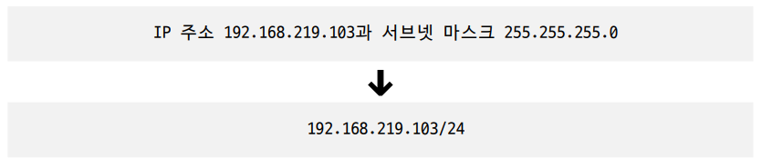

# 03 네트워크 계층

## 03-1 LAN을 넘어서는 네트워크 계층

### 데이터링크계층의 한계

- 네트워크 통신의 어려움
  - LAN만으로 다른 네트워크까지의 도달 경로 파악 어려움
  - MAC 주소만으로 모든 네트워크에 속한 호스트 위치 특정 어려움

### 인터넷 프로토콜(Internet Protocol)

- 종류

  - IPv4
    - 일반적인 IP or IP 주소
    - 4바이트(32비트)로 주소 구성 (옥텟 : 0 ~ 225범위, 10진수)
    - ex) 192.168.1.1
    - 프레임의 페이로드로 데이터에 필드 명시 ← 프레임의 데이터 필드에는 상위계층에서 전달받거나 상위계층으로 전달해야 할 내용 명시되어야함
      
    - IPv4 패킷
      
      1. 식별자
         - 패킷에 할당된 번호
         - 수신지에서 재조합할 때 인식하기 위해 식별자 사용
      2. 플래그
         - 총 세개의 비트로 구성
         - 첫번째 : 0 (항상) 현재 사용x
         - 두번째 : DF(Don’t Fragment) 1 IP단편화X ↔ 0 IP단편화O
           - 그럼에도 불구하고 패키의 크기가 크다면? 폐기
         - 세번째 : MF(More Fragment) 1 뒤에 패킷 존재 ↔ 0 마지막 패킷
      3. 단편화 오프셋
         - 패킷 단편화 전에 패킷의 초기데이터에서 몇번째로 떨어진 패킷인지 나타냄
         - 수신지 도착 후 패킷 순서대로 재조합하기 위해 사용
      4. TTL(Time To Live)
         - 패킷의 수명
         - 홉 하나 거칠때마다 TTL 1씩 감소
         - 0이면 폐기 후 송신한 호스트에게 시간초과 메시지 전송
         - 홉(hop) : 패킷이 호스트 또는 라우터에 한 번 전달되는것
         - 존재 이유 : 무의미한 패킷이 네트워크 상에 지속적으로 남아있는 것을 방지
      5. 프로토콜
         - 상위 계층의 프로토콜 나타냄 TCP : 6, UDP : 17
      6. 송신지 IP 주소
      7. 수신지 IP 주소
  - IPv6

    - IPv4의 주소 개수 부족을 해결하기 위해 등장
    - 16바이트 (128비트)
    - 콜론 구분
    - IPv6 패킷
      

      1. 다음 헤더

         

         - 상위계층의 프로토콜 or 확장 헤더 가리킴
         - 확장헤더 : 기본 헤더가 IPv4보다 간소화되어있는데 추가적인 헤더정보를 말함
           - 홉간옵션
           - 수신지옵션
           - 라우팅
           - 단편
           - ESP
           - AH
             (종류 세세하게 알아야하나?)

      2. 홉 제한 : IPv4패킷 TTL필드와 비슷
      3. 송신지 IP주소
      4. 수신지 IP주소

- 기능
  - IP 주소 지정(IP addressing) : IP 주소 바탕으로 송수신 대상 지정
  - IP 단편화(IP fragmentation) : 전송하고자하는 패킷의 크기가 MTU(한 번에 전송가능한 IP 패킷 최대 크기) 보다 클 경우, 패킷 쪼갬 → 수신지 도착 후 재조합

### ARP

- 상대 호스트의 IP주소는 알지만, MAC주소 모르는 상황
- **동일 네트워크** 내에 있는 호스트의 IP 주소를 통해 MAC 주소를 알아내는 프로토콜

**스위치가 MAC 주소 학습했다고해서 호스트들끼리 서로 MAC 주소 학습한 거 아님**

1. ARP 요청
   - 모든 호스트에게 브로드캐스트 메시지 요청
2. ARP 응답
   - 해당하는 호스트는 자신 MAC주소 담은 유니캐스트 메시지(ARP 패킷) 전송(나머지는 무시)
   - ARP 패킷
3. ARP 테이블 갱신

   

   - 일정시간 지나면 삭제, 임의 삭제도 가능
   - 테이블 채워지면 통신할 때 브로드캐스트 ARP 요청 보낼 필요 x → 채워진 호스트는 유니캐스트로 보내면 되는듯

- 만약 다른 네트워크 내에 있는 호스트의 IP 주소를 통해 통신해야하는 상황이라면?
  
  - 라우터의 MAC 주소 알아내서 패킷 전송해야함
  - ARP 요청을 라우터를 거치며 여러번 반복(ex. 호스트A → 라우터 A → 라우터 B → 호스트B)
    - 호스트A ARP테이블에 라우터A MAC 주소 채워짐
    - 라우터A ARP 테이블에 라우터 B MAC 주소 채워짐
    - 라우터 B ARP 테이블에 호스트 B MAC 주소 채워짐
  - 실제로 라우터 간 통신 주고받을 때 ARP만 이용하지는 않음
- IP 단편화는 좋은 것인가? X
  - 데이터가 여러 패킷으로 쪼개지면 전송해야할 패킷 헤더 증가, 불필요한 트래픽 증가, 대역폭 낭비
  - 쪼개진 IP 패킷 하나로 합치는 과정에서 발생하는 부하가 성능저하 야기할수있음
  - 즉 처리가능한 MTU 크기 고려해야함 → 경로 MTU만큼 전송
    
  - 오늘날 네트워크에서는 대부분 경로 MTU 발견 지원 (DF플래그)

## 03-2 IP 주소

### 네트워크 주소와 호스트 주소

- 네트워크 주소 : 네트워크 ID, 네트워크 식별자
- 호스트 주소 : 호스트 ID, 호스트 식별자
- 32비트는 네트워크 주소 + 호스트 주소 : 할당량은 가변적
- 어떻게 할당하는 것이 좋을까?
  - 호스트 주소 너무 크게 하면 호스트 할당되지 않은 다수 IP주소 낭비
  - 호스트 주소 너무 작으면 호스트가 사용할 IP 주소 부족해질 수 O
  - 클래스가 해결책

### 클래스풀 주소 체계

- 클래스 : 네트워크 크기에 따라 IP주소 분류하는 기준
  
- 클래스풀 주소 체계 : 클래스 기반으로 IP 주소 관리하는 주소 체계
- 네트워크 주소 : 무조건 비트0으로 시작 2^7 (0~127) 가능
- 호스트 주소 : 2^8 (0~ 255) 가능
  - 호스트 주소 전부 0 : 해당 네트워크 자체를 의미하는 네트워크 주소
  - 호스트 주소 전부 1 : 브로드캐스트 위한 주소

- 한계
  - 클래스별 네트워크 크기가 고정되어 있어서 다수의 IP주소의 낭비 가능성
  - 300명 직원이 동일 네트워크 구성하려면 클래스풀 주소 체계에서는 어쩔 수 없이 B클래스 이용 → 낭비되는 IP주소 많음

### 클래스리스 주소체계

- 클래스에 구애받지 않고 네트워크 영역 나눠 호스트에게 IP 주소 공간 할당 (오늘날 주로 이용)
- 서브넷마스크를 이용해 네트워크 주소와 호스트 주소를 구분하는 IP 주소 체계
- 서브넷 마스크
  - 네트워크와 호스트를 구분 짓는 수단
  - 네트워크주소 : 1 / 호스트 주소 : 0 로 표기한 비트열
  - 서브네팅 : 서브넷 마스크를 이용해 클래스를 원하는 크기로 더 잘게 쪼개어 사용하는 것
  - 서브네트워크(서브넷) : IP주소의 네트워크 주소로 구분 가능한 네트워크의 부분집합
  - A,B,C 클래스 기본 서브넷 마스크
    
  - 네트워크주소AND연산
    
- 서브넷 마스크 표기: CIDR 표기법
  - C클래스의 기본 서브넷 마스크 225.225.225.0 (1이 총 24개)
    

### 공인 IP 주소와 사설 IP 주소

- 공인 IP 주소
  - 전세계에서 고유한 IP 주소
  - 인터넷 이용할 때 사용하는 IP주소
  - ISP나 공인 IP 주소 할당 기관통해 할당 가능
- 사설 IP 주소
  - 10.0.0.0/8, 172.16.0.0/12, 192.168.0.0/16
  - 사설 네트워크에서 사용하기 위한 IP 주소
  - 인터넷, 외부 네트워크에 공개x 네트워크
  - 사설 IP주소로 사용하도록 특별히 예약된 IP 주소 공간 존재
  - 사설 IP 할당 주체는 일반적으로 라우터
  - 사설 IP만으로는 일반적인 인터넷 접속을 비롯한 외부 네트워크 간 통신 어려움
- NAT(Network address Translation)
  
  - 사설 IP주소를 사용하는 호스트가 외부 네트워크와 통신하기 위한 IP주소 변환 기술
  - 사설 IP 주소 → 공인 IP 주소
  - 대부분의 라우터와 가정용 공유기는 NAT기능 내장
    - 사설 네트워크 상에서 만들어진 패킷 속 사설 IP 주소는 공유기 거쳐 공인 IP 변경, 외부 네트워크 전송
    - 외북 네트워크로부터 받은 패킷 속 공인 IP주소는 공유기를 거쳐 사설 IP주소로 변경되어 네트워크 속 호스트에 이르게됨

### 정적 IP 주소와 동적 IP 주소

- 정적 할당
  - 호스트에게 수작업으로 IP주소 부여 → 정적 IP 주소
- 동적 할당
  - 호스트에게 동적 할당, 사용되지 않을 경우 회수, 할당받을때마다 다른 주소 받을 수 있음
  - **DHCP**(Dynamic Host Configuration Protocol)
    - 응용계층
    - IP 주소를 할당받고자하는 호스트와 IP주소 제공하는 DHCP 서버 간에 메시지 교환에서 IP 주소 할당
    - DHCP서버 : 보통 라우터(공유기)가 수행, 특정 호스트에 DHCP서버 기능 추가도 가능, 할당가능한 IP주소목록 관리하며 요청시 할당
    - DHCP서버 통해 할당받은 IP주소는 사용기간 정해져 있음 (일반적으로 수시간, 수일)
    - 다 쓴 뒤 반납 (임대의 개념)
    - 메시지 주고받는 순서(DHCP 패킷을 주고받기)
      
      1. DHCP Discover(고객 → DHCP서버)
         - 브로드캐스트로 메시지보내며 DHCP서버 찾기 (송신지 IP주소 :0.0.0.0)
      2. DHCP Offer(DHCP서버 → 고객)
         - 할당해줄 IP 주소 제안(서브넷 마스크, 임대기간 정보 포함)
      3. DHCP Request(고객 → DHCP서버)
         - 2번 메시지에 대한 응답 전송 (브로드캐스트 전송) (얘는 왜 브로드 캐스트로 전송할까? 왜 애니캐스트가 아닐까?)
         - ‘DHCP Offer 메시지’잘 받았는데 이 IP주소 써도 되지요? 확답달라는 뉘앙스
      4. DHCP Acknowledgment(ACK)(DHCP서버 → 고객)
         - 최종승인 땅땅땅 이거까지받으면 할당받은 IP주소를 자신의 IP주소로 설정(임대기간동안)
         - 사용기간 끝나면 원칙적으로 과정 반복해 재할당해야함
         - 재할당 대신 임대갱신 가능 (자동으로 두 차례 수행) → 만약 자동갱신 실패시 IP주소 DHCP서버 반납
- cf) 게이트웨이
  - 호스트가 속한 네트워크 외부로 나가기 위한 기본적인 첫 경로( 첫번째 홉)
  - 보통 네트워크 외부와 연결된 라우터(공유기)주소 의미하는 경우 많음

- 루프백 주소(로컬호스트)
  - 자기 자신 가리키는 특별한 주소
  - 루프백 주소로 전송된 패킷은 자기 자신에게 되돌아오기 때문에 다른 호스트인양 간주 가능 → 테스트 디버깅 용도

## 03-3 라우팅

라우팅 : 패킷이동할 최적 경로 설정한 뒤 해당경로로 패킷 이동

### 라우터

- L3 스위치 장치와 유사
- 일반적으로 가정환경 공유기가 라우터의 역할

### 라우팅 테이블

- 특정 수신지까지 도달하기 위한 정보를 명시한 일종의 표와 같은 정보
- 라우팅 테이블을 참고하여 수신지까지 도달경로 판단
- 명시되는 정보
  - 수신지IP주소, 서브넷 마스크 : 최종적으로 패킷 전달할 대상
  - 다음 홉(게이트웨이) : 최종수신지까지 가기 위해 다음으로 거칠 호스트의 IP 주소, 인터페이스
  - 네트워크 인터페이스 : 패킷 내보낼 통로, 인터페이스(NIC)이름 명시되거나 인터페이스에 대응하는 IP주소 명시
  - 메트릭 : 경로이동에 드는 비용, 낮은 경로 선호
- 라우팅 테이블에 없는 경로로 패킷을 전송한다면?
  - 디폴트 라우트를 이용
    - 기본적으로 패킷 내보낼 경로
    - 모든 IP주소 의미하는 0.0.0.0/0
    - 기본 게이트웨이로 나아가기 위한 경로가 디폴트 라우트 (잘 이해안됨 → 0.0.0.0/0이 기본 게이트 웨이인 것인가? 라우팅 테이블에 없는 경로일 때만 기본 게이트웨이로 전송한다라는 의미?)
- **라우팅을 해 주는 네트워크 장비인 라우터는 라우팅 테이블을 통해 패킷을 수신지까지 전달할 수 있다는 점**
- **라우팅 테이블 안에는 네트워크상의 특정 수신지까지 도달하기 위한 정보들이 담겨 있다는 점**

### 정적 라우팅과 동적라우팅

- 정적라우팅
  - 수동으로 라우팅 테이블 채움(DHCP랑 비슷하지요)
- 동적라우팅
  - 자동으로 라우팅 테이블 항목을 만들고 이를 이용하여 라우팅하는 방식
  - 라우팅 프로토콜 이용 : 라우터끼리 서로 정보 교환
- AS (라우터들의 집단 네트워크)
  - AS경계라우터(ASBR)
    

### 라우팅 프로토콜

- 라우터끼리 정보교환하며 최적의 패킷이동경로 찾음
- IGP(Interior Gateway Protocol)
  - AS 내부
  - **RIP와 OSPF**
    - RIP : 거리 벡터 사용
      - 홉 수가 가장 적은 경로 (홉 수 적을수록 라우팅 테이블 메트릭 값도 작아짐)
    - OSPF : 링크 상태 사용
      - 링크상태데이터베이스 : 간선(링크)정보와 현재 네트워크 상태를 그래프 형태로 저장
        - 네트워크 규모가 커져 db에 다 안 담길 수도 있는 문제점
          
          - AS를 AREA 단위로 나눠 구분된 AREA 내에서만 링크상태 공유
          - AREA 번호 부여
          - ABR : 에어리어 경계에 있는 라우터, AREA간 연결 담당
      - 대역폭 기반으로 메트릭 계산(대역폭 높은 링크일수록 메트릭 낮은 경로로 인식)
- EGP(Ecterior Gateway Protocol)
  - AS 외부
  - BGP(Border Gateway Protocol)
    - eBGP : AS간의 통신
      
      - AS내에 eBGP 사용하는 라우터가 하나 이상 있어야함
      - 다른 AS의 BGP 라우터와 연결되어 있어야 함
      - peer : BGP메시지 주고받을 수 있게 연결된 BGP 라우터
      - 피어링(Peering) : 피어 관계가 되도록 연결하는 과정
      - 속성
        - AS-PATH
          - BGP는 AS간 라우팅을 할때 거치게 될 라우터의 수가 아닌 AS의 수를 고려 → AS-PATH 길이 짧은 경로라도 거치게될 라우터 홉의 수 많을 수 있음
          - BGP는 RIP처럼 단순이 수신지 거리 기준이 아닌 메시지가 어디를 거쳐 어디로 이동하는지 나타내는 경로 고려
        - NEXT-HOP (다음 홉/다음 라우터 IP 주소)
        - LOCAL-PREF (선호도)
    - iBGP : AS 내의 통신
- 라우팅 정리 표
  
