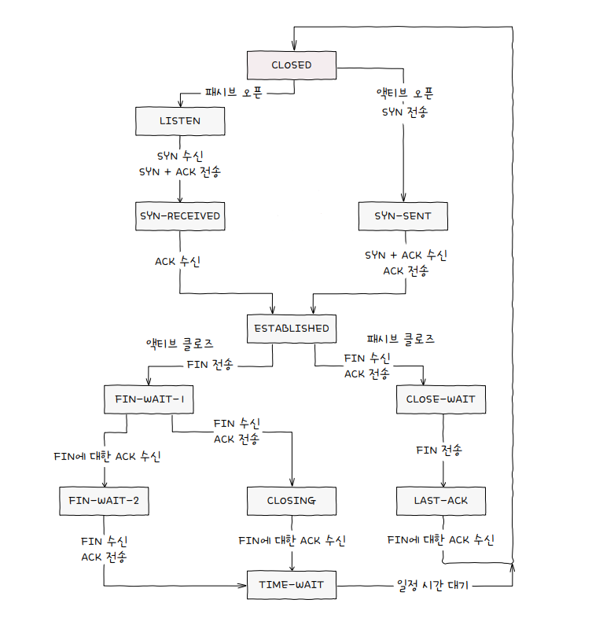
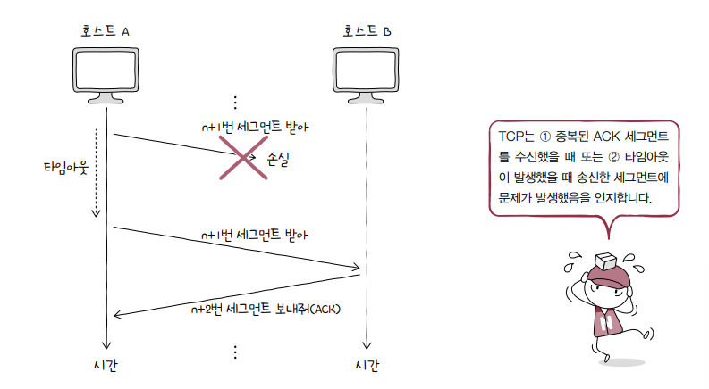

# 04 전송계층

## 04-1 전송계층개요

- IP의 한계
  - 신뢰할 수 없는 통신
    - 패킷이 수신지까지 제대로 전송됐다는 보장x
    - 통신 과정에서 패킷의 데이터가 손상되거나 중복된 패킷이 전송되었더라도이를 확인하지 않고, 재전송도 하지 않으며, 순서대로 패킷이 도착할 것이라는 보장도 하지않음
  - 비연결형 통신
    - 송수신 호스트 간에 사전 연결 수립 작업 거치지 않음 (그저 수신지를 향해 보냄)
    - 비연결성 통신하는 이유 : 성능때문(빠른 송수신을 위함)

### 전송계층

- 연결형 통신 가능
  - TCP
- 신뢰성 있는 통신 가능
  - TCP 패킷은 수신지까지 올바른 순서 전달보장을 위해 재전송을 통한 오류제어, 흐름제어, 혼잡제어 등 다양한 기능 제공
- UDP : 신뢰할 수 없는 통신, 비연결형 통신 가능하게 함

### 포트

- 패킷의 최종 수신 대상은 특정 애플리케이션 프로세스 (수신지 호스트의 주소까지 전달됐다고 해서 전송이 끝난것이아님
- 패킷에 적힌 특정 애플리케이션을 식별할수 있는 정보 → 포트 번호를 통해 특정 애플리케이션 식별

### 전송계층은 신뢰할 수 있는 연결형 통신가능한 프로토콜을 제공하기에 네트워크 계층의 한계 보완 가능, 포트를 통해 응용계층의 애플리케이션을 식별함으로써 응용계층과의 연결다리 역할 수행

### 포트 기반 NAT

- IP 주소 일대일 대응 (사설 IP주소 ↔ 공인 IP 주소
- 하지만 이 방식은 많은 사설 IP 주소 변환하기에는 무리 존재
- 따라서 오늘날 대중적인 NAT는 변환하고자하는 IP주소 일대일 대응 x → 그럼 어떻게 다대일 관계로 변환 할 수 있는건가?

### NAPT

- 앞서말한 변환을 위해 NAPT를 사용
- 포트 기반의 NAT → 포트를 활용해 하나의 공인 IP주소를 여러 사설 IP주소가 공유할수 있도록하는 NAT의 일종

### 포트포워딩

- 네트워크내 특정 호스트에 IP주소와 포트번호 미리 할당 후 (해당 IP주소 : 포트번호)로써 해당 포스트에게 패킷 전달하는 기능

### ICMP

- IP 패킷의 전송과정에 대한 피드백메시지를 얻기 위해 사용하는 프로토콜
- 전송 과정에서 발생한 문제상황에 대한 오류 보고
- 네트워크에 대한 진단정보 제공

## 04-2 TCP와 UDP

### TCP 통신단계와 세그먼트 구조

- TCP 통신
  1. 연결수립
  2. 데이터 송수신
  3. 연결종료
- MSS(Maximum Segment Size)
  - TCP로 전송할 수 있는 최대 페이로드 크기
  
- TCP 세그먼트
  
  - 송신지포트, 수신지 포트 : 송수신지 애플리케이션 식별하는 포트번호 명시
  - 순서번호와 확인응답번호
    - 순서번호 : 송수신되는 세그먼트의 올바른 순서보장을 위해 세그먼트 데이터의 첫 바이트에 부여되는 번호
      
    - 확인응답번호: 상대 호스트가 보낸 세그먼트에 대한 응답, 다음으로 수신하기를 기대하는 순서번호 명시
      
    -
  - 제어비트 : = 플래그비트 , 현재 세그먼트에 대한 부가정보
    - ACK : 세그먼트 승인을 나타내기 위한 비트
    - SYN : 연결을 수립하기 위한 비트
    - FIN : 연결을 종료하기 위한 비트
    ⇒ OOO세그먼트는 : OOO 비트가 1로 설정된 세그먼트
  - 윈도우 : 수신 윈도우 크기 명시 (한번에 수신하고자하는 데이터의 양)

### TCP 연결수립과 종료

- 연결수립 : 쓰리웨이핸드쉐이크
  
  - 액티브 오픈 : 처음 연결을 시작하는 호스트의 연결수립과정(호스트A)
  - 패시브 오픈 : 연결요청을 받고나서 요청에 따라 연결 수립(호스트B)
- 연결종료
  
  

### TCP 상태

- 상태
  - 어떤통신과정에 있는지 나타내는 정보
  1. 연결이 수립되지 않은 상태
     - closed :아무런 연결이 없는 상태
     - listen : 일종의 연결 대기 상태, 패시브오픈 호스트는 LISTEN상태 유지, SYN세그먼트 기다리는 상태
  2. 연결 수립 상태
     - SYN-SENT
       - SYN 세그먼트 보낸 뒤 SYN+ACK세그먼트 기다린는 상태
     - SYN-RECEIVED : SYN +ACK 세그먼트 보낸 뒤 그에 대한 ACK 세그먼트 기다리는 상태
     - ESTBLISHED : 연결 확립되었음 나타냄, 데이터 송수신 가능 상태, 두호스트가 마지막 SCK세그먼트 주고받은 상태
  3. 연결 종료 상태

     
- CLOSING 상태 : 동시에 연결 종료할 때 전이되는 상태
  
- TCP 상태 정리
  

### UCP 데이터그램 구조

- 비연결형 통신을 수행하는 신뢰할 수 없는 프로토콜
- 상태를 유지하지도 활용하지도 않음 → 스테이트리스 프로토콜의 일종

- 송신지포트,수신지포트 : 포트번호 담김
- 길이 : 헤더를 포함한 UDP 데이터그램의 바이트 담김
- 체크섬 : 데이터그램 전송과정에서 오류발생했는지 검사하기 위한 필드
- TCP에 비해 적은 오버헤드로 패킷 빠르게 처리 가능
- 실시간 스트리밍서비스, 인터넷전화 등 실시간 강조되는 상황에서 자주 쓰임

## TCP의 오류/흐름/혼잡 제어

### 오류제어 : 재전송 기법

- 재전송 일어나는 상황
  - 중복된 ACK 세그먼트를 수신했을 때
    
  - 타임아웃 발생
    - TCP 세크먼트 송신하는 호스트는 재전송 타이머 값 유지
    - 카운트다운 끝나면 타임아웃
    - 타임아웃 발생시까지 ACK 세그먼트 못 받으면 비정상도착 간주 후 재전송
    
- 재전송 기법
  - ARQ : 재전송 기법
    - 자동재전송 요구
    - Stop-and Wait ARQ
      - 제대로 전달했음을 확인하기 전까지 새메시지 안보냄
      - 네트워크 이용효율 낮아질 수 있음 (성능 저하)
    - GO Back N ARQ
      - 파이프라이닝기반
      - 도중 잘못 전송된 세그먼트 발생시 해당세그먼트부터 전부 다시 전송
      - 누적확인응답이라고도 함
      
    - Selective Repeat ARQ
      - 파이프라이닝기반
      - 선택적으로 재전송하는 방법
      - 고백투방법은 한 세그먼트 문제 발생 시 그 후 모든 세그먼트 재전송해야한다는 단점존재
      - 개별확인 응답
      

### 흐름제어 : 슬라이딩 윈도우

- 흐름제어
  - 슬라이딩 윈도우
    

### 혼잡제어

- 혼잡윈도우 : 혼잡없이 전송할 수 있을법한 데이터 양
- 혼잡제어 알고리즘을 통해 혼잡윈도우 크기 결정
  - AIMD(Additive Increase/Multiplicative Decrease)
    - 혼잡 감지되지 않으면 혼잡윈도우를 RTT마다 1씩 선형적 증가, 혼잡 감지 시 혼잡윈도우 절반으로 떨어뜨림
    1. 느린 시작 알고리즘

       - 혼잡윈도우 1부터 시작해 문제없이 수신된 ACK 세그먼트 하나당 1씩 증가시키는 방식

       

       - 느린시작 임계치 설정 : 임계치 이상이나 타임아웃 발생 시 세 방법 중 하나 선택

       

    2. 혼잡 회피 알고리즘

       - RTT(송신호스트 세그먼트 전송 후 답변받는데까지 걸리는 시간)마다 혼잡윈도우 1MSS씩 증가시키는 알고리즘
       - 혼잡윈도우를 지수적 증가시키는 느린 시작과 달리 혼잡 윈도우 크기를 선형적 증가

       

    3. 빠른 회복 알고리즘

       - 세번의 중복 ACK 세그먼트 수신시 느린 시작 건너뛰고 혼잡회피 수행

       
