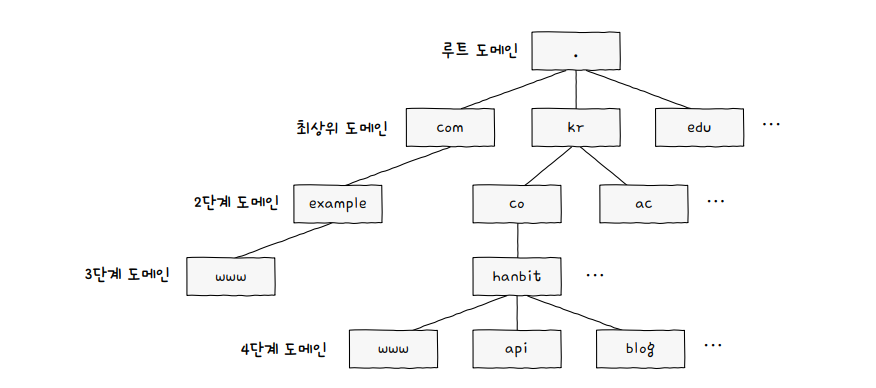
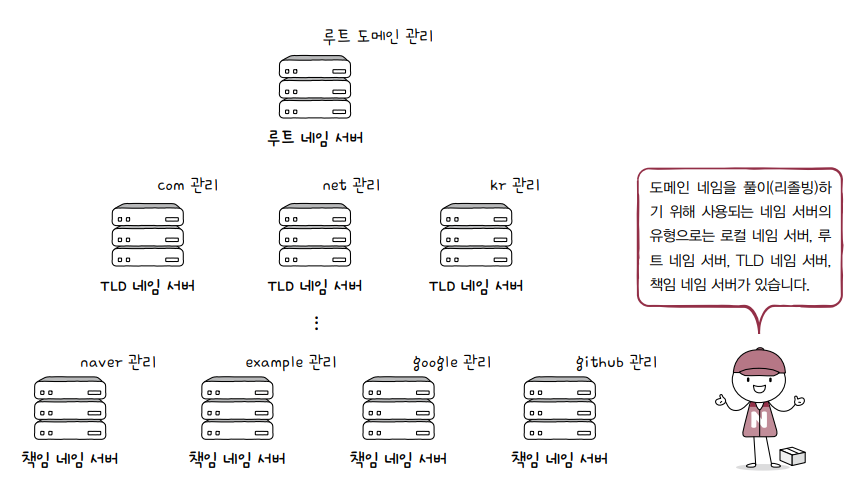
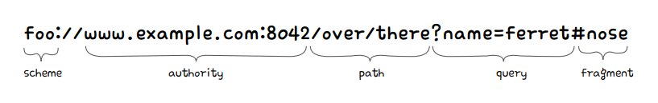
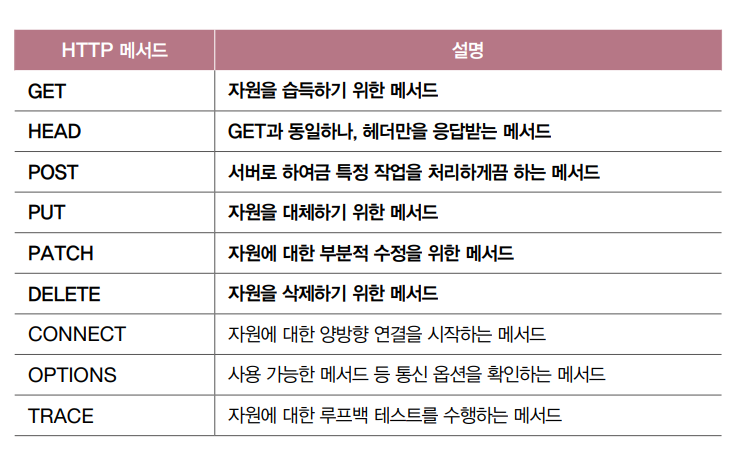
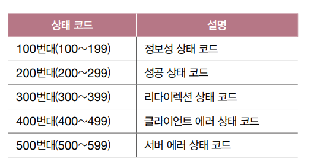
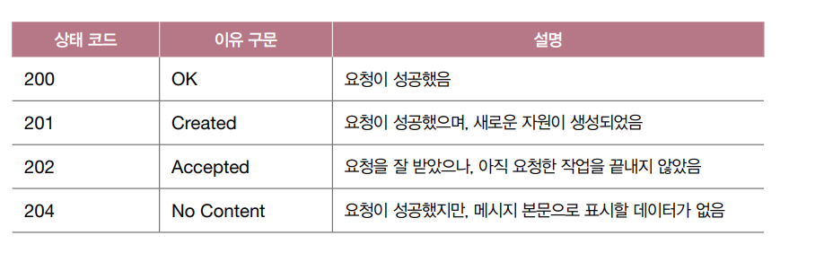
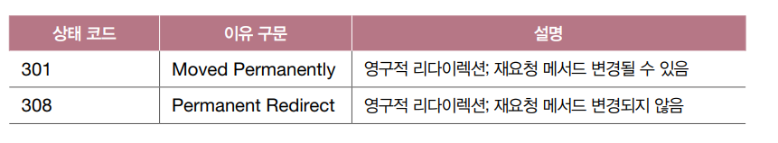
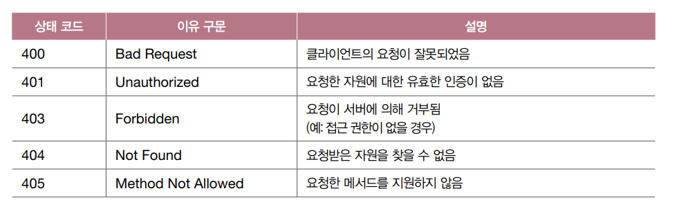
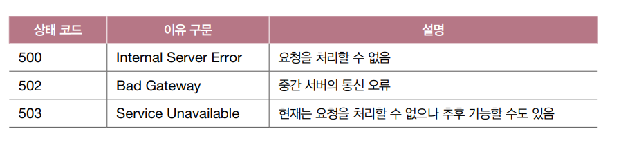
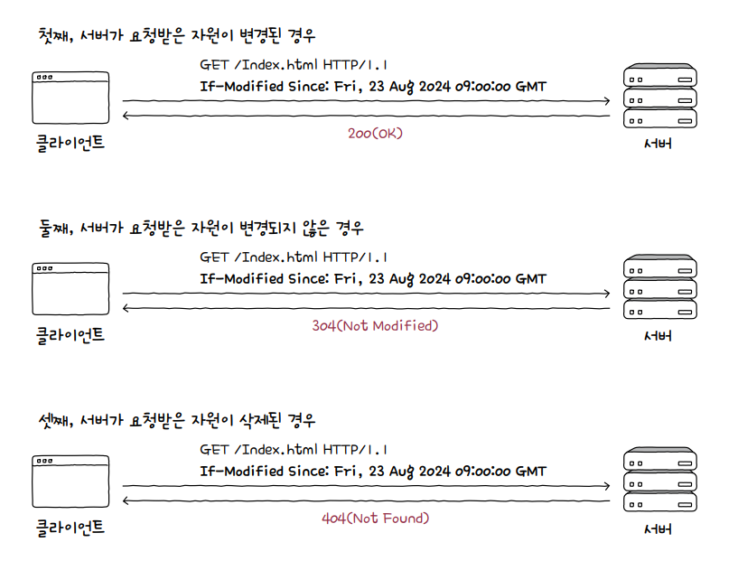

# 05 응용 계층

## 05-1 DNS와 자원

### 도메인네임과 네임서버

네임 서버 : 도메인 네임과 IP주소 관리, 도메인 네임 관리하는 네임서버는 DNS서버

- 리졸빙
  - 도메인 네임 리졸빙 과정은 계층적 구조
    
  - 재귀적 질의
  - 반복적 질의
  - but 이 방법들은 8번의 단계를 거쳐야함 → 시간 오래걸림, 네트워크 상 메시지 수 지나치게 늘어남
  - 따라서 DNS 캐시 이용
  - DNS캐시 : 네임서버들이 기존에 응답받은 결과를 임시 저장했다 추후 같은 질의에 활용 (TTL로 캐시되는 시간 관리됨)

### 자원 식별하는 URI

- 자원 : 네트워크 상의 메시지를 통해 주고받는 대상(ex. 텍스트파일, HTML파일 등등) = HTTP요청메시지의 대상
- URI : 네트워크 상에서 자원을 식별할 수 있는 정보
  - URL : 위치를 이용해 자원을 식별
    
    - fragment : 자원의 한 조각을 가리키기 위한 정보
  - URN : 이름을 이용해 자원을 식별
    - 위치나 프로토콜과 무관하게 자원 식별 가능
    - 자원의 위치가 변해도 ㄱㅊ

## 05-2 HTTP

### HTTP 특성

- 요청-응답 기반 프로토콜
  - 클라이언트와 서버가 서로 HTTP 요청 메시지와 HTTP 응답 메시지를 주고받는 구조
- 미디어 독립적 프로토콜
  - 다양한 종류의 자원을 주고받을 수 있음
  - 자원을 주고받는 수단(인터페이스)
  - 미디어타입
    - 타입 : 데이터의 유형 ex) image
    - 서브타입 : 주어진 타입에 대한 세부 유형 ex) png, jpeg, webp, gif
- 스테이트리스 프로토콜
  - 상태유지x 프로토콜
  - 서버가 HTTP 요청 보낸 클라이언트와 관련된 상태 기억하지 않음
  - 모든 HTTP 요청은 기본적으로 독립적인 요청으로 간주
  - HTTP 서버는 일반적으로 많은 클라이언트와 동시상호작용 → 모든 클라이언트 상태 정보 유지는 서버에 큰 부담
  - 서버는 하나가 아니라 여러개 있을수도 o → 상태를 유지 하지 않고 모든 요청 독립요청처리하는 것은 특정 클라이언트가 특정 서버에 종속되지 않도록 함, 서버의 추가나 문제발생 시 대처 용이
- 지속 연결 프로토콜
  - 비지속 연결 : TWH 통해 TCP 연결 수립 후 , 요청응답 받으면 연결 종료(HTTP 1.0이하)
  - 지속 연결(킵 얼라이브) : 하나의 TCP 연결상에서 여러 개의 요청-응답을 주고받을 수 있는 기술

### HTTP 메시지 구조

- 메서드 : get, post, put, delete 등
  
- 요청 대상 : HTTP 요청 보낼 서버의 자원 (보통 쿼리 포함된 URI의 경로가 명시)http://www.example.com/hello?q=world 여기선 hello?q=world
- HTTP 버전
- 상태라인 HTTP/1.1 200 OK(HTTP 버전 + 상태코드 + 이유구문)

### HTTP 상태 코드

## 05-3 HTTP 헤더와 HTTP 기반 기술

### HTTP 헤더

- 요청시 활용되는 HTTP 헤더
  - Host, User-Agent, Referer, Authorization
- 응답시 활용되는 HTTP 헤더
  - Server, Allow, Retry-After, Location, WWW-Authenticate
- 요청/응답 시 활용되는 HTTP 헤더
  - Date, Connection, Content-Length, Content-Type, Content-Language, Content-Encoding

### 캐시

- 불필요한 대역폭 낭비와 응답 지연을 방지하기 위해 정보의 사본을 임시로 저장하는 기술
- 개인 전용 캐시 : 웹브라우저에 저장된 캐시
- 공용 캐시 : 클라이언트와 서버 사이에 위치한 중간 서버에 저장된 캐시
  
- 엔티티 태그 : 자원의 버전 식별 (자원 변경되지 않으면 기존의 Etag 변경 x)

### 쿠키

- 서버에서 생성되어 클라이언트 측에 저장되는 데이터
- 브라우저에서 저장되고 관리됨
- 한계 : 보안
  - 민감한 정보를 담아 송수신하고 저장하는 것이 바람직한가? 쿠키 정보 쉽게 노출되거나 조작될 수 있음
  - 해결책
    - Secure : HTTPS 프로토콜 사용되는 경우에만 쿠키 전송하는 속성
    - HTTPOnly : HTTP 송수신을 통해서만 쿠키 이용하도록 제한
      - 쿠키 관련 데이터는 HTTP 송수신 통해서 접근 가능하지만 js에서도 접근 가능함 → 해커가 js로 중간에 쿸키 가로채거나 위변조 가능 → 따라서 js에서 쿠키 접근 못하도록 막음
