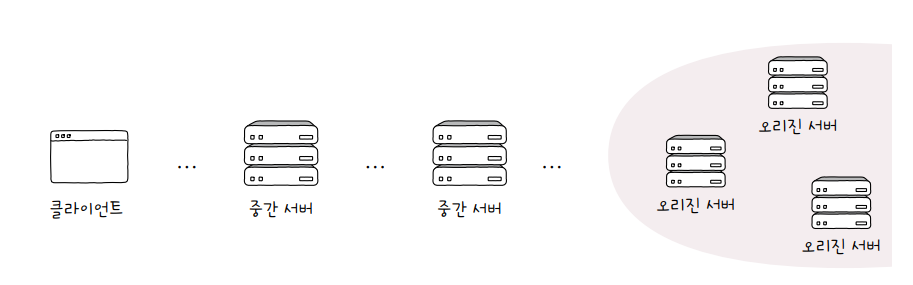
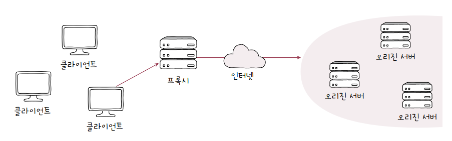
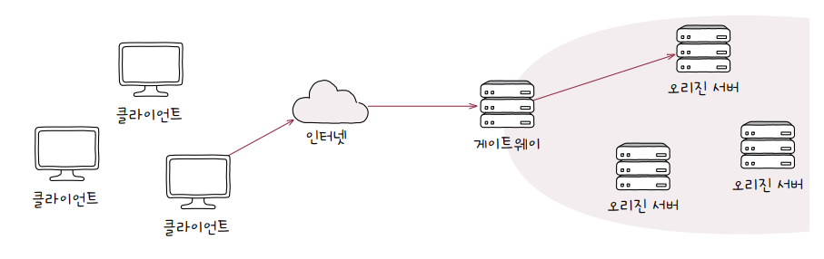
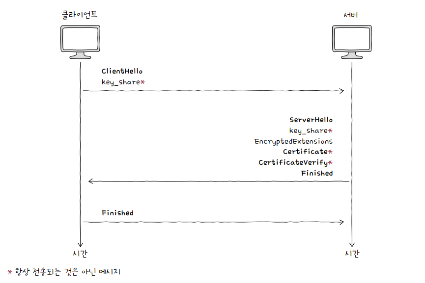

# 07 네트워크 심화

## 07-1 안정성을 위한 기술

### 가용성

- 안정성 : 특정 기능을 언제든 균일한 성능으로 수행할 수 있는 특성
- 안정적인 웹 서버 : 언제든지 응답메시지 제공할 수 있는 서버
- 안정적인 라우터 : 언제든지 라우팅 기능을 제공할 수 있는 라이터
- 가용성 : 컴퓨터 시스템이 특정 기능을 실제로 수행할 수 있는 시간의 비율 = 전체 사용시간 중 정상적인 사용시간[가용성 = 업타임 / (업타임 + 다운타임)]
- 문제가 발생하더라도 기능을 계속 수행 할 수 있도록 설계해야함 (결함감내)

### 이중화

- 무언가를 이중으로 두는 기술
- 결함감내해 가용성 높이기 위한 방법(예비(백업) 마련)
- 이중화 대상(단일장애점 = SPOF) : 문제 발생할 경우 시스템 전체가 중단될 수 있는 대상
- 이중화 구성 방법
  - 액티브/스탠바이 : 한 시스템 가동, 한 시스템 대기 상태
  - 액티브/액티브 : 두 시스템 모두 가동 상태
    - 부하 분산 가능해 성능상 이점
    - 한 시스템 문제 발생 시 순간적으로 나머지 시스템에 부하 급증가능성
- 다중화 : 무언가를 여거래 두는 기술 (이중화보다 안정적 운영 가능)
  - 티밍(teaming 윈도우), 본딩(bonding리눅스)
    - 여러개의 네트워크 인터페이스(NIC) 이중화/다중화 하여 하나의 인터페이스 처럼 보이게 하는 기술

### 로드밸런싱

- 트래픽 : 주어진 시점에 네트워크를 경유한 데이터의 양 = 주어진 시점에서 특정 노드를 경유한 패킷의 양
- 서버를 다중화 했더라도 트래픽을 고르게 분산해야 가용성 높아짐
- 로드밸런서 : L4스위치, L7스위치, 소프트웨어 설치( HAProxy, Envoy) 등으로 로드밸런싱 기능 수행 가능
- 로드밸런싱 알고리즘 : 부하가 균등분산되도록 부하 대상 선택하는 방법
  - 라운드로빈 알고리즘, 최소연결 알고리즘, 가중치 라운드로빈 알고리즘 등등

### 포워드 프록시와 리버스 프록시

- 오리진 서버 : 자원을 생성하고 클라이언트에게 권한 있는 응답을 보낼 수 있는 HTTP서버
  
- 프록시 : **클라이언트가 선택**한 메시지 전달 대리자
  - 오리진 서버보다 클라이언트와 더 가까움
  - 주로 캐시 저장, 클라이언트 암호화 및 접근 제한 기능 제공
  
- 게이트웨이(리버스프록시) : 아웃바운드 연결에 대해 **오리진 서버 역할**을 하지만 수신된 요청을 변환하여 다른 인바운드 서버들로 전달하는 중개자 역할
  - 로드밸런서로 동작 가능
  - 캐시 저장 가능
  

## 07-2 안정성을 위한 기술

- 암호화 : 원문 데이터를 알아볼 수 없는 형태로 변경
- 복호화 : 암호화된 데이터를 원문 데이터로 되돌리는 과정
- 대칭키암호화 : 암호화 복호화에 동일 키 사용
  - 키 유출 시 문제 발생, 안전한 키 전달 필요
- 공개키암호화(비대칭 키 암호화) : 암호화, 복호화 키 다름

### 인증서와 디지털 서명

- 인증서 = 공개키 인증서 : 공개키와 공개키의 유효성 입증위한 전자문서
- CA가 발급한 인증서 = 이 공개키는 진짜임 보증함(서명값 존재)
- 디지털 서명 : 개인키로 암호화된 메시지를 공개키로 복호화함으로써 신원 증명하는 절차
- HTTPS 메시지 동작 과정
  1. TCP 쓰리웨이 핸드셰이크
     - SYN + ACK, ACK 플래그 설정된 TCP 세그먼트 주고 받기
  2. TLS 핸드셰이크

     

     - 암호화 통신을 위한 키 교환, 인증서 송수신과 검증 이루어짐
     - ClientHello 메시지 : 지원되는 TLS버전, 암호스위트 (사용가능한 암호화방식과 해시 함수), 키를 만들기 위해 사용할 클라이언트의 난수
     - ServerHello 메시지 : 선택된 TLS버전, 암호스위트 정보, 키를 만들기 위해 사용할 서버의 난수
     - Certificate : 인증서
     - CertificateVerify : 디지털 서명

  3. 암호화된 메시지 송수신

## 07-3 무선 네트워크

### 전파와 주파수

- 전파 : 눈에 보이지 않는 전자기파의 일종

### 와이파이와 802.11

- 오늘날 LAN 환경에서의 유선 통신은 IEEE 802.11으로 표준화

### AP와 서비스 셋

- AP : 무선 통신 기기들을 연결하여 무선 네트워크를 구성하는 장치, 무선 LAN에서 통신 중개하는 역할 (= 공유기)
  - 인프라스트럭처모드 : AP 경유해 통신 이루어지는 무선 네트워크 통신 방식
- SSID : 와이파이 이름
- 비컨 프레임 : 외부에 자신의 존재가 있다는 것을 알리기 위해 보내는 브로드캐스트 메시지(SSID와 AP의 MAC주소 포함)
