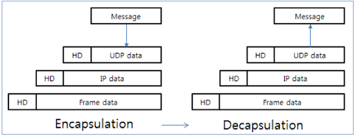
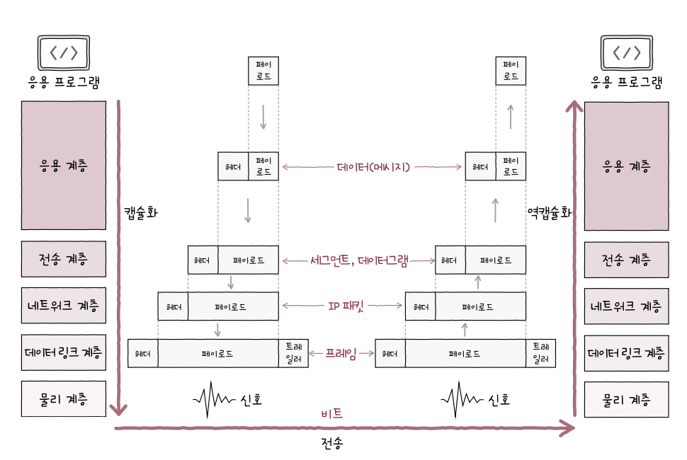

# 1️⃣ Chapter 01: 컴퓨터 네트워 시작하기

# 1-2 네트워크 거시적으로 살펴보기

## 네트워크의 기본 구조

### [1] 호스트

네트워크의 가장자리에 위치한 노드이. 종단 시스템이라도 부른다.
때로는 호스트가 서버나 클라이언트의 역할을 하기도 한다.

### [2] 네트워크 장비

네트워크 가장자리에 위치하지 않은 노드, 즉 호스트 간 주고받을 정보가 중간에 거치는 노드가 있으며 이를 중간 노드라고 한다. 예를 들어 `허브`, `스위치`, `라우터`, `공유기` 등이 여기에 속한다.

### [3] 통신 매체

각 노드를 연결하는 간선이 통신 매체이며 `유선 매체`, `무선 매체`가 있다.

### [4] 메시지

통신 매체로 연결된 노드가 주고받는 정보를 메시지라고 한다. 메시지의 형태는 다양하다. 웹 페이지, 파일, 메일 등등 다양한 형태로 구성된다.

## 메시지 교환 방식에 따른 네트워크 분류

### [1] 회선 교환 방식

회선 교환 방식은 두 호스트 간에 물리적 또는 논리적 연결을 확립하고, 그 연결을 통해 데이터를 전송하는 방식이다.

**특징**

1. **연결 확립**: 두 호스트가 데이터를 교환하기 전에 먼저 연결을 확립한다. 이 연결 과정에서는 통신을 위한 경로가 설정되며, 이 경로는 통신이 종료될 때까지 유지된다.
2. **전용 회선**: 연결이 확립되면, 해당 경로는 통신하는 두 호스트만의 전용 회선으로 사용된다. 다른 통신들은 이 회선을 사용할 수 없기에 데이터 충돌이 발생하지 않는다.
3. **일정한 데이터 전송률**: 회선이 확립되면, 그 회선을 통해 일정한 속도로 데이터가 전송된다. 이는 회선이 전용으로 할당되어 있기 때문이고 네트워크의 다른 부분에서 발생하는 지연이나 변동이 데이터 전송에 영향을 미치지 않는다.
4. **데이터의 연속성 및 순서 보장**: 데이터는 전송된 순서대로 도착하며, 중간에 데이터가 분실되거나 순서가 바뀌는 일이 없다. 이는 특히 실시간 음성 통화나 스트리밍과 같은 서비스에 매우 중요한 특성이다.

**단점**

1. **자원 활용의 비효율성**: 회선 교환 방식에서는 두 호스트 간의 통신을 위해 전용 회선이 설정되어야 한다. 이 회선은 통신이 진행되는 동안 다른 어떤 통신에도 사용될 수 없다. 따라서 통신 중이 아니라면 이 회선은 아무런 데이터도 전송하지 않음에도 불구하고 계속 예약된 상태로 남아 있게 된다. 이는 전체 네트워크 자원의 사용률이 낮아지는 원인이 될 수 있다.
2. **유연성 부족**: 회선 교환 방식은 고정된 회선을 사용하기 때문에 네트워크의 변화나 수요 증가에 유연하게 대응하기 어렵다.
3. **설정 시간**: 통신을 시작하기 전에 경로 설정과 연결 확립 과정이 필요하다. 이 과정에서 발생하는 지연은 특히 사용자가 빈번하게 연결을 요구하는 상황에 영향을 줄 수 있다. 예를 들어 인터넷 사용처럼 짧은 메시지를 자주 교환해야 하는 환경에서는 불편할 수 있다.

### [2] 패킷 교환 방식

회선 교환 방식의 문제점을 해결한 방식이다. 메시지를 `패킷`단위로 쪼개어 전송한다. 또한 정해진 경로만으로 데이터를 송수신하지 않는다. 따라서 `패킷 스위치`가 패킷이 잘 도착할 수 있도록 최적의 경로를 결정하고 패킷의 송수신지를 식별한다. 대표적인 패킷 스위치 장비로 `라우터`와 `스위치`가 있다.

**패킷의 구성**

1. **페이로드**:
   패킷을 통해 전송하고 하는 데이터의 전체 또는 일부분이다.
2. **헤더**:
   헤더는 패킷에 대한 제어 정보와 경로 지정 정보를 포함하고 있다. 패킷의 소스와 목적지 주소, 순서 번호, 타입, 프로토콜 정보 등이 포함될 수 있다. 이 정보는 네트워크 장비가 패킷을 올바르게 처리하고 올바른 목적지로 전송할 수 있도록 돕는다. 또한 헤더는 패킷의 조각들이 목적지에서 올바르게 재조립되도록 순서 정보를 제공하기도 한다.
3. **트레일러**:
   트레일러는 주로 패킷의 끝에 위치하며, 오류 검사 및 패킷의 무결성을 보장하는 데 사용되는 정보를 포함한다. 가장 흔히 사용되는 방식은 오류 검출 코드, 예를 들어 순환 중복 검사(CRC) 코드다. 트레일러의 데이터는 패킷이 전송 경로에서 손상되지 않았는지를 수신측에서 확인하는 데 사용된다.

> [!NOTE]
>
> **주소와 송수신지 유형에 따른 전송 방식**
>
> 유니캐스트: 네트워크 상의 한 대상에서 다른 단일 대상으로 데이터를 전송하는 방식이다.
> 브로드캐스트: 네트워크 상의 모든 장치들에게 데이터를 동시에 전송하는 방식이다. 네트워크의 모든 장치에 시간 동기화 신호를 보내거나 로컬 네트워크 내에서 초기 구성 정보를 제공할 때 사용된다.

# 1-3 네트워크 미시적으로 살펴보기

## 프로토콜

노드 간 정보를 올바르게 주고받기 위해 합의된 규칙이나 방법을 의미한다. IP, HTTP, HTTPS, ARP 등등 다양한 프로토콜이 있으여 이후에 자세히 정리한다.

## 네트워크 참조 모델

네트워크를 통해 정보를 주고받을 때 정형화된 여러 단계를 거치게 되며 이를 계층으로 표현할 수 있다. 이렇게 통신 각 과정을 계층으로 나눈 수조를 네트워크 참조 모델이라고 한다.

### OSI 모델 - 네트워크를 이론적으로 기술하고 이해할 때 사용

1. **물리 계층 (Physical Layer)**:
   네트워크의 물리적 매체를 통해 데이터를 전기적, 기계적, 기능적 신호로 변환하여 전송하는 역할을 한다. 이 계층은 데이터를 `비트(bit) 단위`로 처리한다.
2. **데이터 링크 계층 (Data Link Layer)**:
   네트워크의 노드 간 신뢰성 있는 데이터 전송을 보장하기 위해 프레임을 형성하고 `MAC 주소`를 사용하여 주소를 지정한다. `오류 검출 및 수정`이 수행된다.
3. **네트워크 계층 (Network Layer)**:
   다양한 네트워크 간 데이터를 전송하고 경로를 결정한다. `IP 주소`를 사용하여 패킷의 송수신자 주소를 지정하며 `라우팅 기능`을 담당한다.
4. **전송 계층 (Transport Layer)**:
   호스트 간 데이터 전송의 신뢰성을 보장한다. 데이터를 `세그먼트`로 분할하고 `전송 제어 및 오류 복구 기능`을 수행합니다. `TCP와 UDP 프로토콜`이 이 계층에서 작동합니다.
5. **세션 계층 (Session Layer)**:
   통신 세션을 설정, 관리, 종료하는 기능을 담당한다. 이 계층은 애플리케이션 간의 `세션`을 유지하며 데이터 교환 동안 동기화와 세션 복구를 제공한다.
6. **표현 계층 (Presentation Layer)**:
   데이터의 표현 형식을 관리하며 암호화 및 압축을 수행할 수 있습니다. 데이터를 `네트워크에서 애플리케이션으로 전송하기 적합한 형식으로 변환`하는 역할을 합니다.
7. **응용 계층 (Application Layer)**:
   사용자가 네트워크에 접근할 수 있도록 하는 애플리케이션 서비스를 제공한다. 이메일, 파일 전송, 웹 서비스 등 사용자에게 직접적으로 서비스를 제공하는 프로토콜과 인터페이스가 이 계층에 포함된다.

### TCP/IP - 구현에 중점을 둔 모델

1. 링크 계층 (Link Layer):
   이 계층은 OSI 모델의 물리 계층과 데이터 링크 계층에 해당하는 기능을 수행한다. 네트워크 하드웨어와 드라이버를 통해 데이터를 물리적 매체를 통해 전송하는 역할을 한다. Ethernet, Wi-Fi 등의 기술이 이 계층에서 작동한다.
2. 인터넷 계층 (Internet Layer):
   IP 주소를 기반으로 패킷을 올바른 목적지로 라우팅하는 역할을 합니다. IP, ARP, ICMP 등의 프로토콜이 이 계층에서 활용된다.
3. 전송 계층 (Transport Layer):
   OSI 모델의 전송 계층과 동일한 기능을 수행하며, 데이터의 신뢰성 있는 전송을 담당한다. TCP(신뢰성 있는 연결 지향적 서비스)와 UDP(비연결형 서비스) 등의 프로토콜이 이 계층에서 작동한다. TCP는 데이터가 정확하게 전달되고 순서대로 재조합될 수 있도록 보장하고 UDP는 더 빠른 전송을 위해 오류 검사만 수행한다.
4. 응용 계층 (Application Layer):
   OSI 모델의 세션 계층, 표현 계층, 응용 계층의 기능을 모두 포함한다. 사용자가 네트워크를 통해 데이터를 생성하고 받아볼 수 있는 다양한 응용 프로그램과 서비스를 제공한다. HTTP, FTP, DNS, SMTP 등 많은 중요한 인터넷 프로토콜들이 이 계층에서 작동한다.

### 캡슐화와 역캡슐화

### PDU (Protocol Data Unit)

각 계층에서 송수신되는 메시지의 단위를 말한다. 상위 계층에서 전달받은 데이터에 현재 계층의 프로토콜 헤더를 추가하면 현재 계층의 PDU가 된다.

| OSI 계층         | PDU                  |
| ---------------- | -------------------- |
| 응용 계층        | 데이터               |
| 표현 계층        | 데이터               |
| 세션 계층        | 데이터               |
| 전송 계층        | 세그먼트, 데이터그램 |
| 네트워크 계층    | 패킷                 |
| 데이터 링크 계층 | 프레임               |
| 물리 계층        | 비트                 |

