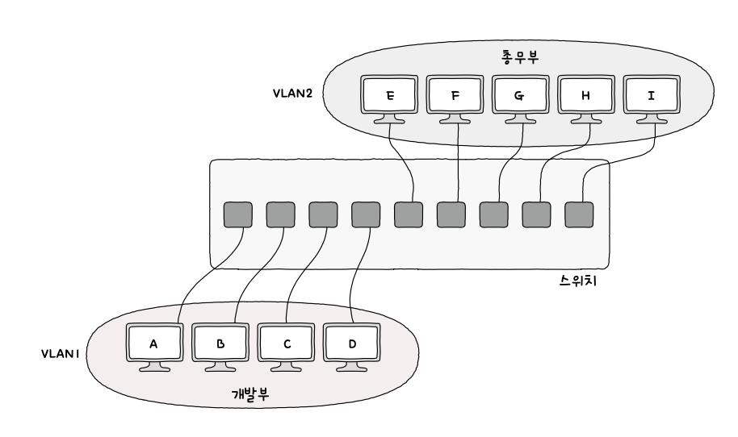

# 2️⃣ Chapter 02: 물리 계층과 데이터 링크 계층

# 2-1 이더넷

이더넷은 유선 LAN 환경에서 가장 대중적으로 사용되는 기술이다. 다양한 통신 매체의 규격들과 송수신되는 프레임의 형태, 프레임을 주고받는 방법 등이 정의된 네트워크 기술이다.

### 이더넷 프레임

현대 유선 LAN 환경은 대부분 이더넷을 기반으로 구성되어 호스트가 데이터 링크 계층에서 주고받는 프레임 형식도 정해져 있다. 이를 이더넷 프레임이라 부른다.

이더넷 프레임은 상위 계층으로부터 받아들인 정보에 헤더와 트레일러를 추가하는 캡슐화 과정을 거쳐 만들어지고 수신자 입장에서는 역캡슐화 과정을 거쳐 프레임의 헤더와 트레일러 정보를 제거한 뒤 상위 계층으로 보낸다.

**이더넷 프레임 헤더 구성요소**

1. 프리앰블(Preamble):
   프레임의 시작을 알리는 부분으로 8바이트의 길이를 갖는다. 앞 7바이트는 10101010 값을 갖고 마지막 바이트는 10101011 값을 갖는다. 수신자는 프리앰블을 통해 이더넷 프레임이 오고 있음을 알아차린다. 즉 송시신지 간의 동기화를 위해 사용되는 정보다.
2. 목적지 MAC 주소(Destination MAC Address):
   데이터 링크 계층의 핵심이다. 프레임을 받을 대상의 MAC 주소를 나타내며, 6바이트(48비트)로 구성됩니다. 이 주소는 네트워크 인터페이스마다 부여되는 주소이며 네트워크 상의 특정 장치를 식별할 수 있다. NIC(Network Interface Controller) 장치가 네트워크 인터페이스 역할을 담당한다.
3. 출발지 MAC 주소(Source MAC Address):
   데이터를 보내는 장치의 MAC 주소를 나타내며 6바이트(48비트)로 구성된다.
4. 이더타입(EtherType):
   프레임에 실린 데이터의 타입 또는 프로토콜을 나타내는 2바이트(16비트) 필드다. 상위 계층에서 사용된 프로토콜의 이름이 명시된다. 예를 들어, IPv4는 16진수 0800, ARP는 16진수 0806이 명시된다.
5. 데이터 및 패딩(Data and Padding):
   실제 전송하려는 데이터가 위치하는 부분이다. 최소 46바이트에서 최대 1500바이트의 데이터를 포함할 수 있으며 프레임의 최소 길이 요구를 충족시키기 위해 필요한 경우 패딩이 추가된다.
6. 프레임 체크 시퀀스(FCS, Frame Check Sequence):
   프레임의 끝에 위치하는 4바이트(32비트)의 오류 검사용 숫자다. 수신한 이더넷 프레임에 오류가 있는지 확인할 때 사용된다. 이는 프레임이 손상 없이 정확히 전송되었는지를 확인하는 데 사용되는 CRC (Cyclic Redundancy Check) 기반의 체크값이다. 송신자는 프리앰블을 제외한 나머지 필드 값을 바탕으로 CRC 값을 계산한 후 이 값을 FCS 필드에 명시한다. 이후 수신자는 동일한 방법으로 CRC 값을 계산하고 FCS 필드 값과 비교하여 프레임에 오류가 있는지 검사한다.

# 2-2 NIC와 케이블

### NIC

통신 매체에는 전기, 빛 등 다양한 신호가 흐를 수 있고 이를 호스트가 제대로 이해하기 위해서는 신호를 컴퓨터가 이해할 수 있는 정보로 변환하는 작업이 필요하다. 이때 호스트와 유선 통신 매체를 연결하고 변환을 담당하는 장비가 NIC다.

호스트가 네트워크를 통해 송수신하는 정보는 NIC를 거치게 된다는 점, 네트워크와의 연결점을 담당한다는 점에서 `네트워크 인터페이스 역할을 수행한다`고도 한다. 따라서 MAC 주소를 통해 도착한 프레임이 자신과 관련 있는지 판단할 수 있다.

# 2-3 허브

통신 매체를 통해 송수신되는 메시지가 다른 호스트에게 전달되는 과정에서 네트워크 장비를 거치게 되며 물리 계층에는 `허브`, 데이터 링크 계층에는 `스위치`가 있다.

> [!NOTE]
>
> 송수신지를 특정하는 MAC 주소는 데이터 링크 계층부터 존재한다. 따라서 데이터 링크 이상의 계층 장비는 송수신지를 특정할 수 있다. 반면 주소 개념이 없는 물리 계층 장비는 송수신되는 정보에 어떠한 조작이나 판단을 하지 않는 특징이 있다.

### 허브 (물리 계층)

허브는 여러 대의 호스트를 연결하는 장치다.

**허브 특징**

1. **전달받은 신호를 다른 모든 포트로 그대로 다시 내보낸다.**

   물리 계층에는 주소 개념이 없으므로 수신지를 특정할 수 없다. 따라서 허브는 신호를 받으면 조작이나 판단을 하지 않고 모든 포트로 내보낸다. 그리고 이 신호를 받은 모든 호스트는 데이터 링크 계층에서 패킷의 MAC 주소를 확인하고 자신과 관련 없는 주소는 폐기한다.

2. **반이중 모드로 통신한다.**

   송수신을 번갈아 가며 하는 통신을 말한다. 즉 호스트 A가 B에게 메시지를 송신할 때 B가 A에게 송신할 수 없다. 무전기를 떠올리면 이해하기 쉽다.

**콜리전 도메인**

앞서 허브는 반이중 모드로 통신한다고 했다. 만약 두 호스트가 동시에 허브에 신호를 송신하면 충돌이 발생한다. 허브에 연결된 호스트가 많을수록 충돌 발생 가능성은 증가한다. 이렇게 충돌이 발생할 수 있는 영역을 `콜리전 도메인`이라고 한다.

이런 충돌 문제를 해결하기 위해 CSMA/CD 프로토콜을 사용하거나 스위치 장비가 필요하다.

### CSMA/CD (Carrier Sense Multiple Access wirh Collision Detection)

반이중 이더넷 네트워크에서 충돌을 방지하는 대표 프로토콜이다.

1. **Carrier Sense**

   메시지를 보내기 전에 현대 네트워크 상에서 전송 중인 것이 있는지 먼저 확인한다. 현재 통신 매체의 사용 가능 여부를 검사하는 것을 `캐리어 감지`라고 한다.

2. **Multiple Access**

   캐리어 감지를 하는데도 두 개 이상의 호스트가 동시에 네트워크를 사용하려는 경우가 있다. 이런 상황을 `다중 접근`이라고 한다. 이때 충돌이 발생한다.

3. **Collision Detection**

   충돌이 발생하면 이를 검출하는데 이를 `충돌 검출`이라고 한다. 충돌을 감지하면 전송이 중단되고 다른 호스트에 충돌 발생을 알리기 위해 `잼 신호`를 보낸다. 이후 임의의 시간 동안 기다혔다가 신호를 재전송한다.

# 2-4 스위치

허브를 사용하면서 발생하는 콜리전 도메인 문제를 해결하는 방법으로 CSMA/CD가 있지만 더 근본적인 해결 방법이 있다. 전달받은 신호를 수신지 호스트에게만 보내고 전이중 모드로 통신하면 문제가 해결된다. 이러한 기능을 지원하는 장비가 데이터 링크 계층의 `스위치`다.

스위치가 MAC 주소를 학습할 수 있으므로 원하는 포트로만 신호를 내보낼 수 있는 것이다. 또한 논리적으로 LAN을 분리하여 VLAN을 구성할 수도 있다.

### 스위치 (L2 스위치)

**특징**

1. MAC 주소 학습

   특정 포트와 해당 포트에 연결된 호스트의 MAC 주소와의 관계를 기억한다. 따라서 원하는 호스트에만 프레임을 전송할 수 있다. 이런 정보를 메모리에 표 형태로 저장하고 이를 `MAC 주소 테이블`이라고 부른다.

### MAC 주소 학습

아래 기능을 통해 MAC 주소 테이블이 완성된다.

1. **플러딩**

   스위치는 처음에 호스트의 MAC 주소를 하나도 모르는 상태다. 스위치가 처음 호스트 A에서 프레임을 수신했다면, `송신지 MAC 주소`를 확인하여 A의 MAC 주소를 기록한다. 그러나 해당 프레임의 수신지 MAC 주소는 확인할 수 없다. 따라서 모든 호스트에게 프레임을 흘려 보낸다. 이를 `플러딩`이라고 한다.

   자신과 관계없는 프레임을 받은 호스트는 폐기하지만, 호스트 C는 응답 프레임을 스위치로 전송하게 되고 이때 스위치는 호스트 C의 `송신지 MAC 주소`를 기록한다.

2. **포워딩과 필터링**

   스위치가 호스트로부터 전달받은 프레임을 어디로 내보내고 말지를 결정하는 기능을 `필터링`이라고 한다. 그리고 프레임이 전송될 포트에 실제 프레임을 내보내는 것을 `포워딩`이라고 한다.

3. **에이징**

   MAC 주소 테이블에 등록된 특정 포트에서 일정 시간 동안 프레임을 전송받지 못했다면 해당 항목은 삭제된다. 이를 `에이징`이라고 한다.

### VLAN

한 대의 스위치로 가상의 LAN을 만드는 방법이다. 허브는 송신지 포트를 제외한 모든 포트로 신호를 보내므로 네트워크상에 불필요한 트래픽이 늘어난다. 스위치를 사용해도 호스트가 서로 메시지를 주고 받는 일이 적거나 브로드캐스트 메시지를 받을 필요가 없을 수 있다.

이런 호스트를 따로 분리할 때 VLAN을 구성하면 새로운 스위치 장비를 구비하지 않을 수 있다.

한 대의 물리적 스위치라 해도 여러 대의 스위치가 있는 것처럼 논리적 단위로 LAN을 구획할 수 있다.

**VLAN을 구성하는 방법**

#### [1] 포트 기반 VLAN

스위치의 포트가 VLAN을 결정하는 방식이다. 사전에 특정 포트에 VLAN을 할당하고 해당 포트에 호스트를 연결하는 방법이다. 그러나 연결하려는 호스트가 많다면 VLAN끼리 연결하여 VLAN을 확장해야 한다. 그러나 이는 포트 낭비다.

- VLAN 확장
  

이때 `VLAN 트렁킹 방법`을 사용할 수 있다. 두 대 이상의 VLAN 스위치를 효율적으로 연결하여 확장하는 방법이다. 스위치 간 통신을 위해 특별한 포트인 `트렁크 포트`에 VLAN 스위치를 연결하는 방식이다.

- 트렁크 포트
  

> [!NOTE]
>
> **트렁크 포트로 전달받은 프레임이 어떤 VLAN에 속하는지 파악하는 방법**
>
> 프레임이 스위치 A에서 트렁크 포트를 타고 스위치 B로 넘어온 경우 어떤 VLAN에 속하는지 알 기 위해서는 어떤 VLAN에 속하는지 식별할 수 있는 정보가 포함된 `확장된 이더넷 프레임`을 사용한다. 32비트 `VLAN 태그`가 헤더에 포함된다.

#### [2] MAC 기반 VLAN

사전에 설정된 MAC 주소에 따라 VLAN이 결정되는 방식이다. 송수신하는 프레임 속 MAC 주소가 호스트가 속할 VLAN을 결정하게 된다.
