# 3️⃣ Chapter 03: 네트워크 계층

# 3-1 LAN을 넘어서는 네트워크 계층

네트워크 계층에서는 IP 주소를 이용해 송수신지 대상을 정하고 `라우팅`을 통해 다른 네트워크와 통신한다.

### 데이터 링크 계층의 한계

물리 계층과 데이터 링크 계층에서 송수신지를 특정할 수 있는 MAC 주소 개념이 있으므로 멀리 떨어진 사람들과 통신할 수 있을 것 같지만 불가능하다.

#### [1] 다른 네트워크까지의 도달 경로를 파악하기 어렵다.

물리 계층과 데이터 링크 계층은 LAN을 다루는 계층이다. 그러나 LAN A에 속한 호스트가 LAN B에 속한 호스트에게 패킷을 전송하면 다양한 경로를 통해 이동한다.
통신을 빠르게 하기 위해 최적의 경로를 찾아야 하고 이것을 `라우팅`이라고 한다.

라우팅을 하기 위해서는 `라우터`가 필요하다.

#### [2] MAC 주소만으로 모든 네트워크에 속한 호스트의 위치를 특정하기 어렵다.

택배에 비유하면 MAC주소는 **수신인 정보**라고 볼 수 있다. 택배를 보내기 위해서 **수신지 정보**도 필요하며 이 역할을 하는 것이 `IP 주소`다.

IP 주소를 `논리 주소`라고도 부른다. 또한 MAC주소는 NIC마다 할당되는 고정 주소지만, IP 주소는 `DHCP (Dynamic Host Configuration Protocol)`을 통해 직접 할당 할 수 있으며 한 소스트가 여러 개의 IP 주소를 가질 수도 있다.

### 인터넷 프로토콜

4바이트로 주소를 표현하며 4개의 10진수로 표기된다. 그리고 8비트를 옥텟이라고 한다.

#### IP의 기능

1. IP 주소 지정

   - IP 주소를 바탕으로 송수신 대상을 지정하는 것을 의미한다.

2. IP 단편화
   - 전송하고자 하는 패킷의 크기가 `MTU(Maximum Transmission Unit)`보다 클 경우, MTU 이하 크기의 여러 패킷으로 나누는 것을 의미한다.

> [!NOTE]
>
> **MTU(Maximum Transmission Unit)**
>
> 한 번에 전송 가능한 IP 패킷의 최대 크기를 의미한다. 일반적으로 1500바이트 크기다. MTU 크기 이하로 나누어진 패킷은 수신지에서 재조합된다.
> 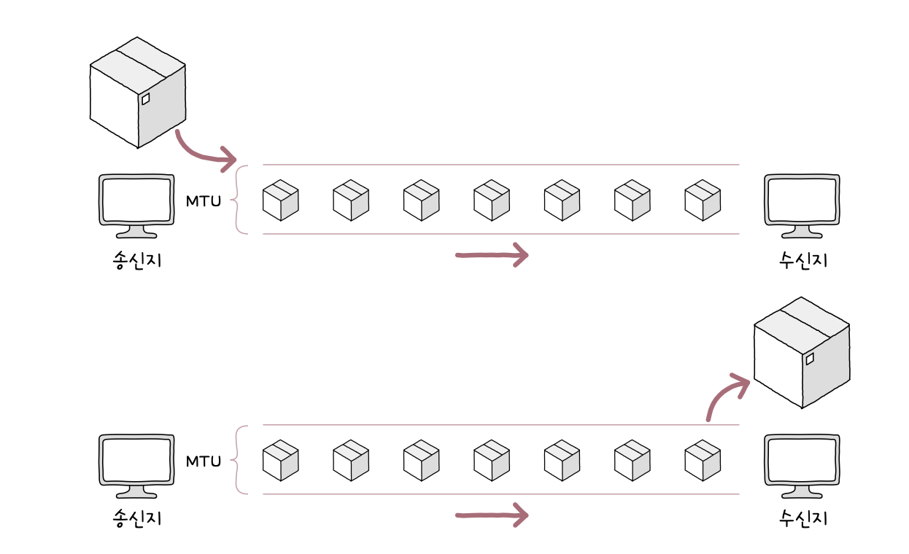

#### IPv4

IPv4 패킷은 프레임의 페이로드로 데이터 필드에 명시된다.

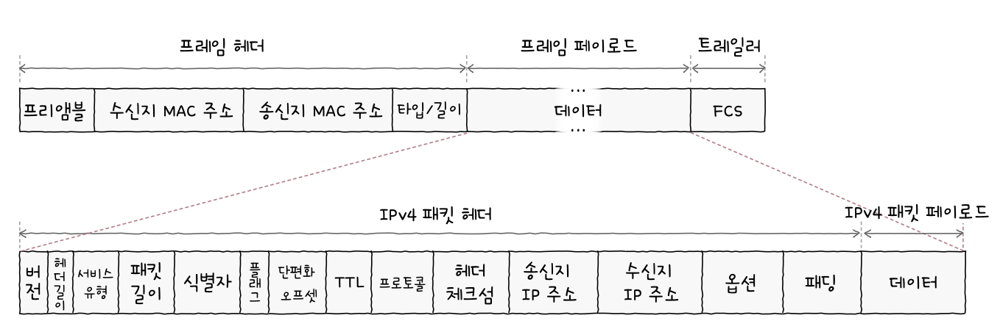

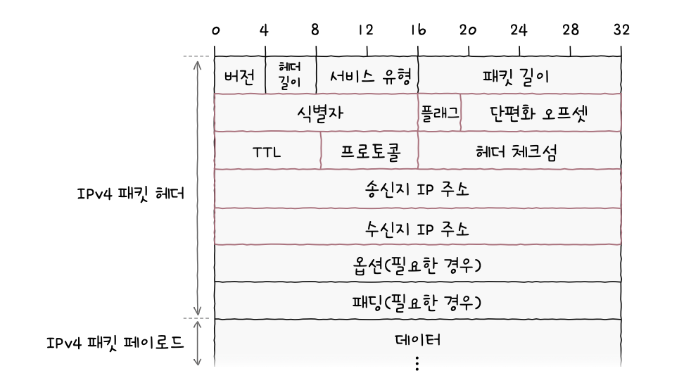

#### [1] 식별자

패킷에 할당된 번호다. IPv4 패킷이 여러 조각으로 쪼개져 전송되었을 떄 조합을 해야하고 이떄 식별자를 사용하여 패킷을 구분한다.

#### [2] 플래그

3개의 비트로 구성된 필드다.

- 첫 비트
  - 항상 0으로 예약되어 있으며 현재는 사용하지 않는다.
- DF (Don't Fragment)
  - IP 단편화 수행 여부를 의미하는 비트다. 0으로 설정되어 있으면 단편화가 가능하다.
- MF (More Fragment)
  - 단편화된 패킷이 더 있는지를 나타낸다. 0으로 설정되어 있으면 해당 패킷이 마지막임을 의미한다.

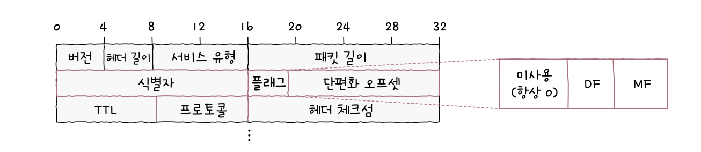

#### [3] 단편화 오프셋

패킷이 단편화되기 전에 패킷의 초기 데이터에서 몇 번째로 떨어진 패킷인지를 나타낸다. 단편화되어 전송된 패킷이 수신지에 순서대로 도착하는 것이 아니므로 재조합할 때 순서를 파악하기 위해 사용된다.

#### [4] TTL

멀리 떨어진 호스트와 통신할 때 여러 라우터를 거쳐 이동할 수 있다. 패킷이 라우터를 지날 때마다 TTL이 1씩 감소하고 0이된면 폐기된다. 그리고 패킷이 호스트 또는 라우터에 한 번 전달되는 것을 `hop`이라고 한다.

TTL을 사용하는 것은 네트워크 상에 지속적으로 남아있는 것을 방지하기 위함이다.

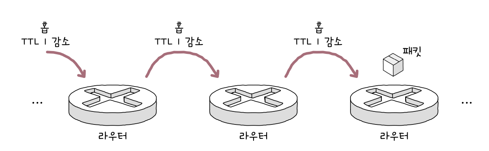

#### [5] 프로토콜

상위 계층의 프로토콜이 무엇인지 나타내는 필드다.

#### [6] 송신지 IP 주소와 수신지 IP 주소

송수신지의 IP 주소를 지정할 수 있다.

### IPv6

할당 가능한 IPv4 주소는 약 43억개다. IPv4 주소가 고갈될 상황을 대비해 등장했다.

16바이트로 주소를 표현하며 콜론으로 구분하고 8개의 16진수로 표기한다.

### ARP (Address Resolution Protocol)

ARP는 IP 주소를 통해 MAC 주소를 알아내는 프로토콜이다.

데이터를 전송할 때 기본적으로 MAC, IP 주소를 함께 사용한다. 그러나 상대 호스트의 IP 주소만 알고 있는 경우가 있을 수 있다. 이때 ARP 프로토콜을 사용하면 **동일 네트워크 내에서 MAC 주소를 알아낼 수 있다.**

ARP의 동작 과정은 다음과 같다.

1. ARP 요청
2. ARP 응답
3. ARP 테이블 갱신

#### [1] ARP 요청

네트워크 내의 모든 호스트에게 브로드캐스트 메시지를 보내 특정 IP 주소를 가진 호스트의 MAC 주소를 묻는다.

#### [2] ARP 응답

IP 주소가 일치하는 호스트는 MAC 주소를 유니캐스트 메시지로 전송한다. 이 메시지는 ARP 응답이라고 하는 ARP 패킷이다.

#### [3] ARP 테이블 갱신

ARP를 활용할 수 있는 모든 호스트는 ARP 테이블에 정보를 저장하고 관리한다. 이 테이블은 IP 주소와 MAC주소를 맵핑한 정보가 저장된다.

**ARP 테이블은 일정 시간이 지난 후 삭제되며 임의로 삭제할 수도 있다.**

> [!NOTE]
>
> **호스트 A와 B가 다른 네트워크에 속해있는 경우?**
>
> 호스트 A와 연결된 라우터 A의 MAC 주소를 얻은 후 페킷을 전송한다.
> 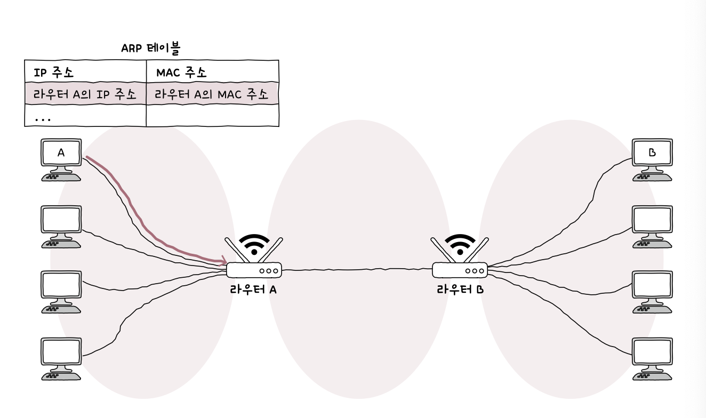
> 라우터 A는 라우터 B의 MAC 주소를 얻어온 후 패킷을 전송한다.
> 
> 라우터 B는 호스트 A의 MAC 주소를 얻어온 후 패킷을 전송한다.
> 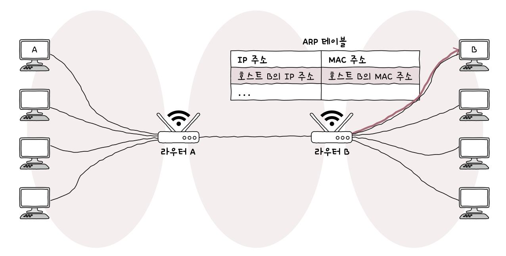
>
> _이는 간략화된 예시로, 실제로 ARP만 사용하지 않고 다양한 기술이 사용된다._

# 3-2 IP 주소

### 네트워크 주소와 호스트 주소

네트워크 주소는 네트워크 ID, 네트워크 식별자 등으로 불린다.

호스트 주소는 호스트 ID, 호스트 식별자 등으로 불린다.

### 클래스풀 주소 체계

클래스는 네트워크 크기에 따라 IP 주소를 분류하는 기준이다. 클래스를 이용하여 호스트 IP 개수에 따라 네트워크 크기를 가변적으로 조정할 수 있다. 이렇게 클래스를 기반으로 IP주소를 관리하는 체계를 `클래스풀 주소 체계`라고 한다.

클래스는 A, B, C, D, E가 있으며 D와 F는 멀티캐스를 위한 클래스, 예약된 클래스다.

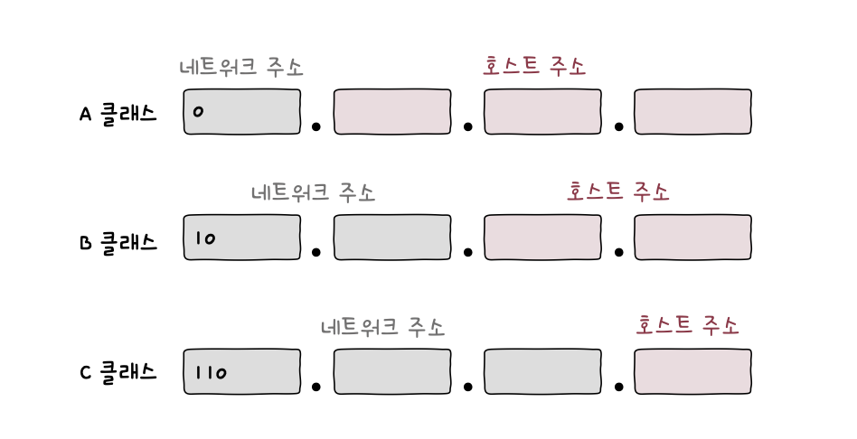

- A 클래스 (0 ~ 127)
  - 0으로 시작
  - 0.0.0.0 ~ 127.255.255.255
    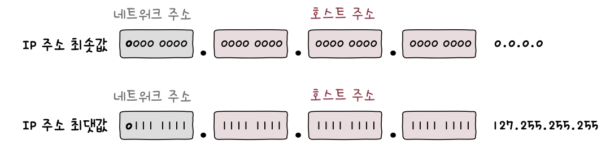
- B 클래스 (128 ~ 191)
  - 10으로 시작
  - 128.0.0.0 ~ 191.255.255.255
    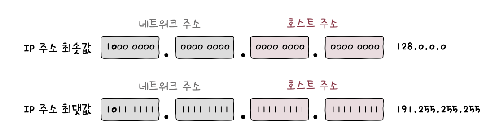
- C 클래스 (192 ~ 223)
  - 110으로 시작
  - 192.0.0.0 ~ 223.255.255.255
    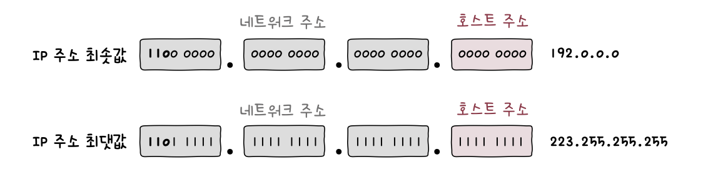

그러나 호스트 주소가 전부 0인 IP 주소와 전부 1인 IP 주소는 특정 호스트를 지칭하는 주소로 사용할 수 없다.

> 호스트 주소가 전부 0인 IP 주소 == 해당 네트워크를 의미하는 주소
>
> 호스트 주소가 전부 1인 IP 주소 == 브로드캐스트를 위한 주소

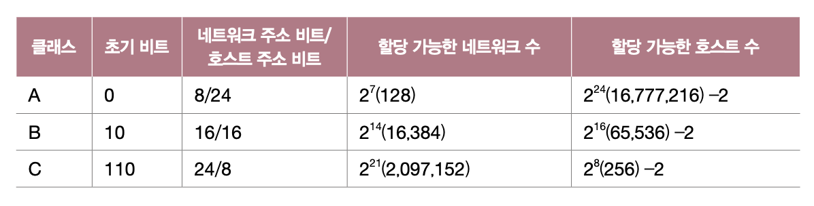

### 클래스리스 주소 체계

클래스풀 주소 체계는 클래스별 네트워크의 크기가 고정되어 있어 IP 주소가 낭비될 가능성이 있다. 따라서 유동적으로 네트워크 영역을 나누어 호스트에게 IP 주소를 할당하는 방법이 등장했고 이를 클래스리스 주소 체계라고 부른다.

#### 서브넷 마스크

클래스리스 주소 체계에서 네트워크 주소와 호스트 주소를 구분 짓는 지점이 임의로 결정된다. 이때 서브넷 마스크를 이용한다.

서브넷 마스크는 IP 주소상에서 네트워크 주소는 1, 호스트 주소는 0으로 표기한 비트열을 의미한다. 그리고 서브넷 마스크를 이용하여 클래스를 원하는 크기로 더 쪼개어 사용하는 것을 서브네팅이라고 한다.

#### 서브네팅

서브넷 마스크와 IP 주소를 비트 AND 연산하면 해당 IP 주소의 네트워크 주소를 구할 수 있다.

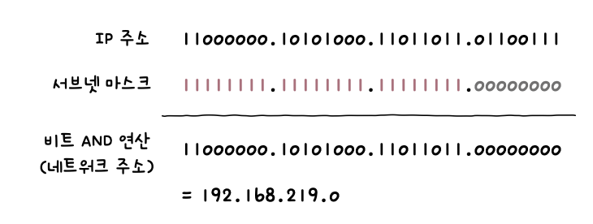

#### 서브넷 마스트 표기: CIDR

표기 방법에는 두 가지가 있다.

1. 255.255.255.0 처럼 10진수로 표기하는 방법
2. `IP 주소/서브넷 마스크상의 1의 개수` 형식으로 표기하는 방법

두 번째 방법을 `CIDR(Classless Inter-Domain Routing notation) 표기법`이라고 부른다.

> ex) 192.168.219.103/24

### 공인 IP 주소와 사설 IP 주소

#### 공인 IP 주소

전 세계에서 고유한 IP 주소다.

#### 사설 IP 주소와 NAT

사설 네트워크에서 사용하기 위한 IP 주소다. IP 주소 공간에는 사설 IP 주소로 사용하도록 예약된 IP 주소 공간이 있다.

- 10.0.0.0/8 (10.0.0.0 ~ 10.255.255.255)
- 172.16.0.0/12 (172.16.0.0 ~ 172.31.255.255)
- 192.168.0.0/16 (192.168.0.0 ~ 192.168.255.255)

사설 IP 주소의 할당 주체는 라우타다. 사설 IP는 호스트가 속한 네트워크 내에서 유효하기 때문에 다른 네트워크에 동일한 IP 주소를 사용하는 호스트가 있을 수 있다. 따라서 사설 IP 주소만 사용하여 다른 네트워크와 통신하는 것은 힘들다.

이때 NAT(Network Address Translation) 기술이 사용된다. 이는 사설 IP와 공인 IP 주소를 변환하는데 사용된다.대부분의 라우터와 공유기가 NAT 기능을 내장하고 있다.

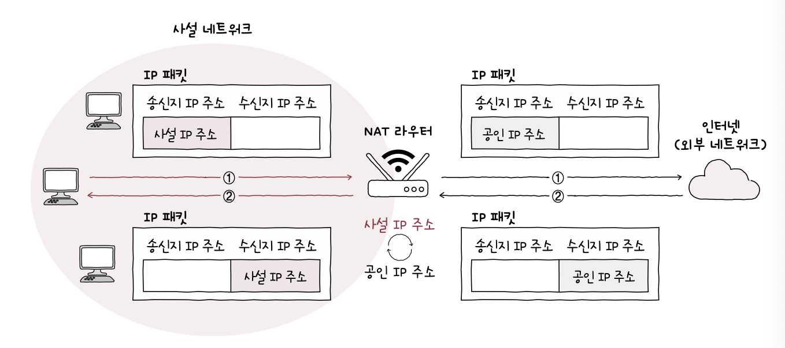

### 정적 IP 주소와 동적 IP 주소

#### 정적할당

호스트에 수작업으로 IP 주소를 부여하는 방법이다.

#### 동적 할당과 DHCP(Dynamic Host Configuration Protocol)

호스트에 IP 주소가 동적으로 할당되는 방식이다. 동적 IP 주소는 사용되지 않을 경우 회수되고 매번 다른 주소를 받을 수 있다. 그리고 IP 할당에 사용되는 프로토콜이 DHCP다.

DHCP를 통한 IP 주소 할당은 주소를 할당받고자 하는 호스트와 IP 주소를 제공하는 DHCP 서버간에 메시지를 주고받으면서 이루어진다. 이때 주고받는 메시지의 종류는 크게 4가지가 있다.

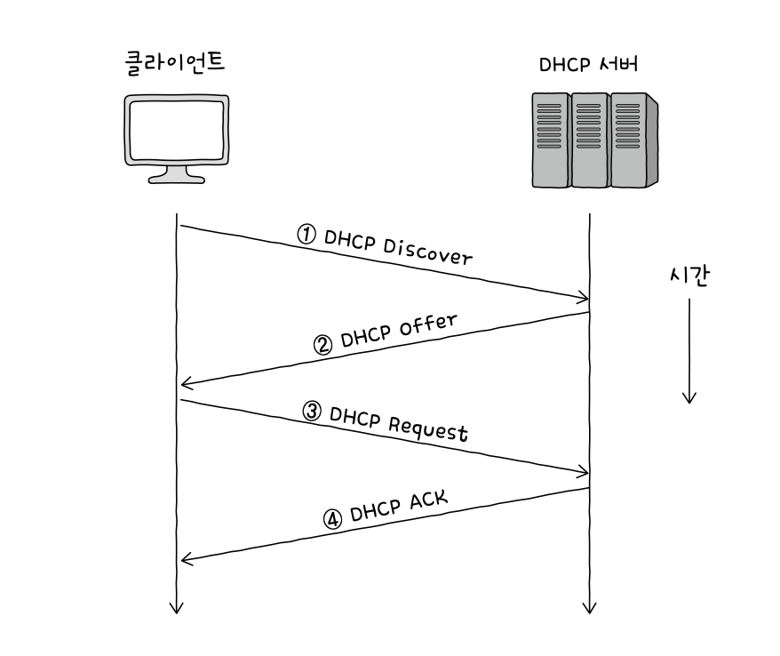

1. DHCP Discover
   - 브로드캐스트로 전송하여 DHCP 서버를 찾는 메시지다.
   - 클라이언트는 IP 주소를 할당받지 못한 상태이므로 송신지 IP 주소는 `0.0.0.0`이다.
2. DHCP Offer
   - 발견된 DHCP 서버가 클라이언트에게 IP 주소를 제안한다.
   - 서브넷 마스크, 임대 기간 등의 정보도 포함된다.
3. DHCP Request
   - DHCP Offer 메시지에 대한 응답이다.
4. DHCP ACK
   - 최종 승인 메시지와 같다.

# 3-3 라우팅

라우팅은 라우터가 패킷이 이동할 최적의 경로를 설정한 뒤 해당 경로를 패킷으로 이동시키는 것을 의미한다.

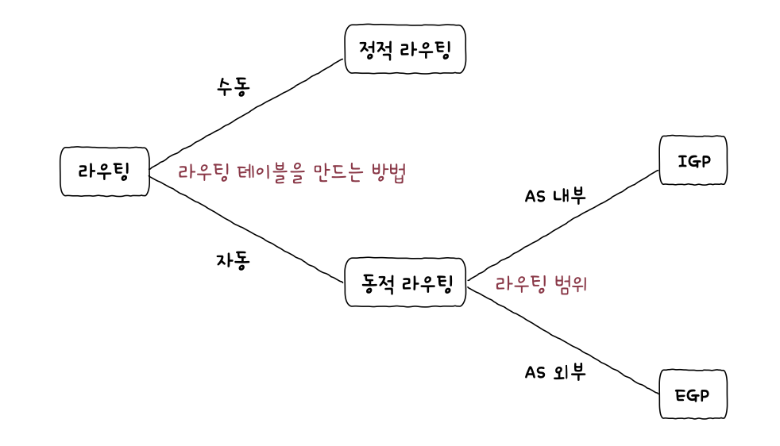

### 라우터

라우터는 네트워크 계층의 핵심 기능을 담당한다. `L3 스위치`도 대표적인 장치이나 라우터와 거의 유사하다.

### 라우팅 테이블

라우팅 테이블은 특정 수신지까지 도달하기 위한 정보를 명시한 일종의 표와 같은 정보다. 라우터는 이 표를 참고하여 수신지까지의 도달 경로를 판단한다. 그리고 테이블에 공통적으로 저장되는 정보가 있다.

- **수신지 IP 주소와 서브넷 마스크**
  - 최종적으로 패킷을 전달할 대상
- **다음 홉 (게이트웨이)**
  - 최종 수신지까지 가기 위해 다음으로 거쳐야 할 호스트의 IP 주소나 인터페이스
- **네트워크 인터페이스**
  - 패킷을 내보낼 통로
- **메트릭**
  - 해당 경로로 이동하는 데에 드는 비용

### 정적 라우팅과 동적 라우팅

라우팅 테이블을 만드는 방법에는 `정적 라우팅`과 `동적 라우팅`이 있다. 앞서 봤던 정적 IP, 동적 IP 주소 할당 방식과 유사하다.

#### 정적 라우팅

사용자가 수종으로 라우팅 테이블에 정보를 삽입하는 방식이다.

#### 동적 라우팅

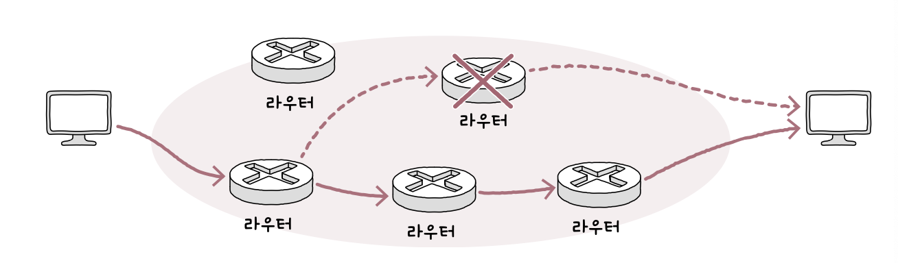

자동으로 라우팅 테이블 항목을 만들고 라우팅하는 방식을 의미한다. 대규모 네트워크를 관리할 때 유리하며 네트워크 경로상에 문제가 발생한 경우 우회할 수 있도록 경로를 갱신한다.

> [!NOTE]
>
> **라우터들의 집단 네트워크 AS(Autonomous System)**
>
> 동일한 라우팅 정책으로 운용되는 라우터들의 집단 네트워크다. AS마다 고유한 번호인 ASN이 할당된다. 만약 라우터가 AS 외부와 통신하는 경우 다른 AS와 통신을 주고받을 수 있는 `AS 경계 라우터(ASBR, Autonomous System Boudary Router)`를 이용한다.

### 라우팅 프로토콜

라우터끼리 자신들의 정보를 교환하며 패킷이 이동할 최적의 경로를 찾기 위한 프로토콜이다.

AS 내부에서 수행되는 경우 `IGP(Internet Gateway Protocol)`, 외부에서 수행되는 경우 `EGP(Exterior Gateway Protocol)`라고 한다.

#### IGP: RIP와 OSPF

- RIP: 거리 벡터 기반의 라우팅 프로토콜

거리를 기반으로 최적의 경로를 찾는 프로토콜이다. 이때 거리는 **패킷이 경유한 라우터의 수**, 즉 `홉`을 의미한다.

- OSPF: 링크 상태 라우팅 프로토콜

현재 네트워크 상태를 그래프의 형태로 `링크 상태 데이터베이스(LSDB, Link State DataBase)`에 저장한다. 이 데이터는 라우터들의 연결 관계, 연결 비용 등의 정보로 구성된다. 라우터는 LSDB를 기반으로 네트워크 구성을 그려보고 최적의 경로를 선택한다.

최적 경로를 결정할 때 대역폭을 기준으로 판단하며 대역폭이 클수록 메트릭이 낮은 경로라고 인식한다.
또한 RIP와 달리, OSPF는 네트워크의 구성이 변경되었을 때 라우팅 테이블이 갱신된다. 이런 특성때문에 대규모 네트워크에서 라우팅 테이블을 갱신하는 비용이 높아질 수 있다.

OSPF는 AS를 `area` 단위로 나누고 구분된 영역 내에서만 링크 상태를 공유한다. 그리고 이 `area`간의 연결을 `ABR(Area Border Router)`이 담당한다.

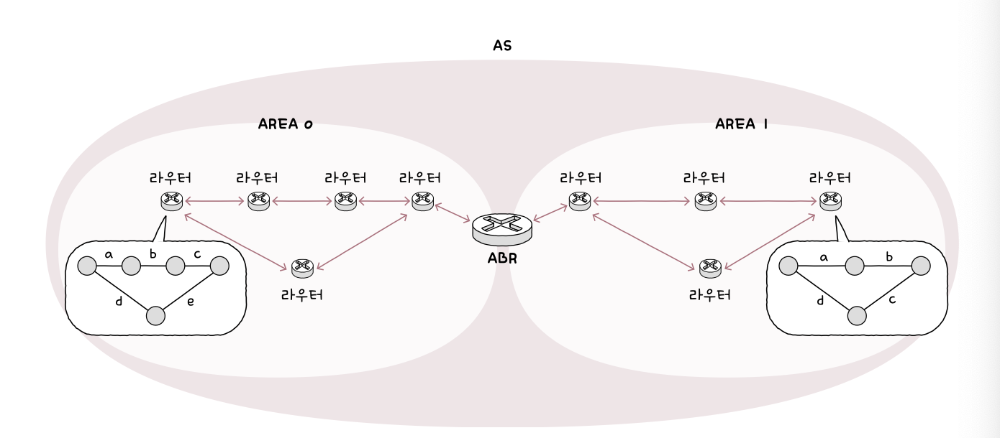

#### EGP: BGP

AS 간의 통신에서 사용되는 대표적인 프로토콜이다. AS 간의 통신을 위한 `eBGP(external BGP)`, AS 내의 통신을 위한 `iBGP(internal BGP)`가 있다.

AS간에 정보를 주고받기 위해서는 AS 내에 eBGP를 사용하는 라우터가 하나 이상 있어야 하며 다른 AS의 eBGP 라우터와 연결되어야 한다. 이렇게 서로 연결된 BGP를 `피어(peer)`라고 한다. 그리고 피어가 되도록 연결되는 과정을 `피어링(peering)`이라고 한다.

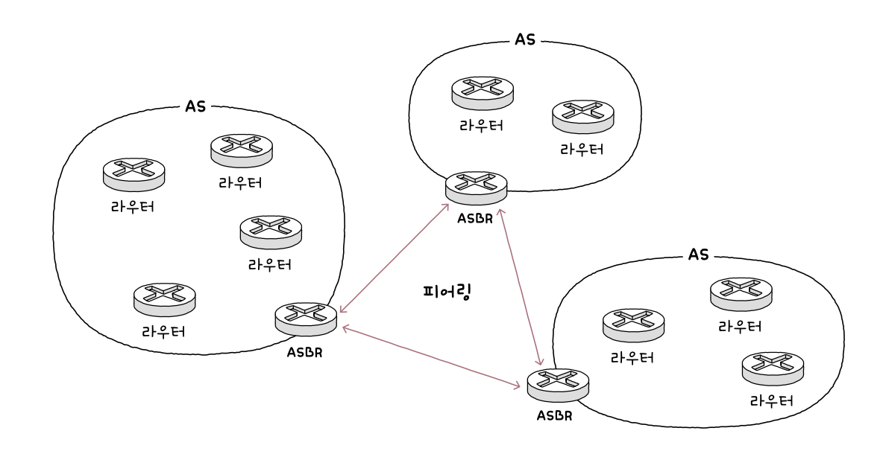
