# 4️⃣ Chapter 04: 전송 계층

# 4-1 전송 계층 개요: IP의 한계와 포트

### 신뢰할 수 없는 통신과 비연결형 통신

IP는 신뢰할 수 없는 프로토콜이자 비연결형 프로토콜이다. 따라서 IP를 통한 패킷의 전달은 신뢰성이 없으며 연결을 수립하는 과정이 없는 통신이다.

신뢰할 수 없는 통신은 IP 프로토콜 패킷이 수신지까지 제대로 전송되었음을 보장하지 않는다. 이러한 전송을 **최선형 전달**이라고 부른다.

IP가 신뢰할 수 없는 비연결형 통신을 하는 이유는 **성능**때문이다. 모든 패킷이 전송되었는지 확인하고 호스트와 연결을 수립하는 작업은 빠른 송수신과는 배치되는 작업이다.

### IP의 한계를 보완하는 전송 계층

#### [1] 전송 계층은 연결형 통신을 가능하게 한다.

연결형 통신을 지원하는 대표적인 전송 프로토콜로 TCP가 있다. TCP는 두 호스트가 정보를 주고받기 전에 가상의 회선을 설정하듯 연결을 수립한다. 송수신하는 동안 연결을 유지하고 송수신이 끝나면 연결을 종료한다.

#### [2] 전송 계층은 신뢰성 있는 통신을 가능하게 한다.

TCP는 패킷이 수신지까지 올바른 순서로 확실히 전달되는 것을 보장하기 위해 재전송을 통한 오류 제어, 흐름 제어, 혼잡 제어 등 다양한 기능을 제공한다.

그러나 항상 신뢰성 있는 통신이 무조건적으로 좋은 것은 아니다. 빠른 성능이 필요한 경우 다른 프로토콜이 필요할 수 있다. 그래서 UDP 프로토콜도 존재한다. UDP는 신뢰할 수 없고 비연결형 통신을 가능하게 하는 전송 계층의 프로토콜이다.

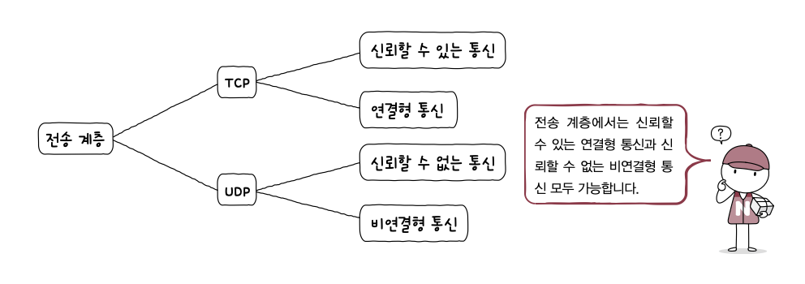

### 응용 계층과의 연결 다리, 포트

#### 포트의 정의

패킷은 실행 중인 특정 애플리케이션 프로세스까지 전달되어야만 한다. 결국 패킷의 최종 수신 대상은 특정 애플리케이션 프로세스다.

어떤 패킷을 수신할 애플리케이션에 대한 정보가 패킷 내부에 없다면 어떤 애플리케이션으로 전달해야 할지 알 수 없다. 따라서 애플리케이션을 식별하기 위해 **포트**를 사용한다.

#### 포트의 분류

전송 계층에서는 패킷 내 수신지 포트와 송신지 포트를 통해 송수신지 호스트의 애플리케이션을 식별한다.

포트 번호는 16비트로 표현 가능하고 총 65536개 사용 가능하다.

| 포트 종류      | 포트 번호 범위 |
| :------------- | :------------- |
| 잘 알려진 포트 | 0 ~ 1023       |
| 등록된 포트    | 1024 ~ 49151   |
| 동적 포트      | 49152 ~ 65535  |

잘 알려진 포트는 `시스템 포트` 라고도 불린다.

| 잘 알려진 포트 번호 | 설명   |
| :------------------ | :----- |
| 20, 21              | FTP    |
| 22                  | SSH    |
| 23                  | TELNET |
| 53                  | DNS    |
| 67, 68              | DHCP   |
| 80                  | HTTP   |
| 443                 | HTTPS  |

등록된 포트는 덜 범용적이지만 애플리케이션 프로토콜에 할당하기 위해 사용된다.

| 등록된 포트 번호 | 설명                              |
| :--------------- | :-------------------------------- |
| 1194             | OpenVPN                           |
| 1433             | Microsoft SQL Server 데이터베이스 |
| 3306             | MySQL 데이터베이스                |
| 6379             | Redis                             |
| 8080             | HTTP 대체                         |

동적 포트는 사설 포트, 임시 포트라고도 불린다. 특별히 관리되지 않기 때문에 자유롭게 사용할 수 있다.

### 포트 기반 NAT

NAT란 IP 주소를 변환하는 기술이며 네트워크 내부에서 사용되는 사설 IP 주소와 네트워크 외부에서 사용되는 공인 IP 주소를 변환하는데 사용된다. 그리고 이러한 변환을 위해 사용되는 것이 NAT 변환 테이블이다.

#### NAT 변환 테이블

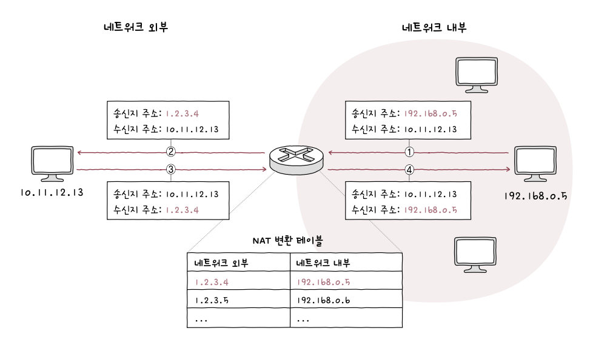

NAT 테이블을 살펴보면 사설 IP주소와 공인 IP 주소가 일대일로 대응하고 있다. 그러나 현실에서 이렇게 일대일로 맵핑하는 것은 불가능하므로 대부분 사설 IP 주소를 그보다 적은 수의 공인 IP 주소로 변환한다. 이것이 가능한 이유는 포트가 활용되기 때문이다.

#### NAPT

포트 기반의 NAT를 NAPT라고 한다. 동일한 공인 IP 주소에 포트를 함께 저장하여 사설 IP 주소를 구분한다. 따라서 사설 IP 주소와 공인 IP 주소를 N:1로 관리할 수 있다. **NAPT는 공인 IP 주소 부족 문제를 개선한 기술로도 간주된다.**

# 4-2 TCP와 UDP

### TCP 통신 단게와 세그먼트 구조

TCP 통신을 크게 세 단계로 나누면 다음과 같다.

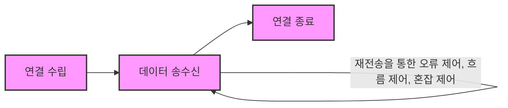

TCP 연결 수립과 종료를 이해하려면 MSS라는 단위와 TCP의 세그먼트 구조를 이해해야 한다.

MSS는 Maximum Segment Size의 약자로 TCP로 전송할 수 있는 최대 페이로드 크기를 의미한다.

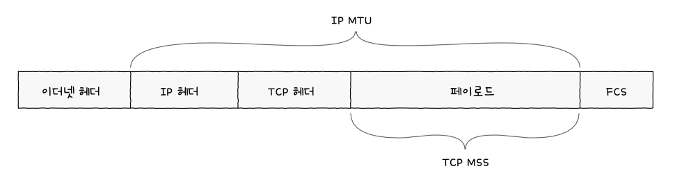

TCP 세그먼트의 구조는 아래와 같고 순서 번호, 확인 응답 번호 필드, 제어 비트를 주로 다룰 것이다.

#### 제어 비트

제어 비트 필드는 8비트로 구성된다. 가장 자주 언급되는 3개의 제어 비트는 다음과 같다.

- ACK: 세그먼트 승인을 나타내기 위한 비트
- SYN: 연결을 수립하기 위한 비트
- FIN: 연결을 종료하기 위한 비트

#### 순서 번호와 확인 응답 번호

이 두 필드는 TCP의 신뢰성을 보장하기 위해 사용되는 중요한 필드이므로 묶어서 기억하는 것이 좋다.

순서 번호는 세그먼트의 올바른 송수신 순서를 보장하기 위한 번호이며 세그먼트 데이터의 첫 바이트에 부여된다.

예를 들어 전송 계층에서 응용 게층으로 1900바이트 크기의 데이터를 전달받았고 MSS가 500바이트라고 가정하면 총 4개의 세그먼트로 전송된다.

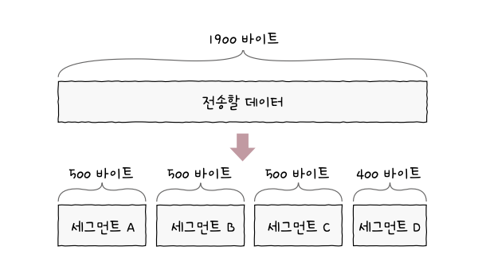

제어 비트에서 연결을 수립하기 위한 비트인 SYN 플래그가 1로 설정된 경우 순서 번호는 무작위 값이 된다. 이를 초기 순서 번호라고 하며 데이터를 송신하는 동안 순서 번호는 송신한 바이트를 더해가는 형태로 누적값을 갖는다.

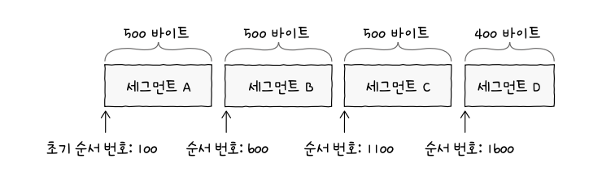

확인 응답 번호 필드에 명시되는 확인 응답 번호는 순서 번호에 대한 응답이다. 보통 `수신한 순서 번호 + 1`로 결정된다. 확인 응답 번호 값을 보내기 위해서는 ACK 플래그를 1로 설정해야 한다.

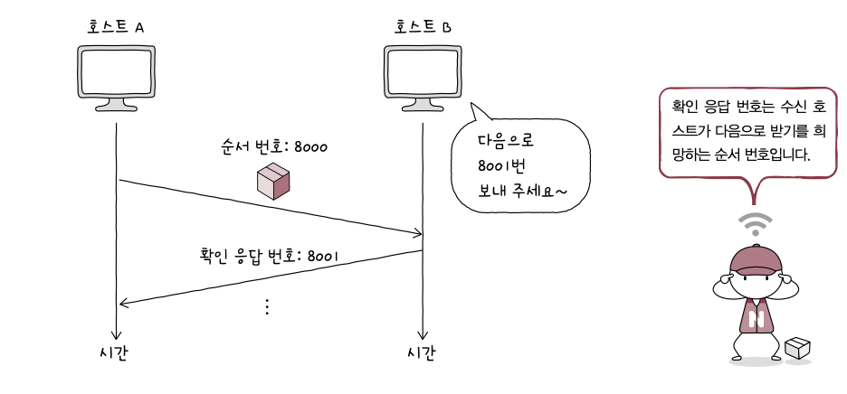

### TCP 연결 수립과 종료

#### 연결 수립: 3-way handshake

| 송수신 방향 | 세그먼트           | 세그먼트에 포함된 주요 정보                                                                                                         | 비유                               |
| :---------- | :----------------- | :---------------------------------------------------------------------------------------------------------------------------------- | :--------------------------------- |
| A→B         | SYN 세그먼트       | • 호스트 A의 초기 순서 번호 • 1로 설정된 SYN 비트                                                                                | '연결 시작합니다.'                 |
| B→A         | SYN + ACK 세그먼트 | • 호스트 B의 초기 순서 번호 • 호스트 A가 전송한 세그먼트에 대한 확인 응답 번호 • 1로 설정된 SYN 비트 • 1로 설정된 ACK 비트 | '네, 확인했습니다. 연결 시작해요!' |
| A→B         | ACK 세그먼트       | • 호스트 A의 다음 순서 번호 • 호스트 B가 전송한 세그먼트에 대한 확인 응답 번호 • 1로 설정된 ACK 비트                          | '네, 확인했습니다'                 |

여기서 연결 시작하는 수립 과정을 `액티브 오픈`, 연결 요청을 받고 연결을 수립해 주는 과정을 `패시브 오픈` 이라고 한다.

#### 연결 종료

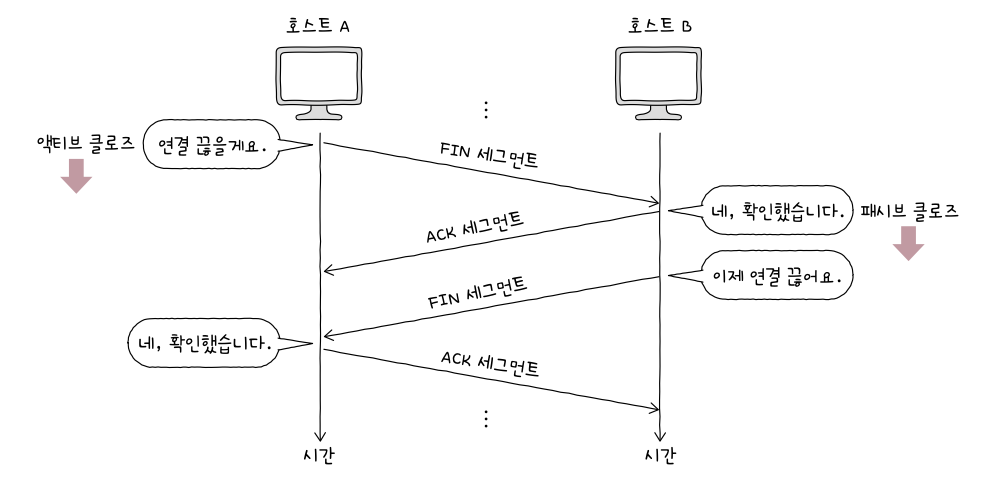

연결을 종료하는 과정은 송수신 호스트가 FIN, ACK를 주고받으며 이루어진다.

| 송수신 방향 | 세그먼트     | 세그먼트에 포함된 주요 정보                                                 | 비유                |
| :---------- | :----------- | :-------------------------------------------------------------------------- | :------------------ |
| A→B         | FIN 세그먼트 | • 1로 설정된 FIN 비트                                                       | '연결 끊을게요.'    |
| B→A         | ACK 세그먼트 | • 호스트 A가 전송한 세그먼트에 대한 확인 응답 번호 • 1로 설정된 ACK 비트 | '네, 확인했습니다.' |
| B→A         | FIN 세그먼트 | • 1로 설정된 FIN 비트                                                       | '이제 연결 끊어요.' |
| A→B         | ACK 세그먼트 | • 호스트 B가 전송한 세그먼트에 대한 확인 응답 번호 • 1로 설정된 ACK 비트 | '네, 확인했습니다.' |

여기서 먼저 연결을 종료하려는 호스트에 의해 수행되는 과정을 `액티브 클로즈`, 연결 종료 요청을 받아들이는 호스트의 과정을 `패시브 클로즈` 라고 한다.

### TCP 상태

TCP는 연결형 통신과 신뢰할 수 있는 통신을 유지하기 위해 상태를 유지한다. 그래서 스테이트풀 프로토콜이라고도 불린다.

| 상태 분류 | 주요 상태                                                        |
| --------- | ---------------------------------------------------------------- |
| ①         | CLOSED, LISTEN                                                   |
| ②         | SYN-SENT, SYN-RECEIVED, ESTABLISHED                              |
| ③         | FIN-WAIT-1, CLOSE-WAIT, FIN-WAIT-2, LAST-ACK, TIME-WAIT, CLOSING |

#### 연결이 수립되지 않은 상태

- CLOSED: 아무런 연결이 없는 상태
- LISTEN: 연결 대기 상태, SYN 세그먼트를 기다리는 상태. 따라서 액티브 오픈 호스트가 LISTEN 상태인 호스트에게 SYN 세그먼트를 보내면서 3way-handshake가 시작

#### 연결 수립 상태

- SYN-SENT: 액티브 오픈 소스트가 SYN 세그먼트를 보내고 그에 대한 응답 SYN + ACK 세그먼트를 기다리는 상태
- SYN-RECEIVED: 패시브 오픈 호스트가 SYN + ACK 세그먼트를 보낸 후 그에 대한 ACK 세그먼트를 기다리는 상태
- ESTABLISHED: 연결이 확립된 상태

#### 연결 종료 상태

- FIN-WAIT-1: 연결 종료의 첫 단계. FIN 세그먼트로 연결 종료 요청을 보낸 액티브 클로즈 호스트의 상태
- CLOSE-WAIT: FIN 세그먼트를 받은 패시브 클로즈 호스트가 그에 대한 응답으로 ACK 세그먼트를 보낸 후 대기하는 상태
- FIN-WAIT-2: FIN-WAIT-1 상태에서 ACK 세그먼트를 받은 상태. 상대 호스트의 FIN 세그먼트를 기다리는 상태
- LAST-ACK: CLOSE-WAIT 상태에서 FIN 세그먼트를 전송한 뒤 이에 대한 ACK 세그먼트를 기다리는 상태
- TIME-WAIT: 액티브 클로즈 호스트가 FIN 세그먼트를 수신한 뒤, 이에 대한 ACK 세그먼트를 전송한 뒤 접어드는 상태. 패시브 클로즈 호스트가 마지막 ACK 세그먼트를 수신하면 CLOSED 상태로 전이하지만, TIME-WAIT 상태에 접어든 액티브 클로즈 호스트는 일정 시간을 기다린 뒤 CLOSED 상태로 전이됨

> [!NOTE]
>
> **TIME-WAIT 상태가 필요한 이유는?**
>
> 상대 호스트가 받아야 할 ACK 세그먼트가 올바르게 전송되지 않았을 수도 있기 때문이다. 이런 경우 재전송을 해야 한다. 따라서 일정 시간 대기하는 것이다.

### UDP 데이터그램 구조

TCP처럼 상태를 유지하지 않으므로 스테이트리스 프로토콜의 일종이라고도 한다. TCP에 비해 제공하는 기능이 적은 만큼 필드도 단순하다.

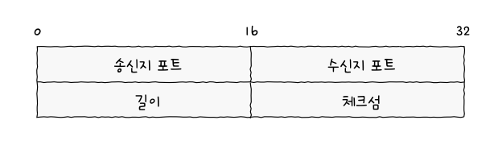

- 길이: 헤더를 포함한 UDP 데이터그램의 바이트가 담김
- 체크섬: 데이터 전송 과정에서 오류가 발생했는지 검사하기 위한 필드. 수신지에서 데이터그램의 정보가 훼손되었는지 판단하고 폐기할 때 사용한다.

TCP에 비해 적은 오버헤드로 패킷을 빠르게 처리할 수 있다. 따라서 실시간 스트리밍 서비스, 인터넷 전화같은 실시간성이 강조되는 상황에서 많이 사용된다.
또한 패킷이 손실되거나 순서가 변경될 수 있다.

# 4-3 TCP의 오류, 흐름, 혼잡 제어

### 오류 제어: 재전송 기법

TCP는 잘못된 세그먼트를 재전송하여 오류를 제어한다.

#### 오류 검출과 재전송

체크섬으로는 신뢰성을 보장할 수 없다. 세그먼트의 훼손 여부만 나타내므로 전송 과정에서 문제가 있었음을 알 수 없다.
그래서 오류를 검출하고 세그먼트를 재전송하는 상황은 크게 두 가지가 있다.

#### [1] 중복된 ACK 세그먼트를 수신했을 때

세그먼트의 순서 번호 중에서 일부가 누락되면 중복된 ACK 세그먼트를 전송하게 된다.

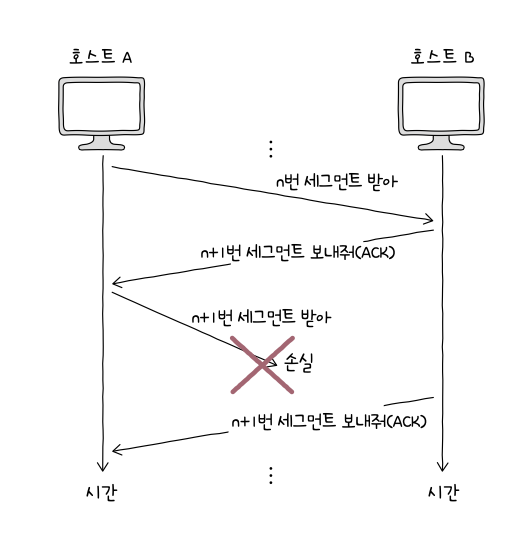

#### [2] 타임아웃이 발생했을 때

TCP 세그먼트를 송신하는 호스트는 모두 재전송 타이머 값을 유지한다. 호스트가 세그먼트를 전송할 때마다 재전송 타이머를 시작하는데 타이머의 카운트 다운이 끝난 상황을 타임아웃이라고 한다. 타임아웃이 발생할 때까지 ACK 세그먼트를 받지 못하면 상대 호스트에게 정상적으로 도착하지 않았다고 간주하고 세그먼트를 재전송한다.

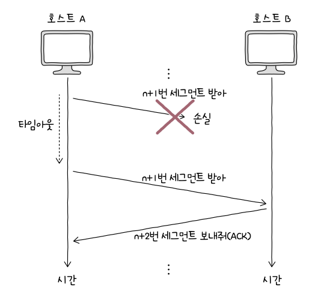

이제 재전송 기법을 알아보자.

#### ARQ: 재전송 기법

Stop-and-Wait ARQ는 가장 단순한 방식이다. 제대로 전달했음을 확인하기 전까지 새로운 메시지를 보내지 않는 방식이다. 매번 메시지 수신 여부를 응답으로 받으므로 높은 신뢰성을 보장하는 방식이다.

그러나 이는 네트워크 이용 효율이 낮아지는 문제를 야기할 수 있다. 송신 호스트에서 확인 응답을 받기 전까지는 다음 데이터를 전송할 수 없고 대기해야 하기 때문이다.

#### Go-Back-N ARQ

Stop-and-Wait ARQ의 문제를 해결하기 위해서는 각 세그먼트에 대한 ACK 세그먼트가 도착하기 전에도 세그먼트를 보낼 수 있어야 한다. 이런 것을 가능하게 한 기술이 파이프라이닝이다. 오늘날 TCP는 파이프라이닝이 사용되는 Go-Back-N ARQ와 Selective Repeat ARQ를 기반으로 동작한다.

Go-Back-N ARQ는 파이프라이닝을 사용하여 여러 세그먼트를 전송하고 도중에 잘못 전송된 세그먼트가 발생할 경우 해당 세그먼트부터 전부 다시 전송하는 방식이다.

이런 점에서 Go-Back-N ARQ에서 순서 번호 n에 대한 ACK 세그먼트는 `n번까지의 확인 응답` 이라고도 볼 수 있다. 이때의 ACK 세그먼트를 누적 확인 응답이라고 한다.

#### Selective Repeat ARQ ARQ

선택적으로 재전송하는 방법이다. 수신 호스트 측에서 제대로 전송받은 각각의 패킷들에 대해 ACK 세그먼트를 보내는 방식이다. 이는 개별 확인 응답인 셈이다.

### 흐름 제어: 슬라이딩 윈도우

파이프라이닝 기반의 Go-Back-N ARQ와 Selective Repeat ARQ ARQ가 정상적으로 동작하려면 흐름 제어를 고려해야 한다. 호스트가 한 번에 받아서 처리할 수 있는 세그먼트의 양에 한계가 있기 때문이다.

수신 버퍼는 수신된 세그먼트가 애플리케이션 프로세스에 의해 읽히기 전에 임시로 저장되는 공간이다. 이 버퍼가 넘치는 상황을 버퍼 오버플로라고 한다.
TCP의 흐름제어는 이러한 문제를 방지하기 위해 수신 호스트의 처리 속도를 고려하며 송수신 속도를 균일하게 유지한다. 이때 슬라이딩 윈도우를 사용한다.

윈도우는 송신 호스트가 파이프라이닝할 수 있는 최대량을 의미한다. 결국 너무 많은 데이터를 수신 호스트로 보내지 않기 위해 수신 호스트가 알려 주는 윈도우 크기 정보가 송신 호스트 측에서 사용된다. 송신 호스트가 이 정보를 바탕으로 수신 호스트의 처리 속도와 발맞춰 균일한 속도로 세그먼트를 전송하게 된다.

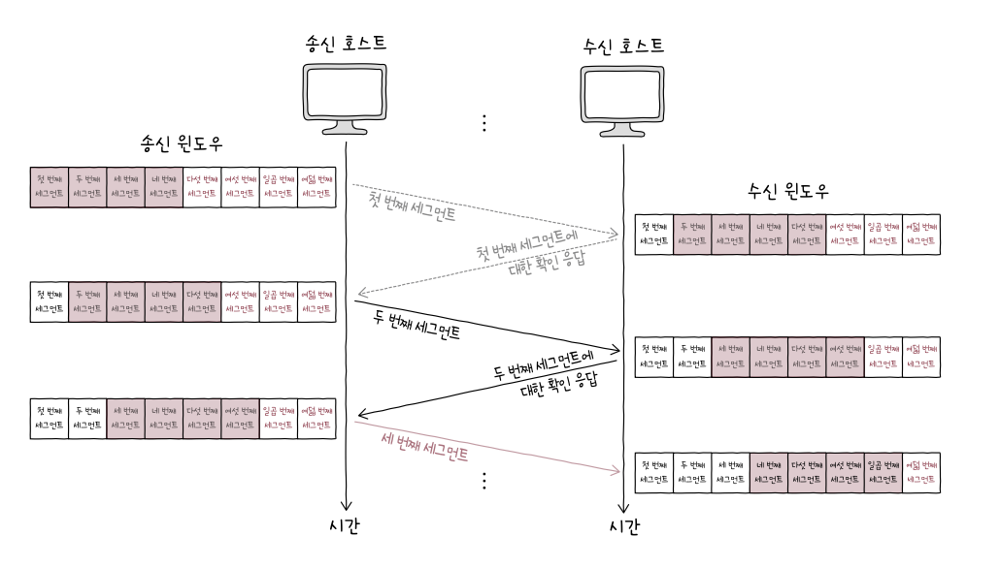

### 혼잡 제어

같은 네트워크에 속한 여러 호스트가 한 대의 라우터에 연결되어 있는 경우 모든 호스트가 라우터에게 전송 가능한 최대 양으로 세그먼트를 전송하면 라우터에 과부하가 발생할 수 있다. 추가로 오류가 발생하면 재전송을 하게되고 혼잡 현상이 더 악화되었다.

흐름 제어의 주체가 수신 호스트라면, 혼잡 제어의 주체는 송신 호스트다. 송신 호스트는 네트워크 혼잡도를 판단하고 유동적으로 전송량을 조절하며 전송한다.

혼잡 윈도우는 혼잡 없이 전송할 수 있을 정도의 데이터양을 의미한다. 그리고 혼잡 윈도우의 크기는 송신 호스트가 어느 정도의 세그먼트를 전송해야 혼잡을 방지할 수 있는지를 직접 계산해야 한다. 이를 게산하는 알고리즘을 혼잡 제어 알고리즘이라고 한다.
