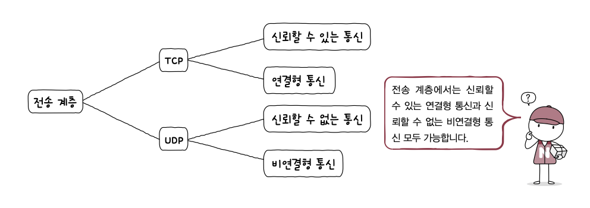
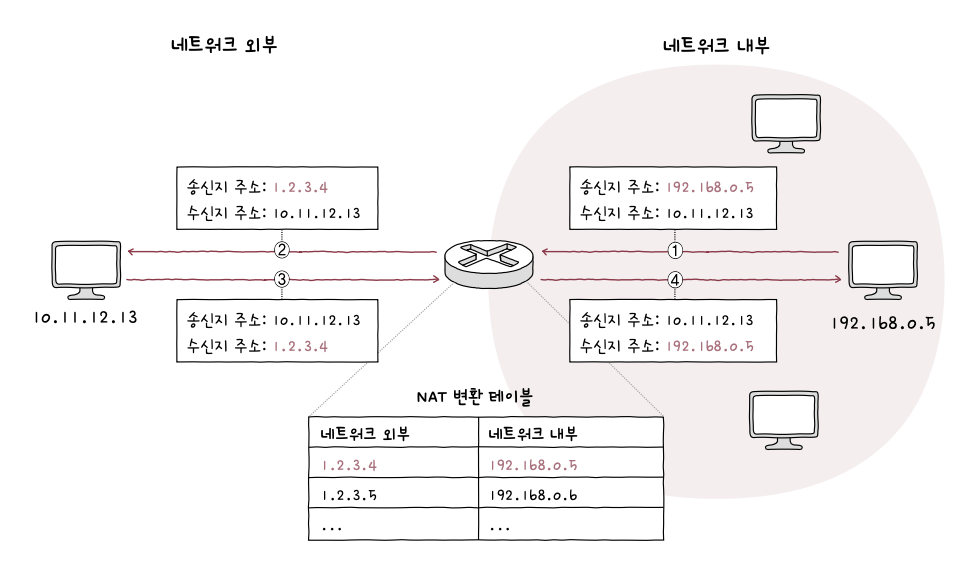

# 4️⃣ Chapter 04: 전송 계층

# 4-1 전송 계층 개요: IP의 한계와 포트

### 신뢰할 수 없는 통신과 비연결형 통신

IP는 신뢰할 수 없는 프로토콜이자 비연결형 프로토콜이다. 따라서 IP를 통한 패킷의 전달은 신뢰성이 없으며 연결을 수립하는 과정이 없는 통신이다.

신뢰할 수 없는 통신은 IP 프로토콜 패킷이 수신지까지 제대로 전송되었음을 보장하지 않는다. 이러한 전송을 **최선형 전달**이라고 부른다.

IP가 신뢰할 수 없는 비연결형 통신을 하는 이유는 **성능**때문이다. 모든 패킷이 전송되었는지 확인한고 호스트와 연결을 수립하는 작업은 빠른 송수신과는 배치되는 작업이다.

### IP의 한계를 보완하는 전송 계층

#### [1] 전송 계층은 연결형 통신을 가능하게 한다.

연결형 통신을 지원하는 대표적인 전송 프로토콜로 TCP가 있다. TCP는 두 호스트가 정보를 주고받기 전에 가상의 회선을 설정하듯 연결을 수립한다. 송수신하는 동안 연결을 유지하고 송수신이 끝나면 연결을 종료한다.

#### [2] 전송 계층은 신뢰성 있는 통신을 가능하게 한다.

TCP는 패킷이 수신지까지 올바른 순서로 확실히 전달되는 것을 보장하기 위해 재전송을 통한 오류 제어, 흐름 제어, 혼잡 제어 등 다양한 기능을 제공한다.

그러나 항상 신뢰성 있는 통신이 무조건적으로 좋은 것은 아니다. 빠른 성능이 필요한 경우 다른 프로토콜이 필요할 수 있다. 그래서 UDP 프로토콜도 존재한다. UDP는 신뢰할 수 없고 비연결형 통신을 가능하게 하는 전송 계층의 프로토콜이다.

### 응용 계층과의 연결 다리, 포트

#### 포트의 정의

패킷은 실행 중인 특정 애플리케이션 프로세스까지 전달되어야만 한다. 결국 패킷의 최종 수신 대상은 특정 애플리케이션 프로세스다.

어떤 패킷을 수신할 애플리케이션에 대한 정보가 패킷 내부에 없다면 어떤 애플리케이션으로 전달해야 할지 알 수 없다. 따라서 애플리케이션을 식별하기 위해 **포트**를 사용한다.

#### 포트의 분류

전송 계층에서는 패킷 내 수신지 포트와 송신지 포트를 통해 송수신지 호스트의 애플리케이션을 식별한다.

포트 번호는 16비트로 표현 가능하고 총 65536개 사용 가능하다.

| 포트 종류      | 포트 번호 범위 |
| :------------- | :------------- |
| 잘 알려진 포트 | 0 ~ 1023       |
| 등록된 포트    | 1024 ~ 49151   |
| 동적 포트      | 49152 ~ 65535  |

잘 알려진 포트는 `시스템 포트` 라고도 불린다.

| 잘 알려진 포트 번호 | 설명   |
| :------------------ | :----- |
| 20, 21              | FTP    |
| 22                  | SSH    |
| 23                  | TELNET |
| 53                  | DNS    |
| 67, 68              | DHCP   |
| 80                  | HTTP   |
| 443                 | HTTPS  |

등록된 포트는 덜 범용적이지만 애플리케이션 프로토콜에 할당하기 위해 사용된다.

| 등록된 포트 번호 | 설명                              |
| :--------------- | :-------------------------------- |
| 1194             | OpenVPN                           |
| 1433             | Microsoft SQL Server 데이터베이스 |
| 3306             | MySQL 데이터베이스                |
| 6379             | Redis                             |
| 8080             | HTTP 대체                         |

동적 포트는 사설 포트, 임시 포트라고도 불린다. 특별히 관리되지 않기 때문에 자유롭게 사용할 수 있다.

### 포트 기반 NAT

NAT란 IP 주소를 변환하는 기술이며 네트워크 내부에서 사용되는 사설 IP 주소와 네트워크 외부에서 사용되는 공인 IP 주소를 변환하는데 사용된다. 그리고 이러한 변환을 위해 사용되는 것이 NAT 변환 테이블이다.

#### NAT 변환 테이블

NAT 테이블을 살펴보면 사설 IP주소와 공인 IP 주소가 일대일로 대응하고 있다. 그러나 현실에서 이렇게 일대일로 맵핑하는 것은 불가능하므로 대부분 사설 IP 주소를 그보다 적은 수의 공인 IP 주소로 변환한다. 이것이 가능한 이유는 포트가 활용되기 때문이다.

#### NAPT

포트 기반의 NAT를 NAPT라고 한다. 동일한 공인 IP 주소에 포트를 함께 저장하여 사설 IP 주소를 구분한다. 따라서 사설 IP 주소와 공인 IP 주소를 N:1로 관리할 수 있다. **NAPT는 공인 IP 주소 부족 문제를 개선한 기술로도 간주된다.**

# 4-2 TCP와 UDP

### TCP 통신 단게와 세그먼트 구조

TCP 통신을 크게 세 단계로 나누면 다음과 같다.

ㅅ
