# 5️⃣ Chapter 05: 응용 계층

# 5-1 DNS와 지원

### 도메인 네임과 네임 서버

IP주소를 기억하기 어렵기 때문에 도메인 네임을 사용하고 `DNS 서버`에서 도메인 네임을 관리한다.

도메인은 .을 기준으로 계층적으로 분류된다.

루트 도메인, 최상위 도메인, 2단계 도메인, 전체 주소 도메인 네임으로 구분할 수 있다..

- **루트 도메인**: .
- **최상위 도메인**: com
- **2단계 도메인**: example
- **3단계 도메인**: www
- **전체 주소 도메인**: 일반적으로 3 ~ 5단계 정도의 도메인으로 구성되며 전체 도메인 이름을 포함하고 `FQDN (Fully-Qualified Domain Name)` 이라고 부른다.

### 계층적 네임 서버

도메인 이름을 통해 IP 주소를 알아내는 과정에 다양한 네임 서버가 사용된다. 크게 4가지로 구분된다.

- **로컬 네임 서버**: 클라이언트가 가장 먼저 찾는 네임 서버
- **루트 네임 서버**: 최상위 도메인(ex. com)을 관리하는 TLD 네임 서버의 주소를 알려준다.
- **TLD(최상위 도메인) 네임 서버**: 하위 도메인 네임(ex. example.com)을 관리하는 네임 서버 주소를 반환한다.
- **책임 네임 서버**: 자신이 관리하는 도메인 영역의 질의에 대해서는 다른 네임 서버에게 떠넘기지 않고 답을 할 수 있는 네임서버다.

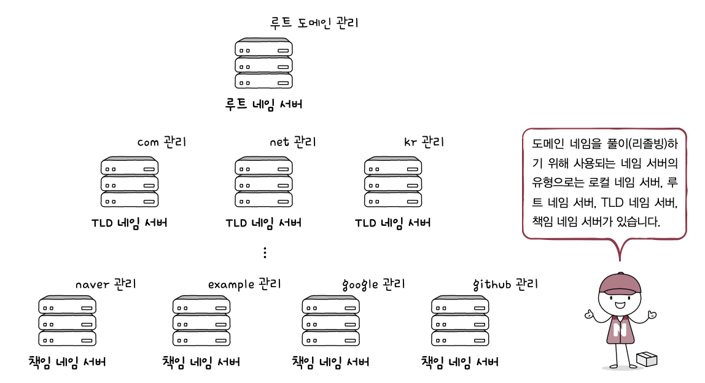

도메인 네임을 리졸빙하는 과정에는 크게 2가지 방법이 있다.

#### [1] 재귀적 질의

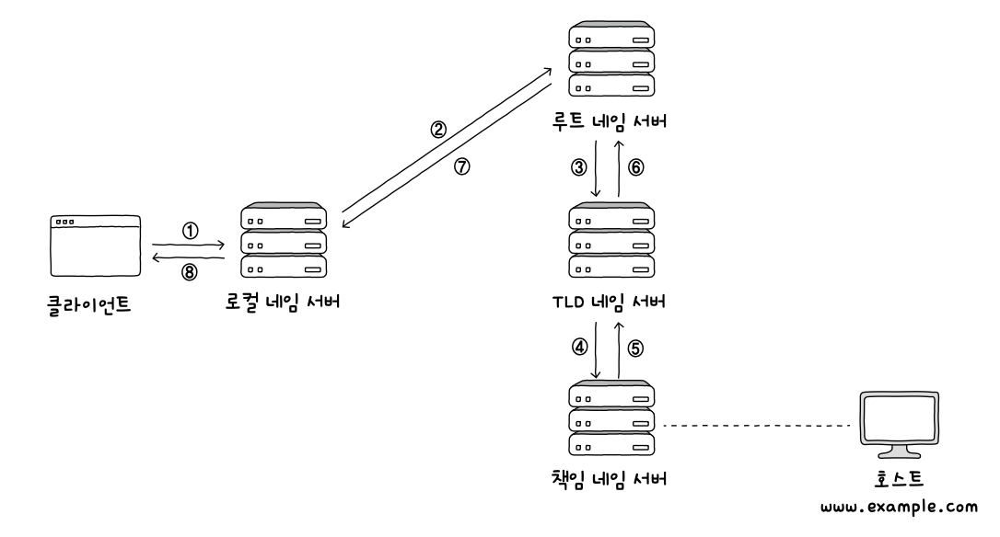

#### [2] 반복적 질의

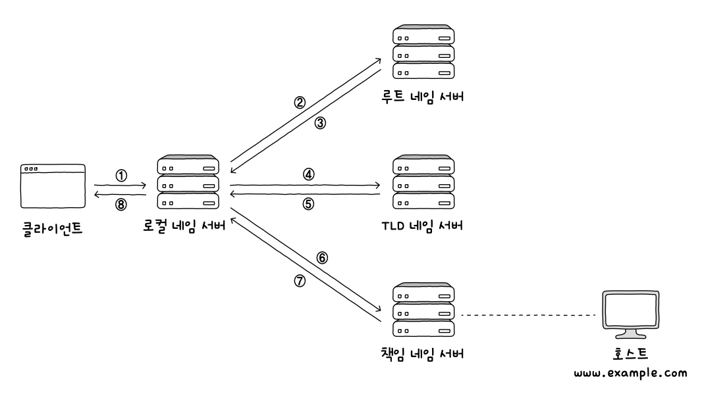

그러나 이런 방법으로 도메인 리졸빙을 하면 시간이 오래 걸리고 네트워크상의 메시지 수가 많아질 수 있다. 또한 동시에 많은 질의가 루트 네임 서버로 요청되면 과부하가 발생할 수 있다. 이런 문제를 개선하고자 네임 서버들은 `DNS 캐시`를 사용한다.

### 자원을 식별하는 URI

네트워크 상에서 자원을 주고받으며 식별할 수 있어야 한다. 자원을 식별할 수 있는 정보를 `URI (Uniformed Resource Identifier)` 라고 한다.

URI는 자원의 위치를 이용한 식별 `URL`, 이름을 이용한 식별 `URN` 두 가지로 구분된다.

> [!NOTE]
>
> **DNS 레코드 타입**
>
> 네임 서버는 `DNS 자원 레코드`라 불리는 정보를 저장하고 관리한다.
>
> 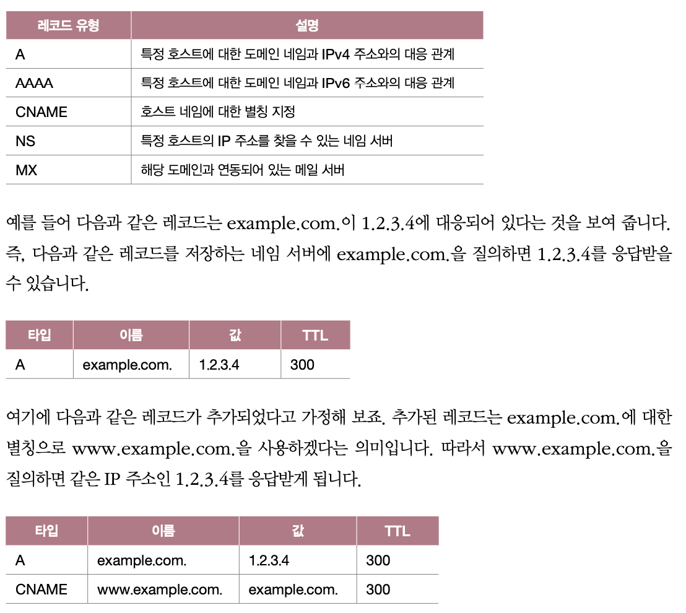

# 5-2 HTTP

### HTTP의 특성

응용 계층에서 정보를 주고받는 데 사용되는 프로토콜이다. 4가지의 특성은 다음과 같다.

#### [1] 요청-응답 기반 프로토콜

#### [2] 미디어 독립적 프로토콜

HTTP는 자원의 특성을 제한하지 않는다. 자원가 상호 작용하는 데 사용할 수 있는 인터페이스를 정의하는 것이다. 그리고 대부분의 자원은 URI로 식별된다.

HTTP에서 메시지로 주고받는 자원의 종류를 `미디어 타입이(MIME 타입)` 라고 한다.
그리고 미디어 타입은 `타입/서브타입` 형식으로 구분된다.

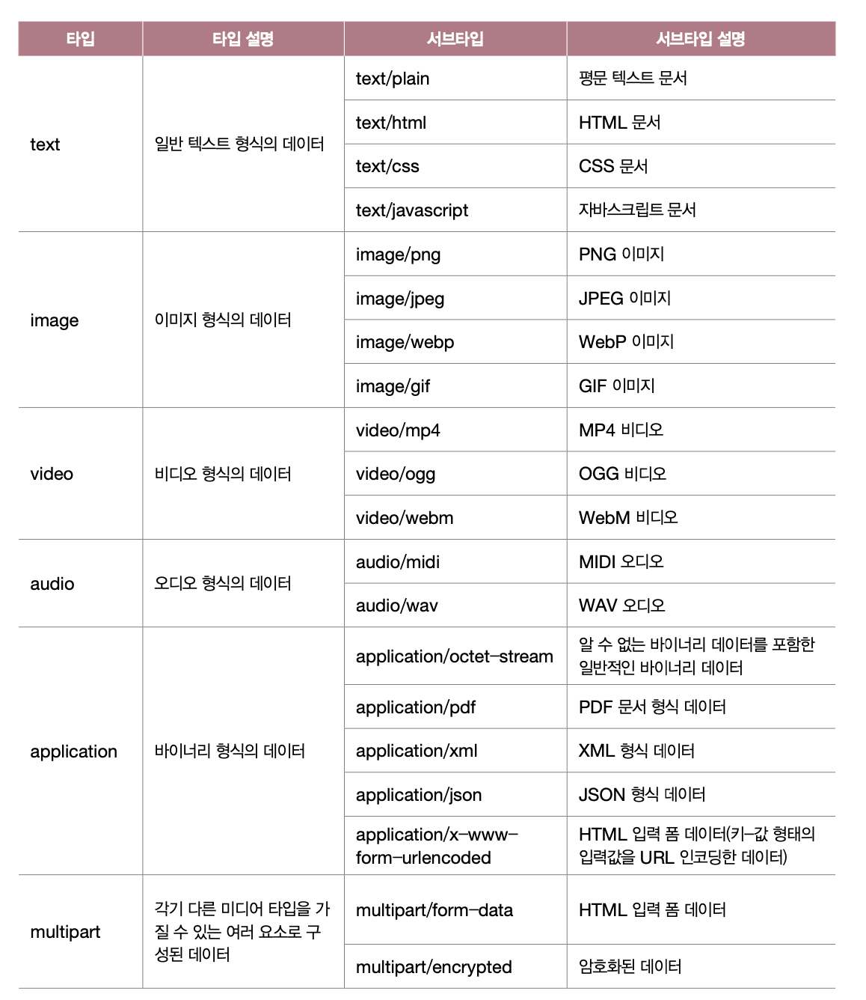

또한 타입에 대해 부가적인 설명을 위해 매개변수가 포함될 수 있다.

```
type/subtype;parameter=value
```

#### [3] 스테이트리스 프로토콜

서버는 HTTP 요청을 보낸 클라이언트와 관련된 상태를 기억하지 않는다. 따라서 모든 클라이언트의 HTTP 요청은 독립적인 요청으로 간주된다.

서버가 만약 클라이언트의 상태 정보를 유지한다면 서버에 부담이 될 수 있다.
서버가 여러 대로 구성된 경우, 모든 서버가 클라이언트 상태 정보를 공유하는 것이 힘들기 때문에 클라이언트가 여러 서버를 동시에 이용하기 어려워진다.

또한 특정 클라이언트가 특정 서버에 종속될 수 있다.
한 서버에 문제가 발생하면 해당 서버에 종속된 클라이언트는 직전까지의 HTTP 통신 내역을 잃어버리게 된다.

상태를 기억하지 않는 이유를 정리하면

1. 클라이언트 상태를 유지하면서 서버에 부담이 될 수 있음
2. 클라이언트가 서버에 종속될 수 있음

클라이언트의 상태를 기억하지 않기 때문에 HTTP는 `확장성` 과 `견고성` 을 높다.

#### [4] 지속 연결 프로토콜

기본적으로 HTTP는 TCP상에서 동작한다. 그러나 HTTP는 비연결형, TCP는 연결형 프로토콜이다.
그래서 초기 HTTP 1.0이하에서는 TCP 연결을 맺은 후 요청을 보내 응답을 받응 후 연결을 종료하는 식으로 동작했다.
이런 방식을 `비지속 연결`이라고 한다.

그러나 HTTP 1.1 이상은 keep-alive 기술을 제공하여 TCP 연결을 맺은 상태에서 여러 개의 요청, 응답을 주고받을 수 있게 되었다.

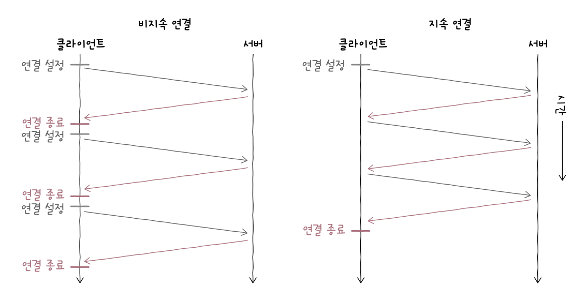

### HTTP 메시지 구조

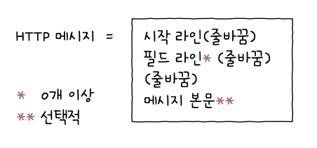

요청 메시지인 경우 시작 라인은 `요청 라인`, 응답 메시지인 경우 시작 라인은 `상태 라인`이 된다.

- **요청 라인**: 메서드, 요청 대상, HTTP 버전으로 구성된다.

```
GET /example-page HTTP/1.1
```

- **상태 라인**: HTTP 버전, 상태 코드, 이유 구문으로 구성된다.

```
HTTP/1.1 200 OK

HTTP/1.1 404 NOT FOUND
```

### HTTP 메서드

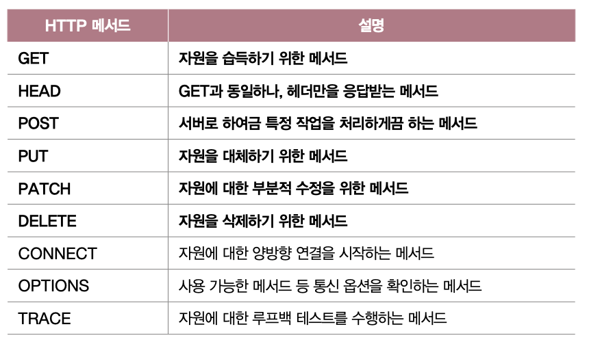

### HTTP 상태 코드

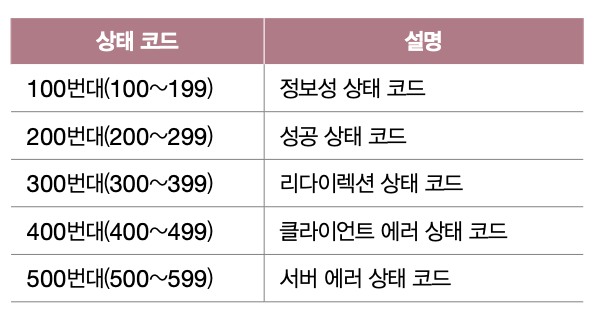

#### 200번대: 성공 상태 코드

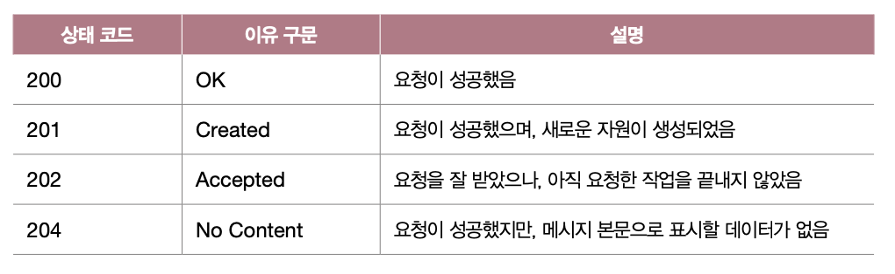

#### 300번대: 리다이렉션 상태 코드

- 영구적인 리다이렉션
  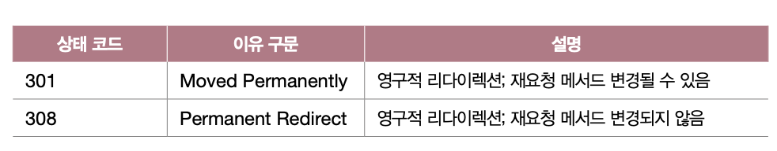

- 일시적인 리다이렉션
  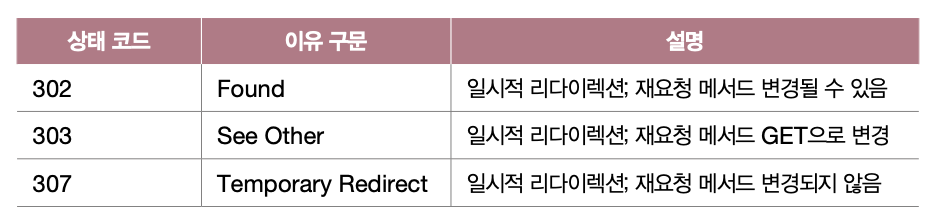

#### 400번대: 클라이언트 에러 상태 코드

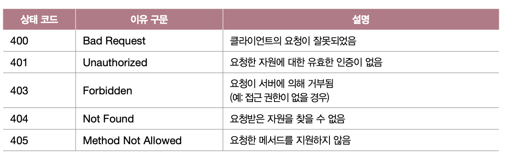

#### 500번대: 서버 에러 상태 코드

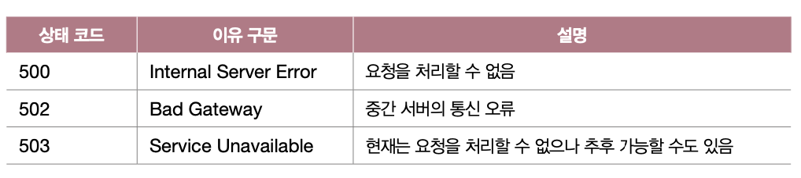

### HTTP의 발전: 0.9 ~ 3.0까지

1. HTTP/0.9

- GET 메서드만 사용 가능했다.
- 헤더가 지원되지 않았다.

2. HTTP/1.0

- HEAD, POST 같은 메서드가 도입됐다.
- 지속 연결을 지원하지 않아 연결 수립 과정이 매 요청마다 필요했다.

3. HTTP/1.1

- 지속 연결을 지원했다.
- 응답이 수신되기 전에 다음 요청을 보낼 수 있는 파이프라이닝 기능, 콘텐츠 협상 기능 등 여러 편의 기능이 추가됐다.

4. HTTP/2.0

- HTTP/1.0을 보완하고 개선한 버전이다.
- 헤더를 압축하여 전송하고 텍스트 기반이 아닌 바이너리 기반의 메시지를 송수신한다.
- 클라이언트가 미래에 필요할 것으로 예상되는 자원을 미리 전송해 주는 서버 푸시 기능을 제공한다.
- `HOL 블로킹 (Head-of-Line blocking)` 문제를 완화했다.
  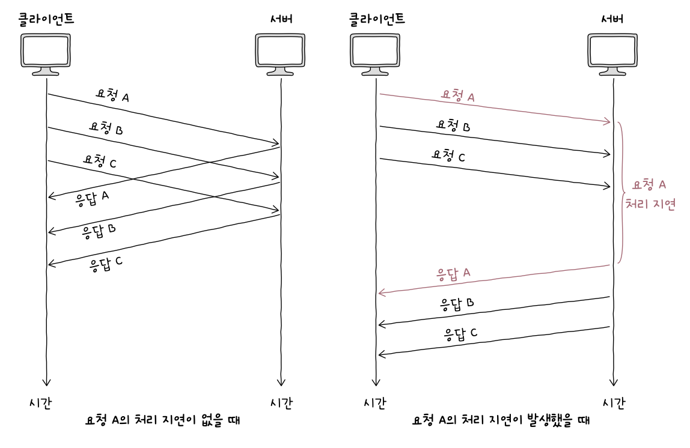
- 멀티 플렉싱 기법을 도입하여 병렬적으로 메시지를 주고 받는 것이 가능해졌다. 따라서 요청과 응답을 주고받는 단위가 하나의 스트림에서 이루어지며 동시에 여러 스트림을 활용할 수 있게 되었다.

5. HTTP/3.0

- 이전 버전들과 다르게 UDP를 기반으로 동작한다.
- TCP에 비해 속도가 많이 개선되었다.
