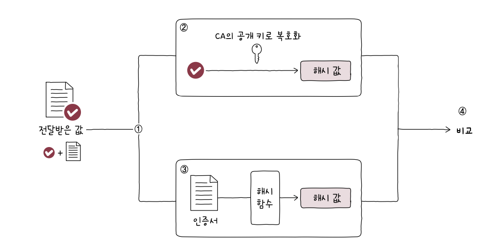

# 7️⃣ Chapter 07: 네트워크 심화

# 7-1 안정성을 위한 기술

### 가용성

가용성이란 컴퓨터 시스템이 특정 기능을 실제로 수행할 수 있는 시간의 비율을 의미한다. 즉 전체 사용 시간 중에서 정상적인 사용 시간을 의미한다.

가용성을 높이기 위해서는 서버가 동작하지 않는 시간, 다운타임을 낮춰야 한다. 그러나 이를 완전히 차단하기는 불가능하므로 우리는 문제가 발생하더라도 정상 동작할 수 있도록 설계해야 한다.

문제가 발생하더라도 기능할 수 있는 능력을 `결함 감내 (fault tolerance)` 라고 한다.

### 이중화

결함을 감내하여 가용성을 높이기 위한 가장 기본적이고 대표적인 방법이다.

이중화 할 수 있는 대상은 대부분 `문제가 발생할 경우 시스템 전체가 중단될 수 있는 대상` 이다. (서버, NIC, 스위치, DB 등)

`단일 장애점 (SPOF, Single Point Of Failure)` 은 문제가 발생할 경우 시스템 전체가 중단될 수 있는 대상을 가리키는 용어다. 가용성을 높이기 위해서는 SPOF를 줄여야 한다.

이중화 구성에는 크게 두 가지 방식이 있다.

1. 액티브/스탠바이

- 한 시스템은 동작, 다른 시스템은 대기

2. 액티브/액티브

- 두 시스템 모두 동작

### 다중화

이중화는 무언가를 이중으로 두는 기술이다. 다중화는 `무언가를 여러 개 두는 기술` 이다.

### 로드 밸런싱

트래픽은 `주어진 시점에 특정 노드를 경유한 패킷의 양` 이라고 정의할 수 있다. 그리고 서버에 많은 트래픽이 몰리면 메모리 용량 부족, 응답 지연, 누락 등 많은 문제가 발생하고 서버의 가용성이 떨어진다.

트래픽을 분산해야 서버의 가용성을 높일 수 있고 이때 사용되는 기술이 `로드 밸런싱` 이다. 로드 밸런서로 L4, L7 스위치 또는 Nginx, HAProxy, Envoy 같은 소프트웨어를 사용할 수 있다.

로드 밸런서는 클라이언트와 이중화나 다중화된 서버 사이에 위치한다. 그리고 헬스 체크를 하며 서버들의 상태를 모니터링한다. 그리고 부하를 전달할 서버를 선택할 때 사용하는 라운드 로빈 알고리즘, 최소 연결 알골리즘이 있다.

> [!NOTE]
>
> **포워드 프록시와 리버스 프록시**
>
> [포워드 프록시]
>
> 클라이언트 측에서 사용하는 프록시다. 클라이언트의 요청을 대신 처리하여 서버로 전달하고, 서버의 응답을 다시 클라이언트로 전달한다.
> 클라이언트의 IP를 숨기기, 특정 웹사이트에 대한 접근 제한, 캐싱 등을 위해 사용된다.
> 
>
> [리버스 프록시]
>
> 서버 측에서 사용하는 프록시다. 클라이언트는 직접 서버에 접근하지 않고 리버스 프록시를 통해 서버에 접근한다.
> 여러 서버에 트래픽을 분산, 서버 IP 주소를 숨겨 보안 강화, 캐싱 등을 하기 위해 사용된다.
>
> 

# 7-2 안정성을 위한 기술

### 암호와 인증서

#### 대칭키 암호화 방식과 비대칭키 암호화 방식

대칭키는 암호화, 복호화에 동일한 키를 사용한다. 따라서 상대방에게 안전하게 키를 전달해야 한다. 그러나 키를 안전하게 전달할 수 있다면 굳이 암호화 할 필요가 없을 것이다.

비대칭키 암호화는 암호화는 개인키, 복호화는 공개키를 사용한다.

대칭키 방식은 상대방에게 안전하게 키를 전달하기 힘들지만 부하가 적어 암호화, 복호화를 빠르게 수행할 수 있다. 비대칭키 방식은 키를 안전하게 공유할 수 있지만 암호화, 복호화를 수행할 때 시간과 부하가 상대적으로 많이 든다.

그래서 두 가지 방식을 결합한 방식이 많이 사용된다.
대칭키를 공개키로 암호화하고, 개인키로 복호화한다.
이렇게 되면 대칭키를 안전하게 공유할 수 있다.
이런 상황에서 대칭키를 `세션키` 라고 부른다.

#### 인증서와 디지털 서명

공개키 인증서는 공개키와 공개키의 유효성을 입증하기 위한 전자 문서다.
그리고 이러한 인증서는 인증기관 (CA, Certification Authority) 이 발급한다.

인증서에는 인증서가 진짜임을 보증하기 위한 서명값 (signature) 이 있다.
서명값은 인증서 내용에 대한 해시값 (fingerprint) 을 CA의 개인키로 암호화하여 만들어진다.

인증서를 검증하기 위해서는 서명값을 CA의 공개키로 복호화하여 `인증서 내용에 대한 해시값` 을 얻는다.
그리고 인증서 데이터에 대한 해시값을 직접 구한 후 앞서 구한 해시값과 비교하면 된다.

이런 절차를 `디지털 서명` 이라고 부른다.

### HTTPS: SSL과 TLS

대칭키, 비대칭키, 공개키 인증서를 기반으로 동작하는 프로토콜로 `SSL (Secure Sockets Layer)` 와 `TLS (Transport Layer Security)` 가 있다.
이 두 프로토콜은 인증과 암호화를 수행한다.

SSL/TLS를 사용하는 대표적인 프로토콜로 `HTTPS (HTTP over TLS)` 가 있다.

HTTPS 메시지는 3단계를 거쳐 송수신된다.

1. TCP 3 way handshake
2. TLS handshake
3. 암호화된 메시지 송수신

TLS handshake 과정은 다음과 같다 (feat. GPT).

> TLS(Transport Layer Security) 핸드셰이크는 HTTPS(HTTP Secure) 프로토콜에서 클라이언트와 서버 간에 보안 연결을 설> 정하기 위해 사용됩니다. TLS 핸드셰이크 과정은 여러 단계로 구성되며, 이 과정에서 서로의 신원을 확인하고 세션 키를 설정합니다. > 주요 단계는 다음과 같습니다:
>
> ### 1. 클라이언트 헬로 (Client Hello)
>
> 클라이언트는 서버에 연결을 시도하면서 `Client Hello` 메시지를 보냅니다. 이 메시지에는 다음 정보가 포함됩니다:
>
> - 클라이언트가 지원하는 TLS 버전
> - 클라이언트가 지원하는 암호화 스위트(암호화 알고리즘 목록)
> - 클라이언트가 생성한 랜덤 값
> - 클라이언트가 지원하는 압축 방법 등
>
> ### 2. 서버 헬로 (Server Hello)
>
> 서버는 클라이언트의 `Client Hello` 메시지를 받고, 이에 대한 응답으로 `Server Hello` 메시지를 보냅니다.
> 이 메시지에는 다음 정보가 포함됩니다:
>
> - 서버가 선택한 TLS 버전
> - 서버가 선택한 암호화 스위트
> - 서버가 생성한 랜덤 값
> - 서버 인증서 (서버의 신원을 확인할 수 있는 정보)
>
> ### 3. 서버 키 교환 및 인증 (Server Key Exchange and Authentication)
>
> 서버는 다음 단계에서 클라이언트에게 인증서를 전송합니다.
> 인증서에는 서버의 공개 키가 포함되어 있으며, 클라이언트는 이를 통해 서버의 신원을 확인할 수 있습니다.
> 필요에 따라 서버는 추가적인 키 교환 메시지를 보낼 수 있습니다.
>
> ### 4. 클라이언트 키 교환 (Client Key Exchange)
>
> 클라이언트는 서버의 공개 키를 사용하여 세션 키를 암호화한 후 `Client Key Exchange` 메시지를 통해 서버에 전송합니다.
> 이 세션키는 이후의 대칭 키 암호화에 사용됩니다.
>
> ### 5. 완료 메시지 (Finished)
>
> 클라이언트와 서버는 각각 `Change Cipher Spec` 메시지를 보내고, 이를 통해 앞으로의 통신에서 대칭 키 암호화를 사용할 것임을 알립니다.
> 이후 `Finished` 메시지를 통해 핸드셰이크 과정이 성공적으로 완료되었음을 확인합니다.
>
> ### TLS 핸드셰이크 과정 요약
>
> 1. **클라이언트 헬로**: 클라이언트가 연결을 시작하고 지원하는 암호화 방법을 서버에 알림.
> 2. **서버 헬로**: 서버가 클라이언트의 요청에 응답하고 선택한 암호화 방법과 인증서를 클라이언트에 보냄.
> 3. **서버 키 교환 및 인증**: 서버가 추가적인 키 교환 정보를 전송하고, 클라이언트가 서버를 인증함.
> 4. **클라이언트 키 교환**: 클라이언트가 서버의 공개 키로 암호화된 세션 키를 서버에 전송.
> 5. **완료 메시지**: 클라이언트와 서버가 암호화된 연결을 설정하고 핸드셰이크를 완료함.
>
> 이 과정을 통해 클라이언트와 서버는 보안된 세션을 설정하고 안전하게 데이터를 주고받을 수 있게 됩니다.

# 7-3 무선 네트워크

### AP와 서비스 셋

무선 네트워크를 생성하기 위해 액세스 포인트라는 장비가 필요하다.
AP는 무선 통신 기기를 연결하여 무선 네트워크를 구성하는 장치이며 무선 LAN에서 통신을 중개하는 역할을 수행한다.
이렇게 AP를 경유하여 통신이 이루어지는 방식을 인프라스트럭처 모드라고 한다.
또한 무선 네트워크를 이루는 AP와 여러 장치들의 집합을 서비스 셋이라고 부른다.
이때 각각의 서비스 셋을 구분할 수 있어여 하고 `서비스 셋 식별자 (SSID, Service Set Identifier)` 가 사용된다.

AP는 호스트가 연결 가능한 무선 네트워크가 존재함을 알 수 있도록 외부로 자신의 존재를 알려야 한다.
이때 브로드캐스트 메시지를 주기적으로 전송하는데 이를 `비컨 프레임` 이라고 한다.
비컨 프레임에는 SSID, AP의 MAC 주소 등이 포함되며 이 신호로 우리가 WIFI 목록에서 공유기를 볼 수 있게 되는 것이다.

