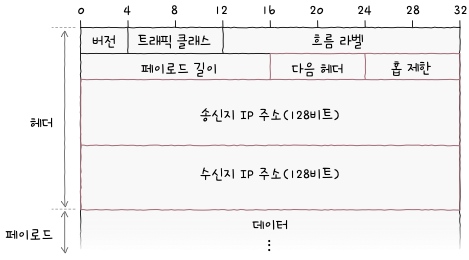
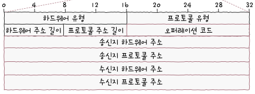
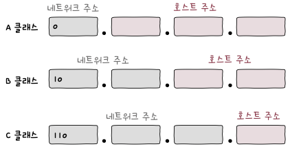
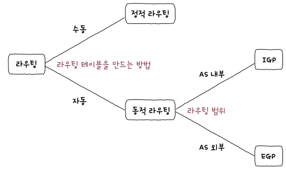
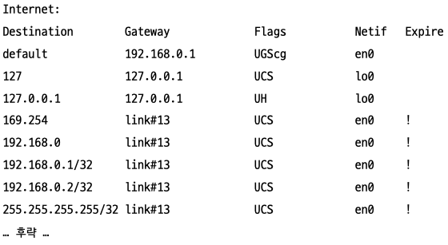

# 네트워크 계층
> 다른 네트워크와 통신하기 위한 계층  

- IP 주소를 사용하여 송수신지 대상 지정
- 라우팅

## 데이터 링크 계층의 한계
- 다른 네트워크까지의 도달 경로 파악의 어려움
	- 패킷이 이동할 최적 경로 결정(라우팅) 불가
- 호스트 위치 특정의 어려움
	- MAC 주소만으로 세상의 모든 호스트를 특정하기 어려움  
		→ 같은 LAN에 속한 호스트 식별은 어렵지 않지만 여러 네트워크를 거쳐야 도달 가능한 호스트라면?


## 인터넷 프로토콜

### IPv4
> 4바이트(32비트)로 표현되는 주소

[RFC 791](https://datatracker.ietf.org/doc/html/rfc791)에 정의되어있다

- 표기 형태
	- 한 바이트씩 점(.)을 사용하여 10진법(0~255)으로 표현  
		ex) 192.168.0.1
- 기능
	- IP 주소 지정
		- IP 주소를 바탕으로 송수신 대상을 지정
	- IP 단편화
		- 전송하고자 하는 패킷의 크기가 MTU라는 최대 전송 단위보다 클 경우, 이를 MTU[^1] 크기 이하의 패킷으로 분할
####  패킷 구성


- 식별자
	- 패킷에 할당된 번호
- 플래그
	- 3개의 비트로 구성
	- 1번 비트는 0으로 예약
	- 2번 비트는 DF(Don’t Fragment) → IP단편화를 수행하지 않도록 지시[^2]
	- 3번 비트는 MF(More Fragment) → 단편화된 패킷이 더 있는지 표현
- 단편화 오프셋
	- 단편화된 패킷이 원본 데이터의 몇 번째 위치에 해당하는지
	- 첫 번째 단편의 오프셋은 0
	- 식별자를 통해 단편화된 패킷들을 그룹화하고, 그 그룹 내에서 단편화 오프셋을 통해 순서 결정
- TTL(Time To Live)
	- 패킷의 수명을 의미
	- 무의미한 패킷이 네트워크상에 남아있는 것을 방지
	- 홉[^3]마다 1씩 감소
	- **라우터에서** --TTL > 0 이면 전송, 아니면 폐기(ICMP 메시지 전송)
- 프로토콜
	- 상위 계층(전송 계층)의 프로토콜 정보를 나타낸다

### IPv6
> 16바이트(128비트)로 표현되는 주소. 부족한 IPv4 주소를 대체하기 위해 등장하였다.

[RFC2460](https://datatracker.ietf.org/doc/html/rfc2460)(폐기됨), [RFC8200](https://datatracker.ietf.org/doc/html/rfc8200)에 정의되어있다.


- 표기 형태
	-  4비트씩 콜론(:)을 사용하여 16진법(0~F)으로 표현
		ex) 2001:0230:abcd:ffff:0000:0000:ffff:1111

#### 패킷 구성


- 다음 헤더
	- 상위 계층의 프로토콜이나 확장 헤더를 나타낸다
		- 확장 헤더는 기본 헤더와 페이로드 사이에 위치
		- IPv6에서 단편화는 확장 헤더를 통해 이루어진다
- 홉 제한
	- 패킷의 수명을 나타낸다(TTL와 유사)


**IPv4 패킷 헤더는 가변적 이지만 IPv6 패킷 (기본)헤더는 40바이트 고정이다.**

### ARP
> IP 주소를 통해 동일 네트워크 내 호스트의 MAC 주소를 알아내는 프로토콜

다른 네트워크에 속한 호스트에게 패킷을 보내는 경우 라우터에게 전송  
ex) A → 라우터 A → 라우터 B → B  
==만약 라우터의 MAC주소를 얻기 위해 ARP 요청을 하였는데 라우터가 아닌 노드가 ARP 응답을 한다면?==
#### ARP의 동작 과정
1. ARP 요청
	- ARP 요청 패킷을 브로드캐스트한다. (10.0.0.2 IP 주소의 MAC 주소를 알고싶어요)
2. ARP 응답
	- 해당 IP를 가진 호스트만 ARP 응답 패킷을 유니캐스트로 전송
	- 해당 IP가 아닌 호스트들은 요청 무시
3. ARP 테이블 갱신
	- ARP 응답을 통해 알게 된 MAC 주소를 ARP 테이블에 저장(IP → MAC)
	- 일정 시간이 지나거나 임의로 삭제


#### 패킷 구성




### ETC
```
단편화를 하게 된다면 그만큼 헤더를 만드는 비용과 재조립 과정으로 인해 성능 저하가 있을 수 있어 피하는 것이 좋다.

이를 피하기 위해 '경로 MTU 발견' 기술을 사용한다.
ICMP Can't Fragment에러를 받는다면 호스트에서 패킷의 크기를 줄여서 전달 <- 반복
```


## IP 주소

- 네트워크 주소
	- 호스트가 속한 특정 네트워크를 식별
- 호스트 주소
	- 네트워크 내에서 특정 호스트를 식별

### 클래스풀 주소 체계
> 클래스를 기반으로 IP 주소를 관리하는 주소 체계

호스트 주소를 너무 크거나 작게 할당하면 IP 주소가 낭비되거나 부족하기에 이를 해결하기 위해 사용
호스트 주소의 모든 비트가 1이거나 0인 주소는 각각 브로드캐스트 주소, 네트워크 주소로 예약되어있다.



- A 클래스
	- 네트워크 주소: 비트 b’0’으로 시작, 8비트 사용
- B 클래스
	- 네트워크 주소: 비트 b’10’으로 시작, 16비트 사용
- C 클래스
	- 네트워크 주소: 비트 b’110’으로 시작, 24비트 사용
- D 클래스
	- 
	- 비트 b’1110’으로 시작
- E 클래스
	- 
	- 비트 b’1111’으로 시작

### 클래스리스 주소 체계
> 클래스 개념 없이 네트워크의 영역을 나누어서 호스트에게 IP 주소 공간을 할당

클래스를 사용하여도 네트워크 크기가 고정 → IP 주소가 낭비될 가능성 존재


#### 서브넷 마스크
> 클래스리스 주소 체계에서 네트워크와 호스트를 구분 짓는 수단

네트워크 주소를 1, 호스트 주소를 0으로 표기  
IP 주소와 AND 연산한 결과 → 네트워크 주소

표기법
- 10진수 형태 표기
	- ex) 255.255.255.0
- CIDR
	- `IP 주소` / `서브넷 마스크상의 1의 개수` 형식
	- ex) 192.168.0.1/24 ← 255.255.255.0과 동일

### 공인 IP 주소
> 전 세계에서 고유한 IP 주소

ISP나 공인 IP 주소 할당 기관을 통해 할당받을 수 있다.

### 사설 IP 주소
> 사설 네트워크[^4]에서 사용하기 위한 IP 주소

IP 주소 공간 중에서 사설 IP 주소로 사용하도록 예약된 공간이 있다.
- 10.0.0.0/8
- 172.16.0.0/12
- 192.168.0.0/16

일반적으로 라우터가 사설 IP주소를 할당한다.  
사설 IP는 속해 있는 사설 네트워크 내에서만 유효한 주소이기 때문에 네트워크가 다르다면 중복이 가능하다.  
→ 사설 IP 주소로 외부 네트워크와 통신이 어렵다.(고유하지 않기 때문)  
→ 외부 네트워크와 통신하기 위해 NAT를 사용해야 한다.

>[!NOTE]
NAT를 사용하였을 때  
외부 네트워크 입장에서는 하나의 공인 IP와 통신하는 것이기 때문에  
같은 네트워크의 누구라도 IP 차단을 당하면 네트워크 전체가 IP 차단을 당한 것과 동일하다


### IP 주소 정적 할당
> 호스트에 수동으로 IP 주소를 부여

이렇게 할당된 IP 주소가 정적 IP 주소이다.

일반적으로 정적 할당을 위해 다음과 같은 값들이 필요하다.
- IP 주소
- 서브넷 마스크
- 게이트웨이(라우터) 주소
- DNS 주소

### IP 주소 동적 할당
> 호스트에 IP 주소가 동적으로 할당

잘못된 IP, 중복 IP 등 정적 할당 방식은 관리의 어려움이 존재  
→ 동적 할당

일반적으로 DHCP 프로토콜을 사용하여 IP 주소를 동적으로 할당한다.

##### DHCP[^5]
- IP 주소 할당 과정
	1. DHCP Discover
		- 클라이언트가 DHCP 서버를 찾는 과정
		- 브로드캐스트를 사용한다.
		- 이때의 송신지 IP 주소는 0.0.0.0[^6]
	2. DHCP Offer
		- 서버가 discover 메시지를 수신하면 클라이언트에게 사용할 IP 제안
		- IP 주소, 서브넷 마스크, 임대 기간 등의 정보가 들어있다.
	>> [!NOTE]  
	>> 이때도 브로드캐스트일까?
	3. DHCP Request
		- 제안받을 IP를 사용하겠다고 서버에 요청
		- 브로드캐스트를 사용한다.
	4. DHCP ACK
		- 요청한 IP 주소를 사용해도 좋다고 승인
	
- 임대 기간이 정해져 있다.
- 임대 갱신을 통해 임대 기간을 연장할 수 있다.

## 라우팅
> 패킷이 이동할 최적의 경로를 설정한 뒤 해당 경로로 패킷을 이동시키는 것

라우팅 분류  


### 라우팅 테이블
> 특정 수신지까지 도달하기 위한 정보를 명시한 테이블

수신지에 대한 정보가 테이블에 없다면 디폴트 라우트로 보낸다.

- 수신지 IP 주소 및 서브넷 마스크
	- 최종적으로 패킷을 전달할 대상
- 다음 홉 or 게이트웨이
	- 다음으로 거쳐야 할 호스트의 IP 주소 또인 인터페이스
- 네트워크 인터페이스
	- 패킷을 내보낼 통로
	- NIC의 이름이 명시되거나 대응하는 IP 주소가 명시
- 메트릭
	- 해당 경로로 이동하는데 드는 비용

### 정적 라우팅
> 사용자가 수동으로 채워 넣은 라우팅 테이블의 항목을 토대로 라우팅되는 방식

정적 라우팅으로 설정된 경로상에 문제가 발생한다면, 우회하여 전송이 가능하여도 문제가 있는 경로로만 보내야 한다
### 동적 라우팅
> 자동으로 라우팅 테이블 항목을 만들고, 이를 이용하여 라우팅하는 방식

라우팅 테이블 항목이 수시로 변할 수 있다.

### AS(Autonomous System)
> 동일한 라우팅 정책으로 운용되는 라우터들의 집단 네트워크

- 하나의 AS 내에는 다수의 라우터가 있다.  
- 라우터가 AS 외부와 통신할 경우 AS 경계에서 ASBR(Autonomous System Boundary Router)라는 특별한 라우터를 사용해야 한다.

### IGP(Interior Gateway Protocol)
> AS 내부에서 수행되는 라우팅 프로토콜

- RIP(Routing Information Protocol)
	- 거리(홉 수)를 기반으로 최적의 경로를 찾는 라우팅 프로토콜
	- `거리 벡터(Distance Vector)`를 사용하여 최적의 경로 선정
	- 라우터 간에 경로 정보를 주기적으로 교환하며 라우팅 테이블 갱신
	- 최적의 경로 = 수신지까지의 홉 수(메트릭)가 가장 적은 경로
- OSPF(Open Shortest Path First)
	- 링크 상태 데이터베이스를 기반으로 최적의 경로를 선택
	- `링크 상태(Link State)`를 사용하여 최적의 경로 선정
	- 네트워크의 구성이 변경되었을 때 라우팅 테이블 갱신
	- AS를 에어리어라는 단위로 나누고, 구분된 에어리어 내에서만 링크 상태를 공유
		- ABR(Area Border Router)가 에어리어 간 연결을 담당

### EBP(Exterior Gateway Protocol)
> AS 외부에서 수행되는 라우팅 프로토콜

- BGP(Border Gateway Protocol)
	- AS 간의 통신이 ‘가능한’ 프로토콜
	-  iBGP
		- AS 내의 통신을 위한 BGP
	- eBGP
		- AS 간의 통신을 위한 BGP
		- AS 간 라우팅을 할 때 거치게 될 ‘라우터’의 수가 아닌 ‘AS’의 수를 고려
			- AS-PATH 길이가 짧더라도 홉 수가 더 많을 수 있다.
		- RIP처럼 단순히 수신지에 이르는 ‘거리’가 아닌, 메시지가 어디를 거쳐 어디로 이동하는지를 나타내는 `경로`를 고려
			- 경로 벡터 라우팅 프로토콜의 일종이라 부르기도 한다.
			- `경로 순환을 방지`하기 위해 거리가 아닌 경로를 고려
	- 피어
		- BGP 메시지를 주고받을 수 있도록 연결된 BGP 라우터
		- 내부 피어: 동일한 AS 내의 피어
		- 외부 피어: 다른 AS 내의 피어

<hr/>

[^1]: 한 번에 전송 가능한 IP 패킷의 최대 크기. 일반적으로 1500바이트의 크기를 가지며, 패킷의 헤더도 MTU 크기에 포함된다.  

[^2]: 패킷의 크기가 너무 크다면 폐기된다.  

[^3]: 패킷이 다음 네트워크 장비로 이동  

[^4]: 외부 네트워크에 공개되지 않은 네트워크  

[^5]: DHCP는 네트워크 계층이 아닌 응용 계층에 속한다.  

[^6]: 이때는 0.0.0.0/8로, 이 네트워크의 이 호스트라는 의미를 가진다.  
‘모든 임의의 IP 주소’를 의미하는 0.0.0.0/0과는 다르다.