# 4. 전송 계층

## IP(3계층)의 한계  
-  신뢰할 수 없는 통신
	- 패킷이 수신지까지 제대로 전송되었음을 보장하지 않음
	- 최선형 전달[^1]이라고도 부른다
- 비 연결형 통신
	- 송수신 호스트 간에 사전 연결 수립 작업을 거치지 않는다
	- 수신지를 향해 패킷을 보내기만 한다

> [!NOTE]
> IP가 신뢰할 수 없는, 비연결형 통신을 하는이유?
> 
> 모든 패킷이 신뢰성 있는 전송을 보장해야 하지는 않는다.
> 빠른 전송이 우선되는 스트리밍, 영상 통화와 같은 서비스들도 존재

## IP의 한계를 보완하는 전송 계층  

- 연결형 통신 지원
	- TCP는 호스트 간 통신 시 `연결 수립`
> [!NOTE]
>  TCP 연결이 수립되었다면 패킷은 정해진 경로로만 이동할까?
- 신뢰성 있는 통신 지원
	- TCP는 패킷이 수신지까지 `올바른 순서`대로 확실하게 전달되는 것을 보장
		- 오류 제어, 흐름 제어, 혼잡 제어

다만, UDP와 같이 비 연결형, 신뢰할 수 없는 통신 또한 사용할 수 있다.


## 포트
> 애플리케이션을 식별하기 위한 정보

컴퓨터에서는 여러 프로그램들이 작동하고 있다.  
이때 패킷들은 어느 프로그램에서 사용되어야 하는 패킷인지 어떻게 알 수 있을까?  

→ 포트!  
전송 계층에서는 이를 통해 `애플리케이션을 식별`한다.

### 포트 범위에 따른 분류
> well known port와 registered port는 IANA에서 관리한다.  

포트 번호는 16비트르 표현 가능하기에 2 ^ 16 (65536)개의 번호 사용 가능  
#### Well Known Port
> 범용적으로 사용되는 애플리케이션 프로토콜이 일반적으로 사용하는 포트 번호

0 ~ 1023 의 범위를 사용한다.  
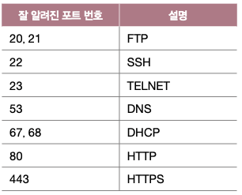

#### Registered Port
> 덜 범용적이지만 흔히 사용되는 애플리케이션 프로토콜에 할당

1024 ~ 49151의 범위를 사용한다.

#### Dynamic Port, Private Port, Ephemeral Port
> 자유롭게 사용하는 포트

49152 ~ 65535의 범위를 사용한다.

브라우저에서 서버에 요청을 할 때 송신지 포트 번호로 자주 사용

> [!NOTE]
>  포트는 IP 주소와 함께 다음과 같은 형태로 표기되는 경우가 많다.
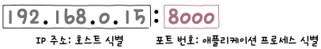

## NAPT (Network Address Port Translation)
> 포트 기반의 NAT

기존 NAT는 공인 IP : 사설 IP = 1 : 1이라 사설 IP 수 만큼 공인 IP도 필요  
이를 보완하기 위해 NAPT 등장
- 공인 IP 주소 수 부족 문제를 개선한 기술!
- 공인 IP : 사설 IP = 1 : N  
	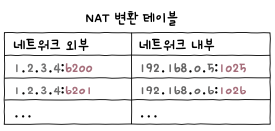

> [!NOTE]
> 포트포워딩?
> 
> 만약 내 컴퓨터에서 웹서버를 운영한다고 생각해보자.  
> 클라이언트는 내 서버 IP + 80 (HTTP well known 포트로 설정하였다고 가정)으로 접속해야 한다.
> 
> 하지만 내 서버는 공유기에서 받은 사설 IP를 사용하고 있는데 어떻게 접속하지?  
> → 공유기한테 미리 공유기(공인) IP:80으로 들어오는 트래픽은 내 서버(사설) IP:80로 전달하라고 지시
> 
> 이제 클라이언트가 공유기 IP:80으로 접속하면 해당 트래픽이 내 서버로 들어와 통신을 할 수 있다


## TCP
> 신뢰할 수 있는 통신을 위한 연결형 프로토콜

### MSS (Maximum Segment Size)
> TCP로 전송할 수 있는 최대 페이로드 크기

MTU와는 다르게 헤더의 크기는 포함하지 않음  
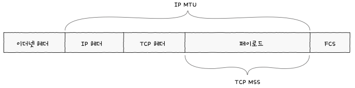

### TCP 구조

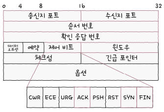  

- 순서 번호
	- 송수신되는 세그먼트의 올바른 순서를 보장
	- 세그먼트 데이터의 첫 바이트에 부여
	- SYN 세그먼트 전송 시 무작위 초기 순서 번호(ISN)를 부여
	- 이후 순서 번호는 `초기 순서 번호 + 송신한 바이트 수`로 계산
	- 32비트로 표현 가능한 수를 넘어가면 0부터 다시 증가
- 확인 응답 번호
	- 상대 호스트가 보낸 세그먼트에 대한 응답
	- 다믕으로 수신하기를 기대하는 순서 번호 명시
	- ACK 세그먼트를 전송할 때 설정
	- `수신한 순서 번호 + 1`의 값을 가진다
		- 수신한 순서 번호 + 세그먼트 바이트 수 + 1이 아니라…?
- 제어 비트
	- 현재 세그먼트에 대한 부가 정보
	- 8비트로 구성되어 있으며 각 비트는 하나의 플래그를 의미 (1이면 플래그 on)
	- ACK, SYN, FIN등이 있다
- 윈도우
	- 수신 윈도우[^2]의 크기를 명시

## 3-Way-Handshake
> 세 개의 단계로 이루어진 TCP의 연결 수립 과정

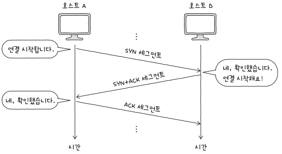
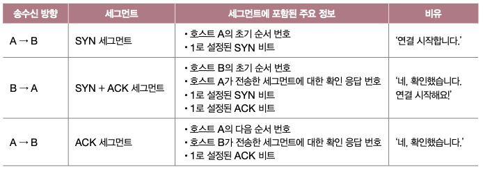

먼저 연결 수립을 시도하는 과정을 Active Open, 요청을 받아 연결을 수립하는 과정을 Passive Open

Active Open은 주로 클라이언트, Passive Open은 주로 서버가 수행한다.

## 4-Way-Handshake
> 네 개의 단계로 이루어진 TCP의 연결 종료 과정

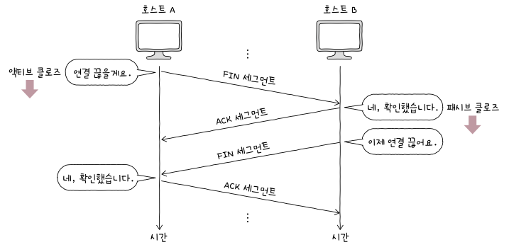
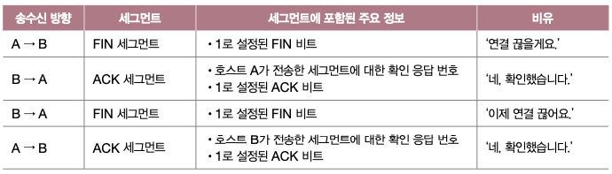


## TCP 상태
> TCP는 연결형 통신과 신뢰할 수 있는 통신을 유지하기 위해 `상태`를 유지 → stateful한 프로토콜

| 상태 분류    | 주요 상태         | 설명                                                              |
| -------- | ------------- | --------------------------------------------------------------- |
| 연결 수립 이전 | CLOSED        | 연결이 닫힌 상태.                                                      |
|          | LISTEN        | 서버가 들어오는 연결 요청을 기다리고 있는 상태.<br>(SYN 세그먼트를 기다리는 중)               |
| 연결 수립    | SYN-SENT      | 클라이언트가 서버에 연결 요청을 보낸 상태.<br>(SYN을 보내고 SYN + ACK 기다리는 중)         |
|          | SYN-RECEIVED  | 서버가 클라이언트의 연결 요청을 받아들여 대기 중인 상태.<br>(SYN + ACK를 보내고 ACK 기다리는 중) |
|          | ESTABLISHED   | 연결이 성공적으로 수립된 상태.                                               |
|          |               | 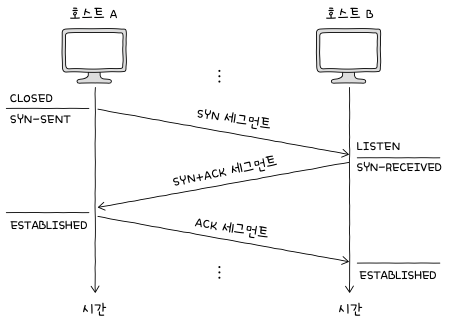                                      |
| 연결 종료    | FIN-WAIT-1    | 연결을 종료하기 위해 FIN 세그먼트를 보낸 상태.                                    |
|          | CLOSE-WAIT    | 상대방의 FIN 세그먼트를 받고 ACK를 보낸 뒤, 종료를 기다리는 상태.                       |
|          | FIN-WAIT-2    | FIN-ACK을 받은 후, 상대방의 FIN을 기다리는 상태.                               |
|          | LAST-ACK      | CLOSE-WAIT 상태에서 FIN을 보낸 후 ACK를 기다리는 상태                          |
|          | TIME-WAIT[^3] | ACK가 올바르게 전송되지 않았다면 이를 다시 전송해주어야 하기 때문에 대기중인 상태                 |
|          | CLOSING       | 양쪽이 거의 동시에 FIN 세그먼트를 보낸 상태로, 종료 절차가 진행 중인 상태.                   |
|          |               | 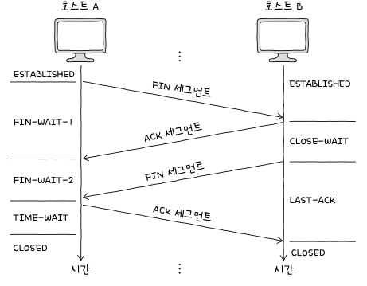                                      |

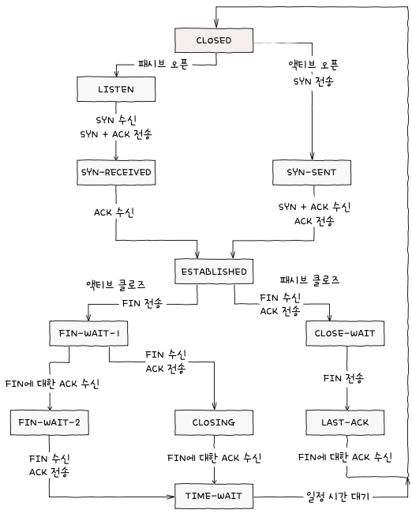

### 오류 제어: 재전송 기법

1. 송신 호스트가 송신한 세그먼트에 문제가 발생하였음을 인지
2. 인지하였다면 해당 세그먼트를 재전송

#### 오류 감지

중복된 ACK 세그먼트 수신
- 송신측에서 다음 세그먼트를 전송하였는데 세그먼트가 사라짐
- 수신측은 아무리 기다려도 다음 세그먼트가 오지 않아서 다시 ACK롤 보내며 다음 세그먼트를 달라고 요청 (얼마나 기다려야 하는 건지?)  
	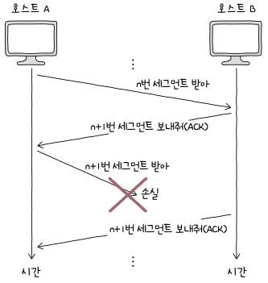

타임아웃 발생
- 송수신 호스트 모두 재전송 타이머값을 유지
- 각 호스트는 세그먼트를 전송할 때마다 재전송 타이머 시작 → 카운트다운이 끝날 때 까지 ACK가 오지 않는다면 문제가 발생하였다고 판단

#### 재전송

Stop-and-Wait-ARQ
> ACK를 확인하기 전까지 새로운 메시지를 전송히지 않음

```diff
+ 단순
+ 높은 신뢰성
- 낮은 네트워크 이용 효율
- 성능 저하
```

Go-Back-N-ARQ
> 파이프라이닝[^4] 방식을 활용해 여러 세그먼트를 전송
> 도중 잘못 전송된 세그먼트가 발생할 경우 `해당 세그먼트부터 전부 다시 전송`

누적 확인 응답(Cumulative Acknowledgment) 이라고도 불린다.
```diff
+ 네트워크 이용 효율 증가(대기하지 않음)
- 오류가 발생한 세그먼트 이후의 모든 세그먼트들을 재전송 -> 대역폭의 낭비
```
Selective Repeat ARQ
> ACK를 받지 못했다면 `해당 세그먼트만 재전송`

두 호스트가 연결을 수립할 때 서로의 Selective Repeat ARQ 지원 여부를 확인[^5]  
지원 ? selective arq : go back arq

> [!NOTE]
> 파이프라이닝 기반인 Go-Back-N ARQ와 Selective Repeat ARQ는 흐름 제어가 필요하다  
> 호스트가 한 번에 받아서 처리할 수 있는 세그먼트의 양에는 한계가 있기 때문!

### 흐름 제어: 슬라이딩 윈도우
> 송신 호스트가 수신 호스트의 처리 속도록 고려하며 송수신 속도를 조정

윈도우: 송신 호스트가 파이프라이닝 할 수 있는 최대량

수신 버퍼: 수신된 세그먼트가 애플리케이션 프로세스에 의해 읽히기 전 임시로 저장되는 공간  
송신 버퍼: 송신할 세그먼트가 저장되는 공간

송신 호스트가 수신 버퍼의 크기보다 많은 데이터를 전송한다면 버퍼가 가득 차 흘러 넘친다 → 버퍼 오버플로우


### 혼잡 제어

혼잡을 제어하지 않는다면?
1. 모든 호스트가 전송 가능한 최대 양으로 세그먼트를 전송
2. 라우터에 과부하가 생겨 오류 발생
3. 호스트들이 오류를 검출하여 재전송 요청
4. 점점 더 많은 데이터를 전송
5. 혼잡 ↑, 전송률 저하(congestion collapse)

혼잡 윈도우[^6]: 혼잡 없이 전송할 수 있을 법한 데이터양

그렇다면 혼잡 윈도우의 크기를 어떻게 결정할까? → 혼잡 제어 알고리즘

#### AIMD(Additive Increase / Multiplicative Decrease)
> 가장 기본적인 혼잡 제어 알고리즘

- 혼잡이 감지되지 않는다면 RTT마다 윈도우 +1
- 혼잡이 감지된다면 윈도우 / 2

느린 시작(Slow Start)
> 혼잡 윈도우를 1부터 시작하여 수신된 ACK당 1씩 증가 → RTT마다 2배씩 증가

- AIMD의 처음 연결 수립 이후 윈도우 크기 증가 속도가 느린 단점을 보완  
- 최대 slow start threshold값 까지 증가 가능

혼잡 회피
> 혼잡 윈도우가 느린 시작 임계치를 넘어서면 느린 시작 종료 후 혼잡 회피 시작
> RTT마다 혼잡 윈도우를 1MSS씩 증가 → 윈도우 크기 선형적으로 증가


빠른 회복
> 세 번의 중복 ACK를 수신했을 때 느린 시작은 건너뛰고 혼잡 회피 수행

| 상황                 | 방법                                                                             |
| ------------------ | ------------------------------------------------------------------------------ |
| 타임아웃 발생            | - 혼잡 윈도우 값을 1로 초기화<br>- 느린 시작 임계치를 혼잡이 감지된 시점의 혼잡 윈도우 값의 절반으로 설정<br>- 느린 시작 수행 |
| 혼잡 윈도우 ≥ 느린 시작 임계치 | - 느린 시작 종료<br>- 혼잡 윈도우를 절반으로 줄임 ← ?????????<br>- 혼잡 회피 수행                      |
| 세 번의 중복 ACK 발생     | - 혼잡 윈도우와 느린 시작 임계치 절반으로 감소<br>- 빠른 재전송 후 빠른 회복 수행                             |


## UDP
> 비연결형 통신을 수행하는 신뢰할 수 없는 프로토콜 → stateless 프로토콜

### UDP 구조
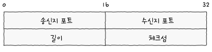

- 길이
	- 헤더를 포함한 UDP 데이터그램의 바이트 수
- 체크섬
	- 데이터그램 전송 과정에서 오류가 발생했는지 검사
	- 문제가 있다고 판단되면 데이터그램 폐기
	- 데이터 훼손 여부를 파악하기 위한 것이기 때문에 신뢰성과는 무관하다


## TCP vs UDP

| 특징             | TCP (Transmission Control Protocol) | UDP (User Datagram Protocol)  |
| -------------- | ----------------------------------- | ----------------------------- |
| **연결 방식**      | 연결 지향적 (Connection-oriented)        | 비연결형 (Connectionless)         |
| **신뢰성**        | 신뢰성 있는 데이터 전송 보장                    | 신뢰성 없음                        |
| **흐름 제어**      | 흐름 제어 (Flow control) 지원             | 흐름 제어 지원 안함                   |
| **혼잡 제어**      | 혼잡 제어 (Congestion control) 지원       | 혼잡 제어 지원 안함                   |
| **오류 검출 및 수정** | 오류 검출 및 재전송                         | 기본적인 오류 검출, 재전송 없음            |
| **순서 보장**      | 데이터 순서 보장                           | 데이터 순서 보장 안함                  |
| **헤더 크기**      | 비교적 큼 (20-60 바이트)                   | 작음 (8 바이트)                    |
| **전송 속도**      | 느림 (오버헤드가 큼)                        | 빠름 (오버헤드가 적음)                 |
| **사용 사례**      | 웹, 이메일, 파일 전송 등                     | 실시간 스트리밍, VoIP, 게임 등          |
| **연결 설정**      | 3-way 핸드셰이크를 통해 연결 설정               | 연결 설정 없음                      |
| **멀티캐스팅**      | 지원 안함                               | 멀티캐스팅 지원                      |
| **패킷 크기**      | 가변적, MTU에 따라 다름                     | 고정 크기                         |
| **주로 사용되는 분야** | 웹, 이메일, 파일 전송, 웹 애플리케이션, 데이터베이스 등   | 실시간 스트리밍, VoIP, 온라인 게임, DNS 등 |


[^1]: 최선을 다해 전송은 해 보겠지만 보장은 안한다  
[^2]: 한 번에 수신하고자 하는 데이터의 양  
[^3]:https://tech.kakao.com/posts/321  
[^4]: 연속해서 메시지를 전송할 수 있는 기술(Stop-and-Wait 방식과는 다르게)  
[^5]: TCP 세그먼트 헤더의 옵션 필드에 속한 SACK 허용(SACK-permitted) 필드를 통해 알 수 있다  
[^6]: 수신 윈도우는 수신 호스트가 송신 측에게 알려주어야 하지만 혼잡 윈도우는 송신자가 자체적으로 계산하기에 알릴 필요가 없어 헤더에도 미포함  