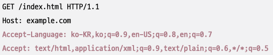

# DNS (Domain Name System)[^1]

## 도메인 네임
> 호스트의 IP 주소와 대응되는 문자열 형태의 호스트 특정 정보

통신을 하기 위해서는 상대방의 IP 주소를 알아야 하지만 IP 주소는 언제든지 바뀔 수 있으며 기억하기도 쉽지 않다.

그렇기에 일반적으로 상대 호스트를 특정하기 위해 IP 주소 보다는 도메인 네임을 사용한다.

> `네임 서버`는 이 도메인 네임과 그에 해당하는 IP를 관리한다.

## 도메인 네임 관리

도메인 네임은 `.`을 기준으로 계층적 분류  

> [!NOTE]
> 
> 루트 도메인은 `com`, `kr`, … 이 아니라 `.`이다.  
> 다만, 일반적으로 루트 도메인은 생략해서 표기한다  
> 
> 최상위 도메인과 루트 도메인을 햇갈리지 않도록 주의하자

`도메인 네임이 계층적인 형태를 띄고 있으므로 이를 효율적으로 관리하기 위해 네임 서버 또한 계층적인 형태를 이룬다.`

전체 주소 도메인 네임(FQDN; Fully-Qualified Domain Name)
도메인 네임을 모두 포함하는 도메인 네임

> [!NOTE]
> 
> hosts 파일  
> - 도메인 네임과 IP 주소의 대응 관계를 담은 파일
> - DNS 쿼리보다 우선순위를 가진다.

## 계층적 네임 서버

네임 서버의 유형은 크게 4가지가 있다.
- 로컬 네임 서버
	- 클라이언트가 도메인 네임을 통해 IP 주소를 알아내고자 할 때 가장 먼저 찾게 되는 네임 서버
- 루트 네임 서버
	- 루트 도메인을 관리
	- 질의에 대해 TLD 네임 서버의 IP 주소를 반환
- TLD[^2](최상위 도메인) 네임 서버
	- TLD를 관리
	- 질의에 대해 하위 도메인 네임을 관리하는 네임 서버 주소를 반환
- 책임 네임 서버
	- 특정 도메인 영역을 관리하는 네임 서버
	- 자신이 관리하는 도메인 영역의 질의에 대해서는 다른 네임 서버에게 떠넘기지 않고 곧바로 응답

## 로컬 네임 서버가 네임 서버들에게 질의하는 방법

### 1. 재귀적 질의
> 1. 클라이언트가 로컬 네임 서버에게 도메일 네임 질의
> 2. 로컬 네임 서버가 루트 네임 서버에게 질의
> 3. 루트 네임 서버가 TLD 네임 서버에 질의
> 4. TLD 네임 서버가 다음 단계에 질의
> 5. 이후 역순으로 응답 결과 반환

### 2. 반복절 질의
> 1. 클라이언트가 로컬 네임 서버에게 질의
> 2. 로컬 네임 서버는 루트 네임 서버에 질의 → TLD 네임 서버 주소 주소 반환
> 3. 로컬 네임 서버는 다시 TLD 네임 서버에 질의 → 다음 네임 서버 주소 반환
> 4. … 이하 동일

### 3. DNS Cache

하나의 도메인 네임을 리졸빙 하기 위해서는 여러 단계를 거쳐야 한다.  
→ 비 효율적!, 루트 네임 서버 과부하

이를 해결하기 위해 질의 결과를 캐싱하자  
→ DNS Cache
→ 빠르게 IP 주소를 얻을 수 있다.

IP 주소는 유동적일 수 있기에 DNS Cache에는 TTL 값을 설정해 해당 기간동안만 유지된다.

# URI (Uniform Resource Identifier)
> 자원[^3]을 식별할 수 있는 정보

## URI가 자원을 식별하는 방법

### 1. URL (Uniform Resource Locator)
> 위치 기반의 자원 식별자

| 표기        | 설명                                          |
| --------- | ------------------------------------------- |
| scheme    | 자원에 접근하는 방법을 명시 (일반적으로는 프로토콜을 의미)           |
| authority | 호스트를 특정할 수 있는 정보 (IP주소 or 도메인 네임 + 포트)      |
| path      | 자원이 위치한 경로                                  |
| query     | path까지 사용하여도 자원의 위치를 식별하기 어려울 때 더 많은 정보를 제공 |
| fragment  | 자원 내의 특정 부분을 나타낸다                           |

> 자원의 위치는 가변적이기에 위치가 변한다면 URL은 유효해지지 않을 수 있다.  

### 2. URN (Uniform Resource Name)
> 이름 기반 자원 식별자

자원의 위치와 무관하게 자원을 식별할 수 있다.  
ex) urn:isbn:123457890 ← isbn이 1234567890인 도서

프로토콜과 무관하게 자원을 식별할 수 있다  
다만 널리 채택된 방식은 아님

# HTTP (Hypertext Transfer Protocol)

## HTTP의 특징

### 1. 요청-응답 기반 프로토콜

클라이언트와 서버가 HTTP 요청 메시지와 HTTP 응답 메시지를 주고받음

### 2. 미디어 독립적 프로토콜

- HTTP는 자원의 특성을 제한하지 않음
- 자원과 상호 작용하는 데 사용할 수 있는 인터페이스를 정의
	- 자원의 특성과 무관하게 그저 자원을 주고받을 수단(인터페이스)의 역할만 수행
	- HTML, JPEG, JSON, XML, PDF 등 다양한 종류의 자원을 주고받을 수 있음
- 미디어 타입을 통해 주고받는 자원의 종류를 나타냄
	- MIME 타입이라고도 부른다
	- type[^4]/subtype[^5]의 형식으로 구성
	- 부가적인 설명을 위해 매개변수 포함 가능
		- `type/subtype;매개변수=값`
### 3. Stateless 프로토콜

- 서버가 HTTP 요청을 보낸 클라이언트와 관련된 상태를 기억하지 않음 → 각 요청은 독립적

stateless의 장점
- 동시에 처리해야 하는 요청이 많아 모든 상태를 저장하는 것은 서버에 부담
- 서버는 여러 대로 구성 될 수 있기에 stateless하지 않다면 클라이언트는 처음 연결된 서버에 종속
- 확장성, 견고성 좋음 (하나의 서버에 문제가 생겨도 다른 서버로 대체 가능)

### 4. 지속 연결 프로토콜

HTTP 1.0 (비지속 연결)
- 하나의 요청과 응답 당 한번의 3-way-handshake 필요

HTTP 1.1 (지속 연결)
- keep-alive를 사용하여 하나의 TCP 연결로 여러 요청-응답 처리
- HTTP 1.0에 비해 TCP 연결 오버헤드가 적어 더 빠르다
- HOL[^6](Head of Line) 문제가 존재

HTTP 2.0 (멀티플렉싱)
- 송수신 효율을 높이기 위해 헤더 압축, 바이너리 데이터 기반 메시지 송수신 지원
- 서버 푸시(server push) 기능 지원
- 멀티플렉싱을 사용하여 HOL 문제 완화 (HTTP에서의 HOL은 없어졌지만 TCP에서의 HOL은 존재)

HTTP 3.0 (UDP 사용)
- UDP를 기반으로 동작 (QUIC 프로토콜 사용)
- UDP는 TCP에 비해 상대적으로 빠르기 때문에 속도 향상

## HTTP 메시지 구조

### 1. 시작 라인

요청 라인: HTTP 요청 메시지인 경우  
  

- 메서드: 클라이언트가 서버의 자원에 대해 수행할 작업의 종류
	- GET, POST, PUT, DELETE…
- 요청 대상: HTTP 요청을 보낼 서버의 자원 (보통은 쿼리를 포함하는 URI)
	- /hello?q=world
	- 하위 경로가 없더라도 `/`는 항상 표기해야 한다.
- HTTP 버전: 사용된 HTTP 버전
	- HTTP/1.1, HTTP/2 …
	
상태 라인: HTTP 응답 메시지인 경우  

- HTTP 버전: 사용된 HTTP 버전
	- HTTP/1.1, HTTP/2 …
- 상태 코드: 요청에 대한 결과 (3자리 정수)
	- 200, 404, 500 …
- 이유 구문: 상태 코드에 대한 물자열 형태의 설명
	- OK, Not Found, Internal Server Error …

### 2. 필드 라인 (헤더 라인)

0개 이상의 HTTP 헤더[^7]를 명시

Header-Name: Header-Value 형식으로 구성.

### 3. 메시지 본문

요청 / 응답 메시지에서 본문이 필요할 경우 메시지 본문(message body)에 명시 ← optional

## HTTP 메서드

| HTTP 메서드 | 설명                           |
| -------- | ---------------------------- |
| GET      | 자원을 습득하기 위한 메서드              |
| HEAD     | GET과 동일하나, 헤더만을 응답받는 메서드     |
| POST     | 서버로 하여금 특정 작업을 처리하게끔 하는 메서드  |
| PUT      | 자원을 대체하기 위한 메서드              |
| PATCH    | 자원에 대한 부분적 수정을 위한 메서드        |
| DELETE   | 자원을 삭제하기 위한 메서드              |
| CONNECT  | 자원에 대한 양방향 연결을 시작하는 메서드      |
| OPTIONS  | 사용 가능한 메서드 등 통신 옵션을 확인하는 메서드 |
| TRACE    | 자원에 대한 루프백 테스트를 수행하는 메서드     |

GET
- 특정 자원을 조회
- Host 헤더에 명시된 호스트로 요청 전송
- 요청 메시지에 body를 사용하는것은 권장되지 않음 (대신 쿼리 파라미터 사용)

HEAD
- GET과 거의 동일하지만 응답 메시지에 메시지 본문이 포함되지 않음
- 응답에 대한 헤더만 얻고자 할 때 사용

POST
- 특정 작업을 처리하도록 요청
- 처리할 대상은 보통 메시지 본문으로 전송
- 많은 경우 서버에 새로운 자원을 생성하고자 할 때 사용

PUT
- 덮어쓰기 요청
- 요청 자원이 없다면 자원을 새로 생성 / 이미 존재한다면 메시지 본문으로 완전 대체

PATCH
- 부분적 수정

DELETE
- 특정 자원 삭제
- REST에서 로그아웃 시 사용

## HTTP 상태 코드

100번대 상태 코드
- 정보성 상태 코드

200번대 상태 코드
- 성공 상태 코드

| 상태 코드 | 이유 구문      | 설명                              |
| ----- | ---------- | ------------------------------- |
| 200   | OK         | 요청이 성공했음                        |
| 201   | Created    | 요청이 성공했으며, 새로운 자원이 생성되었음        |
| 202   | Accepted   | 요청을 잘 받았으나, 아직 요청한 작업을 끝내지 않았음  |
| 204   | No Content | 요청이 성공했지만, 메시지 본문으로 표시할 데이터가 없음 |

300번대 상태 코드
- 리다이렉션 상태 코드, 캐시

| 상태 코드 | 이유 구문              | 설명                                            |
| ----- | ------------------ | --------------------------------------------- |
| 301   | Moved Permanently  | 영구적 리다이렉션 리다이렉트 시 HTTP 메서드 변경 될 수 있음       |
| 308   | Permanent Redirect | 영구적 리다이렉션 리다이렉트 시 HTTP 메서드 변경되지 않음(요청과 동일) |
| 302   | Found              | 일시적 리다이렉션 재요청 메서드 변경될 수 있음                 |
| 303   | See Other          | 일시적 리다이렉션 재요청 메서드 GET                      |
| 307   | Temporary Redirect | 일시적 리다이렉션 재요청 메서드 변경되지 않음                  |

400번대 상태 코드
- 클라이언트에 의한 에러가 있음을 표시

| 상태 코드 | 이유 구문              | 설명                               |
| ----- | ------------------ | -------------------------------- |
| 400   | Bad Request        | 클라이언트의 요청이 잘못되었음                 |
| 401   | Unauthorized       | 요청한 자원에 대한 유효한 인증이 없음            |
| 403   | Forbidden          | 요청이 서버에 의해 거부됨 (예: 접근 권한이 없을 경우) |
| 404   | Not Found          | 요청받은 자원을 찾을 수 없음                 |
| 405   | Method Not Allowed | 요청한 메서드를 지원하지 않음                 |

401 코드 사용 시 WWW-Authenticate 헤더를 통해 인증 방법을 알려 주어야 한다.

500번대 상태 코드
- 서버에서 오류가 발생하여 처리하지 못함

| 상태 코드 | 이유 구문                 | 설명                           |
| ----- | --------------------- | ---------------------------- |
| 500   | Internal Server Error | 요청을 처리할 수 없음                 |
| 502   | Bad Gateway           | 중간 서버의 통신 오류                 |
| 503   | Service Unavailable   | 현재는 요청을 처리할 수 없으니 추가 가능할 수도? |

## HTTP 헤더

- Host
	- 요청을 보낼 호스트
	- 주로 도메인 네임으로 명시, 포트 번호도 포함될 수 있음
- User-Agent
	- 요청을 수행하는 클라이언트의 프로그램과 관련된 정보
	- 운영체제, 브라우저 종류 및 버전, 렌더링 엔진 ...  
		
- Referer
	- 클라이언트가 요청을 보낼 때 머무르고 있던 URL
	- 유입 경로 파악에 좋음
- Authorization
	- 클라이언트의 인증 정보를 담는 헤더
	- `Authorization: <type> <credentials>` 형태로 표기
- Server
	- 서버 측의 소프트웨어와 관련된 정보를 명시
	- 노출되어봤자 좋을게 없는 정보이므로 가능하면 숨기자
- Allow
	- 클라이언트에게 허용된 HTTP 메서드 목록을 알려주기 위해 사용
- Retry-After
	- 자원을 사용할 수 있는 날짜 혹은 시간을 나타낸다.
	- 주로 503(Service Unavailable)과 같이 사용되며, API Rate Limit이 걸려있는 경우 접하게 된다.
- Location
	- 클라이언트에게 자원의 위치를 알려주기 위해 사용
	- 리다이렉션
- WWW-Authenticate
	- 자원에 접근하기 위한 인증 방식을 설명
	- 401(Unauthorized)와 함께 사용
- Date
	- 메시지가 생성된 날짜와 시각에 관련된 정보
- Connection
	- 요청-응답 간의 연결 방식 설정
	- keep-alive: 지속 연결 희망, close: 연결 종료
- Content-Length
	- 본문의 바이트 단위 길이
- Content-Type
	- 메시지 본문에서 사용된 미디어 타입
- Content-Encoding
	- 메시지 본문을 압축하거나 변환한 방식
	- 여러 인코딩이 사용되었을 경우 순서대로 명시

## 캐시
> 불필요한 대역폭 낭비와 응답 지연을 방지하기 위해 정보의 사본을 임시로 저장하는 기술

캐시를 했다면 항상 캐시한 이후로 원본 데이터가 변경되는 상황에 대비해야 한다.  
→ 캐시의 신선도를 유지해야 한다.

캐시 신선도 유지하기
- 유효 기간 설정
	- Expires, Cache-Control의 Max-Age
- 캐시 신선도 재검사
	- 날짜 기반
		- If-Modified-Since 헤더 사용
	- 엔티티 태그 기반
		- Etag(응답), If-None-Match(요청) 사용

## 쿠키
> 서버에서 생성되어 클라이언트 측에 저장되는 데이터

쿠키를 통해 상태를 유지하지 않는 HTTP의 특성 보완  
요청 시 서버로 자동으로 전송됨(스토리지와의 차이점)

<이름, 값> 쌍의 형태  
도메인, 경로, 유효 기간, HttpOnly, Secure 등의 속성을 설정할 수 있음

## 컨텐츠 협상과 표현

Accept-Language, Accept-Charset, Accept-Encoding 의 헤더를 통해 클라이언트에게 가장 적합한 자원의 표현을 제공

선호도에 우선순위를 반영할 수 있음

[^1]: 도메인 네임 시스템. 계층적이고 분산된 도메인 네임에 대한 관리 체계를 일컫는다.
[^2]: Top Level Domain
[^3]: 네트워크상의 메시지를 통해 주고받는 대상
[^4]: 데이터의 유형
[^5]: 주어진 타입에 대한 세부 유형
[^6]: 하나의 요청-응답이 끝나야 다음 요청-응답을 수행할 수 있다. 그렇기에 만약 중간에 크기가 큰 파일은 받아야 한다면 해당 파일의 다운로드가 끝날 때 까지 다른 파일을 받을 수 없다.
[^7]: HTTP 통신에 필요한 부가 정보를 의미한다.