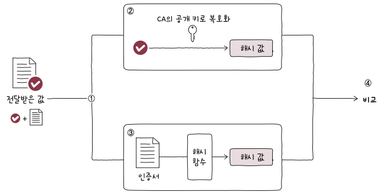

# 가용성
> 컴퓨터 시스템[^1]이 특정 기능을 실제로 수행할 수 있는 시간의 비율

$가용성 = \frac{업타임}{업타임 + 다운타임}$

- 업타임: 정상적인 사용 시간
- 다운타임: 정상적인 사용이 불가능한 시간

> [!NOTE]
> 
> 안정적인 수준의 가용성은 일반적으로 99.999% 이상을 목표로 한다.[^2]  
> 

가용성을 높이기 위해서는 다운타임을 낮추어야 한다.  
일반적으로 서비스가 다운되는 원인은 다음과 같다.  
- 과도한 트래픽
- 소프트웨어 오류
- 하드웨어 장애
- 보안 공격
- 자연재해

이러한 원인들을 원천적으로 차단하기는 어렵기에 문제 발생을 방지하기 보다 문제가 발생하더라도 계속 기능할 수 있도록 만드는 것이 중요하다.  
그리고 이를 결함 감내(fault tolerance)라고 한다.

# 이중화
> 가용성을 높이기 위한 가장 기본적이고 대표적인 방법. 백업본을 만드는 방식

이중화 대상
- 서버 컴퓨터
- NIC
- 스위치
- DB
- 웹 서버

이외에도 많지만 대부분 단일 장애점(SPOF)[^3] 이라는 공통점이 있다.

> [!NOTE]
> # 이중화 종류
> 
> 액티브/스탠바이
> - 하나의 시스템만 가동
> - 다른 시스템은 백업 용도로 대기
> - 액티브 시스템에 문제가 생겼을 경우 스탠바이 시스템이 자동으로 액티브 시스템을 대체[^4]
> - 하나의 장비를 사용할 때에 비해 성능상 이점은 없음
>   
> 액티브/액티브
> - 두 시스템 모두 가동 상태
> - 부하 분산 가능 (성능상 이점)
> - 한 시스템 다운 시 순간적으로 다른 시스템에 부하 급증

# 로드 밸런싱
> 트래픽의 고른 분배를 위해 사용하는 기술

서버를 다중화 하여도 특정 서버에만 트래픽이 몰리게 된다면 가용성이 떨어질 수 있다.  
따라서 트래픽을 고르게 분산해야 가용성을 높일 수 있다.  
그리고 이를 위해 사용하는 기술이 `로드 밸런싱`이다.

로드 밸런싱 알고리즘
- 라운드 로빈 알고리즘(RR)
- 최소 연결 알고리즘(least connection)
- 이외에도 무작위, 해시, 응답시간을 이용하는 방법 또한 있다.

서버들의 성능이 다른 경우를 고려하여 가중치가 적용된 알고리즘을 사용할 수 도 있다.

# 암호화

## 대칭키 암호화

- 암호화와 복호화에 사용하는 키가 동일하다  
- 안전하게 키를 전달하기 어려움
- 암호화 및 복호화가 빠르다

## 비대칭키 암호화

- 암호화와 복호화에 사용하는 키가 다르다
- 공개 키, 개인 키로 이루어져 있다
- 공개 키는 누구에게나 공개해도 무방하다 (개인키는 공개되면 안됨)
- 암호화 및 복호화에 상대적으로 많은 시간 소요

***  
대칭키와 비대칭키의 장단점을 고려해서  
1. 대칭 키(세션 키) 공유는 비대칭 암호화 알고리즘을 사용
2. 이후의 통신은 대칭키 암호화 알고리즘 사용  
(HTTPS가 이러한 방식으로 동작한다)

# 인증서
> 일반적으로 공개 키 인증서[^5]를 일컫는다

- 공개 키
- 누가 생성하였는지
- 조작되지 않았는지
- 유효 기간 등의 정보를 포함하고 있다.

이러한 인증서는 일반적으로 인증 기관(Certification Authority)에서 발급한다.  
CA가 발급한 인증서에는 `서명값(signature)`가 있어 이를 바탕으로 인증서를 검증한다.

# HTTPS
> HTTP 메시지의 안전한 송수신을 위해 개발된 프로토콜

- TLS(이전 SSL)를 사용한다.

HTTPS 동작 단계
1. TCP 3-way-handshake
2. TLS handshake
	
3. 암호화된 메시지 송수신

# AP (Access Point)
> 무선 통신 기기들을 연결하여 무선 네트워크를 구성하는 장치

> [!NOTE]
> 
> 호스트가 연결 가능한 무선 네트워크가 존재한다는 것을 알기 위해서는  
> AP는 지속적으로 자신의 존재를 알려야 한다.  
> 
> 이를 위해 AP는 비컨 프레임(Beacon Frame)을 브로드캐스트 메시지로 전송한다.  
> 여기에는 SSID, MAC과 같은 정보가 포함되어 있다.
## 서비스 셋 (Service Set)
> 무선 네트워크를 이루는 AP와 여로 장치들의 집합

같은 서비스 셋에 속한 장치들은 같은 무선 네트워크에 속한다고 볼 수 있다.  

서비스 셋을 식별하기 위해 사용하는게 SSID[^7](Service Set Identifier)이다.

## 인프라스트럭처 모드

AP를 경유하여 통신이 이루어지는 무선 네트워크 통신 방식 ←→ Ad Hoc Mode[^6]

- BSS (Basic Service Set)
	- 하나의 AP만으로 구성된 무선 LAN
- ESS (Extended Service Set)
	- 여러 AP로 구성된 무선 LAN

[^1]: 서버가 될 수도 있고, 네트워크 혹은 프로그램도 될 수 있다.  
[^2]: 이 때문에 ‘파이브 나인스' 라고도 불린다.  
[^3]: Single Point of Failure의 약어. 문제가 발생할 경우 시스템 전체가 중단될 수 있는 대상  
[^4]: Failover  
[^5]: 공개 키와 공개 키의 유효성을 입증하기 위한 전자 문서  
[^6]: 호스트 간 1:1 통신하는 모드  
[^7]: 무선 네트워크를 구분짓는 수단이자 무선 네트워크를 지칭하는 고유한 이름. 와이파이 이름  