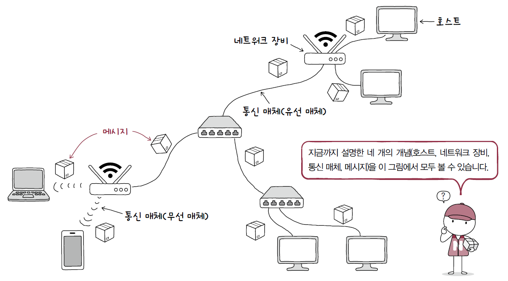
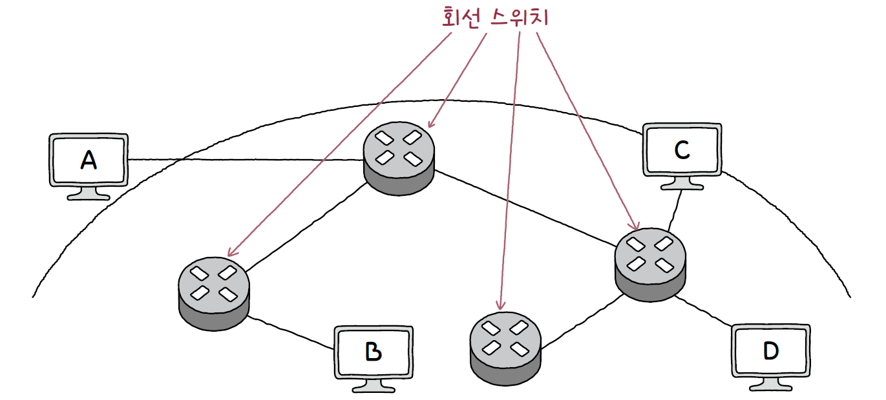
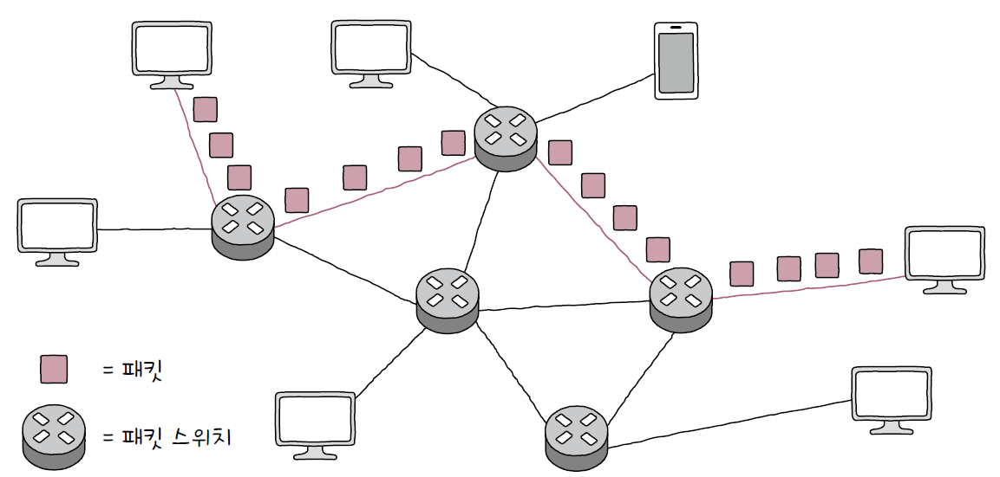
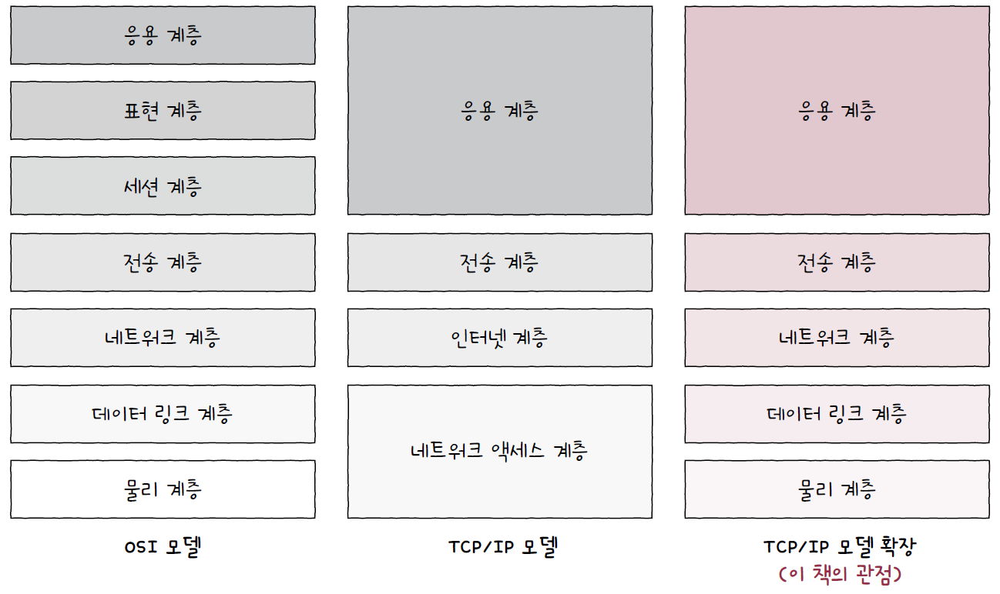

# 01. 컴퓨터 네트워크 시작하기

## 01 - 1. 컴퓨터 네트워크를 알아야 하는 이유

### 컴퓨터 네트워크

- 여러 개의 장치가 마치 그물처럼 서로 연결되어 정보를 주고받을 수 있는 통신망

### 인터넷

- 여러 네트워크를 연결한 “네트워크의 네트워크”

## 01 - 2. 네트워크 거시적으로 살펴보기

### 네트워크의 기본 구조

- 호스트
  - 네트워크의 가장자리에 위치한 노드
  - 네트워크를 통해 흐르는 정보를 최초로 생성 및 송신하고, 최종적으로 수신한다.
  - 호스트의 역할
    - `서버` : 서비스(파일, 웹, 메일 등)를 제공하는 호스트
    - `클라이언트` : 서비스를 요청하고, 서버의 응답을 받는 호스트
- 네트워크 장비
  - 네트워크 가장자리에 위치하지 않은 노드, 호스트 간 주고받을 정보가 중간에 거치는 노드
  - 호스특 간 주고받는 정보가 원하는 수신지까지 안정적이고 안전하게 전송한다.
  - `이더넷 허브`, `스위치`, `라우터`, `공유기` 등
- 통신 매체
  - 각 노드를 연결하는 간선
  - `유선 매체`, `무선 매체`
- 메시지
  - 통신 매체로 연결된 노드가 주고받는 정보

> 네트워크는 가장자리 노드인 호스트, 중간 노드인 네트워크 장비, 노드들을 연결하는 간선인 통신 매체, 노드들이 주고받는 정보인 메시지로 구성된다.

### 범위에 따른 네트워크 분류

- LAN(Local Area Network)
  - 가까운 지역을 연결한 근거리 통신망
  - 가정, 기업, 학교 등의 한정된 공간에서의 네트워크
- WAN(Wide Area Network)
  - 먼 지역을 연결하는 광역 통신망
  - 다른 LAN에 속한 호스트와 메시지를 주고받을 때 WAN이 필요
  - 인터넷을 사용하기 위해 접속하는 WAN은 ISP(Internet Service Provider)라는 인터넷 서비스 업체가 구축, 관리한다.

### 메시지 교환 방식에 따른 네트워크 분류

- 회선 교환 방식
  - 메시지 전송로인 `회선`을 설정하고 이를 통해 메시지를 주고받는 방식
  - 호스트들이 메시지를 주고받기 전 두 호스트를 연결한 후, 연결된 경로로 메시지를 주고받는다.
  - `회선 스위치`를 통해 호스트 간의 회선을 적절하게 설정하고, 일대일 전송로를 확보한다.
    
  - 장점 : 주어진 시간 동안 전송되는 정보의 양이 비교적 일정하다.
  - 단점 : 가능한 모든 회선에 끊임없이 메시지가 흐르고 있어야 이용 효율이 높아진다.
- 패킷 교환 방식
  - 회선 교환 방식의 문제점을 해결한 방식
  - 메시지를 `패킷`이라는 작은 단위로 쪼개어 전송한다.
  - 메시지를 송수신하는 두 호스트가 하나의 전송 경로를 점유하지 않아 네트워크 이용 효율이 상대적으로 높다.
  - 회선 교환 방식과 달리 정해진 경로만으로 메시지를 송수신하지 않는다.
  - `패킷 스위치`를 통해 패킷이 수신지까지 올바르게 도달할 수 있도록 최적의 경로를 결정하거나 패킷의 송수신지를 식별한다.
    - 대표적인 패킷 스위치 네트워크 장비 : `라우터`, `스위치`
  - 패킷의 구성요소
    - `페이로드` : 전송하고자 하는 데이터
    - `헤더` : 송수신지를 특정하는 정보인 주소 등의 부가 정보
    - `트레일러` : 부가 정보
      

### 주소와 송수신지 유형에 따른 전송 방식

- `유니캐스트`
  - 하나의 수신지에 메시지를 전송하는 방식
  - 송신지와 수신지가 일대일로 메시지를 주고받는 경우
- `브로드캐스트`
  - 자신을 제외한 네트워크상의 모든 호스트(`브로드캐스트 도메인`)에게 전송하는 방식

## 01 - 3. 네트워크 미시적으로 살펴보기

### 프로토콜

- 노드 간에 정보를 올바르게 주고받기 위해 합의된 규칙이나 방법
- 서로 다른 통신 장치들이 정보를 주고받으려면 프로토콜이 통해야 함
- IP, TCP, UDP, HTTP 등

### 네트워크 참조 모델(네트워크 계층 모델)

- 통신이 일어나는 각 과정을 계층으로 나눈 구조
- 통신 과정을 계층으로 나눈 이유
  - 네트워크 구성과 설계 용이
  - 네트워크 문제 진단과 해결 용이
- OSI 모델
  - 네트워크를 이론적으로 기술하고 이해할 때 사용
  1. 물리 계층
     - 1과 0으로 표현되는 비트 신호를 주고받음
     - 통신 매체를 통한 송수신
  2. 데이터 링크 계층
     - 네트워크 내의 주변 장치 간의 통신
     - 물리 계층을 통해 주고받는 정보에 오류가 없는지 확인
     - 전송 과정의 충돌 문제 해결
  3. 네트워크 계층
     - 메시지를 다른 네트워크의 수신지까지 전달
     - 네트워크 간의 통신
  4. 전송 계층
     - 신뢰성, 안정성 있는 전송을 할 때 필요
     - 패킷의 흐름 제어, 전송 오류 점검
     - 포트를 통해 실행중인 응용 프로그램 식별
  5. 세션 계층
     - 세션의 연결 상태를 생성, 유지하고 종료되었을 때 끊어줌
     - `세션` : 통신을 주고받는 호스트의 응용 프로그램 간 연결 상태
  6. 표현 계층
     - 사람이 이해할 수 있는 언어를 컴퓨터가 이해할 수 있는 코드로 변환, 압축, 암호화
  7. 응용 계층
     - 사용자가 이용할 응용 프로그램에 다양한 네트워크 서비스 제공
     - 타 계층에 비해 응용 계층에 속한 프로토콜이 많음
- TCP/IP 모델
  - 이론보다는 구현에 중점을 둔 네트워크 참조 모델
  1. 네트워크 액세스 계층
     - OSI 모델의 데이터 링크 계층과 유사
     - 컴퓨터를 물리적으로 네트워크에 연결하여 기기 간의 전송이 가능하도록 함
  2. 인터넷 계층
     - OSI 모델의 네트워크 계층과 유사
     - 네트워크 주소를 기반으로 데이터를 전송
  3. 전송 계층
     - OSI 모델의 전송 계층과 유사
     - IP와 애플리케이션을 중개하여 데이터를 확실하게 전달
  4. 응용 계층
     - OSI 모델의 세션, 표현, 응용 계층을 합친 것과 유사
     - 애플리케이션에 맞춰 통신

### 캡슐화와 역캡슐화

- 캡슐화
  - 송신 과정에서 아래 계층은 바로 위의 계층으로부터 받은 패킷에 헤더 및 트레일러를 추가한다. 이 과정을 `캡슐화(encapsulation)`라고 한다
- 역캡슐화
  - 수신 과정에서는 캡슐화 과정에서 붙였던 헤더 및 트레일러를 각 계층에서 확인한 뒤 제거한다. 이 과정을 `역캡슐화(decapsulation)`라고 한다.

### PDU

- 각 계층에서 송수신되는 메시지의 단위
- 상위 계층에서 전달받은 데이터에 현재 계층의 프로토콜 헤더 및 트레일러를 추가하면 현재 계층의 PDU가 된다.
- PDU는 전송 계층 이하의 메시지를 구분하기 위해 사용
- OSI 모델의 각 계층에서의 PDU
  | OSI 계층 | PDU |
  | ---------------- | -------------------- |
  | 응용 계층 | 데이터 |
  | 표현 계층 | 데이터 |
  | 세션 계층 | 데이터 |
  | 전송 계층 | 세그먼트, 데이터그램 |
  | 네트워크 계층 | 패킷 |
  | 데이터 링크 계층 | 프레임 |
  | 물리 계층 | 비트 |

### 트래픽과 네트워크 성능 지표

- 트래픽 : 네트워크 내의 정보량
- 과부하 : 특정 노드에 트래픽이 몰려 특정 시간동안 처리해야 할 정보가 많을 때 발생 가능
- 네트워크 성능 지표
  - 처리율
    - 단위 시간당 네트워크를 통해 실제로 전송되는 정보량
    - 실시간성이 강조된 지표
  - 대역폭
    - 단위 시간 동안 통신 매체를 통해 송수신할 수 있는 최대 정보량
    - 높은 대역폭 : 많은 정보를 송수신할 능력이 있음
  - 패킷 손실
    - 송수신되는 패킷이 손실된 상황
    - 높은 트래픽으로 인해 노드가 순간적으로 처리해야 할 패킷이 너무 많아지거나, 네트워크에 예기치 못한 장애가 발생해서 패킷을 처리하지 못할 때 발생 가능
