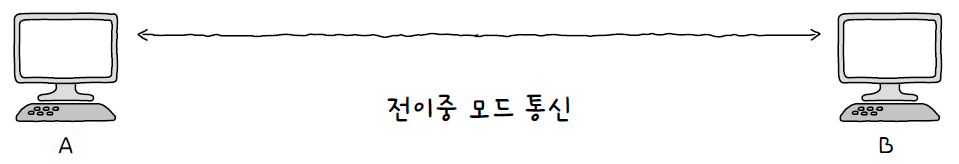

# 02. 물리 계층과 데이터 링크 계층

## 02 - 1. 이더넷

### 이더넷 표준

- 이더넷 : 현대 유선 LAN 환경에서 가장 대중적으로 사용되는 기술
- 유선 LAN 환경을 구축했다면 대부분 물리 계층에서는 이더넷 규격 케이블을 사용했을 것이고, 데이터 링크 계층에서 주고받는 프레임은 이더넷 프레임의 형식을 따를 것이다.
- IEEE 802.3 : 이더넷 관련 다양한 표준들의 모음

### 이더넷 프레임

- 이더넷 네트워크에서 주고받는 프레임
- 이더넷 프레임은 상위 계층으로부터 받아들인 정보에 헤더와 트레일러를 추가하는 캡슐화 과정을 통해 만들어진다.
- 수신지 입장에서는 프레임의 헤더와 트레일러를 제거한 뒤 상위 계층으로 올려보내는 역캡슐화 과정을 거친다.

- 이더넷 프레임 헤더 구성요소
  - 프리앰블
    - 이더넷 프레임의 시작을 알리는 8바이트(64비트) 크기의 정보
    - 첫 7바이트는 10101010 값을 가지고, 마지막 바이트는 10101011 값을 가진다.
    - 송수신지 간의 동기화를 위해 사용되는 정보
  - 수신지 MAC 주소와 송신지 MAC 주소
    - **MAC 주소**는 “물리적 주소”라고도 불리며, 데이터 링크 계층의 핵심이다.
    - MAC 주소는 네트워크 인터페이스마다 부여되는 6바이트(48비트) 길이의 주소로, LAN 내의 수신지와 송신지를 특정할 수 있다.
    - NIC(Network Interface Controller)라는 장치가 네트워크 인터페이스 역할을 하며, MAC 주소는 일반적으로 고유하고 변경되지 않는 주소로써 네트워크 인터페이스마다 부여된다.
  - 타입/길이
    - 필드에 명시된 크기가 1500 이하일 경우 프레임의 크기(길이)
    - 1536 이상일 경우 타입을 나타내는 데 사용
    - `타입` : 이더넷 프레임이 “어떤 정보를 캡슐화했는지”를 나타내는 정보. `이더타입`이라고도 부른다. 대표적으로 상위 계층에서 사용된 프로토콜의 이름이 명시된다.
  - 데이터
    - 상위 계층에서 전달받거나 상위 계층으로 전달해야 할 내용
    - 최대 1500바이트, 최소 46바이트
      - 46바이트 이하의 데이터라면 크기를 맞추기 위해 `패딩`이라는 정보가 내부에 채워진다. 보통 46바이트 이상이 될 때까지 0으로 채워진다.
  - FCS(Frame Check Sequence)
    - 수신한 이더넷 프레임에 오류가 있는지 확인하기 위한 필드
    - CRC(Cyclic Redundancy Check) : 순환 중복 검사라는 오류 검출용 값이 들어간다.
    - 송신지는 프리앰블을 제외한 나머지 필드 값들을 바탕으로 CRC 값을 계산한 후, 이 값을 FCS 필드에 명시
    - 수신지는 수신한 프레임에서 프리앰블과 FCS 필드를 제외한 나머지 필드 값들을 바탕으로 CRC 값을 계산하고, FCS 필드 값과 비교한다. 비교 값이 일치하지 않으면 해당 프레임을 폐기한다.
      

## 02 - 2. NIC와 케이블

### NIC(Network Interface Controller)

- 호스트와 유무선 통신 매체를 연결하고, MAC 주소가 부여되는 네트워크 장비
- 케이블 : NIC에 연결되는 물리 계층의 유선 통신 매체
  - 트위스티드 페어 케이블
    - 구리 선으로 전기 신호를 주고받음
    - 케이블 본체와 케이블의 연결부인 커넥터로 이루어짐
    - 노이즈에 민감
  - 광섬유 케이블
    - 빛(광신호)을 이용해 정보를 주고받음
    - 빠른 속도, 먼 거리 전송, 노이즈 간섭 적음
- NIC의 역할
  - 통신 매체에 흐르는 신호를 호스트가 이해하는 프레임으로 변환하거나, 반대로 호스트가 이해하는 프레임을 통신 매체에 흐르는 신호로 변환
  - 호스트가 네트워크를 통해 송수신하는 정보는 NIC를 거치고, NIC는 네트워크와의 연결점을 담당한다는 점에서 네트워크 인터페이스 역할을 수행한다고도 한다.

## 02 - 3. 허브

### 주소 개념이 없는 물리 계층

- 물리 계층에는 주소 개념이 없다.
  - 호스트와 통신 매체 간의 연결과 통신 매체상의 송수신만이 이루어짐
- 데이터 링크 계층에는 주소 개념이 있다.
  - MAC 주소가 여기에 속한다.
  - 데이터 링크 계층이나 그 이상 계층의 장비들은 송수신지를 특정할 수 있고, 주소를 바탕으로 송수신되는 정보에 대한 조작과 판단을 할 수 있다.

### 허브

- 여러 대의 호스트를 연결하는 장치
- `리피터 허브`라고 부르기도 하고, 이더넷 네트워크의 허브는 `이더넷 허브`라고도 부른다
- 커넥터를 연결할 수 잇는 지점을 `포트`라고 한다.
- 허브의 특징
  1. 전달받은 신호를 다른 모든 포트로 그대로 다시 내보낸다.
     - 물리 계층에 속하는 허브는 신호를 전달받으면 조작이나 판단을 하지 않고 송신지를 제외한 모든 포트에 내보낸다.
     - 허브를 통해 신호를 전달받은 호스트는 데이터 링크 계층에서 패킷의 MAC 주소를 확인하고 자신과 관련 없는 주소는 폐기한다.
  2. 반이중 모드로 통신한다.
     - 반이중 모드 : 1차선 도로처럼 송수신을 번갈아가며 하는 통신 방식, 동시에 송수신이 불가능
     - 전이중 모드 : 2차선 도로와 같이 송수신을 동시에 양방향으로 할 수 있음

- 콜리전 도메인
  - 동시에 허브에 신호를 송신하면 `충돌(콜리전, collision)`이 발생한다.
  - 허브에 호스트가 많이 연결되어 있을수록 충돌 발생 가능성이 높다.
  - 충돌이 발생할 수 있는 영역을 `콜리전 도메인`이라고 한다.
  - 허브에 연결된 모든 호스트는 같은 콜리전 도메인에 속한다.
  - 허브의 넓은 콜리전 도메인으로 인한 충돌 문제를 해결하기 위해 CSMA/CD 프로토콜을 사용하거나 스위치 장비를 사용해야 한다.

### CSMA/CD

- 허브에서 충돌이 발생하는 근본적인 이유는 허브가 반이중 모드로 통신하기 때문
- CSMA/CD(Carrier Sense Multiple Access with Collision Detection)
  - 반이중 이더넷 네트워크에서 충돌을 방지하는 대표적인 프로토콜
  1. `CS`는 `Carrier Sense`, `캐리어 감지`를 의미한다.
     - 반이중 이더넷 네트워크에서는 현재 통신 매체의 사용 가능 여부를 검사하는 `캐리어 감지`를 한다.
  2. `MA`는 `Multiple Access`, `다중 접근`을 의미한다.
     - 복수의 호스트가 네트워크에 접근하려는 상황
     - 이때 충돌이 발생한다.
  3. `CD`는 `Collision Detection`, `충돌 검출`을 의미한다.
     - 충돌을 감지하면 전송이 중단되고, 충돌을 검출한 호스트는 다른 이들에게 충돌이 발생했음을 알리고자 `잼 신호(Jam signal)`을 보낸다.
     - 임의의 시간동안 기다린 후 다시 전송한다.

## 02 - 4. 스위치

### 스위치

- 데이터 링크 계층의 네트워크 장비
- 허브와 달리 MAC 주소를 학습해 특정 MAC 주소를 가진 호스트에만 프레임을 전달할 수 있고, 전이중 모드의 통신을 지원한다.
- 스위치를 이용하면 포트별로 콜리전 도메인이 나뉘고, 전이중 모드로 통신하므로 CSMA/CD 프로토콜이 필요하지 않다.
- 스위치의 특징
  - MAC 주소 학습 : 특정 포트와 해당 포트에 연결된 호스트의 MAC 주소와의 관계를 기억한다.
  - MAC 주소 테이블 : 스위치의 포트와 연결된 호스트의 MAC 주소 연관 관계를 나타내는 정보

### MAC 주소 학습

- A → C 로 프레임을 전송하는 상황
- 호스트 A, B, C, D는 각각 포트 1, 2, 3, 4번에 연결되어 있음

1. 플러딩

   - 스위치는 처음에 어떤 포트에 어떤 MAC 주소를 가진 호스트가 연결되어 있는지 학습하지 않았다.
   - 스위치의 MAC 주소 학습은 프레임 내 “송신지 MAC 주소” 필드를 바탕으로 이루어진다.
   - 스위치가 처음 호스트 A에서 프레임을 수신하면, 프레임 내 “송신지 MAC 주소” 정보를 바탕으로 호스트 A의 MAC 주소와 연결된 포트를 MAC 주소 테이블에 저장한다.
   - 이 상황에서 스위치는 마치 허브처럼 송신지 포트를 제외한 모든 포트로 프레임을 전송하고, 이러한 스위치의 동작을 `플러딩`이라고 한다.
   - 호스트 B, C, D는 프레임을 전달받고, 자신과 관련 없는 프레임을 전송받은 B, D는 이를 폐기한다.

   

   

2. 포워딩과 필터링

   - 이제 스위치는 호스트 A와 C의 MAC 주소와 연결된 포트를 알고 있으므로 두 호스트가 프레임을 주고받을 때는 다른 포트로 프레임을 내보낼 필요가 없다.
   - 전달받은 프레임을 어디로 내보내고 어디로 내보내지 않을지 결정하는 기능을 `필터링`이라고 한다.
   - 프레임이 전송될 포트에 실제로 프레임을 내보내는 것을 `포워딩`이라고 한다.

   

3. 에이징
   - MAC 주소 테이블에 등록된 특정 포트에서 일정 시간 동안 프레임을 전송받지 못했다면 해당 항목은 삭제되고, 이를 `에이징`이라고 한다.

### VLAN(Virtual LAN)

- 한 대의 스위치로 가상의 LAN을 만드는 방법
- 허브와 스위치는 송신지 포트를 제외한 모든 포트로 신호를 보내고, 네트워크상에 불필요한 트래픽이 늘어난다.
- VLAN을 구성하면 한 대의 물리적 스위치라 해도 여러 대의 스위치가 있는 것 처럼 논리적인 단위로 LAN을 구획할 수 있다.
- 포트 기반 VLAN
  - 스위치의 포트가 VLAN을 결정하는 방식
  - 사전에 특정 포트에 VLAN을 할당하고, 해당 포트에 호스트를 연결함으로써 VLAN에 포함시킬 수 있다.
  - 한 대의 스위치만으로 포트 기반 VLAN을 나누면 포트 수가 부족한 문제가 생길 수 있기 때문에 스위치 간의 통신을 위한 특별한 포트인 `트렁크 포트`에 VLAN 스위치를 서로 연결하여 `VLAN 트렁킹`을 사용할 수 있다.
    
- MAC 기반 VLAN
  - 사전에 설정된 MAC 주소에 따라 VLAN을 결정하는 방식
  - 포트가 VLAN을 결정하는 것이 아닌, 송수신하는 프레임 속 MAC 주소가 호스트가 속할 VLAN을 결정하는 방식
