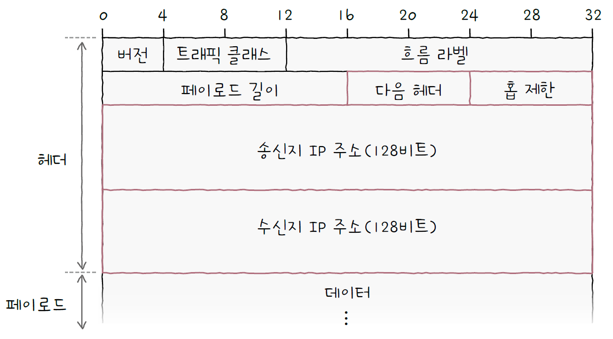

# 03. 네트워크 계층

## 03 - 1. LAN을 넘어서는 네트워크 계층

### 데이터 링크 계층의 한계

1. 물리 계층과 데이터 링크 계층만으로는 다른 네트워크까지의 도달 경로를 파악하기 어렵다.
   - 통신을 빠르게 주고받으려면 패킷이 최적의 경로로 이동해야 한다.
   - 패킷이 이동할 최적의 경로를 결정하는 것을 `라우팅`이라고 하고, 이를 수행하는 대표적인 장비로는 `라우터`가 있다.
   - 물리 계층과 데이터 링크 계층의 장비로는 `라우팅`을 수행할 수 없지만, 네트워크 계층의 장비로는 가능하다.
2. MAC 주소만으로는 모든 네트워크에 속한 호스트의 위치를 특정하기 어렵다.
   - 모든 호스트가 모든 네트워크에 속한 모든 호스트의 MAC 주소를 서로 알고 있기는 어렵다. 따라서 MAC 주소만으로는 모든 호스트를 특정하기 어렵다.
   - 네트워크에서는 `MAC 주소(수신인 역할)`와 `IP 주소(수신지 역할)`를 함께 사용하고, 기본적으로 IP 주소를 우선으로 활용한다.
   - MAC 주소를 물리 주소라고 부르는 것처럼 IP 주소는 `논리 주소`라고도 부른다.
   - MAC 주소는 일반적으로 NIC마다 할당되는 고정된 주소이지만, IP 주소는 호스트에 직접 할당이 가능하다.
   - `DHCP`라는 특정 프로토콜을 통해 자동으로 할당받거나 사용자가 직접 할당할 수 있고, 한 호스트가 복수의 IP 주소를 가질 수 있다.

### 인터넷 프로토콜(IP)

- 네트워크 계층의 가장 핵심적인 프로토콜
- 종류
  - IPv4
  - IPv6
- IP 주소 형태
  - IP 주소는 0~255 범위 안에 있는 4개의 10진수로 표기한다.
- IP의 기능
  - IP 주소 지정
    - IP 주소를 바탕으로 송수신 대상을 지정하는 것
  - IP 단편화
    - 전송하고자 하는 패킷의 크기가 MTU라는 최대 전송 단위보다 클 경우, 이를 MTU 크기 이하의 복수의 패킷으로 나누는 것
  - `MTU`
    - 한 번에 전송 가능한 IP 패킷의 최대 크기
    - IP 패킷의 헤더도 MTU 크기에 포함된다.
    - 일반적인 MTU의 크기는 1500바이트이며, MTU 크기 이하로 나누어진 패킷은 수신지에 도착하면 다시 재조합된다.
      
- IPv4
  - IPv4 패킷은 프레임의 페이로드로 데이터 필드에 명시된다.
  1. 식별자
     - 패킷에 할당된 번호
     - 메시지 전송 과정에서 쪼개져서 전송되었다면 수신지에서 재조합
     - 이때 어떤 메시지에서부터 쪼개졌는지 인식하기 위해 식별자 사용
  2. 플래그
     - 3개의 비트로 구성된 필드
     - 1번 비트 : 항상 0으로 예약된 비트, 사용하지 않음
     - 2번 비트 : `DF(Don’t Fragment)`, 0이라면 IP 단편화가 가능하고, 1이라면 IP 단편화를 수행하지 않는다.
     - 3번 비트 : `MF(More Fragment)`, 0이라면 이 패킷이 마지막 패킷, 1이라면 쪼개진 패킷이 아직 더 있다는 것을 의미
  3. 단편화 오프셋
     - 패킷이 단편화되기 전 패킷의 초기 데이터에서 몇 번째로 떨어진 패킷인지를 나타냄
     - 단편화되어 전송되는 패킷들은 수신지에 순서대로 도착하지 않을 수 있다.
     - 수신지가 패킷을 순서대로 재조합하기 위해 단편화 오프셋이 활용된다.
  4. TTL(Time To Live)
     - 패킷의 수명
     - 패킷이 호스트 또는 라우터에 한 번 전달되는 것을 `홉(hop)`이라고 한다.
     - 패킷이 하나의 라우터를 거칠 때(홉) 마다 TTL이 1씩 감소하며, TTL 값이 0으로 떨어진 패킷은 폐기한다.
     - TTL 필드의 존재 이유는 무의미한 패킷이 네트워크상에 지속적으로 남아있는 것을 방지하기 위함이다.
  5. 프로토콜
     - IP 패킷의 프로토콜은 상위 계층의 프로토콜이 무엇인지를 나타내는 필드이다.
     - ex) 전송계층의 대표적인 프로토콜인 TCP는 6번, UDP는 17번
  6. 송신지 IP 주소와 수신지 IP 주소
     - 송수신지의 IPv4 주소
       
       
- IPv6
  - IPv4 주소는 4바이트, 0~255 범위의 4개의 10진수로 표기되는 주소
  - 이론적으로 할당 가능한 IPv4 주소는 약 43억개이기 때문에 주소의 총량이 쉽게 고갈될 수 있고, 이 때문에 IPv6가 등장했다.
  - IPv6 주소는 16바이트(128비트)로 주소를 표현할 수 있고, 콜론(:)으로 구분된 8개 그룹의 16진수로 표기된다.
    - `2001:0230:abcd:ffff:0000:0000:ffff:1111`
  - IPv4 헤더 길이는 가변적이지만, IPv6 기본 헤더는 40바이트로 고정적이다.
  1. 다음 헤더
     - 상위 계층의 프로토콜을 가리키거나 확장 헤더를 가리킨다.
     - IPv4에 비해 간소화된 `기본 헤더`에 추가적인 헤더 정보가 필요할 경우 `확장 헤더`라는 추가 헤더를 가질 수 있다.
       
  2. 홉 제한
     - IPv4 패킷의 TTL 필드와 비슷하게 패킷의 수명을 나타내는 필드
  3. 송신지 IP 주소와 수신지 IP 주소
     

### ARP

- Address Resolution Protocol
- 상대 호스트의 IP 주소는 알지만, MAC 주소는 알지 못하는 상황에 사용하는 프로토콜
- IP 주소를 통해 MAC 주소를 알아내는 프로토콜
- 동일 네트워크 내에 있는 송수신 대상의 IP 주소를 통해 MAC 주소를 알아낼 수 있다.
- ARP의 동작 과정
  - 호스트 A와 B가 모두 동일한 네트워크에 속한 상태에서 A가 B에게 패킷을 보내는 상황
  - A는 B의 IP 주소를 알고 있지만, MAC 주소는 모르는 상황
  1. ARP 요청
     - A는 네트워크 내의 모든 호스트에게 브로드캐스트 메시지(`ARP 요청`)를 보낸다.
     - ARP 요청은 “저 10.0.0.2와 통신하고 싶은데, 이 분의 MAC 주소가 무엇인가요?”라고 소리치는 것과 같다.
       
  2. ARP 응답
     - 네트워크 내의 모든 호스트가 ARP 요청 메시지를 수신하지만, B를 제외한 나머지 호스트는 자신의 IP 주소가 아니므로 무시한다.
     - B는 자신의 MAC 주소를 담은 메시지를 A에게 전송한다. 이 유니캐스트 메시지는 `ARP 응답`이라는 ARP 패킷이다. B의 MAC 주소가 포함된 메시지를 수신한 A는 B의 MAC 주소를 알게 된다.
       
  3. ARP 테이블 갱신
     - ARP를 활용할 수 있는 모든 호스트는 ARP 테이블이라는 정보를 유지한다.
     - ARP 테이블은 IP 주소와 그에 맞는 MAC 주소 테이블을 대응하는 표
     - ARP 요청과 응답을 통해 B의 MAC 주소를 알게 되면 호스트 B의 IP 주소와 MAC 주소의 연관 관계를 ARP 테이블에 추가한다.
       
- 통신하고자 하는 호스트 A와 B가 서로 다른 네트워크에 속한 경우
  - 호스트 A가 라우터 A의 MAC 주소를 모른다면 ARP 요청 - ARP 응답을 통해 라우터 A의 MAC 주소를 얻어오고, 이를 향해 패킷을 전송한다.
  - 라우터 A 가 라우터 B의 MAC 주소를 모른다면 같은 방법으로 라우터 B의 MAC 주소를 얻어온다.
  - 라우터 B가 호스트 B의 MAC 주소를 모른다면 같은 방법으로 호스트 B의 MAC 주소를 얻어온다.
    

## 03 - 2. IP 주소

### 네트워크 주소와 호스트 주소

- 네트워크 주소(네트워크 ID, 네트워크 식별자)
  - 호스트가 속한 특정 네트워크를 식별
- 호스트 주소(호스트 ID, 호스트 식별자)
  - 네트워크 내에서 특정 호스트를 식별
- 호스트 주소 공간을 크게 할당하면 호스트가 할당되지 않은 다수의 IP 주소가 낭비될 수 있다.
- 반대로, 호스트 주소 공간을 작게 할당하면 호스트가 사용할 IP 주소가 부족해질 수 있다.
- 이를 해결하기 위해 IP 주소의 `클래스`라는 개념이 생겼다.

### 클래스풀 주소 체계

- 클래스
  - 네트워크 크기에 따라 IP 주소를 분류하는 기준
  - 필요한 호스트 IP 개수에 따라 네트워크 크기를 가변적으로 조정해 네트워크 주소와 호스트 주소를 구획할 수 있다.
  - 클래스를 기반으로 IP 주소를 관리하는 주소 체계를 `클래스풀 주소 체계`라고 한다.
    

### 클래스리스 주소 체계

- `클래스풀 주소 체계`는 클래스별 네트워크의 크기가 고정되어 있기 때문에 다수의 IP 주소가 낭비될 가능성이 크다.
- `클래스리스 주소 체계`는 `클래스풀 주소 체계`보다 유동적이고 정교하게 네트워크를 구획할 수 있다.
- 클래스에 구애받지 않고 네트워크의 영역을 나누어 호스트에게 IP 주소 공간을 할당하는 방식
- 서브넷 마스크
  - 클래스리스 주소 체계에서 네트워크와 호스트를 구분 짓는 수단
  - IP 주소상에서 네트워크 주소는 1, 호스트 주소는 0으로 표기한 `비트열`
  - 서브넷 마스크를 이용해 클래스를 원하는 크기로 더 잘게 쪼개어 사용하는 것을 `서브네팅`이라고 한다.
- 서브네팅 : 비트 AND 연산
  - 서브넷 마스크를 이용해 네트워크 주소와 호스트 주소를 구분 짓는 방법은 IP 주소와 서브넷 마스크를 비트 AND 연산하면 된다.
- 서브넷 마스크 표기
  - 서브넷 마스크를 `255.255.255.0`, `255.255.255.252`처럼 10진수로 직접 표기하는 방법
  - `CIDR(Classless Inter-Domain Routing notation) 표기법` : `IP 주소/서브넷 마스크 상의 1의 개수` 형식으로 표기하는 방법

### 공인 IP 주소와 사설 IP 주소

- 공인 IP 주소
  - 전 세계에서 고유한 IP 주소
  - 인터넷을 이용할 때 사용하는 IP 주소
- 사설 IP 주소와 NAT
  - 사설 네트워크에서 사용하기 위한 IP 주소
  - 사설 IP 주소의 할당 주체는 일반적으로 `라우터`
  - 할당받은 사설 IP 주소는 해당 호스트가 속한 사설 네트워크상에서만 유효하므로, 다른 네트워크 상의 사설 IP 주소와 중복될 수 있다.
  - `NAT` : 사설 IP 주소를 사용하는 호스트가 외부 네트워크와 통신할 때 사용되는 기술

### 정적 IP 주소와 동적 IP 주소

- 정적 할당
  - 호스트에 직접 수작업으로 IP 주소를 부여하는 방식
- 동적 할당과 DHCP
  - IP 주소를 직접 입력하지 않아도 호스트에 IP 주소가 동적으로 할당되는 방식
  - `DHCP(Dynamic Host Configuration Protocol)` : IP 동적 할당에 사용되는 프로토콜
    - DHCP를 통한 IP 주소 할당은 IP 주소를 할당받고자 하는 호스트(클라이언트)와 해당 호스트에게 IP 주소를 제공하는 DHCP 서버간에 메시지를 주고받음으로써 이루어짐
    - DHCP 서버는 클라이언트에게 할당 가능한 IP 주소 목록을 관리하다가 클라이언트가 요청할 때 IP 주소를 할당한다.
    - DHCP로 할당받은 IP 주소는 사용 기간(임대 기간)이 정해져 있다.
    - IP 주소 할당 과정
      1. DHCP Discover
         - 클라이언트 → DHCP 서버
         - 클라이언트는 DHCP Discover 메시지를 통해 DHCP 서버를 찾는다.
         - 클라이언트는 아직 IP 주소를 할당받지 못해 송신지 IP 주소는 0.0.0.0으로 설정
      2. DHCP Offer
         - DHCP 서버 → 클라이언트
         - DHCP Discover 메시지를 받은 뒤 클라이언트에게 DHCP Offer 메시지를 보낸다.
         - 클라이언트에게 할당해 줄 IP 주소, 서브넷 마스크, 임대 기간 등을 포함한다.
      3. DHCP Request
         - 클라이언트 → DHCP 서버
         - 브로드캐스트로 전송
      4. DHCP Acknowledgment(DHCP ACK)
         - DHCP 서버 → 클라이언트
         - 최종 승인
         - 클라이언트는 할당받은 IP 주소를 자신의 IP 주소로 설정한 뒤 임대 기간 동안 IP 주소를 사용한다.
    - 임대 갱신 : IP 주소의 임대 기간이 끝나기 전 임대 기간을 연장
      

## 03 - 3. 라우팅

### 라우터

- `라우터`의 핵심 기능은 패킷이 이동할 최적의 경로를 설정한 뒤 해당 경로로 패킷을 이동시키는 `라우팅`이다.
- `라우터`는 네트워크 계층의 핵심 기능을 담당한다.
- 라우팅 도중 패킷이 호스트와 라우터 간, 혹은 라우터와 라우터 간에 이동하는 하나의 과정을 `홉(hop)`이라고 부른다.
- 패킷은 여러 홉을 거쳐 라우팅될 수 있다.
  

### 라우팅 테이블

- 특정 수신지까지 도달하기 위한 정보를 명시한 테이블
- 명시되는 정보
  - 수신지 IP 주소와 서브넷 마스크
    - 최종적으로 패킷을 전달할 대상
  - 다음 홉(게이트웨이)
    - 최종 수신지까지 가기 위해 다음으로 거쳐야 할 호스트의 IP 주소나 인터페이스
  - 네트워크 인터페이스
    - 패킷을 내보낼 통로
    - 인터페이스(NIC) 이름이 직접적으로 명시되거나 인터페이스에 대응하는 IP 주소가 명시되기도 함
  - 메트릭
    - 해당 경로로 이동하는 데 드는 비용
    - 라우터가 라우팅 테이블에 있는 경로 중 패킷을 내보낼 경로를 선택할 때 메트릭이 낮은 경로를 선호한다.

### 정적 라우팅과 동적 라우팅

- 정적 라우팅
  - 사용자가 수동으로 직접 채워 넣은 라우팅 테이블의 항목을 토대로 라우팅되는 방식
- 동적 라우팅
  - 자동으로 라우팅 테이블 항목을 만들고, 이를 이용하여 라우팅하는 방식
  - 대규모 네트워크를 관리하는 데 편리하고 네트워크 경로상에 문제가 발생했을 때 우회할 수 있게 경로가 자동으로 갱신되기도 함

### 라우팅 프로토콜

- 라우터끼리 자신들의 정보를 교환하며 패킷이 이동할 최적의 경로를 찾기 위한 프로토콜
- `AS(Autonomous System)`
  - 동일한 라우팅 정책으로 운용되는 라우터들의 집단 네트워크
- `IGF(Interior Gateway Protocol)`
  - AS 내부에서 수행
  - `RIP(Routing Information Protocol)`
    - `거리 벡터` 기반의 라우팅 프로토콜
    - 거리(패킷이 경유한 라우터 수, 홉의 수)를 기반으로 최적의 경로를 찾는 라우팅 프로토콜
      
  - `OSPF(Open Shortest Path First)`
    - `링크 상태` 라우팅 프로토콜
    - 라우터들의 연결 관계, 연결 비용 을 비롯한 현재 네트워크의 상태를 그래프의 형태로 `링크 상태 데이터베이스(LSDB)`에 저장하고, 데이터베이스를 기반으로 최적의 경로를 선택한다.
    - OSPF에서는 AS를 `에어리어(area)`라는 단위로 나누고, 구분된 에어리어 내에서만 링크 상태를 공유한다. 에어리어 경계에 있는 `ABR(Area Border Router)`이라는 라우터가 에어리어 간의 연결을 담당한다.
      
- `EGP(Exterior Gateway Protocol)`
  - AS 외부에서 수행
  - `BGP(Border Gateway Protocol)`
    - AS 간의 통신이 가능한 프로토콜
    - `iBGP(internal BGP)`
      - AS 내의 통신을 위한 BGP
    - `eBGP(external BGP)`
      - AS 간의 통신을 위한 BGP
      - BGP 메시지를 주고받을 수 있도록 연결된 BGP 라우터를 `피어(peer)`라고 한다.
      - 다른 AS와의 BGP 연결을 유지하기 위해서는 BGP 라우터끼리 연결되어 피어가 되어야 하고, 이렇게 피어 관계가 되도록 연결되는 과정을 `피어링(peering)`이라고 한다.
        
    - BGP의 속성
      1. `AS-PATH`
      2. `NEXT-HOP`
      3. `LOCAL-PREF`
