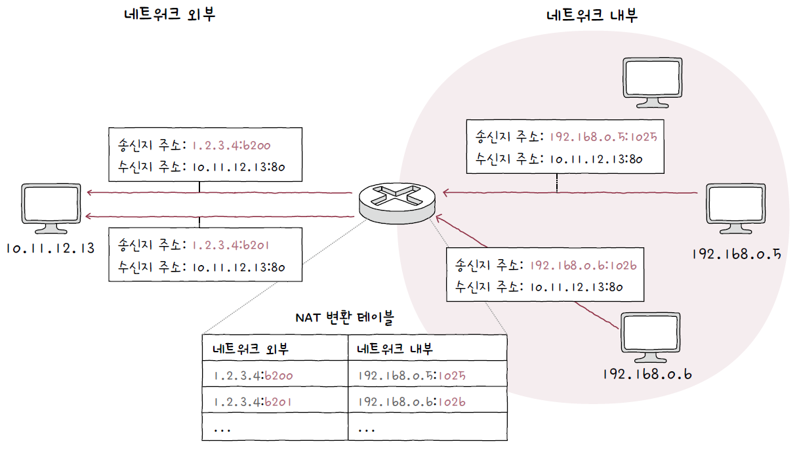
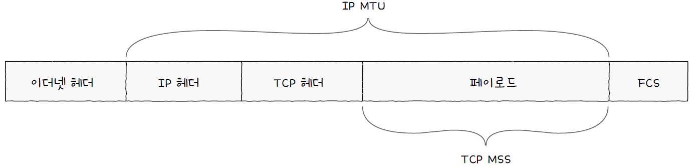
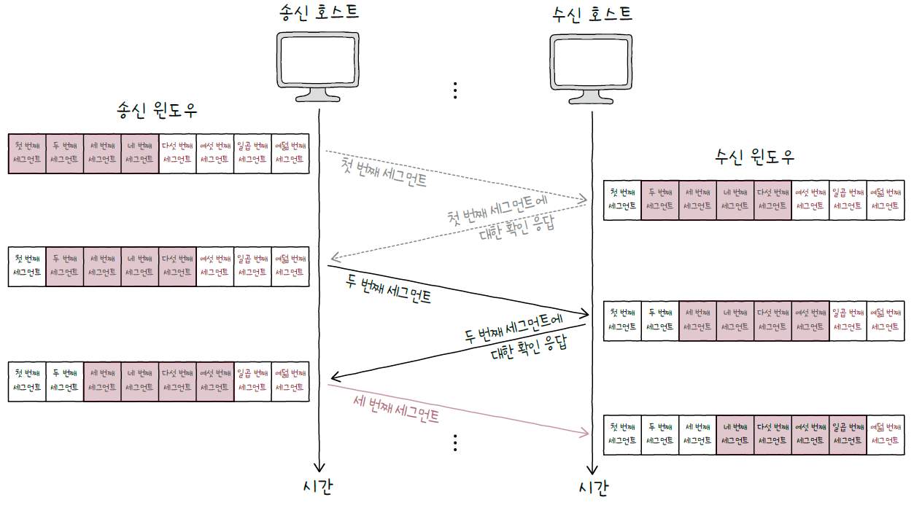

# 04. 전송 계층

## 04 - 1. 전송 계층 개요 : IP의 한계와 포트

### 신뢰할 수 없는 통신과 비연결형 통신

- 네트워크 계층의 핵심 프로토콜인 IP
  - IP 단편화
  - IP 주소 지정
  - 신뢰할 수 없는 통신(최선형 전달)
    - 패킷이 수신지까지 제대로 전송되었다는 보장을 하지 않음
    - 패킷의 데이터 손상, 중복 전송 확인, 재전송, 패킷 순서 보장 하지 않음
  - 비연결형 통신
    - 송수신 호스트 간에 사전 연결 수립 작업을 하지 않음
    - 수신지를 향해 패킷을 보내기만 함

### IP의 한계를 보완하는 전송 계층

1. 전송 계층은 연결형 통신을 가능하게 한다.
   - TCP는 두 호스트가 정보를 주고받기 전 연결을 수립하고, 송수신이 끝나면 연결을 종료할 수 있다.
2. 전송 계층은 신뢰성 있는 통신을 가능하게 한다.
   - TCP는 재전송을 통한 오류 제어, 흐름 제어, 혼잡 제어 등을 통해 신뢰성 있는 통신을 할 수 있다.
   - UDP는 신뢰할 수 없는 통신, 비연결형 통신을 가능하게 하는 전송 프로토콜로, TCP보다 비교적 빠른 전송이 가능하다.

### 응용 계층과의 연결 다리, 포트

- 포트의 정의
  - 패킷이 특정 애플리케이션까지 전달되기 위해서는 특정 애플리케이션을 식별할 수 있는 정보가 포함되어 있어야 한다.
  - 이 정보를 **포트**라고 한다.
- 포트의 분류
  - 전송 계층에서는 포트 번호를 통해 특정 애플리케이션을 식별한다.
  - 포트 번호는 16비트로 표현 가능하며, 사용 가능한 포트는 65536개이다.
    | 포트 종류 | 포트 번호 범위 |
    | -------------- | -------------- |
    | 잘 알려진 포트 | 0 ~ 1023 |
    | 등록된 포트 | 1024 ~ 49151 |
    | 동적 포트 | 49152 ~ 65536 |
  - 잘 알려진 포트
    | 잘 알려진 포트 번호 | 설명 |
    | ------------------- | ------ |
    | 20, 21 | FTP |
    | 22 | SSH |
    | 23 | TELNET |
    | 53 | DNS |
    | 67, 68 | DHCP |
    | 80 | HTTP |
    | 443 | HTTPS |
  - 등록된 포트
    | 등록된 포트 번호 | 설명 |
    | ---------------- | --------------------------------- |
    | 1194 | OpenVPN |
    | 1433 | Microsoft SQL Server 데이터베이스 |
    | 3306 | MySQL 데이터베이스 |
    | 6379 | Redis |
    | 8080 | HTTP 대체 |
  - 동적 포트(사설 포트, 임시 포트) : 49152 ~ 65536번 포트
- IP 주소와 포트 번호에 대한 정보가 함께 주어지면 특정 호스트에서 실행 중인 특정 애플리케이션 프로세스를 식별할 수 있다.

### 포트 기반 NAT

- NAT란 IP 주소를 변환하는 기술이며, 주로 네트워크 내부에서 사용되는 사설 IP 주소와 네트워크 외부에서 사용되는 공인 IP 주소를 변환하는 데 사용된다.
- NAT 변환 테이블
  - NAT는 사설 IP 주소 하나당 공인 IP 주소 하나가 대응된다. 이 방식만으로는 많은 사설 IP 주소를 변환하기에는 무리가 있다.
  - 오늘날 NAT 기술은 포트를 사용하여 다수의 사설 IP 주소를 그보다 적은 수의 공인 IP 주소로 변환한다.
    
- NAPT(Network Address Port Translation)
  - 포트를 활용해 하나의 공인 IP 주소를 여러 사설 IP 주소가 공유할 수 있도록 하는 NAT의 일종이다.
  - NAT 테이블에 변환할 IP 주소 쌍과 더불어 포트 번호를 함께 기록하고 변환한다.
    

### 포트 포워딩

- 네트워크 내 특정 호스트에 IP 주소와 포트 번호를 미리 할당하고, 해당 IP 주소:포트 번호로써 해당 호스트에게 패킷을 전달하는 기능
- 네트워크 내부의 서버를 외부에서 접속할 수 있도록 접속 정보를 공개하기 위해 자주 사용된다.
  - 내부의 여러 호스트가 공인 IP 주소를 공유하는 상황에서, 네트워크 외부에서 내부로 통신을 시작하는 상황을 가정할 때
  - 외부의 호스트가 내부의 특정 호스트에게 패킷을 전달하고 싶어도 네트워크 내에서는 사설 IP 주소들을 사용하고 있고, 여러 호스트가 하나의 공인 IP 주소를 공유하고 있다.
  - 이 때 포트포워딩을 사용해 특정 IP 주소와 포트 번호 쌍을 특정 호스트에게 할당한 뒤, 외부에서 통신을 시작할 호스트에게 해당 접속 정보(IP 주소:포트 번호 쌍)를 알려주면 외부 호스트는 이 접속 정보로 통신을 시작할 수 있다.

### ICMP

- Internet Control Message Protocol
- 신뢰할 수 없는 전송 특성과 비연결형 전송 특성을 보완하기 위한 프로토콜
- IP 패킷의 전송 과정에 대한 피드백 메시지(ICMP 메시지)를 얻기 위해 사용한다.
- ICMP 메시지의 종류
  - 전송 과정에서 발생한 문제 상황에 대한 오류 보고
  - 네트워크에 대한 진단 정보(네트워크상의 정보 제공)

## 04 - 2. TCP와 UDP

- TCP(Transmission Control Protocol)
  - 신뢰할 수 있는 통신을 위한 연결형 프로토콜
- UDP(User Datagram Protocol)
  - 신뢰성은 떨어지지만 비교적 빠른 통신이 가능한 비연결형 프로토콜

### TCP 통신 단계와 세그먼트 구조

- TCP 통신은 크게 세 단계로 나눌 수 있다.
  
- TCP는 통신 전에 연결을 수립하고, 통신이 끝나면 연결을 종료한다.
- 데이터 송수신 과정에서 재전송을 통한 오류 제어, 흐름 제어, 혼잡 제어 등의 기능을 제공한다.
- MSS(Maximum Segment Size)
  - TCP로 전송할 수 있는 최대 페이로드 크기
  - MTU와 달리 크기를 고려할 때 TCP 헤더 크기는 제외한다.
    
- TCP 세그먼트 구조
  - **송신지 포트, 수신지 포트** : 송신지 또는 수신지 애플리케이션을 식별하는 포트 번호 명시
  - **순서 번호** : 송수신되는 세그먼트의 올바른 순서를 보장하기 위해 세그먼트 데이터의 첫 바이트에 부여되는 번호
  - **확인 응답 번호** : 상대 호스트가 보낸 세그먼트에 대한 응답, 다음으로 수신하기를 기대하는 순서 번호 명시
  - **제어 비트(플래그 비트)** : 현재 세그먼트에 대한 부가 정보
  - **윈도우** : 수신 윈도우의 크기(한 번에 수신하고자 하는 데이터의 양)명시
    
- 제어 비트
  - ACK : 세그먼트의 승인을 나타내기 위한 비트
  - SYN : 연결을 수립하기 위한 비트
  - FIN : 연결을 종료하기 위한 비트
- 순서 번호와 확인 응답 번호
  - TCP의 신뢰성을 보장하기 위해 사용되는 필드
  - 순서 번호
    - 세그먼트의 올바른 송수신 순서를 보장하기 위한 번호
    - 세그먼트 데이터의 첫 바이트에 부여
    - 초기 순서 번호 : 처음 통신을 위해 연결을 수립한, SYN 플래그가 1로 설정된 세그먼트의 순서 번호는 무작위 값이 되는데, 이를 초기 순서 번호라고 한다.
      
  - 확인 응답 번호
    - 상대 호스트가 보낸 세그먼트에 대한 응답
    - 다음으로 받기를 희망하는 순서 번호
      

### TCP 연결 수립과 종료

- 연결 수립 : 3-way handshake
  - 세 개의 단계로 이루어진 TCP의 연결 수립 과정
  - 액티브 오픈(active open) : 처음 연결을 시작하는 호스트의 연결 수립 과정, 주로 클라이언트에 의해 수행(아래 그림에서 호스트 A의 동작)
  - 패시브 오픈(passive open) : 요청을 받고 나서 요청에 따라 연결을 수립하는 과정, 주로 서버에 의해 수행(아래 그림에서 호스트 B의 동작)
    
- 연결 종료 : 4-way handshake
  - 데이터 송수신 후 연결을 종료하는 과정
  - 액티브 클로즈(active close) : 먼저 연결을 종료하려는 호스트에 의해 수행(아래 그림의 A)
  - 패시브 클로즈(passive close) : 연결 종료 요청을 받아들이는 호스트에 의해 수행(아래 그림의 B)
    
    

### TCP 상태

- 상태 : 현재 어떤 통신 과정에 있는지를 나타내는 정보
- TCP는 상태를 유지하고 활용한다는 점에서 **Stateful Protocol** 이라고도 부른다.
- 연결이 수립되지 않은 상태
  - `CLOSED` : 아무런 연결이 없는 상태
  - `LISTEN` : 연결 대기 상태, 일반적으로 서버로서 동작하는 패시브 오픈 호스트는 `LISTEN` 상태를 유지하고, 액티브 오픈 호스트가 SYN 세그먼트를 보내면 `3-way handshake` 가 시작된다.
- 연결 수립 상태
  - `SYN-SENT` : 액티브 오픈 호스트가 SYN 세그먼트를 보낸 뒤 그에 대한 응답인 SYN + ACK 세그먼트를 기다리는 상태. 연결 요청을 보낸 뒤 대기하는 상태
  - `SYN-RECIEVED` : 패시브 오픈 호스트가 SYN + ACK 세그먼트를 보낸 뒤 그에 대한 ACK 세그먼트를 기다리는 상태
  - `ESTABLISHED` : 연결이 확립되었음을 나타내는 상태, 데이터 송수신을 할 수 있는 상태. `3-way handshake` 과정에서 두 호스트가 마지막 ACK 세그먼트를 주고받으면 `ESTABLISHED` 상태가 된다.
    
- 연결 종료 상태
  - `FIN-WAIT-1` : 일반적인 TCP 연결 종료의 첫 단계. FIN 세그먼트로서 연결 종료 요청을 보낸 액티브 클로즈 호스트의 상태
  - `CLOSE-WAIT` : 종료 요청인 FIN 세그먼트를 받은 패시브 클로즈 호스트가 그에 대한 응답으로 ACK 세그먼트를 보낸 후 대기하는 상태
  - `FIN-WAIT-2` : `FIN-WAIT-1` 상태에서 ACK 세그먼트를 받으면 `FIN-WAIT-2` 상태가 된다. 상대 호스트의 FIN 세그먼트를 기다리는 상태
  - `LAST-ACK` : `CLOSE-WAIT` 상태에서 FIN 세그먼트를 전송한 뒤 이에 대한 ACK 세그먼트를 기다리는 상태
  - `TIME-WAIT` : 액티브 클로즈 호스트가 FIN 세그먼트를 수신한 뒤, 이에 대한 ACK 세그먼트를 전송한 뒤 접어드는 상태. 패시브 클로즈 호스트가 마지막 ACK 세그먼트를 수신하면 `CLOSED` 상태로 전이하는 반면, `TIME-WAIT` 상태에 접어든 액티브 클로즈 호스트는 일정 시간을 기다린 뒤 `CLOSED` 상태로 전이.
  - `CLOSING` : 동시에 연결을 종료하려 할 때 전이되는 상태. 양쪽 모두가 연결 종료를 요청(FIN 세그먼트를 보내고, 각자 그에 대한 ACK 세그먼트를 전송)하고, 서로의 종료 응답을 기다리는 경우(아직 자신의 FIN 세그먼트에 대한 ACK 세그먼트를 받지 못한 경우) `CLOSING` 상태로 접어든다.
    

### TCP 요약

### UDP 데이터그램 구조

- UDP는 TCP와 달리 비연결형 통신을 수행하는 신뢰할 수 없는 프로토콜이다.
- 연결 수립 및 해제, 재전송을 통한 오류 제어, 혼잡 제어, 흐름 제어 등을 수행하지 않는다.
- TCP처럼 상태를 유지, 활용하지 않아 **Stateless Protocol** 의 일종이라고도 한다.
- UDP 데이터그램 구조
  - 송신지 포트와 수신지 포트 : 송수신지의 포트 번호
  - 길이 : 헤더를 포함한 UDP 데이터그램의 바이트
  - 체크섬 : 데이터그램 전송 과정에서 오류가 발생했는지 검사하기 위한 필드. 수신지는 이 필드의 값을 토대로 데이터그램의 정보가 훼손되었는지 판단하고, 문제가 있다고 판단한 데이터는 폐기한다. “수신지까지 잘 도달했는지”를 나타내는 신뢰성과는 관련이 없다.
- TCP에 비해 적은 오버헤드로 패킷을 빠르게 처리할 수 있기 때문에 실시간 스트리밍 서비스, 인터넷 전화 등 실시간성이 강조되는 상황에서 TCP보다 많이 쓰인다.

## 04 - 3. TCP의 오류, 흐름, 혼잡 제어

> TCP는 재전송을 기반으로 다양한 오류를 제어하고, 흐름 제어를 통해 처리할 수 있을 만큼의 데이터만을 주고받으며, 혼잡 제어를 통해 네트워크가 혼잡한 정도에 따라 전송량을 조절한다.

### 오류 제어 : 재전송 기법

- 신뢰성을 보장하기 위해 오류를 제어할 수 있어야 하고, 이를 위해 TCP는 잘못된 세그먼트를 재전송하는 방법을 사용한다.
- 오류 검출과 재전송

  - TCP가 신뢰성을 보장하려면 송신 호스트가 송신한 세그먼트에 문제가 발생했음을 인지할 수 있어야 하고, 오류를 감지하게 되면 해당 세그먼트를 재전송할 수 있어야 한다.
  - TCP가 송신한 세그먼트에 문제가 있음을 감지하는 상황

    1. 중복된 ACK 세그먼트를 수신했을 때

       - 수신 호스트가 받은 세그먼트의 순서 번호 중 일부가 누락되었다면 중복된 ACK 세그먼트를 전송하게 된다.
       - `RTT(Round Trip Time)` : 메시지를 전송한 뒤 그에 대한 답변을 받는 데 까지 걸리는 시간

       

    2. 타임아웃이 발생했을 때

       - TCP 세그먼트를 송신하는 호스트는 모두 재전송 타이머라는 값을 유지한다.
       - 호스트가 세그먼트를 전송할 때마다 재전송 타이머를 시작하게 되는데, 이 타이머의 카운트다운이 끝난 상황을 **타임아웃**이라고 한다.
       - 타임아웃이 발생할 때 까지 ACK 세그먼트를 받지 못하면 세그먼트가 상대 호스트에게 정상적으로 도착하지 않았다고 간주하여 세그먼트를 재전송한다.

       

- ARQ : 재전송 기법
  - ACK와 타임아웃 발생을 토대로 문제를 진단하고, 문제가 생긴 메시지를 재전송함으로써 신뢰성을 확보하는 방식을 **ARQ(Automatic Repeat Request, 자동 재전송 요구)**라고 한다.
  - ARQ의 종류
    - Stop-and-Wait ARQ
      - 제대로 전달했음을 확인하기 전까지 새로운 메시지를 보내지 않는 방식
      - 단순하지만 높은 신뢰성 보장
      - 송신 호스트는 확인 응답을 받기 전까지는 다음 전송을 할 수 있어도 하지 못함
      - 수신 호스트는 많은 데이터를 한 번에 전송받을 수 있어도 한 번에 하나씩 확인 응답을 해야 함
      - 결과적으로 네트워크의 효율이 낮아질 수 있음
    - Go-Back-N ARQ
      - Stop-and-Wait ARQ의 문제를 해결하려면 각 세그먼트에 대한 ACK 세그먼트가 도착하기 전이더라도 여러 세그먼트를 보낼 수 있어야 한다.
      - 이렇게 연속해서 메시지를 전송할 수 있는 기술을 **파이프라이닝**이라고 한다.
      - Go-Back-N ARQ는 파이프라이닝 방식을 활용해 여러 세그먼트를 전송하고, 도중에 잘못 전송된 세그먼트가 발생할 경우 해당 세그먼트부터 전부 다시 전송한다.
      - 순서 번호 n번에 대한 ACK 세그먼트는 “n번만의”확인 응답이 아니라 “n번까지의” 확인 응답이라고 볼 수 있다. 이러한 점에서 Go-Back-N ARQ의 ACK 세그먼트를 **누적 확인 응답**이라고 한다.
        
    - Selective Repeat ARQ
      - 선택적으로 재전송하는 방법
      - 수신 호스트 측에서 제대로 전송받은 각각의 패킷들에 대해 ACK 세그먼트를 보내는 방식
      - 송신 호스트는 올바르게 수신받지 못한 ACK 세그먼트가 있는지 검사하고, 존재한다면 해당 세그먼트를 재전송한다.
      - Selective Repeat ARQ의 ACK 세그먼트는 **개별 확인 응답**이다.
        

### 흐름 제어 : 슬라이딩 윈도우

> 호스트가 한 번에 받아서 처리할 수 있는 세그먼트의 양에는 한계가 있기 때문에 파이프라이닝 기반의 Go-Back-N ARQ와 Selective Repeat ARQ가 정상적으로 동작하려면 반드시 흐름 제어를 고려해야 한다.

- 수신 버퍼 : 수신된 세그먼트가 애플리케이션 프로세스에 의해 읽히기 전에 임시로 저장되는 공간
- 버퍼 오버플로 : 수신 버퍼의 크기보다 많은 데이터를 전송하여 버퍼가 넘치는 문제 상황
- TCP에서는 흐름 제어로 **슬라이딩 윈도우**를 사용한다.
- 수신 호스트는 TCP 헤더(윈도우 필드)를 통해 송신 호스트에게 자신이 받아들이고자 하는 데이터의 양을 알리고, 송신 호스트는 이 정보를 바탕으로 수신 호스트의 처리 속도와 맞춰 균일한 속도로 세그먼트를 전송한다.
  

### 혼잡 제어

- **혼잡** : 많은 트래픽으로 인해 패킷의 처리 속도가 늦어지거나 유실될 수 있는 상황
- 송신 호스트는 네트워크 혼잡도를 판단하고 혼잡한 정도에 맞춰 유동적으로 전송량을 조절하며 전송하는 **혼잡 제어**를 수행한다.
- 혼잡 윈도우 : 혼잡 없이 전송할 수 있을 법한 데이터의 양
- 혼잡 제어 알고리즘을 통해 혼잡 윈도우 크기를 결정한다.
  - AIMD(Additive Increase/Multiplicative Decrease) : 기본적인 혼잡 제어 알고리즘
    - 혼잡이 감지되지 않는다면 혼잡 윈도우를 RTT마다 1씩 선형적으로 증가시킨다
    - 혼잡이 감지되면 혼잡 윈도우를 절반으로 떨어뜨린다.
  - 느린 시작 알고리즘
    - 혼잡 윈도우를 1부터 시작해 문제없이 수신된 ACK 세그먼트 하나당 1씩 증가시키는 방식
    - 혼잡 윈도우를 RTT마다 2배씩 지수적으로 증가시켜 초기 전송 속도를 확보한다.
      
    - 혼잡 윈도우 값이 **느린 시작 임계치** 이상이 되거나, 타임아웃이 발생하거나, 세 번의 중복된 ACK 세그먼트가 발생하여 혼잡이 감지되면 다음 세 가지 방법 중 하나를 선택한다.
      
  - 혼잡 회피 알고리즘
    - RTT마다 혼잡 윈도우를 1MSS(Maximum Segment Size)씩 증가시키는 알고리즘
    - 느린 시작 임계치를 넘은 시점부터는 혼잡이 발생할 우려가 있으니 윈도우 크기를 선형적으로 증가시킨다.
    - 혼잡 회피 도중 타임아웃이 발생하면 혼잡 윈도우 값은 1로, 느린 시작 임계치는 혼잡이 감지된 시점의 혼잡 윈도우 값의 절반으로 초기화한 뒤 다시 느린 시작을 수행한다.
    - 세 번의 중복 ACK 세그먼트가 발생했을 때는 혼잡 윈도우 값과 느린 시작 임계치를 대략 절반으로 떨어뜨린 뒤 빠른 회복 알고리즘을 수행한다.
      
  - 빠른 회복 알고리즘
    - 세 번의 중복된 ACK 세그먼트를 수신하면 빠른 재전송과 더불어 빠른 회복 알고리즘이 수행된다.
    - 세 번의 중복 ACK 세그먼트를 수신했을 때 느린 시작은 건너뛰고 혼잡 회피를 수행하는 알고리즘
    - 빠른 회복 도중 타임아웃이 발생하면 혼잡 윈도우 값은 1로, 느린 시작 임계치는 혼잡이 감지된 시점의 절반으로 떨어뜨린 후 다시 느린 시작을 수행한다.
      
