# 05. 응용 계층

## 05 - 1. DNS와 자원

### 도메인 네임과 네임 서버

- 도메인 네임 : 호스트의 IP 주소와 대응되는 문자열 형태의 호스트 특정 정보. 모든 호스트의 IP 주소를 기억하기 어렵고, 호스트의 IP 주소는 바뀔 수 있기 때문에 IP 주소보다 도메인 네임을 사용한다.
- 네임 서버(DNS 서버) : 도메인 네임과 IP 주소를 관리하는 서버
- 도메인의 분류 : 점(.)을 기준으로 계층적으로 분류
  - 루트 도메인 : `.`
  - 최상위 도메인 : `com`
  - 2단계 도메인 : `example`
  - 3단계 도메인 : `www`
  - 전체 주소 도메인 네임(FQDN) : `www.example.com`
  - 호스트 네임 : FQDN의 첫 번째 부분(`www`)
    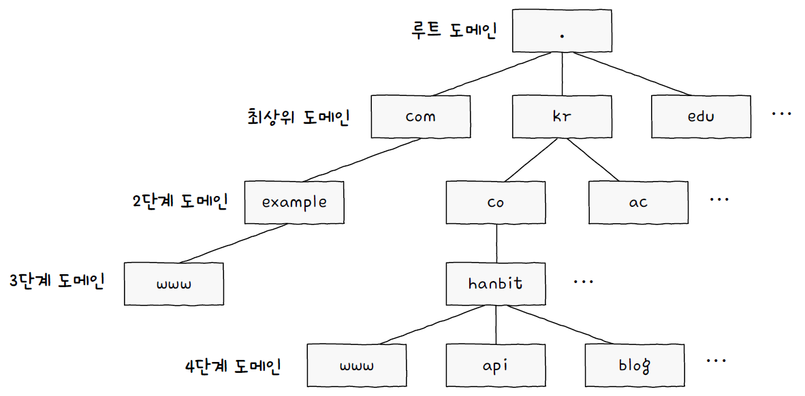
- 도메인 네임 시스템(DNS)
  - 계층적, 분산된 도메인 네임에 대한 관리 체계
  - 호스트가 도메인 네임 시스템을 이용할 수 있도록 하는 애플리케이션 계층 프로토콜

### 계층적 네임 서버

- 도메인 네임 풀이(리졸빙) : IP 주소를 모르는 상태에서 도메인 네임에 대응되는 IP 주소를 알아내는 과정
- 네임 서버의 유형
  - 로컬 네임 서버 : 클라이언트와 맞닿아 있는 네임 서버. 클라이언트가 도메인 네임을 통해 IP 주소를 알아내고자 할 때 가장 먼저 찾게 되는 네임 서버
  - 루트 네임 서버 : 루트 도메인 네임을 관장하는 네임 서버. 로컬 네임 서버가 대응되는 IP 주소를 모르면 루트 네임 서버에 질의한다.
  - TLD(최상위 도메인) 네임 서버 : TLD를 관리하는 네임 서버. 질의에 대해 하위 도메인 네임을 관리하는 서버 주소를 반환할 수 있다.
  - 책임 네임 서버 : 특정 도메인 영역을 관리하는 서버. 자신이 관리하는 도메인 영역의 질의에 대해 곧바로 답할 수 있다. 로컬 네임 서버가 마지막으로 질의하는 네임 서버
    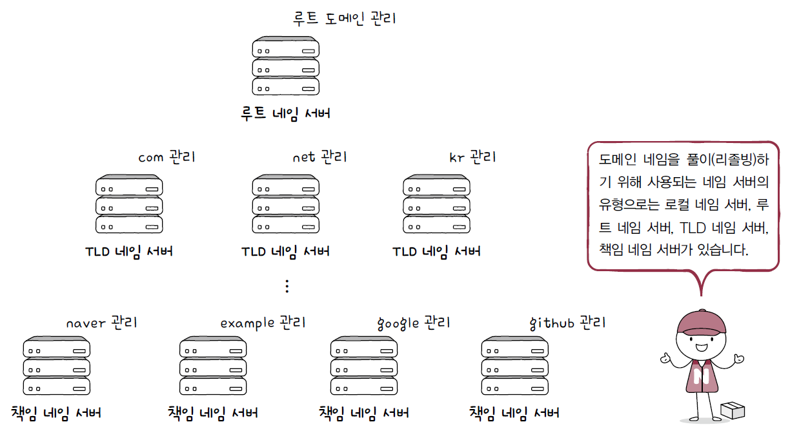
- 리졸빙 과정
  - 재귀적 질의
    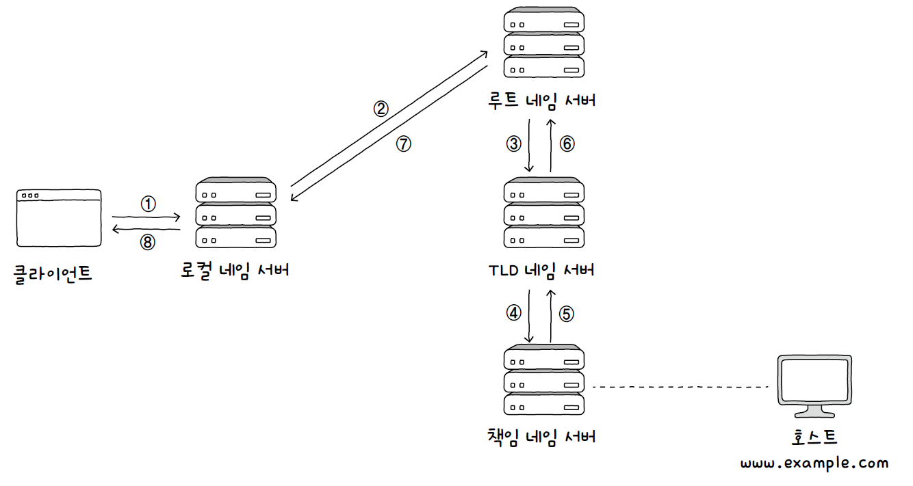
  - 반복적 질의
    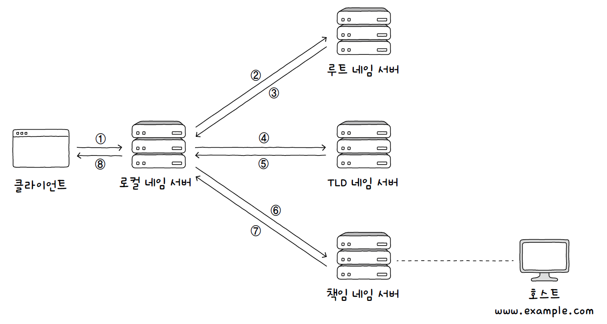
- DNS 캐시
  - 네임 서버들이 기존에 응답받은 결과를 임시로 저장했다가 같은 질의에 다시 활용하는 것
  - 모든 호스트가 도메인 네임을 리졸빙할 때 새로 받아오면 시간이 오래 걸리고 네트워크상의 메시지 수가 지나치게 늘어날 수 있다.

### 자원을 식별하는 URI

- 자원 : 네트워크상의 메시지를 통해 주고받는 대상
- URI(Uniform Resource Identifier) : 자원을 식별할 수 있는 정보
  - URL(Uniform Resource Locator) : 위치를 이용해 자원을 식별
  - URN(Uniform Resource Name) : 이름을 이용해 자원 식별

## 05 - 2. HTTP

### HTTP의 특성

- 요청-응답 기반 프로토콜
  - HTTP는 클라이언트-서버 구조 기반의 요청-응답 프로토콜
- 미디어 독립적 프로토콜
  - 미디어 타입 : HTTP에서 메시지를 주고받는 자원의 종류, MIME 타입(Multipurpose Internet Mail Extensions Type)
    - 타입 : 데이터 유형
    - 서브타입 : 주어진 타입에 대한 세부 유형
  - HTTP는 주고받을 미디어 타입에 특별히 제한을 두지 않고 독립적으로 동작이 가능한 프로토콜
- 스테이트리스 프로토콜
  - HTTP는 상태를 유지하지 않는 스테이스리스 프로토콜
  - HTTP요청을 보낸 클라이언트와 관련된 상태를 기억하지 않고, 클라이언트의 모든 HTTP 요청은 기본적으로 독립적인 요청으로 간주된다.
  - 확장성 : 필요하다면 언제든 서버를 추가할 수 있다.
  - 견고성 : 문제가 생겨도 쉽게 다른 서버로 대체가 가능하다.
- 지속 연결 프로토콜
  - 지속 연결(킵 얼라이브) : 하나의 TCP 연결 상에서 여러 개의 요청-응답을 주고받을 수 있다.
    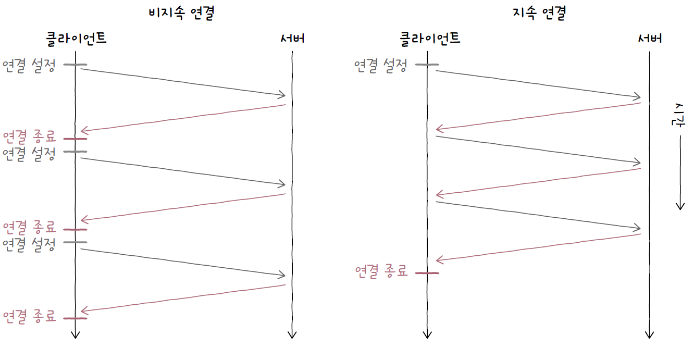

### HTTP 메시지 구조

- 시작 라인
  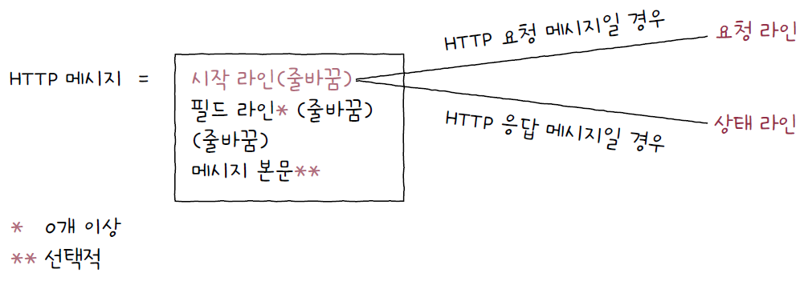
- 요청 라인
  
- 메서드 : 클라이언트가 서버의 자원(요청 대상)에 대해 수행할 작업의 종류
- 요청 대상 : HTTP 요청을 보낼 서버의 자원
- HTTP 버전

### HTTP 메서드

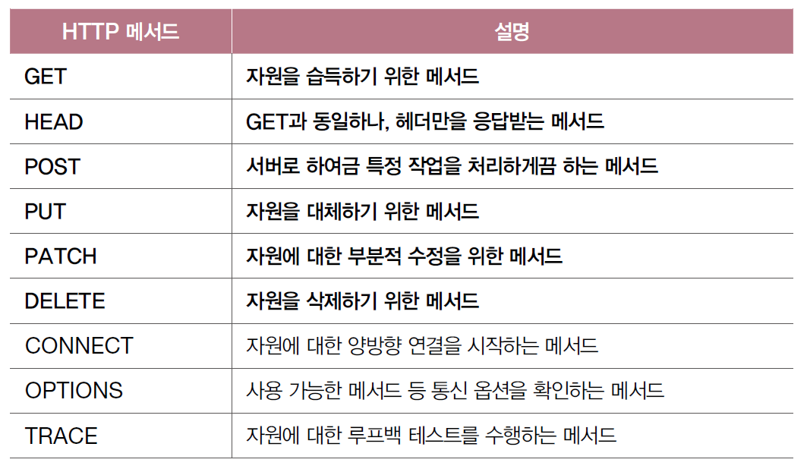

### HTTP 상태 코드

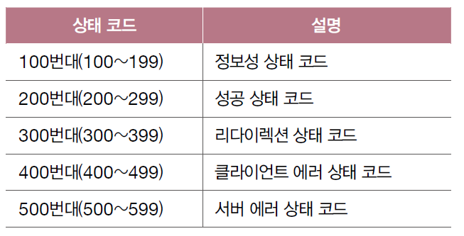

- **200번대** : 성공 상태 코드
  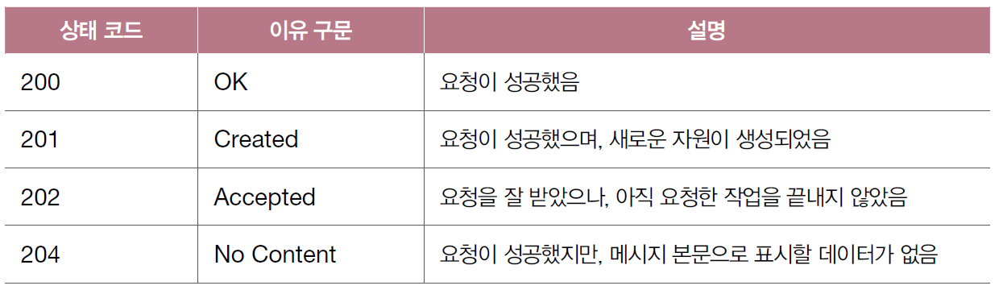
- **300번대** : 리다이렉션 상태 코드
  - 영구적인 리다이렉션 : 자원이 완전히 새로운 곳으로 이동하여 경로가 영구적으로 재지정
    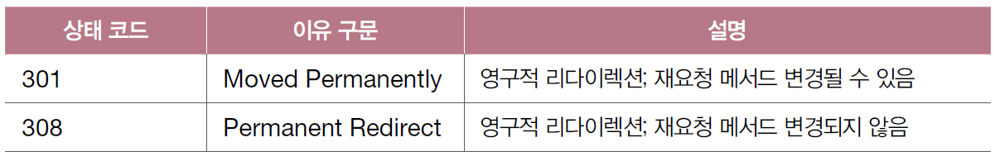
  - 일시적인 리다이렉션 : 자원의 위치가 임시로 변경되었거나 임시로 사용할 URL이 필요한 경우
    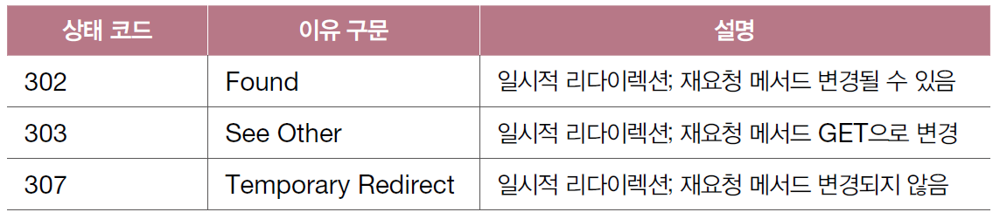
- **400번대** : 클라이언트 에러 상태 코드
  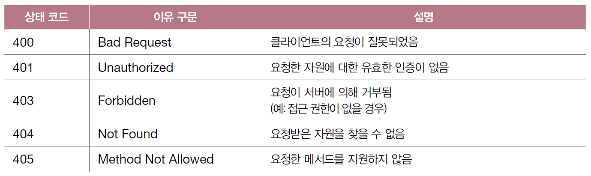
- **500번대** : 서버 에러 상태 코드
  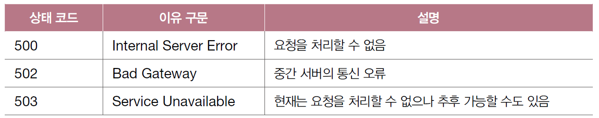

## 05 - 3. HTTP 헤더와 HTTP 기반 기술

### HTTP 헤더

- 요청 시 활용되는 HTTP 헤더
  - Host : 요청을 보낼 호스트를 나타내는 헤더
  - User-Agent : 웹 브라우저와 같이 HTTP 요청을 시작하는 클라이언트 측의 프로그램
  - Referer : 클라이언트가 요청을 보낼 때 머무르고 있던 URL
  - Authorization : 클라이언트의 인증 정보를 담는 헤더
- 응답 시 활용되는 HTTP 헤더
  - Server : 요청을 처리하는 서버 측의 소프트웨어와 관련된 정보
  - Allow : 클라이언트에게 허용된 HTTP 메서드 목록을 알려주기 위해 사용
  - Retry-After : 503 상태 코드(Service Unavailable)와 사용 가능. 자원을 사용할 수 있는 날짜 혹은 시간
  - Location : 자원의 위치를 알려주기 위해 사용. 리다이렉션이 발생했을 때나 새로운 자원이 생성되었을 때 사용
  - WWW-Authenticate : 자원에 접근하기 위한 인증 방식 설명
- 요청과 응답 모두에서 활용되는 HTTP 헤더
  - Date : 메시지가 생성된 날짜와 시각
  - Connection : 클라이언트의 요청과 응답 간의 연결 방식을 설정하는 헤더
  - Content-Length : 본문의 바이트 단위 크기
  - Content-Type, Content-Language, Content-Encoding : 전송하려는 메시지 본문의 표현 방식을 설명. 표현 헤더의 일종

### 캐시

- 불필요한 대역폭 낭비와 응답 지연을 방지하기 위해 **정보의 사본**을 임시로 저장하는 기술
- **개인 전용 캐시** : 웹 브라우저에 저장
- **공용 캐시** : 클라이언트와 서버 사이에 위치한 중간 서버에 저장

### 쿠키

- 서버에서 생성되어 클라이언트에 저장되는 데이터
- 상태를 유지하지 않는 HTTP의 특성을 보완하기 위한 수단
- 서버는 쿠키를 생성하여 클라이언트에게 전송, 클라이언트는 전달받은 쿠키를 저장해 두었다가 추후 동일한 서버에 보내는 요청 메시지에 쿠키를 포함하여 전송한다.
- **세션 인증**
  - 같은 클라이언트가 서버에 여러번 요청을 보낼 때마다 인증 정보를 보내고 번거로운 인증 과정을 거치지 않기 위해 사용
  - 세션 인증의 순서
    1. 클라이언트는 서버에게 (아이디, 비밀번호와 같은) 인증 정보를 전송한다.
    2. 인증 정보가 올바르다면, 서버는 세션 아이디를 생성해 클라이언트에게 전송한다.
    3. 서버는 생성한 세션 아이디를 데이터베이스 등에 저장한다.
    4. 클라이언트는 추후 요청을 보낼 때 쿠키 내에 세션 아이디를 포함하여 전송한다.
    5. 서버는 쿠키 속 세션 아이디와 저장된 세션 아이디를 비교하여 클라이언트를 식별한다.

### 콘텐츠 협상과 표현

- 콘텐츠 협상 : 같은 URI에 대해 가장 적합한 ‘자원의 형태’를 제공하는 메커니즘
- 자원의 표현 : 송수신 가능한 자원의 형태
