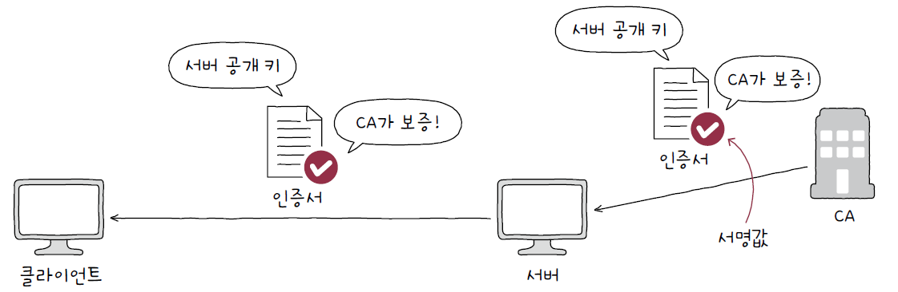
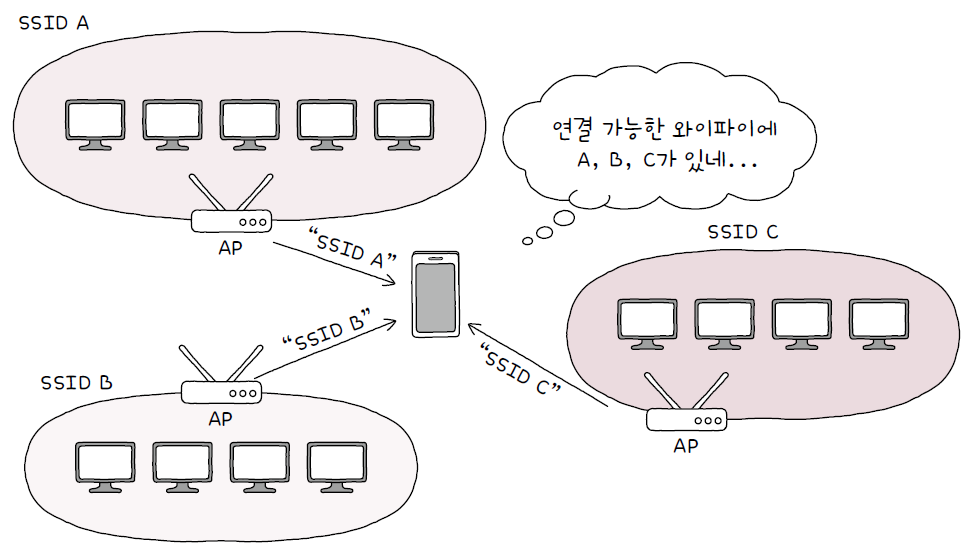

# 07. 네트워크 심화

## 07 - 1. 안정성을 위한 기술

### 가용성

- 안정성의 정도를 나타낸다.
- 컴퓨터 시스템이 특정 기능을 실제로 수행할 수 있는 시간의 비율
  - 컴퓨터 시스템 : 서버, 네트워크, 프로그램 등
- 전체 사용 시간 중 정상적인 사용 시간
  - 업타임 : 정상적인 사용 시간
  - 다운타임 : 정상적인 사용이 불가능한 시간
  - 가용성 = 업타임 / (업타임 + 다운타임)
- 가용성을 높이기 위해서는 다운타임을 낮춰야 한다.
- 결함 감내 : 문제가 발생하더라도 계속 기능할 수 있도록 하는 능력
  - 다운타임을 낮추고 가용성을 높이기 위해서는 결함을 감내할 수 있도록 서비스나 인프라를 설계하는 것이 중요하다.

### 이중화

- 무언가를 이중으로 두는 기술, 백업을 마련하는 방법
- 결함을 감내하여 가용성을 높이기 위한 가장 기본적이고 대표적인 방법
- 서버 컴퓨터, 네트워크 인터페이스(NIC), 스위치와 같은 물리적 장비뿐 아니라 데이터베이스, 웹 서버 프로그램 등도 이중화 할 수 있다.
- 이중화할 수 있는 대상들은 대부분 단일 장애점이다.
  - **단일 장애점(SPOF)** : 문제가 발생할 경우 시스템 전체가 중단될 수 있는 대상
- 이중화 구성의 방식
  - 액티브/스탠바이 : 한 시스템은 가동 상태, 다른 시스템은 백업 용도로 대기 상태
  - 액티브/액티브 : 두 시스템 모두 가동 상태
- 다중화 : 무언가를 여러 개 두는 기술
  - 이중화된 구성에 비해 더욱 안정적인 운영이 가능하다.
- 이중화/다중화의 사례
  - **티밍**(윈도우)과 **본딩**(리눅스) : 여러 개의 네트워크 인터페이스를 이중화/다중화하여 뛰어나고 안정적인 성능을 보유한 하나의 인터페이스처럼 보이게 하는 기술

### 로드 밸런싱

- 트래픽을 고르게 분산하기 위한 기술
  - 트래픽 : 주어진 시점에 특정 노드를 경유한 패킷의 양
- 로드 밸런서 : 로드 밸런싱을 수행하는 장비
  - L4 스위치, L7 스위치
  - 소프트웨어 사용
    - HAProxy, Envoy, Nginx 등
- 로드 밸런서는 이중화나 다중화된 서버와 클라이언트 사이에 위치하여 클라이언트로부터 받은 요청을 각 서버에 균등하게 분배한다.
  
- 로드 밸런싱 알고리즘
  - 라운드 로빈 알고리즘
    - 서버를 돌아가며 부하를 전달
  - 최소 연결 알고리즘
    - 연결이 적은 서버부터 우선적으로 부하를 전달

### 포워드 프록시와 리버스 프록시

- 오리진 서버 : 자원을 생성하고 클라이언트에 권한 있는 응답을 보낼 수 있는 HTTP 서버
- **프록시**
  - **클라이언트가 선택한** 메시지 전달 대리자
  - 캐시 저장, 클라이언트 암호화 및 접근 제한 등의 기능 제공
- **게이트웨이**
  - 네트워크 간의 통신을 가능케 하는 입구 역할을 하는 하드웨어 혹은 소프트웨어
  - 아웃바운드 연결에 대해 **오리진 서버 역할**을 하지만, 수신된 요청을 변환하여 다른 인바운드 서버로 전달하는 중개자 역할

## 07 - 2 - 안전성을 위한 기술

### 암호와 인증서

- 암호화화 복호화
  - 암호화 : 원문 데이터를 알아볼 수 없는 형태로 변경하는 것
  - 복호화 : 암호화된 데이터를 원문 데이터로 되돌리는 과정
- 대칭 키 암호화 방식과 공개 키 암호화 방식
  - 대칭 키 암호화
    - 암호화와 복호화에 동일한 키 사용
    - 키가 유출되면 큰 문제가 발생하는데, 키를 안전하게 전달하기가 어렵다.
      
  - 공개 키 암호화
    - = 비대칭 키 암호화
    - 암호화를 위한 키와 복호화를 위한 키가 다르고, **공개 키**와 **개인 키**로 이루어져 있다.
    - 공개 키는 누구에게나 공개해도 되지만, 개인 키는 유출되면 안된다.
    - 대칭 키 암호화에 비해 시간과 부하가 상대적으로 많이 든다.
      
  - 세션 키
    - 대칭 키를 상대에게 전달할 때 공개 키로 대칭 키를 암호화하고, 개인 키로 암호화된 대칭 키를 복호화한다.
    - 대칭 키를 안전하게 공유하면서 공유한 대칭 키로 빠르게 암호화/복호화를 수행한다.
    - 이 방식으로 활용되는 대칭 키를 **세션 키**라고 한다.
      

### 인증서와 디지털 서명

- 인증서
  - 공개 키 인증서
    - 공개 키와 공개 키의 유효성을 입증하기 위한 문서
    - 인증 기관(CA)이라는 제3의 기관에서 발급하고, 서명 값(signature)을 바탕으로 인증서를 검증할 수 있다.
    - 서명 값은 인증서 내용에 대한 해시 값을 CA의 개인 키로 암호화하는 방식으로 만들어진다.
      
      
    - 디지털 서명 : 개인 키로 암호화된 메시지를 공개 키로 복호화함으로써 신원을 증명하는 절차

### HTTPS : SSL과 TLS

- SSL (Secure Sockets Layer)
- TLS (Transport Layer Security)
  - SSL을 계승한 프로토콜
- SSL과 TLS는 인증과 암호화를 수행하는 프로토콜
- HTTPS
  - HTTP 메시지의 안전한 송수신을 위해 개발된 프로토콜
  - HTTPS의 동작 단계
    1. TCP 쓰리 웨이 핸드셰이크
    2. TLS 핸드셰이크
    3. 암호화된 메시지 송수신

## 07 - 3. 무선 네트워크

### 전파와 주파수

- 전파 : 무선 통신의 기반, 눈에 보이지 않는 전자기파의 일종
- 통신에서 사용되는 전파에는 주파수 대역이 미리 정해져 있다.

### 와이파이와 802.11

- 오늘날 LAN 환경에서의 유선 통신은 IEEE 802.3으로 표준화
- 오늘날 LAN 환경에서의 무선 통신은 IEEE 802.11으로 표준화
  - 대부분 2.4GHz, 5GHz 대역 사용
- **와이파이**
  - IEEE 802.11 표준을 따르는 무선 LAN 기술
  - **와이파이 얼라이언스**라는 비영리단체의 트레이드마크(브랜드) 이름
  - 2.4GHz, 5GHz 주파수 대역은 **채널**이라 불리는 하위 주파수 대역으로 세분화되고, 해당 채널 대역에서 통신이 이루어진다.

### AP와 서비스 셋

- AP(Access Point)
  - 무선 통신 기기들을 연결하여 무선 네트워크를 구성하는 장치
  - AP를 경유하여 통신이 이루어지는 무선 네트워크 통신 방식을 **인프라스트럭쳐 모드**라고 한다.
- 서비스 셋
  - 무선 네트워크를 이루는 AP와 여러 장치들의 집합
  - 서비스 셋 식별자(SSID, Service Set Identifier) : 서비스 셋을 식별하기 위한 수단
- 비컨 프레임
  - AP가 불특정 다수에게 자신을 알리는 브로드캐스트 메시지
  - SSID와 AP의 MAC 주소 등이 포함되어 있다.
    
