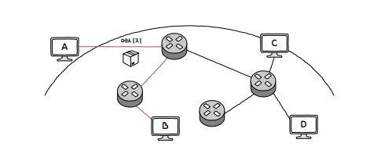
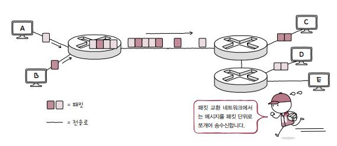
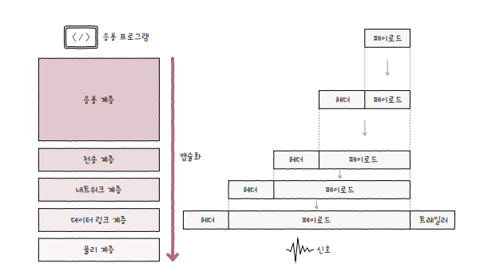
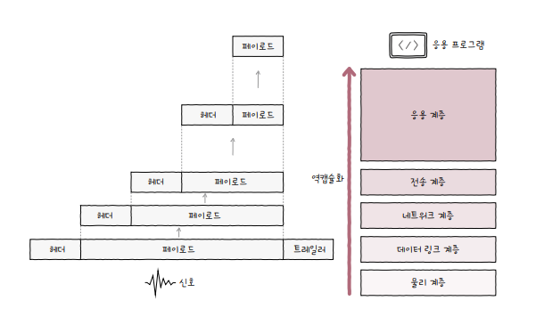
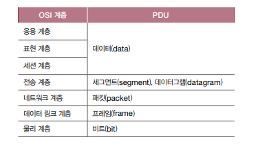

# chapter 1

## 컴퓨터 네트워크

여러개의 장치가 그물처럼 서로 연결되어 주고받을 수 있는 통신망

인터넷 : 네트워크를 연결한 네트워크

## 네트워크 기본 구조

네트워크는 그래프 구조를 가지고 있음

노드 : 장치

간선 : 장치를 연결

메시지 : 노드간 주고받는 정보

호스트 : 가장자리 노드 ( 노트북, 서버, 티비, 스마트폰 등등 )

클라이언트 : 서비스 요청 호스트

서버 : 서비스 제공 호스트

중간노드 : 네트워크 장비 ( 이너뎃, 스위치, 라우터, 공유기 .. )

통신매체 : 장치를 연결하는 간선

- 유선
- 무선

## 메시지 교환 방식에 따른 네트워크 분류

### 회선 교환 방식

미리 메시지 전송로인 회선을 설정하여 메시지를 주고 받는 것

여기에서 A - B 로 가는 것을 선택 ( 빨간색 선 )

그럼 어떻게 설정하냐 ?

회전 스위치를 통해서 전송로를 확보하는 것 !

저기 그림에서 연탄처럼 보이는게 회전 스위치

단점은 회선을 설정하면 설정한 경로에만 메시지가 가는데

나머지 회선은 사용하지 못하니 효율이 떨어진다.

### 패킷 교환 방식

메세지를 패킷이라는 작은 단위로 쪼개어 전송 ! ( 대부분 인터넷은 패킷 교환방식을 사용한다 )

이런식으로 큐에 담아서 전송한다 !

하나의 호스트가 다 점유하지 않기 때문에 효율적이다

### 전송방식

유니케스트

- 하나의 수신자에 메세지를 전송하는 방식 ( 1 : 1 )

브로드 케스트

- 자신을 제외한 네트워크 상의 모든 호스트에게 전송하는 방식

### 네트워크를 계층으로 나누는 이유

1. 네트워크 구성과 설계가 용이
2. 네트워크 문제 진단과 해결이 용이

### OSI

1. 물리 ( 0 / 1 )
2. 데이터 링크
   1. 네트워크 내 주변 장치 간의 정보를 올바르게 주고받기 위한 계층
3. 네트워크
   1. 메세지를 수신자에게 전달하는 계층
   2. 수신지 호스트와 네트워크 식별, 최적 경로 설정
4. 전송
   1. 신뢰성 있고 안전성 있는 전송을 해야 할 때 필요한 계층
   2. 패킷 흐름 제어, 전송 오류 검토
5. 세션
   1. 세션관리를 위한 게층
   2. 네트워크에서 세션은 호스트의 응용 프로그램 간 연결상태를 의미
6. 표현
   1. 코드 변환 계층
   2. 압축, 암호화 같은 작업
7. 응용
   1. 사용자가 이용하는 계층

### TCP / IP

1. 네트워크 엑세스 계층
2. 인터넷 계층
3. 전송계층
4. 응용 계층

### 캡슐화

### 역 캡슐화

그럼 캡슐화는 왜 할까 ?

캡슐화를 하는 이유는

1. 보안
2. 외부에서 변경하는 것을 막음 ( 기능과 서비스 집중 )
3. 헤더와 트레일러를 통해 무결성 보장

등이 있다.

어떻게 보면 자바의 캡슐화와 비슷한 맥락이라고 생각할 수 있다

### PDU

각 계층에서 송수신되는 메세지 단위를 PDU라고 한다

각 계층별 PDU

