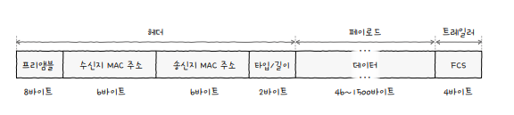
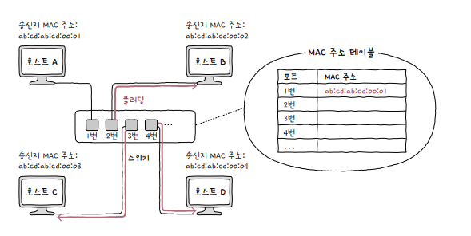
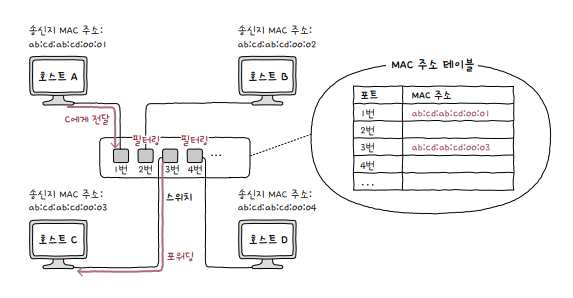
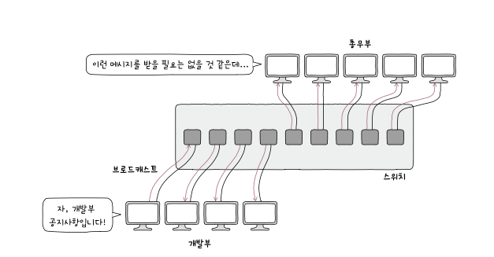
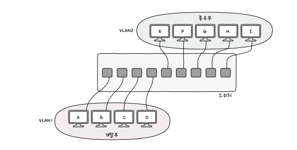
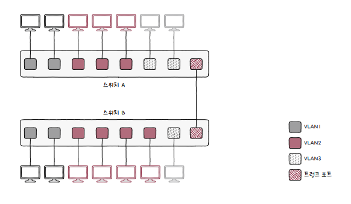

# chapter2 - 물리 계층 / 데이터 링크 계층

## 이더넷

다양한 통신 매체의 규격들과 송수신되는 프레임의 형태, 프레임을 주고받는 방법등이 정의된 네트워크 기술

LAN에서 대중적으로 사용되는 기술이다

물리 계층에서는 이더넷 규격에 맞는 케이블을 사용

데이터 링크 계층에서는 주고받는 프레임은 이더넷 프레임 형식에 따름

캡슐화 과정에서 헤더와 트레일러를 추가 !

프리앰블 : 프레임의 시작을 알리는 8바이트 크기의 정보

mac 주소 : 물리적 주소

타입 / 길이 : 타입과 길이 정보

데이터 : 전달해야하는 내용

FCS : 오류 확인을 위한 필드 ( CRC 값을 통해 오류 검출 )

## NIC 와 케이블

NIC : 호스트와 통신 매체를 연결하고, MAC 주소가 부여되는 네트워크 장비

케이블 :NIC에서 연결되는 물리 계층의 유선 통신 매체

## 허브

허브 : 여러 대의 호스트를 연결하는 장칠

특징

1. 전달받은 신호를 다른 모든 포트로 그대로 다시 내보낸다
2. 반이중 모드로 통신
    1. 반이중 모드 : 단방향 통신 ( 무전기 )
    2. 전이중 모드 : 양방향 통신 가능 ( 휴대폰 )

반이중모드를 사용하기 때문에 충돌이 발생할 수 도 있다

어떻게 해결할까 ?

### CSMA/CD

CS : 현재 네트워크 상에서 전송 중인 것이 있는지를 확인 ( 캐리어 감지 )

MA : 다중 접근

CD : 충돌 검출

충돌이 감지되면 특별한 신호를 보내고, 임의 시간이 지난 후 재전송을 함

허브 보다는 그냥 전달받은 신호 수신지로 보내면 충돌 발생이 적어진다

## 스위치

데이터 링크 계층의 네트워크 장비

MAC 주소를 학습해 MAC 주소를 가진 호스트에만 프레임을 전달할 수 있고, 전이중 방식을 지원

스위치 작동 방식

1. 플러딩 : 송신지 포트를 제외한 모든 포트로 프레임 전송

   
    
3. 포워딩과 필터링 : 전달받은 프레임을 어디로 내보내질 경정하고, 내보는내는 것

    
    
4. 에이징 : 일정시간동안 프레임을 전송받지 못한다면 삭제

## VLAN

한 대의 스위치로 가상의 LAN을 만드는 방법

왜 만들어졌냐

결국 모든 포트에 신호를 보내기 때문에 불필요한 트래픽이 발생

VLAN을 구성하여 논리적 단위로 LAN을 구획할 수 있다.

개발부는 개발부 공지사항만, 총무부는 총무부 공지사항만 받을 수 있다

이렇게하면 포트 수가 부족할 수 있다

이럴 때 사용하는 것이 VLAN 트렁킹이다

VLAN Trunking은 두 대 이상의 VLAN 스위치를 효율적으로 연결하여 확장하는 방법

트렁크 포트를 통해 확장하여 같은 LAN 속하게 네트워크를 구성할 수 있다.
