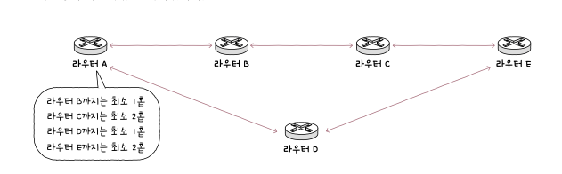

# chapter3 : 네트워크 계층

## 1, 2 계층의 한계

2계층만으로도 멀리 있는 국가에 데이터를 보낼 수 있나 ?

사실 어렵다

대표적으로 두 가지 이유가 있다

1. 경로 파악에 어려움
   1. 만약 먼 곳에 있는 집에 데이터를 보내고 싶은데 경로가 파악이 안되면 ?
   2. 엄어어어어어어어청 오래 걸린다
   3. 그러면 답답해서 못참는다
   4. 그러니깐 최적의 경로가 필요한데
   5. 그건 1,2계층에 있느 장비만으로는 불가능 !
   6. 라우터라는 장비가 필요
   7. 라우터를 통해 라우팅 수행
   8. 그러면 최적의 경로로 빠르게 도달할 수 있다
2. mac 주소로 모든 네트워크에 속하는 호스트 주소 파악의 어려움
   1. mac주소는 나의 개인정보와 같다
   2. 택배로 따지면 이름은 mac, 주소는 ip 이다
   3. 그러니깐 서울에 김서방에게 물건 배달해줘 하는 느낌
   4. 어떻게 찾아
   5. 그러니깐 ip 필요하다

## IP

그냥 쉽게 주소이다

종류는 ipv4, ipv6가 있는데

옛날에는 32비트만으로도 충분히 커버 가능할 거라고 생각했는데

착각이었다

그래서 나온게 ipv6(128bit)

뭐 그렇다

그래도 아직까지는 ipv4를 많이 사용한다

### 기능

ip의 기능은 크게 2가지 IP 주소 지정, IP 단편화가 있다.

주소 지정은 말그대로 주소 지정

ip 단편화는 패킷이 최대 전송 단위보다 크면 ? 바로 나눠서 처리

### IPv4

자세한 내용은 책에서 참고

### ARP

IP 주소를 통해 MAC 주소를 알아내는 프로토콜

동작 과정

1. ARP 요청
2. ARP 응답
3. ARP 테이블 갱신

이건 같은 네트워크 상에서 가능한 건데

그럼 네트워크 위치가 다르면 ?

라우터 MAC 주소를 ARP 테이블에 저장해서 알아낼 수 있다

## IP 주소

크게 네트워크 주소와 , 호스트 주소로 나뉜다

왜 ?

유동적으로 호스트에 IP를 할당하기 위해서 !

많은 호스트에 IP주소 할당

적은 호스트에 IP주소 할당

그러면 주소를 많이 할당할 수 있는게 과연 좋을 까?

주소를 많이 할당할 수 있는데 호스트 수가 적으면 공간낭비

주소를 적게 할당할 수 있는데 호스트 수가 많으면 할당 못하는 주소가 생김

그래서 나온게 클래스

### 클래스

A : 0 ~ 127

B : 128 ~ 191

C : 192 ~ 223

근데 이렇게 나눠도 분명히 낭비되는 공간이 있을 것이다

### 클래스 리스

클래스를 구분하지 않고 네트워크 영역을 나누어서 호스트에게 ip 주소 공간을 할당하는 방법

서브넷 마크스를 이용해서 네트워크와 호스트를 구분짓는다 ( 1 : 네트워크, 0: 호스트 )

서브네팅 : 서브넷 마스크를 이용해서 클래스를 원하는 크기로 더 잘개 쪼개어서 사용하는 것

### 클래스 별 기본 서브넷 마스크

이걸 통해 and 연산하면 네트워크 주소를 구할 수 있다

### 사설, 공인 IP 주소

공인은 고유한 IP 주소

사설은 프라이빗 네트워크에서 사용하기 위한 IP 주소 ( 중복 가능 )

그럼 어떻게 통신 ?

NAT을 사용

IP 주소를 변환하는 기술

## 라우팅

최적 경로 설정 후 , 해당 경로로 패킷을 이동시키는 것

테이블에 최적 경로가 없다면, 디폴트 경로(0.0.0.0/0 모든 IP주소를 의미)로 감

그럼 어떻게 최적의 경로를 찾냐 ?

### 라우팅 프로토콜

AS : 단일한 라우팅 정책 하에 관리되는 라우터들의 집합

AS 내부는 IGP, 외부는 EGP가 있다

### IGP

RIP, OSPF

거리백터냐, 링크 상태를 사용하냐에 차이

RIP는 홉의 개수를 통해 최소홉을 찾아가서 최적의 경로를 구성

OSPF는 연결 상태의 데이터베이스 기반으로 현재 네트워크 구성에 최적의 경로 선택

### EGP

BGP 를 사용, AS간 통신이 가능한 프로토콜

외부 피어를 통해 통신

피어 관계가 되도록 연결되는 과정을 피어링이라고 함
