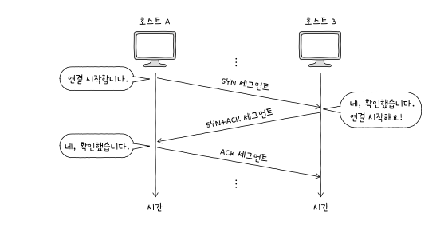

# 전송계층

## 전송 계층 개요: IP의 한계와 포트

3계층에서 IP는 신뢰할 수 없는 통신과 비연결형 통신을 수행한다는 한계가 있음

Best Effort

- 신뢰할 수 없는 통신

  - 무결성 보장 업음
  - 패킷 전송 순서 보장 없음
  - 송신자 인증 없음

- 비 연결성
  - 연결 설정을 안함 그냥

### 포트

패킷이 실행 중인 특정 애플리케이션까지 전달되려면 패킷에 특정 애플리케이션을 식별할 수 있는 정보가 포함되어 있어야 하는데 이러한 정보를 포트라 한다.

포트 번호는 16비트로 표현 가능 ( 0 ~ 65535)

그럼 만약에 IP + PORT 라면 ?

<strong>특정 호스트에서 실행 중인 특정 애플리케이션 프로세스를 식별할 수 있다.

-> 포트는 응용 계층 식별, 연결다리 역할 수행
</strong>

### NAPT

NAT은 IP 주소를 변환하는 기술

-> 근데 일 대 일이야

-> 사설 IP 하나당 공인 IP 하나가 필요한데

-> 사설이 훨씬 많아

-> 사설 IP 주소 여러개를 공인 IP 주소 하나로 변환하자 !

-> 그래서 필요한게 NAPT

어떻게 식별한 건데 ? -> 바로 포트번호로 ~~

```
포트 포워딩 : IP 주소와 포트번호 미리 할당, 해당
IP 주소:포트 번호로써 해당 호스트에게 패킷을 전달하는 기능

여러개의 사설 IP가 공인 IP를 공유할 때, 수신지 주소를 결정하기 어려울 때 사용
```

## TCP 와 UDP

TCP : 신뢰할 수 있는 연결형 통신

UDP : TCP 보다 비교적 빠른 통신이 가능한 비연결형 통신

### TCP 통신단계와 세그먼트 구조

MSS : TCP에서 전송할 수 있는 최대 페이로드 크기

통신 단계


TCP 세그먼트 구조


### 제어비트

기본적으로 8비트로 구성

주요 3개의 제어비트

- ACK : 세그먼트 승인을 나타내기 위한비트
- SYN : 연결을 수립하기 위한 비트
- FIN : 연결을 종료하기 위한 비트

### 순서 번호와 응답 번호

TCP의 신뢰성을 보장하기 위해 사용되는 중요 필드

순서번호 : 세그먼트의 올바른 송수신 순서를 보장하기 위한 번호 (초기 순서 번호 + 송신한 바이트 수)

Ex)


응답 번호 : 순서 번호에 대한 응답

ex) '다음에는 이걸 보내 주세요’, ‘다음으로 제가 받을 순서 번호는 이것입니다’를 나타내는 값

일반적으로 '수신한 순서 번호 + 1'로 설정

### TCP 연결 수립과 종료

3 - way - handshake



### TCP 상태


### UDP 데이터그램 구조

UDP : 비연결형 통신

구조


체크섬 : 전송 과정에서 오류가 발생했는지를 검사하기 위한 필드

-> 잘 도착했는지는 중요한게 아니고, 정보가 훼손되었는지가 중요함

UDP는 보내고 도착여부를 신경쓰지 않음

## TCP의 오류, 흐름, 혼잡 제어

### 오류 검출과 재전송

TCP는 신뢰성을 보장하기위해

1. 오류 검출
2. 재전송

이 필요하다

재전송하는 경우

1. 중복된 ACK 세그먼트 수신
2. 타임아웃

RTT : 메시지를 전송한 뒤 그에 대한 답변을 받는데 까지 걸리는 시간

### ARQ 재전송 기법

종류

1. stop and wait
2. go back n
3. selective repeat

<strong>stop and wait</strong>

재대로 전달했음을 확인하기 전까지는 새로운 메시지를 보내지 않는 방식


문제점 : 네트워크 효율적으로 이용하지 못함

왜 ? -> 재대로된 거 받을때 까지 기다려야 하니깐

<strong>go back n</strong>

연속해서 메시지를 보냄 ( 파이프라이닝 )


사진처럼 보내다가 타임아웃이 발생하면

응답 이후 보냈던 요청을 재전송함

오류난 세그먼트 이후 모든 세그먼트를 재전송해야 한다는 단점이 있음

<strong>selective repeat</strong>

개별 응답 확인

그러니깐 오류난것만 재전송함


### 흐름 제어

흐름제어가 왜 필요하나 ?

호스트가 한 번에 받을 수 있는 세그먼트 양이 제한되어 있으니깐

### 슬라이딩 윈도우

윈도우 크기 정해놓고 세그먼트 받으면 오른쪽으로 이동

### 혼잡 제어

많은 트래픽이 발생하면 ? 느려짐 -> 답답함 -> 화남

그러니깐 제어하자

혼잡 윈도우 : 이정도는 해 줘야지 ? 라느 느낌의 윈도우

혼잡 윈도우 크기

크면 ? 한 번에 보낼 수 있는 세그먼트 수가 많음을 의미

작으면 ? 혼잡한 상황

### 혼잡 제어 알고리즘

#### 느린시작 알고리즘


혼잡 윈도우를 1부터 시작해 수신된 ACK 하나당 1씩 증가하는 방법

따라서 RTT 마다 2배씩 증가한다


혼잡 상황이 발생하면 3가지 방법 중 하난를 택함

#### 혼잡 회피 알고리즘

얘는 혼잡 윈도우 1MSS 씩 선형적으로 증가

#### 빠른 회복 알고리즘

세 번의 중복된 ACK 세그먼트를 수신하면 혼잡 회피를 수행하는 알고리즘

빠른 회복 도중에 타임아웃이 발생하면 윈도우 크기를 1로 변경

### 정리


이 그림을 이해해보자
