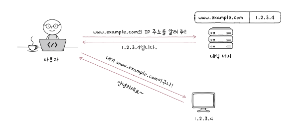
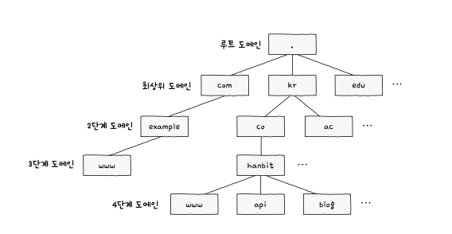
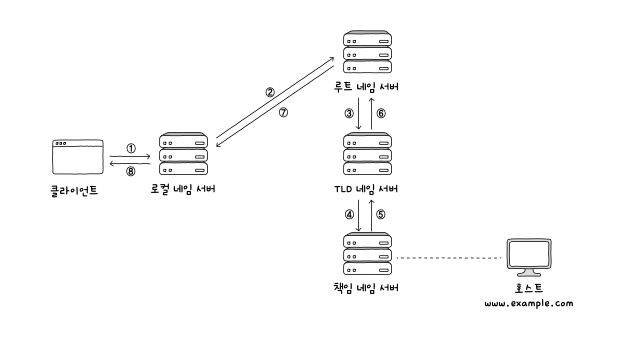
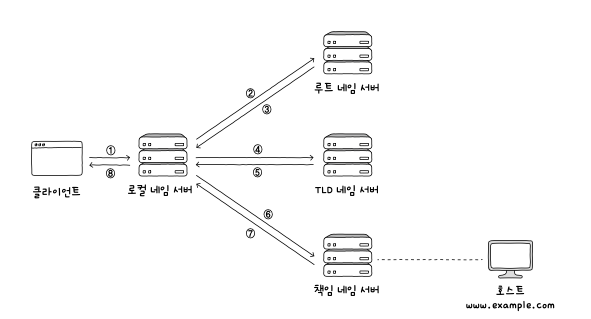
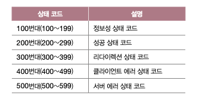
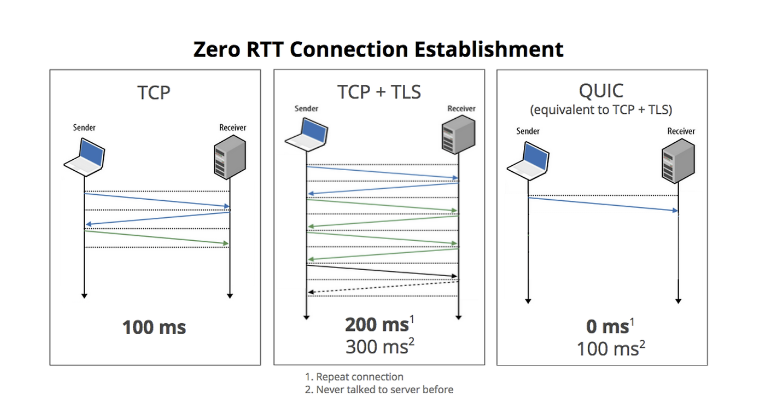

# 응용 계층

## DNS와 자원

도메인 네임 : IP 주소로 호스트를 특정하기 힘드니 이름을 만들자해서 나온 거

DNS 서버 : 이런 도메인 네임을 관리하는 네임 서버

#### 도메인 계층

도메인 네임은 점(.)을 기준으로 계층적으로 분류

일반적으로 3 ~ 5 단계이다.

### 계층적인 네임 서버

로컬 네임 서버 : 클라이언트가 도메인 네임을 통해 IP 주소를 알아내고자 할 때 가장 먼저 찾게 되는 네임 서버

루트 네임 서버 : 질의에 대해 TLD 네임 서버의 IP 주소를 반환할 수 있음

TLD 네임 서버 : TLD의 하위 도메인 네임을 관리하는 네임 서버 주소를 반환할 수 있음

책임 네임 서버 : 특정 도메인 영역을 관리하는 네임 서버, 자신이 관리하는 도메인 영역의 질의에 대해서 다른 네임 서버에 떠넘기지 않고 곧바로 답할 수 있는 네임 서버

#### 재귀적 질의

#### 반복적 질의

## HTTP

http : 응용 계층에서 정보를 주고받는 데 사용되는 프로토콜

특징

1. 요청-응답 기반 프로토콜
2. 미디어 독립적 프로토콜
3. 스테이트리스 프로토콜
4. 지속 연결 프로토콜

메서드는 ssafy에서 잘 배웠죠 ?

예~

### HTTP 상태 코드

상태코드도 대충 이런게 있구나 ~ 알면 될 거 같습니다

### cf

Http/3.0 : 얜 다른 Http 와 달리 UDP 기반으로 동작한다.

정확히 말하면 QUIC 프로토콜을 사용

QUIC 란
쉽게 말해서 Quick UDP 인터넷 연결이다

tcp랑 비교해 보면 ?

1. 전송 속도 향상

출처 : https://musclebear.tistory.com/51

보면 그냥 시간이 빠른 것을 알 수 있다

우리는 TCP + TLS를 항상 사용하니 느리다.
(TLS 는 뭐냐 그냥 데이터 무결성을 제공하기 위한 네트워크 보안 프로토콜)

QUIC는 필요에 따라 Source Address Token을 발급하여 출발지 아이피를 변조 및 재생공격에 대한 검증을 수행한다.

또 QUIC는 연결 지향적이라서 클라이언트와 서버 간의 안정적인 연결을 보장하면서도, 불필요한 연결 설정 과정을 생략해 지연 시간을 줄인다.

그리고 응용 프로그램 계층에 내장되어 있어서 OS 변경이 필요 없는 업데이트 가 가능하다.

그러니깐 UDP + TCP 장점을 모은 것이다.

근데 단점은 없냐 ?

1. 호환성 : UDP를 사용하고 있어서, 기존 방화벽, NAT, 프록시 등의 미들박스에서 트래픽을 인식하고 처리하는 데 어려움이 있을 수 있다.
2. 배터리 소모 : 연결을 유지하는데 패킷을 계속 보내 전력 소모가 증가할 수 있다.

### 요청 HEADER

1. HOST : 호스트를 나타내는 헤더
2. User-Agent : 요청을 시작하는 클라이언트 측 프로그램
3. Referer : 클라이언트가 요청을 보낼 때 머무르고 있던 URL
4. Authorization : 인증

### 응답 HEADER

1. Server : 서버 측의 스프트웨어 관련된 정보 명시
2. Allow : 클라이언트에게 허용된 메서드 목록을 보여주기 위한 목적
3. retry-after : 자원을 사용할 수 있는 날짜 혹은 시각
4. Location : 자원의 위치
5. www-authenticate : 유효한 인증이 없을 때 보냄

### 캐시

캐시 : 불필요한 대역폭 낭비와 응답 지연을 방지하기 위해 정보의 사본을 임시로 저장하는 기술

개인 전용 캐시 : 웹 브라우저에 저장
공용 캐시 : 클라이언트와 서버 사이에 위치한 중간 서버에 저장

신선도를 유지하는 방법 : 유효기간 설정

### 쿠키

쿠키 : 서버에서 생성되어 클라이언트 측에 저장되는 데이터
